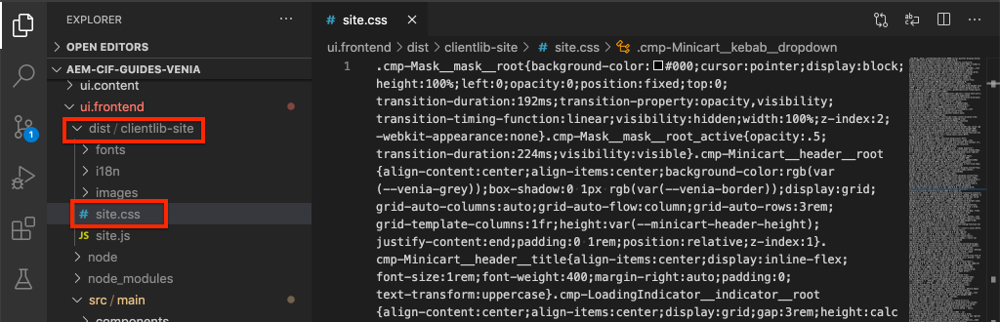
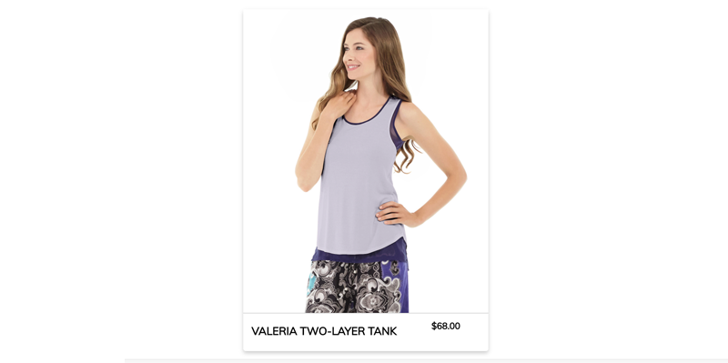
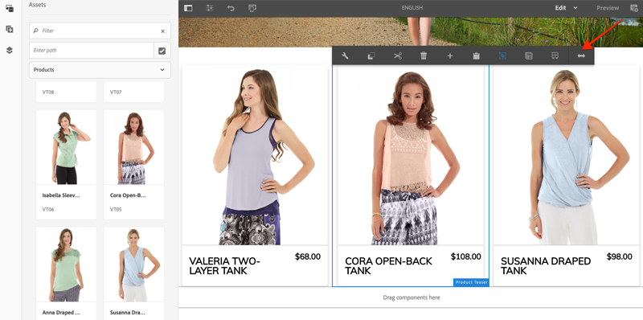

# Personalizzare lo stile dei componenti core CIF di AEM {#style-aem-cif-core-components}

Il [progetto CIF Venia](https://github.com/adobe/aem-cif-guides-venia) è una base di codice di riferimento per l&#39;utilizzo di [componenti core CIF.](https://github.com/adobe/aem-core-cif-components) In questo tutorial, analizzerai il progetto di riferimento Venia e capirai come sono organizzati i CSS e JavaScript utilizzati dai componenti core di AEM CIF. Puoi anche creare uno stile CSS con cui aggiornare lo stile predefinito del componente **Product Teaser**.

>[!TIP]
>
> Utilizza [Archetipo progetto AEM](https://github.com/adobe/aem-project-archetype) quando avvii l&#39;implementazione di e-commerce.

## Cosa verrà creato {#what-you-will-build}

In questo tutorial, viene implementato un nuovo stile per il componente Product Teaser, che assomiglia a una scheda. Le lezioni apprese nell’esercitazione possono essere applicate ad altri componenti core di CIF.


## Prerequisiti {#prerequisites}

Per completare questa esercitazione è necessario un ambiente di sviluppo locale. Questo ambiente include un’istanza in esecuzione di AEM configurata e connessa a un’istanza di Adobe Commerce. Rivedi i requisiti e i passaggi per [configurare uno sviluppo locale con AEM as a Cloud Service SDK.](/help/commerce-cloud/cif-storefront/develop.md)

## Clonare il progetto Venia {#clone-venia-project}

Stai per clonare il [progetto Venia,](https://github.com/adobe/aem-cif-guides-venia) e quindi ignorare gli stili predefiniti.

>[!NOTE]
>
> **Puoi utilizzare un progetto esistente** (basato sull&#39;archetipo di progetto AEM con CIF incluso) e saltare questa sezione.

1. Esegui il seguente comando Git per clonare il progetto:

   ```shell
   $ git clone git@github.com:adobe/aem-cif-guides-venia.git
   ```

1. Crea e implementa il progetto in un’istanza locale di AEM:

   ```shell
   $ cd aem-cif-guides-venia/
   $ mvn clean install -PautoInstallPackage,cloud
   ```

1. Aggiungi le configurazioni OSGi necessarie per collegare la tua istanza AEM a un’istanza Adobe Commerce o aggiungerle al progetto creato.

1. A questo punto, devi disporre di una versione funzionante di una vetrina connessa a un’istanza di Adobe Commerce. Passa alla pagina `US` > `Home` all&#39;indirizzo: [http://localhost:4502/editor.html/content/venia/us/en.html.](http://localhost:4502/editor.html/content/venia/us/en.html)

   Dovresti vedere che la vetrina si basa al momento sul tema Venia. Espandendo il menu principale della vetrina, dovresti vedere diverse categorie, a indicare che la connessione ad Adobe Commerce funziona.

   

## Librerie client e modulo ui.frontend {#introduction-to-client-libraries}

I CSS e JavaScript responsabili del rendering del tema o degli stili della vetrina sono gestiti in AEM da una [libreria client](/help/implementing/developing/introduction/clientlibs.md) o &quot;clientlibs&quot;. Le librerie client forniscono un meccanismo per organizzare CSS e JavaScript nel codice di un progetto e quindi distribuirle sulla pagina.

Gli stili specifici del brand possono essere applicati ai componenti core di AEM CIF aggiungendo e ignorando i CSS gestiti da queste librerie client. È fondamentale comprendere in che modo le librerie client sono strutturate e incluse nella pagina.

[ui.frontend](https://experienceleague.adobe.com/docs/experience-manager-core-components/using/developing/archetype/uifrontend.html) è un progetto [webpack](https://webpack.js.org/) dedicato per gestire tutte le risorse front-end di un progetto. Questo webpack consente agli sviluppatori front-end di utilizzare un numero qualsiasi di lingue e tecnologie come [TypeScript](https://www.typescriptlang.org/), [Sass](https://sass-lang.com/) e molto altro.

Il modulo `ui.frontend` è anche un modulo Maven e integrato con il progetto più grande utilizzando un modulo NPM come [aem-clientlib-generator](https://github.com/wcm-io-frontend/aem-clientlib-generator). Durante una compilazione, `aem-clientlib-generator` copia i file CSS e JavaScript compilati in una libreria client nel modulo `ui.apps`.


*I file CSS e JavaScript compilati vengono copiati dal modulo `ui.frontend` nel modulo `ui.apps` come libreria client durante una build Maven*

## Aggiornare lo stile del teaser {#ui-frontend-module}

Apportare quindi una piccola modifica allo stile Teaser per verificare il funzionamento del modulo `ui.frontend` e delle librerie client. Utilizza [l&#39;IDE che preferisci](https://experienceleague.adobe.com/docs/experience-manager-learn/cloud-service/local-development-environment-set-up/development-tools.html#set-up-the-development-ide) per importare il progetto Venia. Le schermate utilizzate provengono dall&#39;IDE [Codice Visual Studio.](https://experienceleague.adobe.com/docs/experience-manager-learn/cloud-service/local-development-environment-set-up/development-tools.html#microsoft-visual-studio-code)

1. Passa al modulo **ui.frontend** ed espandilo, quindi espandi la gerarchia delle cartelle fino a: `ui.frontend/src/main/styles/commerce`:

   

   Si noti che nella cartella sono presenti più file Sass (`.scss`). Questi file sono gli stili specifici di Commerce per ciascuno dei componenti di Commerce.

1. Aprire il file `_productteaser.scss`.

1. Aggiorna la regola `.item__image` e modifica la regola del bordo:

   ```scss
   .item__image {
       border: #ea00ff 8px solid; /* <-- modify this rule */
       display: block;
       grid-area: main;
       height: auto;
       opacity: 1;
       transition-duration: 512ms;
       transition-property: opacity, visibility;
       transition-timing-function: ease-out;
       visibility: visible;
       width: 100%;
   }
   ```

   La regola di cui sopra deve aggiungere un bordo rosa grassetto al componente Product Teaser.

1. Aprire una nuova finestra del terminale e passare alla cartella `ui.frontend`:

   ```shell
   $ cd <project-location>/aem-cif-guides-venia/ui.frontend
   ```

1. Esegui il seguente comando Maven:

   ```shell
   $ mvn clean install
   ...
   [INFO] ------------------------------------------------------------------------
   [INFO] BUILD SUCCESS
   [INFO] ------------------------------------------------------------------------
   [INFO] Total time:  29.497 s
   [INFO] Finished at: 2020-08-25T14:30:44-07:00
   [INFO] ------------------------------------------------------------------------
   ```

   Controllare l&#39;uscita del terminale. Il comando Maven ha eseguito diversi script NPM, tra cui `npm run build`. Il comando `npm run build` è definito nel file `package.json`, compila il progetto Webpack e attiva la generazione della libreria client.

1. Esaminare il file `ui.frontend/dist/clientlib-site/site.css`:

   

   Il file è la versione compilata e minimizzata di tutti i file Sass nel progetto.

   >[!NOTE]
   >
   > File di questo tipo vengono ignorati dal controllo del codice sorgente poiché devono essere generati durante il tempo di creazione.

1. Controllare il file `ui.frontend/clientlib.config.js`.

   ```js
   /* clientlib.config.js*/
   ...
   // Config for `aem-clientlib-generator`
   module.exports = {
       context: BUILD_DIR,
       clientLibRoot: CLIENTLIB_DIR,
       libs: [
           {
               ...libsBaseConfig,
               name: 'clientlib-site',
               categories: ['venia.site'],
               dependencies: ['venia.dependencies', 'aem-core-cif-react-components'],
               assets: {
   ...
   ```

   Questo file di configurazione è per [aem-clientlib-generator](https://github.com/wcm-io-frontend/aem-clientlib-generator) e determina dove e come i file CSS e JavaScript compilati vengono trasformati in una libreria client di AEM.

1. Nel modulo `ui.apps`, esaminare il file: `ui.apps/src/main/content/jcr_root/apps/venia/clientlibs/clientlib-site/css/site.css`:

   

   Il file è `site.css` copiato nel progetto `ui.apps`. Ora fa parte di una libreria client denominata `clientlib-site` con categoria `venia.site`. Una volta inserito nel modulo `ui.apps`, il file può essere distribuito ad AEM.

   >[!NOTE]
   >
   > File di questo tipo vengono ignorati anche dal controllo del codice sorgente in quanto devono essere generati durante il tempo di creazione.

1. Quindi, esamina le altre librerie client generate dal progetto:

   

   Queste librerie client non sono gestite dal modulo `ui.frontend`. Queste librerie client includono invece le dipendenze CSS e JavaScript fornite da Adobe. La definizione di queste librerie client si trova nel file `.content.xml` sotto ogni cartella.

   **clientlib-base** - Libreria client vuota che incorpora semplicemente le dipendenze necessarie dai [componenti core di AEM.](https://experienceleague.adobe.com/docs/experience-manager-core-components/using/introduction.html?lang=it) La categoria è `venia.base`.

   **clientlib-cif**: una libreria client vuota che incorpora semplicemente le dipendenze necessarie dai [componenti core di AEM CIF.](https://github.com/adobe/aem-core-cif-components) La categoria è `venia.cif`.

   **clientlib-grid** - Include il CSS per abilitare la funzione Griglia reattiva di AEM. L&#39;utilizzo della griglia di AEM abilita la modalità [Layout](/help/sites-cloud/authoring/page-editor/responsive-layout.md) nell&#39;editor di AEM e consente agli autori di contenuto di ridimensionare i componenti. La categoria è `venia.grid` ed è incorporata nella libreria `venia.base`.

1. Esaminare i file `customheaderlibs.html` e `customfooterlibs.html` sotto `ui.apps/src/main/content/jcr_root/apps/venia/components/page`:

   

   Questi script includono **venia.base** e **venia.cif** librerie come parte di tutte le pagine.

   >[!NOTE]
   >
   > Solo le librerie di base sono &quot;hardcoded&quot; come parte degli script di pagina. `venia.site` non è incluso in questi file ma come parte del modello della pagina per una maggiore flessibilità. Questo processo viene esaminato successivamente.

1. Dal terminale, genera e implementa l’intero progetto in un’istanza locale di AEM:

   ```shell
   $ cd aem-cif-guides-venia/
   $ mvn clean install -PautoInstallPackage,cloud
   ```

## Creare un Product Teaser {#author-product-teaser}

Ora che gli aggiornamenti del codice sono stati distribuiti, aggiungi un’istanza del componente Product Teaser alla home page del sito utilizzando gli strumenti di authoring di AEM. In questo modo è possibile visualizzare gli stili aggiornati.

1. Apri una nuova scheda del browser e passa alla **home page** del sito: [http://localhost:4502/editor.html/content/venia/us/en.html.](http://localhost:4502/editor.html/content/venia/us/en.html)

1. Espandi il Finder risorse (barra laterale) in modalità **Modifica**. Cambia il filtro risorse in **Prodotti**.

   

1. Trascina e rilascia un nuovo prodotto nella home page nel Contenitore di layout principale:

   

   Dovresti notare che il Product Teaser ora presenta un bordo rosa brillante in base alla modifica della regola CSS creata in precedenza.

## Verificare le librerie client sulla pagina {#verify-client-libraries}

Verifica quindi l’inclusione delle librerie client nella pagina.

1. Passa alla **home page** del sito: [http://localhost:4502/editor.html/content/venia/us/en.html.](http://localhost:4502/editor.html/content/venia/us/en.html)

1. Seleziona il menu **Informazioni pagina** e fai clic su **Visualizza come pubblicato**:

   

   Questa pagina si apre senza caricare nessuno dei JavaScript di authoring di AEM, come apparirebbe sul sito pubblicato. All&#39;URL è stato aggiunto il parametro di query `?wcmmode=disabled`. Durante lo sviluppo di CSS e JavaScript, è buona norma utilizzare questo parametro per semplificare la pagina senza alcun intervento da parte dell’autore AEM.

1. Visualizza il codice sorgente della pagina e individua diverse librerie client incluse:

   ```html
   <!DOCTYPE html>
   <html lang="en-US">
   <head>
       ...
       <link rel="stylesheet" href="/etc.clientlibs/venia/clientlibs/clientlib-base.min.css" type="text/css">
       <link rel="stylesheet" href="/etc.clientlibs/venia/clientlibs/clientlib-site.min.css" type="text/css">
   </head>
   ...
       <script type="text/javascript" src="/etc.clientlibs/venia/clientlibs/clientlib-site.min.js"></script>
       <script type="text/javascript" src="/etc.clientlibs/core/wcm/components/commons/site/clientlibs/container.min.js"></script>
       <script type="text/javascript" src="/etc.clientlibs/venia/clientlibs/clientlib-base.min.js"></script>
   <script type="text/javascript" src="/etc.clientlibs/core/cif/clientlibs/common.min.js"></script>
   <script type="text/javascript" src="/etc.clientlibs/venia/clientlibs/clientlib-cif.min.js"></script>
   </body>
   </html>
   ```

   Le librerie client recapitate alla pagina hanno il prefisso `/etc.clientlibs` e vengono servite tramite un [proxy](/help/implementing/developing/introduction/clientlibs.md) per evitare di esporre elementi sensibili in `/apps` o `/libs`.

   Avviso `venia/clientlibs/clientlib-site.min.css` e `venia/clientlibs/clientlib-site.min.js`. Questi file sono i file CSS e JavaScript compilati derivati dal modulo `ui.frontend`.

## Inclusione della libreria client con i modelli di pagina {#client-library-inclusion-pagetemplates}

Sono disponibili diverse opzioni per includere una libreria lato client. Verifica in che modo il progetto generato include le librerie `clientlib-site` tramite [Modelli di pagina.](/help/implementing/developing/components/templates.md)

1. Passa alla **home page** del sito nell&#39;editor di AEM: [http://localhost:4502/editor.html/content/venia/us/en.html.](http://localhost:4502/editor.html/content/venia/us/en.html)

1. Seleziona il menu **Informazioni pagina** e fai clic su **Modifica modello**:

   

   Il modello **Pagina di destinazione** è aperto su cui si basa la **Home** pagina.

   >[!NOTE]
   >
   > Per visualizzare tutti i modelli disponibili nella schermata iniziale di AEM, passa a **Strumenti** > **Generale** > **Modelli**.

1. Nell’angolo in alto a sinistra, seleziona l’icona **Informazioni pagina** e fai clic su **Criterio pagina**.

   

1. Criterio pagina viene aperto per il modello Pagina di destinazione:

   

   Sul lato destro è disponibile un elenco delle librerie client **categorie** incluse in tutte le pagine che utilizzano questo modello.

   * `venia.dependencies` - Fornisce tutte le librerie fornitori da cui dipende `venia.site`.
   * `venia.site` - Categoria per `clientlib-site` generata dal modulo `ui.frontend`.

   Altri modelli utilizzano lo stesso criterio: **Pagina contenuto**, **Pagina di destinazione** e così via. Riutilizzando lo stesso criterio, si garantisce che le stesse librerie client vengano incluse in tutte le pagine.

   Quando si gestisce l’inclusione delle librerie client mediante l’uso di modelli e criteri di pagina, si può modificare il criterio a livello di modello. Ad esempio, supponiamo di dover gestire due marchi diversi nella stessa istanza di AEM. Ogni marchio ha un proprio stile o *tema*, ma le librerie e il codice di base sono gli stessi. Un altro esempio, se disponi di una libreria client più grande che desideri visualizzare solo su determinate pagine, puoi creare un criterio di pagina univoco solo per quel modello.

## Sviluppo Webpack locale {#local-webpack-development}

Nell&#39;esercizio precedente, è stato effettuato un aggiornamento a un file Sass nel modulo `ui.frontend` e successivamente, dopo aver eseguito una build Maven, le modifiche vengono distribuite ad AEM. Quindi, puoi utilizzare un webpack-dev-server per sviluppare rapidamente gli stili front-end.

Il webpack-dev-server proxy le immagini e alcuni file CSS/JavaScript dall&#39;istanza locale di AEM, ma consente allo sviluppatore di modificare gli stili e JavaScript nel modulo `ui.frontend`.

1. Nel browser, passa alla pagina **Home** e **Visualizza come pubblicato**: [http://localhost:4502/content/venia/us/en.html?wcmmode=disabled.](http://localhost:4502/content/venia/us/en.html?wcmmode=disabled)

1. Visualizza l&#39;origine della pagina e **copia** il HTML non elaborato della pagina.

1. Torna all&#39;IDE scelto sotto il modulo `ui.frontend` apri il file: `ui.frontend/src/main/static/index.html`

   

1. Sovrascrivi il contenuto di `index.html` e **incolla** il HTML copiato nel passaggio precedente.

1. Trovare le &quot;inclusioni&quot; per `clientlib-site.min.css`, `clientlib-site.min.js` e **rimuoverle**.

   ```html
   <head>
       <!-- remove this link -->
       <link rel="stylesheet" href="/etc.clientlibs/venia/clientlibs/clientlib-base.min.css" type="text/css">
       ...
   </head>
   <body>
       ...
        <!-- remove this link -->
       <script type="text/javascript" src="/etc.clientlibs/venia/clientlibs/clientlib-site.min.js"></script>
   </body>
   ```

   Queste &quot;inclusioni&quot; vengono rimosse perché rappresentano la versione compilata di CSS e JavaScript generata dal modulo `ui.frontend`. Lascia le altre librerie client così come verranno abilitate al proxy dall’istanza AEM in esecuzione.

1. Aprire una nuova finestra del terminale e passare alla cartella `ui.frontend`. Eseguire il comando `npm start`:

   ```shell
   $ cd ui.frontend
   $ npm start
   ```

   Con questo comando viene avviato Webpack-dev-server su [http://localhost:8080/.](http://localhost:8080/)

   >[!CAUTION]
   >
   > Se si verifica un errore relativo a Sass, arrestare il server, eseguire il comando `npm rebuild node-sass` e ripetere i passaggi precedenti. Questo errore può verificarsi se la versione di `npm` e `node` è diversa da quella specificata nel progetto `aem-cif-guides-venia/pom.xml`.

1. Passa a [http://localhost:8080/](http://localhost:8080/) in una nuova scheda con lo stesso browser di un&#39;istanza registrata di AEM. Dovresti vedere la home page di Venia tramite il webpack-dev-server:

   

   Lascia web pack-dev-server in esecuzione. Viene utilizzato nell&#39;esercizio successivo.

## Implementare lo stile della scheda per Product Teaser {#update-css-product-teaser}

Modificare quindi i file Sass nel modulo `ui.frontend` per implementare uno stile di tipo scheda per il Product Teaser. Webpack-dev-server viene utilizzato per visualizzare rapidamente le modifiche.

Torna all’IDE e al progetto generato.

1. Nel modulo **ui.frontend**, riaprire il file `_productteaser.scss` in `ui.frontend/src/main/styles/commerce/_productteaser.scss`.

1. Apporta le seguenti modifiche al bordo del Product Teaser:

   ```diff
       .item__image {
   -       border: #ea00ff 8px solid;
   +       border-bottom: 1px solid #c0c0c0;
           display: block;
           grid-area: main;
           height: auto;
           opacity: 1;
           transition-duration: 512ms;
           transition-property: opacity, visibility;
           transition-timing-function: ease-out;
           visibility: visible;
           width: 100%;
       }
   ```

   Salva le modifiche; webpack-dev-server verrà aggiornato automaticamente con i nuovi stili.

1. Aggiungi un’ombra esterna e includi angoli arrotondati al Product Teaser.

   ```scss
    .item__root {
        position: relative;
        box-shadow: 0 4px 8px 0 rgba(0,0,0,0.2);
        transition: 0.3s;
        border-radius: 5px;
        float: left;
        margin-left: 12px;
        margin-right: 12px;
   }
   
   .item__root:hover {
      box-shadow: 0 8px 16px 0 rgba(0,0,0,0.2);
   }
   ```

1. Aggiorna il nome del prodotto in modo che venga visualizzato nella parte inferiore del teaser e modifica il colore del testo.

   ```css
   .item__name {
       color: #000;
       display: block;
       float: left;
       font-size: 22px;
       font-weight: 900;
       line-height: 1em;
       padding: 0.75em;
       text-transform: uppercase;
       width: 75%;
   }
   ```

1. Aggiorna il prezzo del prodotto in modo che venga visualizzato nella parte inferiore del teaser e modifica il colore del testo.

   ```css
   .price {
       color: #000;
       display: block;
       float: left;
       font-size: 18px;
       font-weight: 900;
       padding: 0.75em;
       padding-bottom: 2em;
       width: 25%;
   
       ...
   ```

1. Aggiorna la query multimediale nella parte inferiore, in modo da poter impilare il nome e il prezzo in schermi più piccoli di **992px**.

   ```css
   @media (max-width: 992px) {
       .productteaser .item__name {
           font-size: 18px;
           width: 100%;
       }
       .productteaser .item__price {
           font-size: 14px;
           width: 100%;
       }
   }
   ```

   Ora dovresti vedere lo stile della scheda riflesso nel webpack-dev-server:

   

   Tuttavia, le modifiche non sono ancora state implementate in AEM. Puoi [scaricare il file della soluzione qui](../assets/style-cif-component/_productteaser.scss).

1. Distribuisci gli aggiornamenti in AEM utilizzando le tue competenze Maven, da un terminale della riga di comando:

   ```shell
   $ cd aem-cif-guides-venia/
   $ mvn clean install -PautoInstallPackage,cloud
   ```

   >[!NOTE]
   >Sono disponibili [strumenti e configurazione IDE](https://experienceleague.adobe.com/docs/experience-manager-learn/foundation/development/set-up-a-local-aem-development-environment.html#set-up-an-integrated-development-environment) aggiuntivi per sincronizzare i file di progetto direttamente con un’istanza AEM locale senza dover eseguire una generazione Maven completa.

## Visualizzare il Product Teaser aggiornato {#view-updated-product-teaser}

Dopo aver distribuito ad AEM il codice per il progetto, ora dovresti essere in grado di visualizzare le modifiche apportate al Product Teaser.

1. Torna al browser e aggiorna la home page: [http://localhost:4502/editor.html/content/venia/us/en.html.](http://localhost:4502/editor.html/content/venia/us/en.html) Dovrebbero essere applicati gli stili del product teaser aggiornati.

   

1. Prova ad aggiungere altri Product Teaser. Utilizza la modalità Layout per modificare la larghezza e l’offset dei componenti in modo da visualizzare più teaser su una riga.

   

## Risoluzione di problemi {#troubleshooting}

In [CRXDE-Lite](http://localhost:4502/crx/de/index.jsp) puoi verificare che il file CSS aggiornato sia stato distribuito: [http://localhost:4502/crx/de/index.jsp#/apps/venia/clientlibs/clientlib-site/css/site.css](http://localhost:4502/crx/de/index.jsp#/apps/venia/clientlibs/clientlib-site/css/site.css)

Durante la distribuzione di nuovi file CSS, JavaScript o entrambi, è importante assicurarsi che il browser non distribuisca file non aggiornati. Puoi eliminare questo potenziale problema cancellando la cache del browser o avviando una nuova sessione del browser.

AEM inoltre tenta di memorizzare nella cache le librerie client per migliorare le prestazioni. A volte, dopo la distribuzione del codice, vengono distribuiti i file meno recenti. È possibile annullare manualmente la validità della cache della libreria client di AEM utilizzando lo strumento [Rigenera librerie client.](http://localhost:4502/libs/granite/ui/content/dumplibs.rebuild.html) *Se si sospetta che AEM abbia memorizzato nella cache una versione precedente di una libreria client, è preferibile annullare la validità della cache. La rigenerazione delle librerie è infatti inefficiente e richiede molto tempo.*

## Complimenti {#congratulations}

Hai terminato di creare lo stile del primo componente core CIF di AEM e hai utilizzato un server di sviluppo Webpack.

## Sfida bonus {#bonus-challenge}

Utilizza [AEM Style System](/help/sites-cloud/authoring/page-editor/style-system.md) per creare due stili che possono essere attivati o disattivati da un autore di contenuti. [Lo sviluppo con il sistema di stili](https://experienceleague.adobe.com/docs/experience-manager-learn/getting-started-wknd-tutorial-develop/project-archetype/style-system.html?lang=it) include passaggi dettagliati e informazioni su come eseguire questa attività.


## Risorse aggiuntive {#additional-resources}

* [AEM Project Archetype](https://github.com/adobe/aem-project-archetype)
* [Componenti core CIF di AEM](https://github.com/adobe/aem-core-cif-components)
* [Configurare un ambiente di sviluppo AEM locale](https://experienceleague.adobe.com/docs/experience-manager-learn/cloud-service/local-development-environment-set-up/overview.html?lang=it)
* [Librerie lato client](/help/implementing/developing/introduction/clientlibs.md)
* [Guida introduttiva di AEM Sites](https://experienceleague.adobe.com/docs/experience-manager-learn/getting-started-wknd-tutorial-develop/overview.html?lang=it)
* [Sviluppo con il sistema di stili](https://experienceleague.adobe.com/docs/experience-manager-learn/getting-started-wknd-tutorial-develop/project-archetype/style-system.html?lang=it)
