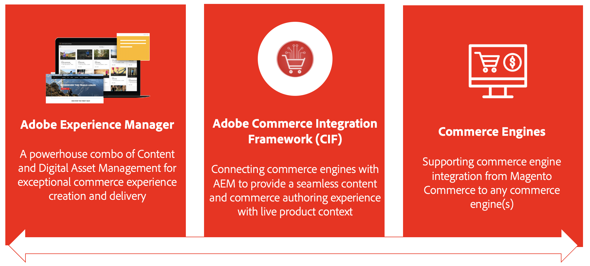

# Introduzione di AEM Commerce Integration Framework (CIF) {#cif-intro}

Una soluzione per l’e-commerce può essere qualsiasi cosa, da una soluzione commerciale come Adobe Commerce Cloud a un set di servizi personalizzati per l’e-commerce. L’integrazione dipende in larga misura dal caso d’uso e dall’ecosistema. Di solito colpisce vari sistemi e si presenta in molte varietà diverse:

* Integrazione di un ecosistema complesso e dinamico (ad esempio cataloghi di prodotti)
* L&#39;azienda deve gestire i contenuti dei prodotti con il proprio ciclo di vita in modo efficiente e omnicanale
* Costruire percorsi di shopping complessi e personalizzati per utenti diversi
* Possibilità di adattare e innovare rapidamente sul back-end e sul front-end
* Esecuzione di un&#39;infrastruttura E2E scalabile e stabile, realizzata per le massime prestazioni (vendita flash, Black Friday, ecc.), compresa la gestione unificata di ricerca e cache

Questa complessità apre le porte a potenziali punti di errore, aumento del TCO, ritardi e riduzione del valore di realizzazione. Questi motivi hanno portato allo sviluppo di Commerce Integration Framework (CIF), un componente aggiuntivo per l’Experience Manager. CIF estende l’Experience Manager con le funzionalità commerce e standardizza l’integrazione con un motore commerce. Il risultato è una soluzione scalabile, stabile e a prova di futuro con un costo totale di proprietà (TCO) inferiore. Sblocca l’innovazione tecnica e aziendale con strumenti agili e funzionalità perfettamente integrate per creare esperienze di e-commerce coinvolgenti.

## Vantaggi di CIF {#cif-benefits}

CIF fornisce componenti core per l’e-commerce pronti all’uso che riducono la necessità di codice personalizzato, accelerando per i brand il tempo di immissione sul mercato. Tutti i componenti core sono pronti all’uso e integrati con il livello dati lato client di Adobe, per arricchire i profili presonalizzati, come il profilo unificato. Questo profilo acquisisce in dettaglio il comportamento di un visitatore, che può essere usato per prevedere e personalizzare il percorso del cliente in tempo reale.

Il componente aggiuntivo CIF porta il contesto del prodotto in Experience Manager e fornisce strumenti di authoring come una console del prodotto e selettori di prodotti/categorie che consentono all’addetto al marketing di creare e distribuire esperienze di acquisto in Experience Manager senza dover dipendere dallo sviluppatore. I vantaggi includono:

* [Esperienze coinvolgenti](#experiences)
* [Time-to-value più rapido](#ttv)
* [Integrazioni affidabili](#integrations)

### Esperienze {#experiences}

I potenti strumenti CIF in AEM consentono ai creatori di contenuti di realizzare rapidamente esperienze di e-commerce avanzate e personalizzate in modo scalabile e indipendente dalla distribuzione, per sfruttare al meglio le opportunità aziendali.

### Time-To-Value (TTV) {#ttv}

CIF accelera lo sviluppo dei progetti con [Componenti core AEM](https://www.aemcomponents.dev/), [AEM Venia reference storefront](https://github.com/adobe/aem-cif-guides-venia), [AEM Project Archetype](https://experienceleague.adobe.com/docs/experience-manager-core-components/using/developing/archetype/overview.html?lang=it) e modelli di integrazione per PWA (Headless Content and Commerce).

CIF è progettato per l&#39;innovazione continua con un componente aggiuntivo sempre aggiornato, che consente di accedere a funzioni nuove e migliorate.

### Integrazioni {#integrations}

Collega l’ecosistema (ad esempio, la soluzione per l’e-commerce) con Experience Cloud utilizzando [Adobe I/O Runtime](https://www.adobe.io/apis/experienceplatform/runtime.html), un PaaS basato su micro-servizi senza server, e [Implementazione di riferimento di CIF](https://github.com/adobe/commerce-cif-graphql-integration-reference).

## Pattern collaudati e best practice {#proven}

CIF ti supporta con modelli di integrazione standardizzati basati sulle best practice. Questo consente di avere successo oggi stesso ed è flessibile per crescere con il tuo e adattarsi alle esigenze future:

* Elimina le problematiche tipiche relative alle integrazioni del catalogo dei prodotti che possono verificarsi, ad esempio:
   * Problemi di prestazioni con volume o complessità del catalogo maggiori
   * Nessun accesso ai dati in fase di sviluppo
   * Necessità di dati ed esperienze sui prodotti in tempo reale
* Una maturità digitale in crescita comporta la necessità di gestire l’esperienza
* &#x200B;
   * CIF offre funzionalità di gestione dell’esperienza dei prodotti che possono essere incorporate in modo incrementale senza ulteriore sforzo IT.
* Pronto per l&#39;omni-channel
   * CIF supporta una serie di tecnologie di punti di contatto (lato server, ibrido, lato client) con modelli, acceleratori e componenti core.

## Percorso {#journey}

Se segui un Percorso commerce, vai al passaggio successivo:

* Il [percorso di authoring dei contenuti AEM](/help/commerce-cloud/cif-storefront/commerce-journeys/aem-commerce-content-author/getting-started.md)
