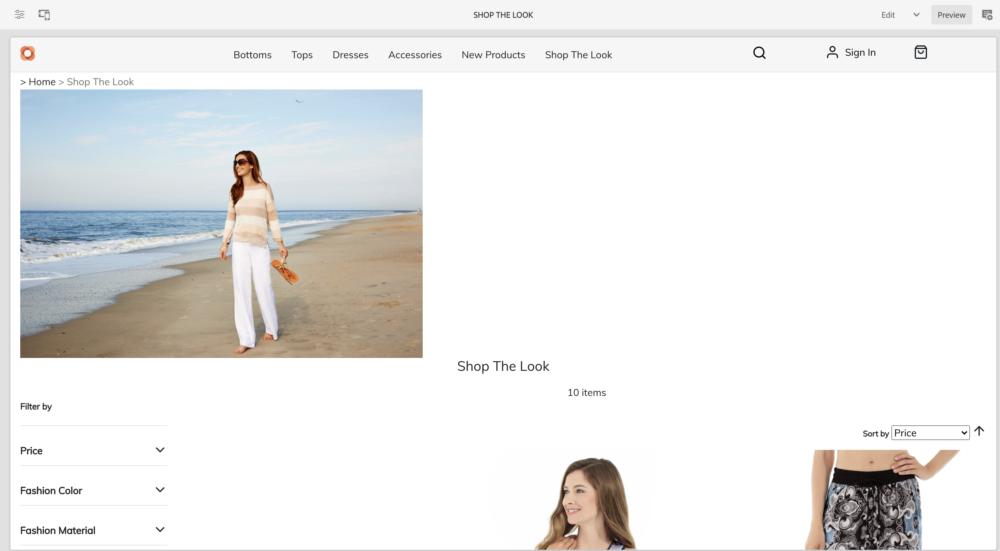

# Gestire pagine e modelli del catalogo dei prodotti {#product-catalog}

Scopri come gestire pagine e modelli di catalogo dei prodotti.

## Percorso affrontato finora {#story-so-far}

Nel documento precedente del percorso di authoring dei contenuti e del commercio dell’AEM, [Guida introduttiva alle nozioni di base sull’authoring dell’CIF AEM](getting-started.md), hai imparato le nozioni di base sull’authoring CIF.

Questo articolo si basa su questi principi fondamentali.

## Obiettivo {#objective}

Questo documento spiega come gestire pagine e modelli di catalogo dei prodotti. Dopo la lettura dovresti:

* comprendere i concetti dei modelli di catalogo
* funzionamento dei modelli generici
* hanno creato un singolo modello

## Concetto di base {#basic-concept}

La vetrina Venia offre un’esperienza tipica con il catalogo dei prodotti, con navigazione e pagine di dettaglio dei prodotti (PDP), categorie (PLP) e destinazione.

Le pagine del catalogo vengono create dinamicamente utilizzando un modello di catalogo CIF dell’AEM e dati dei prodotti in tempo reale che vengono recuperati dall’endpoint commerce quando necessario. Ogni catalogo dispone di un modello generico per le pagine di prodotti e categorie.

Il componente Navigazione mostra il contenuto e le pagine del catalogo. È possibile visualizzare la pagina di destinazione del catalogo o le categorie di primo livello nella navigazione. Passando il puntatore del mouse su una categoria, le categorie di secondo livello vengono visualizzate come seconda riga.

Facendo clic su una categoria si apre la pagina della categoria (o la pagina dell’elenco dei prodotti).

Facendo clic su un prodotto si apre la pagina dei dettagli del prodotto.

## I Modelli {#templates}

### Modelli generici {#generic}

Il modello di catalogo Venia generico utilizza il componente core Elenco prodotti. Questo componente visualizza l’immagine della categoria, se disponibile, e i prodotti della categoria.

Il modello di prodotto Venia generico utilizza il componente core Dettagli prodotto. Questo componente visualizza le informazioni sul prodotto per vari tipi di prodotto e azioni di aggiunta al carrello.

### Modifica Modelli {#edit-templates}

I modelli possono essere modificati aprendo direttamente la pagina del modello o passando alla modalità di modifica durante la navigazione in una pagina del catalogo prodotti. Tieni presente che la modifica della pagina modificherà il modello e non solo la pagina specifica del prodotto/categoria.

### Modelli per categorie o prodotti specifici {#specific}

L’CIF supporta più modelli con pochi clic. Per creare un altro modello, seleziona il modello generico dalla rispettiva categoria e crea una nuova pagina utilizzando **Crea** azione.

Seleziona il rispettivo modello di prodotto o categoria.

Inserisci il titolo e crea la pagina.

Tieni presente che ora disponi di un modello specifico sotto quello generico.

Apri il modello. Assomiglia esattamente al modello di categoria generico.

Aggiungi un’immagine sopra la pagina.

Il modello può essere visualizzato in anteprima con qualsiasi categoria/prodotto. Apri **Informazioni pagina** e quindi seleziona **Visualizza con categoria/prodotto**. Seleziona il prodotto o la categoria dal selettore per ottenere un’anteprima con questo prodotto o categoria. Seleziona **Acquista il look** categoria per ottenere un’anteprima del modello aggiornato.

Ora dobbiamo assegnare questo modello alla categoria specifica. Apri proprietà in **Informazioni pagina** e passa alla scheda commerce. Fai clic sull’icona della cartella per selezionare **Acquista il look** categoria dal selettore delle categorie. È possibile assegnare più categorie a un modello e includere anche le sottocategorie abilitando la casella di controllo.

Torna alla home page principale e fai clic su **Acquista il look** per visualizzare il modello specifico. Tutte le altre categorie utilizzano ancora il modello generico.

È possibile applicare lo stesso flusso di lavoro per creare singoli modelli di prodotto.

## Passaggio successivo {#what-is-next}

Ora che hai completato questa parte del percorso dovresti:

* comprendere i concetti dei modelli di catalogo
* funzionamento dei modelli generici
* hanno creato un singolo modello

Approfondisci l&#39;argomento e continua il tuo percorso esaminando il documento [Gestire le esperienze del catalogo dei prodotti in staging](staged-catalog.md), dove viene illustrato come utilizzare i dati di prodotto staging e i lanci AEM.

## Risorse aggiuntive {#additional-resources}

Sebbene sia consigliabile passare alla parte successiva del percorso esaminando il documento [Gestire le esperienze del catalogo dei prodotti in staging](staged-catalog.md), di seguito sono riportate alcune risorse aggiuntive facoltative che approfondiscono alcuni concetti menzionati in questo documento, ma che non è necessario che continuino sul percorso headless:

* [Creazione di più pagine per categorie e prodotti](/help/commerce-cloud/authoring/multi-template-usage.md)
* [Guida alla migrazione per l’Experience Manager Cloud Service](/help/commerce-cloud/migration.md) - Come migrare al componente aggiuntivo AEM Commerce integration framework (CIF) da una versione precedente
