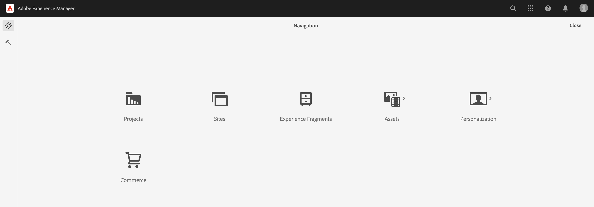
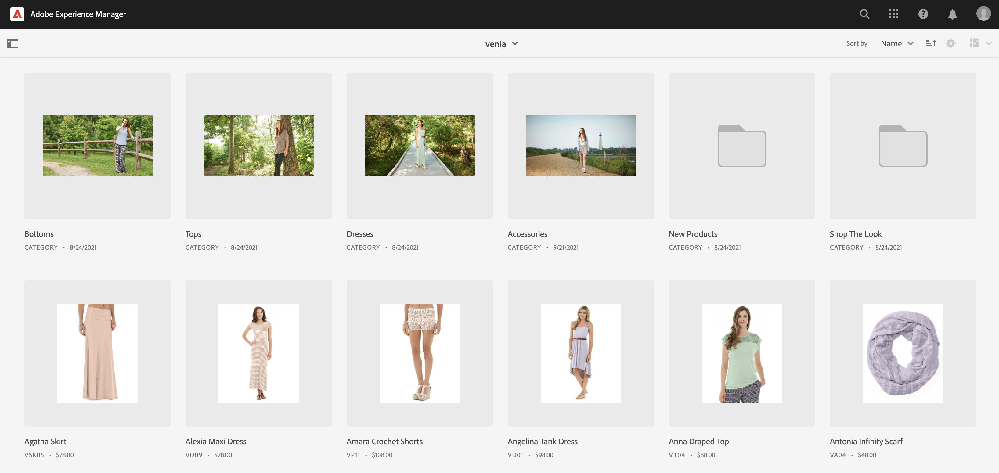

# Guida introduttiva all’authoring dell’CIF AEM {#getting-started}

Scopri di più sull’authoring CIF di Adobe Experience Manager (AEM).

## Percorso affrontato finora {#story-so-far}

Nel documento precedente di questo percorso di contenuti e Commerce dell’AEM, [Informazioni su contenuti AEM e Commerce](/help/commerce-cloud/introduction.md), hai imparato la teoria di base e i concetti di CMS headless, Contenuto AEM e Commerce.

Questo articolo si basa su questi principi fondamentali.

## Obiettivo {#objective}

Questo documento spiega come utilizzare CIF per l’authoring specifico di contenuti e Commerce. Dopo la lettura dovresti:

* Comprendere i concetti dell’authoring CIF utilizzando l’Editor pagina nell’AEM
* Come accedere ai dati del catalogo dei prodotti in AEM utilizzando i selettori di prodotti e categorie
* Come accedere a contenuti e dati di e-commerce utilizzando il pannello di comando del prodotto e AEM Omnisearch

## Authoring CIF nell’Editor pagina AEM {#cif-authoring}

L’CIF estende l’Editor pagina nell’AEM con funzionalità che consentono di accedere ai dati di prodotto in tempo reale senza uscire dal contesto:

Apri il pannello laterale e seleziona Prodotti dall’elenco a discesa.

Puoi sfogliare il catalogo dei prodotti o utilizzare il campo di ricerca full-text per trovare i prodotti.

I prodotti possono essere rilasciati su componenti che supportano i rilasci di prodotto (ad esempio, teaser di prodotto, carosello di prodotto) direttamente sulla pagina, creando così automaticamente un componente teaser di prodotto.

## Selettori di prodotti e categorie {#pickers}

Se i dati di prodotti e categorie sono necessari nei componenti commerce o nelle finestre di dialogo di back-office dell’AEM, gli autori AEM possono utilizzare selettori che sono elementi dell’interfaccia utente per cercare e selezionare comodamente i dati del catalogo dei prodotti.

### Selettore prodotti

Fai clic sull’icona della cartella per aprire l’interfaccia utente modale del selettore (ad esempio, teaser di prodotto)

Puoi trovare i prodotti sfogliando la struttura del catalogo a sinistra o effettuando una ricerca. La ricerca full-text rispetta la categoria selezionata e limita i risultati a questa categoria.

I prodotti con varianti sono contrassegnati con un’icona a forma di cartella su cui è possibile fare clic per visualizzare tutte le varianti.

### Selettore categorie

Funziona come un selettore di prodotti. Fai clic sull’icona della cartella per aprire l’interfaccia utente modale del selettore (ad esempio, carosello categorie)

Sfoglia la struttura del catalogo a sinistra e seleziona la categoria.

## Cockpit prodotto {#cockpit}

Il pannello di comando del prodotto è una posizione centrale per accedere rapidamente al catalogo dei prodotti con tutti i relativi contenuti arricchiti. In uno dei moduli successivi scopri come arricchire i dati di prodotto con i contenuti. Per il momento, concentriamoci sull’accesso ai dati dei prodotti.

Dal menu principale, fai clic su commerce per visualizzare un elenco di tutti i cataloghi di prodotti allegati.

Viene visualizzato un elenco di tutti i cataloghi di prodotti connessi.

Il catalogo prodotti mostra per impostazione predefinita tutte le categorie di primo livello con tutti i prodotti. Facendo clic su una categoria si apre tale categoria con tutti i prodotti e le sottocategorie correlati, inclusi i relativi prodotti.

Per aprire le proprietà del prodotto, fai clic sull’icona della proprietà. L’icona viene visualizzata passando il puntatore del mouse su una sezione del prodotto.

Tutte le proprietà del prodotto sono di sola lettura perché i dati vengono caricati in tempo reale dal backend connesso. La modifica delle proprietà del prodotto deve essere eseguita nel sistema back-end, ovvero nel sistema di registrazione. Scheda **Varianti** viene visualizzato solo se il prodotto presenta varianti. Facendo clic sulla scheda vengono visualizzate tutte le varianti con i relativi attributi.

Le restanti schede mostrano tutto il contenuto AEM associato al prodotto. Queste schede vengono discusse in uno dei moduli successivi.

## AEM Omnisearch {#omnisearch}

Omnisearch consente di trovare facilmente i contenuti AEM mediante la ricerca full-text. CIF estende Omnisearch con la ricerca full-text di cataloghi di prodotti e del relativo contenuto AEM associato.

Omnisearch esegue una ricerca full-text nel backend di Commerce per trovare tutti i prodotti correlati. Il risultato è elencato in **Visualizza tutti i prodotti**. Omnisearch cerca inoltre nell’AEM i contenuti associati al prodotto cercato. I risultati sono elencati nelle rispettive categorie AEM. In questo esempio, un frammento di contenuto è correlato al prodotto.

## Passaggio successivo {#what-is-next}

Ora che hai completato questa parte del percorso dovresti:

* Comprendere i concetti dell’authoring CIF utilizzando l’Editor pagina
* Come accedere al catalogo dei prodotti in AEM utilizzando i selettori di prodotti e categorie
* Come accedere a contenuti e dati di e-commerce utilizzando il pannello di comando del prodotto e AEM Omnisearch

Approfondisci l&#39;argomento e continua il tuo percorso esaminando il documento [Gestione di pagine e modelli del catalogo dei prodotti](catalog-templates.md): per scoprire come creare e personalizzare la tua prima esperienza con il catalogo dei prodotti.

## Risorse aggiuntive {#additional-resources}

Mentre si consiglia di passare alla parte successiva del percorso,[Gestione di pagine e modelli del catalogo dei prodotti](catalog-templates.md)Di seguito sono riportate alcune risorse opzionali che approfondiscono alcuni concetti menzionati. Tuttavia, queste risorse facoltative non sono necessarie per continuare il percorso.

* [Configurazione di store e cataloghi](/help/commerce-cloud/getting-started.md#catalog)
