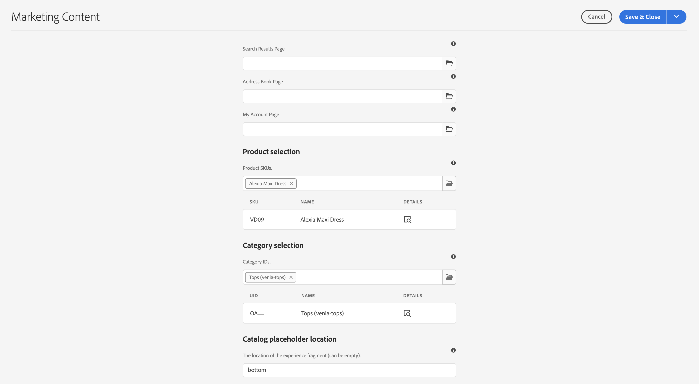
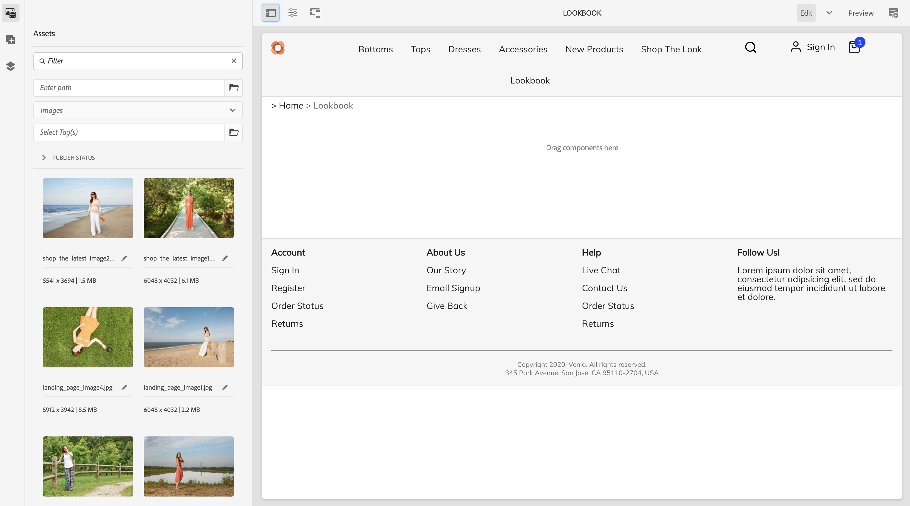

# Creazione di esperienze di prodotto {#building-experiences}

Scopri come gestire le esperienze di prodotto.

## Percorso affrontato finora {#story-so-far}

Nel documento precedente del percorso Adobe Experience Manager (AEM) Content and Commerce, [Gestire le esperienze del catalogo prodotti in staging](staged-catalog.md), hai imparato a gestire le esperienze del catalogo prodotti in staging.

## Obiettivo {#objective}

Questo documento spiega come creare contenuti ed esperienze di prodotto.

## Gestione dell’esperienza del prodotto {#management}

La gestione dell’esperienza del prodotto è la disciplina in base alla quale i dati del prodotto (di proprietà di una soluzione PIM o commerce) vengono decorati con contenuti di marketing in AEM. Questi dati di prodotto arricchiti con i contenuti possono quindi essere utilizzati in vari canali per creare un’esperienza di acquisto coinvolgente.

In AEM puoi creare vari tipi di contenuto e collegarli al catalogo dei prodotti. I contenuti associati possono essere individuati e utilizzati facilmente, con conseguente aumento della produttività.

### Risorse {#assets}

Ad alto livello, esistono due tipi di risorse correlate ai prodotti: prodotto e marketing. Le risorse di prodotto sono gestite dai commercianti e si concentrano sulla visualizzazione del prodotto (per lo più davanti a uno sfondo neutro). Le risorse vengono gestite nella soluzione commerce o in AEM Assets (con un’integrazione Assets alla soluzione commerce/pim).

Le risorse di marketing sono correlate alla promozione e all’utilizzo del prodotto di proprietà del marketing. Ad esempio, vengono mostrati più prodotti (&quot;shop the look&quot;), in un contesto specifico (&quot;outdoor fall collection&quot;) o come utilizzare i pdf. CIF offre un modo semplice per collegare qualsiasi risorsa AEM a un oggetto del catalogo dei prodotti.

Apri le proprietà della risorsa e passa alla scheda **Commerce**. Questa scheda ti consente di gestire l’associazione con i prodotti. La tabella sotto il selettore fornisce informazioni aggiuntive per gli oggetti collegati (visibili solo con una selezione). Fai clic sull’icona dei dettagli per ottenere una visualizzazione completa nella cabina di pilotaggio del prodotto. Per associare un nuovo oggetto, fai clic sull’icona del selettore prodotti (icona della cartella), seleziona un oggetto e chiudi il selettore.

### Frammenti di esperienza {#experience-fragments}

I frammenti di esperienza sono un ottimo modo per creare contenuti riutilizzabili o singoli prodotti su larga scala. L’associazione funziona in modo simile a una risorsa. Apri le proprietà e passa alla scheda **Commerce**. Questa scheda ti consente di gestire l’associazione con prodotti e categorie. Le tabelle sotto i selettori forniscono informazioni aggiuntive per gli oggetti collegati (visibili solo con una selezione). Fai clic sull’icona dei dettagli per ottenere una visualizzazione completa nella cabina di pilotaggio del prodotto. Per associare un nuovo oggetto, fai clic sull’icona del selettore prodotti (icona della cartella), seleziona un oggetto e chiudi il selettore.

### Frammenti di contenuto {#content-fragments}

I frammenti di contenuto sono il tipo di contenuto migliore per qualsiasi contenuto strutturato. Può essere utilizzato per incrementare i dati di prodotto esterni con dati di marketing aggiuntivi o per creare contenuti in modo headless. L’associazione di un frammento di contenuto a un oggetto catalogo di prodotto viene eseguita tramite i tipi di riferimento di prodotto o categoria nell’Editor modello per frammenti di contenuto. Trascina e rilascia il tipo di riferimento corretto sul modello e configura il campo. Questi tipi supportano la selezione singola o multipla.

Se crei un frammento di contenuto basato su questo modello, questi tipi di riferimento ti consentono di selezionare facilmente l’oggetto giusto utilizzando il rispettivo selettore.

### Cockpit prodotto {#product-cockpit}

Sei stato introdotto al pannello di comando del prodotto (o alla console) in uno dei moduli precedenti. La cabina di comando è un modo semplice non solo per sfogliare il catalogo dei prodotti, ma anche per visualizzare tutti i contenuti AEM associati in un’unica posizione. Vai alla console del prodotto e apri le proprietà di un prodotto a cui è associato del contenuto. Passa alla rispettiva scheda per visualizzare il contenuto associato.

Facendo clic sull’icona dell’azione, questa parte di contenuto viene aperta in una nuova scheda del browser.

## Arricchimento di singole pagine di prodotti e categorie {#enrich}

Nei moduli precedenti hai imparato a utilizzare più modelli di catalogo prodotti. I modelli multipli sono un ottimo modo per creare modelli diversi, ma spesso non sono necessari. Spesso lo stesso modello può essere utilizzato con segnaposto per singoli contenuti. CIF supporta i segnaposto per Frammenti di contenuto e Frammenti di esperienza.

Iniziamo con il segnaposto Frammento esperienza. Apri un modello di prodotto nell’editor di AEM. Trascina e rilascia il componente **Frammento esperienza Commerce** sul modello, quindi apri la finestra di dialogo di configurazione.

Apri la finestra di dialogo del componente e immetti un nome per questo segnaposto. È necessario un nome di segnaposto che consente di aggiungere tutti i segnaposto necessari.

Apri il frammento di esperienza associato a un prodotto nel passaggio precedente. Apri le proprietà e passa alla scheda Commerce. Immetti lo stesso nome segnaposto nella **posizione segnaposto catalogo**.

Trascina il componente **Frammento di contenuto di Commerce** sul modello e apri la finestra di dialogo di configurazione.

Questa finestra di dialogo riutilizza la finestra di dialogo Frammento di contenuto componente core. Per ulteriori informazioni, consulta Risorse aggiuntive. L&#39;unica differenza è la proprietà **Elemento collegamento** che configura il campo dell&#39;identificatore (SKU prodotto o UID categoria) nel modello del frammento di contenuto.

Visualizza l’anteprima di una pagina di prodotto a cui sono associati un frammento di contenuto e/o un frammento di esperienza. Quando AEM esegue il rendering di una pagina, esegue una ricerca per ogni segnaposto in base al tipo (Contenuto o Frammento esperienza), all’identificatore e al nome del segnaposto per Frammenti esperienza. AEM utilizza un risolutore URL per ottenere l’identificatore (SKU per prodotti, UID per categorie). Se viene restituito un’esperienza o un frammento di contenuto, questo viene rappresentato nella posizione del segnaposto, altrimenti il segnaposto viene ignorato.

## Rendere i contenuti acquistabili {#making-shoppable}

È inoltre possibile rendere acquistabile una normale pagina AEM aggiungendo componenti commerce. Crea una pagina di contenuto in AEM e apri la pagina vuota nell’editor.

Innanzitutto, trascina e rilascia un componente di dettaglio prodotto sulla pagina. Quindi passa alla barra laterale di Assets, passa ai prodotti e seleziona un prodotto. Trascina e rilascia il prodotto sul componente del prodotto. Mostra un componente prodotto normale in una pagina di contenuto.

Se hai creato contenuto associato per quel prodotto, passa nella barra laterale di Assets a **Contenuto Commerce associato**. Questa scheda mostra tutti i contenuti AEM associati a questo prodotto. Questo consente ora di abbellire rapidamente le pagine con qualsiasi contenuto associato.

## Fine del percorso? {#end-of-journey}

Congratulazioni. Hai completato il percorso AEM Content and Commerce Developer. Ora dovresti aver appreso quanto segue:

* scopri come associare qualsiasi contenuto AEM agli oggetti del catalogo dei prodotti
* utilizzare i segnaposto per arricchire singolarmente le pagine di prodotti e categorie
* sapere come rendere il contenuto acquistabile e utilizzare la scheda contenuto associata

Ora puoi gestire le esperienze dei prodotti utilizzando AEM Content e Commerce. Tuttavia, AEM Content e Commerce hanno molte opzioni aggiuntive disponibili. Consulta alcune delle risorse aggiuntive disponibili nella [sezione Risorse aggiuntive](#additional-resources) dove puoi saperne di più sulle funzioni visualizzate in questo percorso.

## Risorse aggiuntive {#additional-resources}

* [Creazione di esperienze Commerce](/help/commerce-cloud/authoring/authoring-commerce-experiences.md)
* [Cockpit prodotto](/help/commerce-cloud/authoring/product-cockpit.md)
* [Componente Frammento di contenuto](https://experienceleague.adobe.com/docs/experience-manager-core-components/using/wcm-components/content-fragment-component.html?lang=en)
