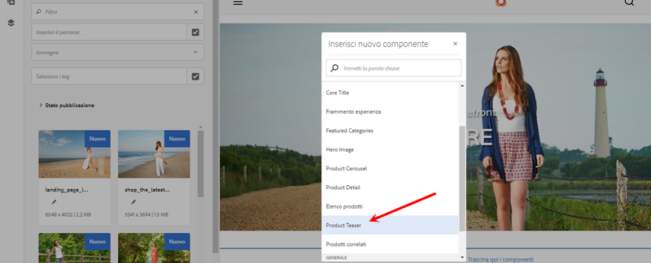
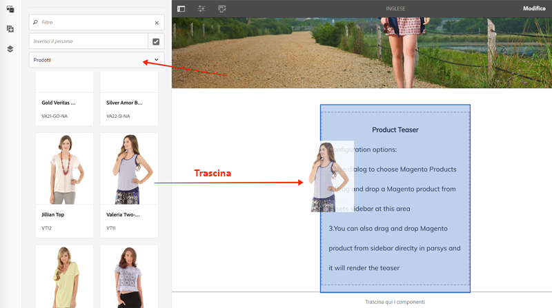
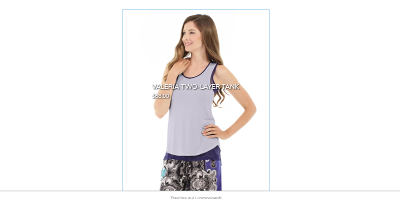

# Personalizzare i componenti core CIF di AEM {#customize-cif-components}

Il [CIF Venia Project](https://github.com/adobe/aem-cif-guides-venia) è una base di codice di riferimento per l’utilizzo dei [componenti core CIF](https://github.com/adobe/aem-core-cif-components). In questa esercitazione, estenderai ulteriormente il componente [Product Teaser](https://github.com/adobe/aem-core-cif-components/tree/master/ui.apps/src/main/content/jcr_root/apps/core/cif/components/commerce/productteaser/v1/productteaser) per visualizzare un attributo personalizzato dal Magento. Ulteriori informazioni sull’integrazione GraphQL tra AEM e Magento e gli hook dell’estensione forniti dai componenti core CIF.

>[!TIP]
>
> Utilizza l’ [AEM archetipo di progetto](https://github.com/adobe/aem-project-archetype) all’avvio dell’implementazione di e-commerce.

## Cosa Verrà Generato

Il brand Venia ha recentemente iniziato a produrre alcuni prodotti utilizzando materiali sostenibili e l&#39;azienda desidera visualizzare un marchio **Eco Friendly** come parte del Product Teaser. Un nuovo attributo personalizzato verrà creato in Magento per indicare se un prodotto utilizza il materiale **eco friendly**. Questo attributo personalizzato verrà quindi aggiunto come parte della query GraphQL e visualizzato sul Product Teaser per prodotti specifici.


## Prerequisiti {#prerequisites}

Per completare questa esercitazione è necessario un ambiente di sviluppo locale. Questo include un&#39;istanza in esecuzione di AEM configurata e connessa a un&#39;istanza di Magento. Controlla i requisiti e i passaggi per [configurare uno sviluppo locale con AEM come Cloud Service SDK](../develop.md). Per seguire completamente l&#39;esercitazione, è necessario disporre delle autorizzazioni per aggiungere [Attributi a un prodotto](https://docs.magento.com/user-guide/catalog/product-attributes-add.html) in un Magento.

Per eseguire gli esempi di codice e le esercitazioni, è inoltre necessario GraphQL IDE, ad esempio [GraphiQL](https://github.com/graphql/graphiql) o un’estensione del browser. Se installi un&#39;estensione del browser, assicurati che sia in grado di impostare le intestazioni della richiesta. Su Google Chrome, [Altair GraphQL Client](https://chrome.google.com/webstore/detail/altair-graphql-client/flnheeellpciglgpaodhkhmapeljopja) è un&#39;estensione che può fare il lavoro.

## Clona il progetto Venia {#clone-venia-project}

Dupliceremo il [Progetto Venia](https://github.com/adobe/aem-cif-guides-venia) e quindi sovrascriveremo gli stili predefiniti.

>[!NOTE]
>
> **Puoi anche utilizzare un progetto esistente**  (basato su AEM Project Archetype con CIF incluso) e saltare questa sezione.

1. Esegui il seguente comando git per clonare il progetto:

   ```shell
   $ git clone git@github.com:adobe/aem-cif-guides-venia.git
   ```

1. Crea e implementa il progetto in un’istanza locale di AEM:

   ```shell
   $ cd aem-cif-guides-venia/
   $ mvn clean install -PautoInstallPackage,cloud
   ```

1. Aggiungi le configurazioni OSGi necessarie per collegare l’istanza AEM a un’istanza di Magento o aggiungi le configurazioni al progetto appena creato.

1. A questo punto è necessario disporre di una versione funzionante di una vetrina che sia collegata a un’istanza di Magento. Passa alla pagina `US` > `Home` in: [http://localhost:4502/editor.html/content/venia/us/en.html](http://localhost:4502/editor.html/content/venia/us/en.html).

   Dovresti vedere che la vetrina si basa al momento sul tema Venia. Espandi il menu principale della vetrina: dovresti vedere diverse categorie, a indicare che la connessione a Magento funziona.

   

## Creare il Product Teaser {#author-product-teaser}

Il componente Product Teaser verrà esteso durante l’esercitazione. Come primo passo, aggiungi una nuova istanza del Product Teaser alla home page per comprendere la funzionalità di base.

1. Passa alla **home page** del sito: [http://localhost:4502/editor.html/content/acme/us/en.html](http://localhost:4502/editor.html/content/acme/us/en.html)

2. Inserisci un nuovo componente **Product Teaser** nel contenitore di layout principale della pagina.

   

3. Espandi il pannello laterale (se non è già attivato) e imposta il menu a discesa di ricerca risorse su **Prodotti**. Dovrebbe essere visualizzato un elenco di prodotti disponibili da un’istanza di Magento connessa. Seleziona un prodotto e **trascinalo** sul componente **Product Teaser** nella pagina.

   

   >[!NOTE]
   >
   > Puoi anche configurare il prodotto visualizzato impostando il componente tramite la finestra di dialogo (clic sull’icona a forma di _chiave inglese_).

4. Ora puoi vedere un prodotto visualizzato dal Product Teaser. Il nome del prodotto e il prezzo del prodotto sono attributi predefiniti visualizzati.

   

## Aggiungi un attributo personalizzato nel Magento {#add-custom-attribute}

I prodotti e i dati dei prodotti visualizzati in AEM vengono memorizzati nel Magento. Quindi aggiungi un nuovo attributo per **Eco Friendly** come parte dell&#39;attributo di prodotto impostato utilizzando l&#39;interfaccia utente del Magento.

>[!TIP]
>
> Hai già un attributo personalizzato **Sì/No** come parte del set di attributi del prodotto? Puoi usarlo e saltare questa sezione.

1. Accedi alla tua istanza di Magento.
1. Passa a **Catalogo** > **Prodotti**.
1. Aggiorna il filtro di ricerca per trovare il **Prodotto configurabile** utilizzato quando viene aggiunto al componente Teaser nell’esercizio precedente. Apri il prodotto in modalità di modifica.

   

1. Dalla visualizzazione del prodotto, fai clic su **Aggiungi attributo** > **Crea nuovo attributo**.
1. Compila il modulo **Nuovo attributo** con i seguenti valori (lascia le impostazioni predefinite per altri valori)

   | Set di campi | Etichetta campo | Valore |
   | ----------------------------- | ------------------ | ---------------- |
   | Proprietà attributo | Etichetta attributo | **Ecologico** |
   | Proprietà attributo | Tipo di ingresso catalogo | **Sì/No** |
   | Proprietà attributo avanzate | Codice attributo | **eco_friendly** |

   

   Al termine, fai clic su **Salva attributo**.

1. Scorri fino alla parte inferiore del prodotto ed espandi l’intestazione **Attributi** . Dovresti visualizzare il nuovo campo **Eco friendly** . Passa all&#39;opzione **Sì**.

   

   **** Salva le modifiche apportate al prodotto.

   >[!TIP]
   >
   > Ulteriori dettagli sulla gestione [Attributi del prodotto sono disponibili nella guida utente del Magento](https://docs.magento.com/user-guide/catalog/attribute-best-practices.html).

1. Passa a **Sistema** > **Strumenti** > **Gestione cache**. Poiché è stato effettuato un aggiornamento allo schema dati, è necessario annullare la validità di alcuni tipi di cache nel Magento.
1. Seleziona la casella accanto a **Configurazione** e invia il tipo di cache per **Aggiorna**

   

   >[!TIP]
   >
   > Maggiori dettagli su [Gestione cache sono disponibili nella guida utente del Magento](https://docs.magento.com/user-guide/system/cache-management.html).

## Utilizza un IDE GraphQL per verificare l&#39;attributo {#use-graphql-ide}

Prima di passare AEM codice è utile esplorare il [Magento GraphQL](https://devdocs.magento.com/guides/v2.4/graphql/) utilizzando un IDE GraphQL. L’integrazione del Magento con AEM viene eseguita principalmente tramite una serie di query GraphQL. Comprendere e modificare le query GraphQL è uno dei modi principali in cui è possibile estendere i componenti core CIF.

Quindi, utilizza un IDE GraphQL per verificare che l&#39;attributo `eco_friendly` sia stato aggiunto al set di attributi del prodotto. Le schermate in questa esercitazione utilizzano il [Client Altair GraphQL](https://chrome.google.com/webstore/detail/altair-graphql-client/flnheeellpciglgpaodhkhmapeljopja).

1. Apri l’IDE GraphQL e immetti l’URL `http://<magento-server>/graphql` nella barra URL dell’IDE o dell’estensione.
2. Aggiungi la seguente [query dei prodotti](https://devdocs.magento.com/guides/v2.4/graphql/queries/products.html) dove `YOUR_SKU` è **SKU** del prodotto utilizzato nell&#39;esercizio precedente:

   ```json
     {
       products(
       filter: { sku: { eq: "YOUR_SKU" } }
       ) {
           items {
           name
           sku
           eco_friendly
           }
       }
   }
   ```

3. Esegui la query e ottieni una risposta come quella riportata di seguito:

   ```json
   {
     "data": {
       "products": {
         "items": [
           {
             "name": "Valeria Two-Layer Tank",
             "sku": "VT11",
             "eco_friendly": 1
           }
         ]
       }
     }
   }
   ```

   

   Il valore di **Sì** è un numero intero di **1**. Questo sarà utile quando scriviamo la query GraphQL in Java.

   >[!TIP]
   >
   > La documentazione più dettagliata sul [Magento GraphQL è disponibile qui](https://devdocs.magento.com/guides/v2.4/graphql/index.html).

## Aggiornamento del modello Sling per Product Teaser {#updating-sling-model-product-teaser}

Ora estenderemo la logica di business del Product Teaser implementando un modello Sling. I [modelli Sling](https://sling.apache.org/documentation/bundles/models.html) sono “POJO” (Plain Old Java Objects) basati su annotazioni che implementano la logica di business necessaria per il componente. I modelli Sling vengono utilizzati insieme agli script HTL come parte del componente. Seguiremo il [pattern di delega per modelli Sling](https://github.com/adobe/aem-core-wcm-components/wiki/Delegation-Pattern-for-Sling-Models) in modo da estendere solo parti del modello esistente di Product Teaser.

I modelli Sling sono implementati come Java e si trovano nel modulo **core** del progetto generato.

Utilizza [l&#39;IDE che preferisci](https://docs.adobe.com/content/help/en/experience-manager-learn/cloud-service/local-development-environment-set-up/development-tools.html#set-up-the-development-ide) per importare il progetto Venia. Le schermate utilizzate provengono dall&#39; [IDE di Visual Studio Code](https://docs.adobe.com/content/help/en/experience-manager-learn/cloud-service/local-development-environment-set-up/development-tools.html#microsoft-visual-studio-code).

1. Nell’IDE, passa al modulo **core** per: `core/src/main/java/com/venia/core/models/commerce/MyProductTeaser.java`.

   

   `MyProductTeaser.java` è un’interfaccia Java che estende CIF  [](https://github.com/adobe/aem-core-cif-components/blob/master/bundles/core/src/main/java/com/adobe/cq/commerce/core/components/models/productteaser/ProductTeaser.java) ProductTeaserinterface.

   È già stato aggiunto un nuovo metodo denominato `isShowBadge()` per visualizzare un badge se il prodotto è considerato &quot;Nuovo&quot;.

1. Aggiungi il nuovo metodo `isEcoFriendly()` all’interfaccia:

   ```java
   @ProviderType
   public interface MyProductTeaser extends ProductTeaser {
       // Extend the existing interface with the additional properties which you
       // want to expose to the HTL template.
       public Boolean isShowBadge();
   
       public Boolean isEcoFriendly();
   }
   ```

   Questo è un nuovo metodo che introdurremo per incapsulare la logica per indicare se l&#39;attributo `eco_friendly` del prodotto è impostato su **Sì** o **No**.

1. Quindi, controlla il `MyProductTeaserImpl.java` in `core/src/main/java/com/venia/core/models/commerce/MyProductTeaserImpl.java`.

   Il pattern di delega [per modelli Sling](https://github.com/adobe/aem-core-wcm-components/wiki/Delegation-Pattern-for-Sling-Models) consente a `MyProductTeaserImpl` di fare riferimento al modello `ProductTeaser` tramite la proprietà `sling:resourceSuperType` :

   ```java
   @Self
   @Via(type = ResourceSuperType.class)
   private ProductTeaser productTeaser;
   ```

   Per tutti i metodi che non dovranno essere ignorati o modificati, possiamo semplicemente restituire il valore che `ProductTeaser` restituisce. Esempio:

   ```java
   @Override
   public String getImage() {
       return productTeaser.getImage();
   }
   ```

   Questo riduce al minimo la quantità di codice Java che un&#39;implementazione deve scrivere.

1. Uno dei punti di estensione aggiuntivi forniti dai componenti core CIF di AEM è `AbstractProductRetriever` che fornisce accesso a attributi di prodotto specifici. Inspect il metodo `initModel()`:

   ```java
   import javax.annotation.PostConstruct;
   ...
   @Model(adaptables = SlingHttpServletRequest.class, adapters = MyProductTeaser.class, resourceType = MyProductTeaserImpl.RESOURCE_TYPE)
   public class MyProductTeaserImpl implements MyProductTeaser {
       ...
       private AbstractProductRetriever productRetriever;
   
       /* add this method to intialize the proudctRetriever */
       @PostConstruct
       public void initModel() {
           productRetriever = productTeaser.getProductRetriever();
   
           if (productRetriever != null) {
               productRetriever.extendProductQueryWith(p -> p.createdAt());
           }
   
       }
   ...
   ```

   L’annotazione `@PostConstruct` assicura che questo metodo venga chiamato non appena viene inizializzato il modello Sling.

   La query GraphQL del prodotto è già stata estesa utilizzando il metodo `extendProductQueryWith` per recuperare l&#39;attributo aggiuntivo `created_at`. Questo attributo viene successivamente utilizzato come parte del metodo `isShowBadge()` .

1. Aggiorna la query GraphQL per includere l&#39;attributo `eco_friendly` nella query parziale:

   ```java
   //MyProductTeaserImpl.java
   
   private static final String ECO_FRIENDLY_ATTRIBUTE = "eco_friendly";
   
   @PostConstruct
   public void initModel() {
       productRetriever = productTeaser.getProductRetriever();
   
       if (productRetriever != null) {
           productRetriever.extendProductQueryWith(p ->
                productRetriever.extendProductQueryWith(p -> p
                   .createdAt()
                   .addCustomSimpleField(ECO_FRIENDLY_ATTRIBUTE)
               );
           );
       }
   }
   ```

   Con l’aggiunta al metodo `extendProductQueryWith`, gli attributi di prodotto aggiuntivi saranno disponibili per il resto del modello. Inoltre si riduce la quantità di query eseguite.

   Nel codice riportato sopra, l&#39;attributo `addCustomSimpleField` viene utilizzato per recuperare l&#39;attributo `eco_friendly` . Questo illustra come eseguire una query per gli attributi personalizzati che fanno parte dello schema di Magento.

   >[!NOTE]
   >
   > Il metodo `createdAt()` è stato effettivamente implementato come parte dell&#39; [Interfaccia prodotto](https://github.com/adobe/commerce-cif-magento-graphql/blob/master/src/main/java/com/adobe/cq/commerce/magento/graphql/ProductInterface.java). La maggior parte degli attributi dello schema comunemente trovati è già stata implementata, quindi utilizza solo gli attributi `addCustomSimpleField` per gli attributi realmente personalizzati.

1. Aggiungi un logger per eseguire il debug del codice Java:

   ```java
   import org.slf4j.Logger;
   import org.slf4j.LoggerFactory;
   ...
   @Model(adaptables = SlingHttpServletRequest.class, adapters = MyProductTeaser.class, resourceType = MyProductTeaserImpl.RESOURCE_TYPE)
   public class MyProductTeaserImpl implements MyProductTeaser {
   
   private static final Logger LOGGER = LoggerFactory.getLogger(MyProductTeaserImpl.class);
   ```

1. Quindi, implementa il metodo `isEcoFriendly()` :

   ```java
   @Override
   public Boolean isEcoFriendly() {
   
       Integer ecoFriendlyValue;
       try {
           ecoFriendlyValue = productRetriever.fetchProduct().getAsInteger(ECO_FRIENDLY_ATTRIBUTE);
           if(ecoFriendlyValue != null && ecoFriendlyValue.equals(Integer.valueOf(1))) {
               LOGGER.info("*** Product is Eco Friendly**");
               return true;
           }
       } catch (SchemaViolationError e) {
           LOGGER.error("Error retrieving eco friendly attribute");
       }
       LOGGER.info("*** Product is not Eco Friendly**");
       return false;
   }
   ```

   Nel metodo di cui sopra il `productRetriever` viene utilizzato per recuperare il prodotto e il metodo `getAsInteger()` viene utilizzato per ottenere il valore dell&#39;attributo `eco_friendly`. In base alle query GraphQL eseguite in precedenza, sappiamo che il valore previsto quando l&#39;attributo `eco_friendly` è impostato su &quot;**Sì**&quot; è in realtà un numero intero di **1**.

   Ora che il modello Sling è stato aggiornato, il markup del componente deve essere aggiornato per visualizzare effettivamente un indicatore di **eco-friendly** basato sul modello Sling.

## Personalizzazione del markup del Product Teaser {#customize-markup-product-teaser}

I componenti AEM vengono spesso estesi per modificare il markup generato dal componente. A tal fine, sovrascrivi lo [script HTL](https://docs.adobe.com/content/help/it-IT/experience-manager-htl/using/overview.html) utilizzato dal componente per eseguire il rendering del relativo markup. HTML Template Language (HTL) è un linguaggio per modelli leggero usato dai componenti di AEM per eseguire il rendering dinamico del markup in base al contenuto creato, in modo che sia possibile riutilizzare i componenti. Il Product Teaser, ad esempio, può essere riutilizzato più volte per visualizzare prodotti diversi.

Nel nostro caso, vogliamo eseguire il rendering di un banner sopra il teaser per indicare che il prodotto è &quot;eco-compatibile&quot; in base a un attributo personalizzato. Il modello di progettazione per [personalizzare il markup](https://docs.adobe.com/content/help/it-IT/experience-manager-core-components/using/developing/customizing.html#customizing-the-markup) di un componente è in realtà standard per tutti i componenti di AEM, non solo per i componenti core CIF di AEM.

1. Nell’IDE, naviga nel modulo `ui.apps` ed espandi la gerarchia delle cartelle fino a: `ui.apps/src/main/content/jcr_root/apps/venia/components/commerce/productteaser` e controlla il file `.content.xml`.

   

   ```xml
   <?xml version="1.0" encoding="UTF-8"?>
   <jcr:root xmlns:sling="http://sling.apache.org/jcr/sling/1.0" xmlns:cq="http://www.day.com/jcr/cq/1.0" xmlns:jcr="http://www.jcp.org/jcr/1.0"
       jcr:description="Product Teaser Component"
       jcr:primaryType="cq:Component"
       jcr:title="Product Teaser"
       sling:resourceSuperType="core/cif/components/commerce/productteaser/v1/productteaser"
       componentGroup="Venia - Commerce"/>
   ```

   Questa è la definizione del componente Product Teaser usato nel nostro progetto. Osserva la proprietà `sling:resourceSuperType="core/cif/components/commerce/productteaser/v1/productteaser"`. Questo è un esempio di creazione di un [componente Proxy](https://docs.adobe.com/content/help/it-IT/experience-manager-core-components/using/get-started/using.html#create-proxy-components). Invece di copiare e incollare tutti gli script HTL di Product Teaser dai componenti core CIF di AEM, possiamo utilizzare `sling:resourceSuperType` per ereditare tutte le funzionalità.

1. Aprire il file `productteaser.html`. Questa è una copia del file `productteaser.html` dal [Product Teaser](https://github.com/adobe/aem-core-cif-components/blob/master/ui.apps/src/main/content/jcr_root/apps/core/cif/components/commerce/productteaser/v1/productteaser/productteaser.html) CIF

   ```html
   <!--/* productteaser.html */-->
   <sly
     data-sly-use.product="com.venia.core.models.commerce.MyProductTeaser"
     data-sly-use.templates="core/wcm/components/commons/v1/templates.html"
     data-sly-use.actionsTpl="actions.html"
     data-sly-test.isConfigured="${properties.selection}"
     data-sly-test.hasProduct="${product.url}"
   ></sly>
   ```

   Si noti che il modello Sling per `MyProductTeaser` viene utilizzato e assegnato alla variabile `product` .

1. Modifica `productteaser.html` per effettuare una chiamata al metodo `isEcoFriendly` implementato nell&#39;esercizio precedente:

   ```html
   ...
   <div
     data-sly-test="${isConfigured && hasProduct}"
     class="item__root"
     data-cmp-is="productteaser"
     data-virtual="${product.virtualProduct}"
   >
     <div data-sly-test="${product.showBadge}" class="item__badge">
       <span>${properties.text || 'New'}</span>
     </div>
     <!--/* Insert call to Eco Friendly here */-->
     <div data-sly-test="${product.ecoFriendly}" class="item__eco">
       <span>Eco Friendly</span>
     </div>
     ...
   </div>
   ```

   Quando si chiama un metodo Sling Model in HTL, la parte `get` e `is` del metodo viene eliminata e la prima lettera viene minuscola. Quindi `isShowBadge()` diventa `.showBadge` e `isEcoFriendly` diventa `.ecoFriendly`. In base al valore booleano restituito da `.isEcoFriendly()`, viene determinato se viene visualizzato il valore `<span>Eco Friendly</span>`.

   Ulteriori informazioni su `data-sly-test` e altre istruzioni per blocchi HTL sono disponibili qui](https://docs.adobe.com/content/help/en/experience-manager-htl/using/htl/block-statements.html#test).[

1. Salva le modifiche e distribuisci gli aggiornamenti per AEM utilizzando le tue competenze Maven, da un terminale di riga di comando:

   ```shell
   $ cd aem-cif-guides-venia/
   $ mvn clean install -PautoInstallPackage,cloud
   ```

1. Apri una nuova finestra del browser e passa a AEM e alla **console OSGi** > **Stato** > **Modelli Sling**: [http://localhost:4502/system/console/status-slingmodels](http://localhost:4502/system/console/status-slingmodels)

1. Cerca `MyProductTeaserImpl` e dovresti vedere una riga come la seguente:

   ```plain
   com.venia.core.models.commerce.MyProductTeaserImpl - venia/components/commerce/productteaser
   ```

   Questo indica che il modello Sling è stato distribuito correttamente e mappato al componente corretto.

1. Aggiorna la pagina principale **Venia** in [http://localhost:4502/editor.html/content/venia/us/en.html](http://localhost:4502/editor.html/content/venia/us/en.html) in cui è stato aggiunto il Product Teaser.

   

   Se l&#39;attributo `eco_friendly` del prodotto è impostato su **Sì**, nella pagina verrà visualizzato il testo &quot;Eco-friendly&quot;. Prova a passare a prodotti diversi per vedere il cambiamento di comportamento.

1. Apri quindi il AEM `error.log` per visualizzare le istruzioni di registro aggiunte. Il percorso `error.log` si trova in `<AEM SDK Install Location>/crx-quickstart/logs/error.log`.

   Cerca nei registri AEM per visualizzare le istruzioni di registro aggiunte nel modello Sling:

   ```plain
   2020-08-28 12:57:03.114 INFO [com.venia.core.models.commerce.MyProductTeaserImpl] *** Product is Eco Friendly**
   ...
   2020-08-28 13:01:00.271 INFO [com.venia.core.models.commerce.MyProductTeaserImpl] *** Product is not Eco Friendly**
   ...
   ```

   >[!CAUTION]
   >
   > È inoltre possibile che alcune tracce di stack siano presenti se il prodotto utilizzato nel teaser non dispone dell’attributo `eco_friendly` come parte del set di attributi.

## Aggiungi stili per il badge eco-compatibile {#add-styles}

A questo punto sta funzionando la logica per quando visualizzare il badge **Eco friendly** , ma il testo normale potrebbe utilizzare alcuni stili. Quindi aggiungi un&#39;icona e gli stili al modulo `ui.frontend` per completare l&#39;implementazione.

1. Scarica il file [eco_friendly.svg](../assets/customize-cif-components/eco_friendly.svg) . Questo verrà utilizzato come badge **Ecofriendly**.
1. Torna all’IDE e passa alla cartella `ui.frontend` .
1. Aggiungi il file `eco_friendly.svg` alla cartella `ui.frontend/src/main/resources/images` :

   

1. Apri il file `productteaser.scss` in `ui.frontend/src/main/styles/commerce/_productteaser.scss`.
1. Aggiungi le seguenti regole Sass all&#39;interno della classe `.productteaser` :

   ```scss
   .productteaser {
       ...
       .item__eco {
           width: 60px;
           height: 60px;
           left: 0px;
           overflow: hidden;
           position: absolute;
           padding: 5px;
   
       span {
           display: block;
           position: absolute;
           width: 45px;
           height: 45px;
           text-indent: -9999px;
           background: no-repeat center center url('../resources/images/eco_friendly.svg');
           }
       }
   ...
   }
   ```

   >[!NOTE]
   >
   > Per ulteriori informazioni sui flussi di lavoro front-end, consulta [Definizione dello stile dei componenti core CIF](./style-cif-component.md) .

1. Salva le modifiche e distribuisci gli aggiornamenti per AEM utilizzando le tue competenze Maven, da un terminale di riga di comando:

   ```shell
   $ cd aem-cif-guides-venia/
   $ mvn clean install -PautoInstallPackage,cloud
   ```

1. Aggiorna la pagina principale **Venia** in [http://localhost:4502/editor.html/content/venia/us/en.html](http://localhost:4502/editor.html/content/venia/us/en.html) in cui è stato aggiunto il Product Teaser.

   

## Congratulazioni {#congratulations}

Hai appena personalizzato il tuo primo componente CIF di AEM. Scarica i file [della soluzione finita qui](../assets/customize-cif-components/customize-cif-component-SOLUTION_FILES.zip).

## Sfida bonus {#bonus-challenge}

Rivedi le funzionalità del contrassegno **Nuovo** già implementato nel Product Teaser. Prova ad aggiungere una casella di controllo aggiuntiva per consentire agli autori di controllare quando deve essere visualizzato il badge **Eco Friendly** . Sarà necessario aggiornare la finestra di dialogo del componente in `ui.apps/src/main/content/jcr_root/apps/venia/components/commerce/productteaser/_cq_dialog/.content.xml`.


## Risorse aggiuntive {#additional-resources}

- [AEM Archetype](https://docs.adobe.com/content/help/it-IT/experience-manager-core-components/using/developing/archetype/overview.html)
- [Componenti core CIF di AEM](https://github.com/adobe/aem-core-cif-components)
- [Personalizzazione dei componenti core CIF di AEM](https://github.com/adobe/aem-core-cif-components/wiki/Customizing-CIF-Core-Components)
- [Personalizzazione dei componenti core](https://docs.adobe.com/content/help/it-IT/experience-manager-core-components/using/developing/customizing.html)
- [Guida introduttiva di AEM Sites](https://docs.adobe.com/content/help/en/experience-manager-learn/getting-started-wknd-tutorial-develop/overview.html)
