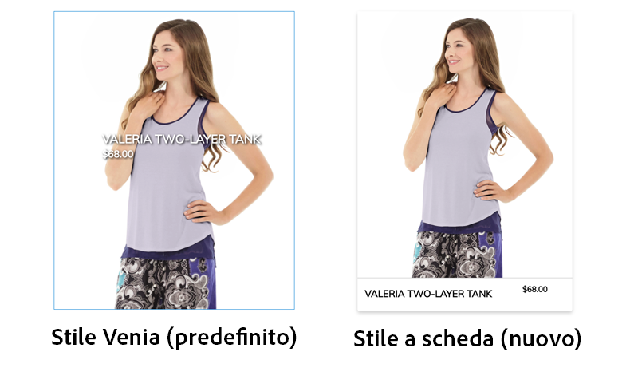
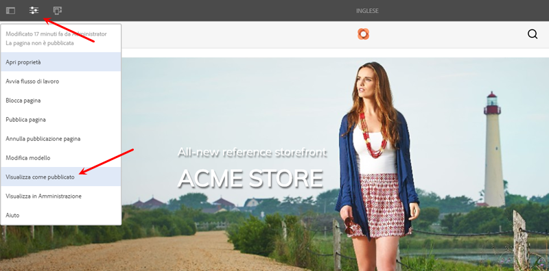
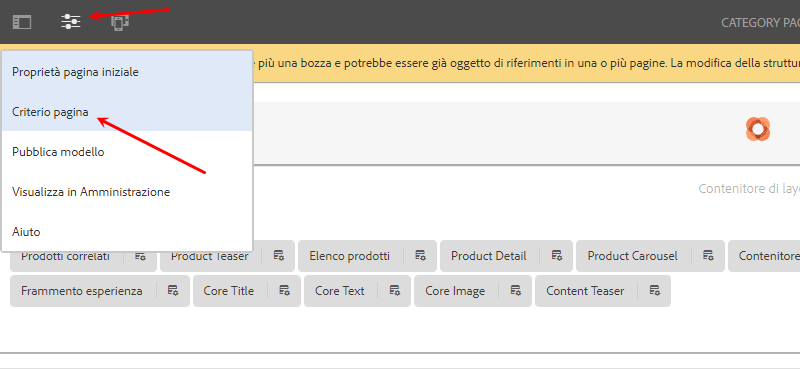
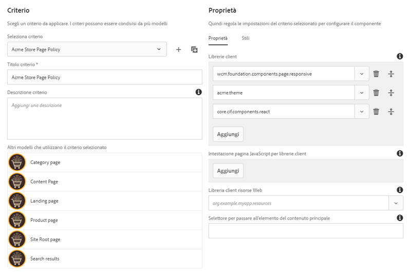
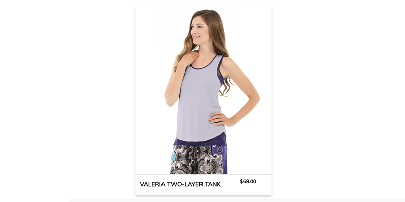
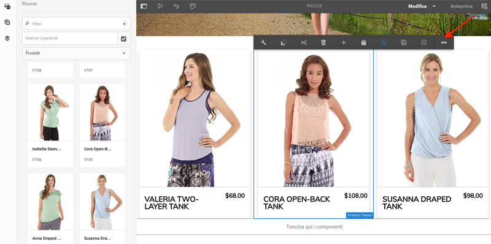
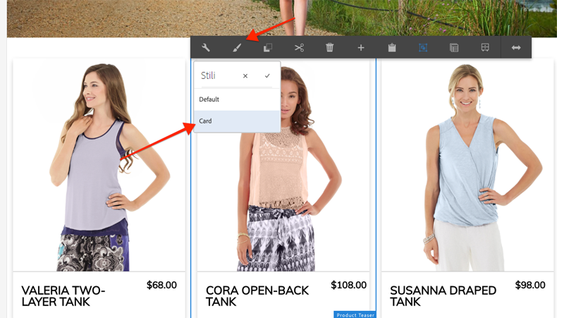

# Personalizzare lo stile dei componenti core CIF di AEM {#style-aem-cif-core-components}

Il progetto [](https://github.com/adobe/aem-cif-guides-venia) CIF Venia è una base di codice di riferimento per l&#39;utilizzo dei componenti [di base](https://github.com/adobe/aem-core-cif-components)CIF. In questa esercitazione verrà analizzato il progetto di riferimento di Venia e verrà illustrato come sono organizzati i CSS e JavaScript utilizzati dai componenti CIF AEM Core. You will also create a new style using CSS to update the default style of the **Product Teaser** component.

>[!TIP]
>
> Utilizza il [AEM archetipo](https://github.com/adobe/aem-project-archetype) del progetto quando avvii la tua implementazione commerciale.

## Cosa verrà creato

Verrà implementato un nuovo stile per il componente Product Teaser, che assomiglia a una scheda.



## Prerequisiti {#prerequisites}

Per completare questa esercitazione è necessario un ambiente di sviluppo locale. Ciò include un&#39;istanza in esecuzione di AEM configurata e connessa a un&#39;istanza di Magento. Verifica i requisiti e i passaggi per [configurare uno sviluppo locale con AEM come SDK](../develop.md)di Cloud Service.

## Clona il progetto Venia {#clone-venia-project}

Cloneremo il Progetto [](https://github.com/adobe/aem-cif-guides-venia) Venia e quindi ignoreremo gli stili predefiniti.

>[!NOTE]
>
> **Sentitevi liberi di utilizzare un progetto** esistente (basato sul AEM Project Archetype con CIF incluso) e saltate questa sezione.

1. Eseguite il seguente comando git per duplicare il progetto:

   ```shell
   $ git clone git@github.com:adobe/aem-cif-guides-venia.git
   ```

1. Crea e implementa il progetto in un’istanza locale di AEM:

   ```shell
   $ cd aem-cif-guides-venia/
   $ mvn clean install -PautoInstallPackage,cloud
   ```

1. Aggiungi le configurazioni OSGi necessarie per collegare l’istanza AEM a un’istanza di Magento o aggiungi le configurazioni al progetto appena creato.

1. A questo punto è necessario disporre di una versione funzionante di una vetrina che sia collegata a un’istanza di Magento. Navigate to the `US` > `Home` page at: [http://localhost:4502/editor.html/content/venia/us/en.html](http://localhost:4502/editor.html/content/venia/us/en.html).

   Dovresti vedere che la vetrina si basa al momento sul tema Venia. Espandi il menu principale della vetrina: dovresti vedere diverse categorie, a indicare che la connessione a Magento funziona.

   

## Librerie client e modulo ui.frontend {#introduction-to-client-libraries}

I CSS e JavaScript responsabili del rendering del tema o degli stili della vetrina sono gestiti in AEM da una [libreria client](https://docs.adobe.com/content/help/it-IT/experience-manager-65/developing/introduction/clientlibs.html), o clientlib. Le librerie client consentono di organizzare CSS e JavaScript nel codice di un progetto e quindi di distribuirli sulla pagina.

Gli stili specifici del marchio possono essere applicati AEM componenti CIF di base aggiungendo e ignorando i CSS gestiti da queste librerie client. È fondamentale comprendere in che modo le librerie client sono strutturate e incluse nella pagina.

Il [file ui.frontend](https://docs.adobe.com/content/help/it-IT/experience-manager-core-components/using/developing/archetype/uifrontend.html) è un progetto [webpack](https://webpack.js.org/) dedicato per gestire tutte le risorse front-end di un progetto. Questo consente agli sviluppatori front-end di utilizzare un numero qualsiasi di linguaggi e tecnologie come [TypeScript](https://www.typescriptlang.org/), [Sass](https://sass-lang.com/) e molto altro.

Il `ui.frontend` modulo è anche un modulo Maven e integrato con il progetto più grande attraverso l&#39;uso di un modulo NPM il generatore [aem-clientlib-](https://github.com/wcm-io-frontend/aem-clientlib-generator)aem. Durante una build, i file CSS e JavaScript compilati `aem-clientlib-generator` vengono copiati in una libreria client nel `ui.apps` modulo.


*I file CSS e Javascript compilati vengono copiati dal`ui.frontend`modulo al`ui.apps`modulo come libreria client durante una build Maven*

## Aggiornare lo stile del teaser {#ui-frontend-module}

Apportate quindi una piccola modifica allo stile Teaser per vedere come funzionano il `ui.frontend` modulo e le clientlibraries. Utilizzate [l&#39;IDE di vostra scelta](https://docs.adobe.com/content/help/en/experience-manager-learn/cloud-service/local-development-environment-set-up/development-tools.html#set-up-the-development-ide) per importare il progetto Venia. Gli screenshot utilizzati sono tratti dall&#39;IDE [di codice di](https://docs.adobe.com/content/help/en/experience-manager-learn/cloud-service/local-development-environment-set-up/development-tools.html#microsoft-visual-studio-code)Visual Studio.

1. Navigate and expand the **ui.frontend** module and expand the folder hierarchy to: `ui.frontend/src/main/styles/commerce`:

   

   Al di sotto della cartella sono presenti più file Sass (`.scss`). Questi sono gli stili specifici di Commerce per ciascuno dei componenti Commerce.

1. Aprire il file `_productteaser.scss`.

1. Aggiornate la `.item__image` regola e modificate la regola del bordo:

   ```scss
   .item__image {
       border: #ea00ff 8px solid; /* <-- modify this rule */
       display: block;
       grid-area: main;
       height: auto;
       opacity: 1;
       transition-duration: 512ms;
       transition-property: opacity, visibility;
       transition-timing-function: ease-out;
       visibility: visible;
       width: 100%;
   }
   ```

   La regola precedente deve aggiungere un bordo rosa molto grassetto al componente Product Teaser.

1. Aprite una nuova finestra del terminale e passate alla `ui.frontend` cartella:

   ```shell
   $ cd <project-location>/aem-cif-guides-venia/ui.frontend
   ```

1. Eseguite il seguente comando Maven:

   ```shell
   $ mvn clean install
   ...
   [INFO] ------------------------------------------------------------------------
   [INFO] BUILD SUCCESS
   [INFO] ------------------------------------------------------------------------
   [INFO] Total time:  29.497 s
   [INFO] Finished at: 2020-08-25T14:30:44-07:00
   [INFO] ------------------------------------------------------------------------
   ```

    l&#39;uscita terminale Inspect. Il comando Maven ha eseguito diversi script NPM, tra cui `npm run build`. Il `npm run build` comando è definito nel `package.json` file e ha l&#39;effetto di compilare il progetto webpack e attivare la generazione della libreria client.

1.  Inspect il file `ui.frontend/dist/clientlib-site/site.css`:

   

   Il file è la versione completa e ridotta di tutti i file Sass nel progetto.

   >[!NOTE]
   >
   > I file di questo tipo vengono ignorati dal controllo del codice sorgente, in quanto dovrebbero essere generati durante il tempo di creazione.

1.  Inspect il file `ui.frontend/clientlib.config.js`.

   ```js
   /* clientlib.config.js*/
   ...
   // Config for `aem-clientlib-generator`
   module.exports = {
       context: BUILD_DIR,
       clientLibRoot: CLIENTLIB_DIR,
       libs: [
           {
               ...libsBaseConfig,
               name: 'clientlib-site',
               categories: ['venia.site'],
               dependencies: ['venia.dependencies', 'aem-core-cif-react-components'],
               assets: {
   ...
   ```

   Questo è il file di configurazione per [aem-clientlib-generator](https://github.com/wcm-io-frontend/aem-clientlib-generator) e determina dove e come i CSS e JavaScript compilati verranno trasformati in una libreria client AEM.

1. Nel `ui.apps` modulo ispezionare il file: `ui.apps/src/main/content/jcr_root/apps/venia/clientlibs/clientlib-site/css/site.css`:

   

   Questo `site.css` file viene copiato nel `ui.apps` progetto. Ora fa parte di una raccolta clienti denominata `clientlib-site` con una categoria di `venia.site`. Una volta che il file fa parte del `ui.apps` modulo, può essere distribuito in AEM.

   >[!NOTE]
   >
   > I file di questo tipo vengono ignorati anche dal controllo del codice sorgente, in quanto dovrebbero essere generati durante il tempo di creazione.

1. Esaminate quindi le altre librerie client generate dal progetto:

   

   Queste librerie client non sono gestite dal `ui.frontend` modulo. Queste librerie client includono dipendenze CSS e JavaScript fornite dal Adobe . La definizione per queste clientlibraries è contenuta nel `.content.xml` file sotto ogni cartella.

   **clientlib-base**: si tratta di una libreria client vuota che incorpora semplicemente le dipendenze necessarie dai [componenti core di AEM](https://docs.adobe.com/content/help/it-IT/experience-manager-core-components/using/introduction.html). La categoria è `venia.base`.

   **clientlib-cif** - Si tratta anche di una libreria client vuota che incorpora semplicemente le dipendenze necessarie dai componenti [di base](https://github.com/adobe/aem-core-cif-components)AEM CIF. La categoria è `venia.cif`.

   **clientlib-grid** : include il CSS necessario per abilitare AEM funzione Griglia reattiva. L’utilizzo della griglia AEM consente di attivare la modalità [](https://docs.adobe.com/content/help/en/experience-manager-65/administering/operations/configuring-responsive-layout.html#include-the-responsive-css) Layout nell’editor AEM e di ridimensionare i componenti per gli autori dei contenuti. La categoria è `venia.grid` ed è incorporata nella `venia.base` libreria.

1.  Inspect i file `customheaderlibs.html` e `customfooterlibs.html` sotto `ui.apps/src/main/content/jcr_root/apps/venia/components/page`:

   

   Questi script includono le librerie **venia.base** e **venia.cif** come parte di tutte le pagine.

   >[!NOTE]
   >
   > Solo le librerie di base sono &quot;hardcoded&quot; come parte degli script di pagina. `venia.site` non è incluso in questi file e viene invece incluso come parte del modello di pagina per una maggiore flessibilità. Questo verrà esaminato successivamente.

1. Dal terminale, create e distribuite l’intero progetto in un’istanza locale di AEM:

   ```shell
   $ cd aem-cif-guides-venia/
   $ mvn clean install -PautoInstallPackage,cloud
   ```

## Author a Product Teaser {#author-product-teaser}

Una volta implementati gli aggiornamenti di codice, aggiungete una nuova istanza del componente Product Teaser nella home page del sito utilizzando gli strumenti di authoring AEM. Questo ci permetterà di visualizzare gli stili aggiornati.

1. Open a new browser tab and navigate to the **Home Page** of the site: [http://localhost:4502/editor.html/content/venia/us/en.html](http://localhost:4502/editor.html/content/venia/us/en.html).

1. Espandete Asset Finder (la barra laterale) in modalità **Modifica** . Passate al filtro Risorse su **Prodotti**.

   

1. Trascinare un nuovo prodotto nella pagina principale del Contenitore di layout principale:

   

   Il teaser prodotto ora presenta un bordo rosa brillante basato sulla modifica della regola CSS creata in precedenza.

## Verificare le librerie client sulla pagina {#verify-client-libraries}

Quindi verificate l&#39;inclusione delle librerie client nella pagina.

1. Navigate to the **Home Page** of the site: [http://localhost:4502/editor.html/content/venia/us/en.html](http://localhost:4502/editor.html/content/venia/us/en.html).

1. Seleziona il menu **Informazioni pagina** e fai clic su **Visualizza come pubblicato**:

   

   La pagina viene aperta senza caricare alcun JavaScript di authoring di AEM, come apparirebbe sul sito pubblicato. All’URL è stato aggiunto il parametro di query `?wcmmode=disabled`. Quando si sviluppano CSS e JavaScript, è buona norma utilizzare questo parametro per semplificare la pagina, rimuovendo elementi dell’istanza di authoring di AEM.

1. Visualizzate l&#39;origine della pagina e dovreste essere in grado di identificare diverse librerie client incluse:

   ```html
   <!DOCTYPE html>
   <html lang="en-US">
   <head>
       ...
       <link rel="stylesheet" href="/etc.clientlibs/venia/clientlibs/clientlib-base.min.css" type="text/css">
       <link rel="stylesheet" href="/etc.clientlibs/venia/clientlibs/clientlib-site.min.css" type="text/css">
   </head>
   ...
       <script type="text/javascript" src="/etc.clientlibs/venia/clientlibs/clientlib-site.min.js"></script>
       <script type="text/javascript" src="/etc.clientlibs/core/wcm/components/commons/site/clientlibs/container.min.js"></script>
       <script type="text/javascript" src="/etc.clientlibs/venia/clientlibs/clientlib-base.min.js"></script>
   <script type="text/javascript" src="/etc.clientlibs/core/cif/clientlibs/common.min.js"></script>
   <script type="text/javascript" src="/etc.clientlibs/venia/clientlibs/clientlib-cif.min.js"></script>
   </body>
   </html>
   ```

   Le librerie client distribuite alla pagina hanno il prefisso `/etc.clientlibs` e vengono servite tramite un [proxy](https://docs.adobe.com/content/help/it-IT/experience-manager-65/developing/introduction/clientlibs.html#locating-a-client-library-folder-and-using-the-proxy-client-libraries-servlet) per evitare di esporre elementi sensibili in `/apps` o `/libs`.

   Avviso `venia/clientlibs/clientlib-site.min.css` e `venia/clientlibs/clientlib-site.min.js`. Si tratta dei file CSS e Javascript compilati derivati dal `ui.frontend` modulo.

## Inclusione della libreria client con i modelli di pagina {#client-library-inclusion-pagetemplates}

Sono disponibili diverse opzioni per includere una libreria lato client. Next inspect how the generated project includes the `clientlib-site` libraries via [Page Templates](https://docs.adobe.com/content/help/it-IT/experience-manager-65/developing/platform/templates/page-templates-editable.html).

1. Navigate to the **Home Page** of the site within the AEM Editor: [http://localhost:4502/editor.html/content/venia/us/en.html](http://localhost:4502/editor.html/content/venia/us/en.html).

1. Selezionate il menu Informazioni **** pagina e fate clic su **Modifica modello**:

   

   Viene aperto il modello **Pagina** di destinazione su cui si basa la pagina **principale** .

   >[!NOTE]
   >
   > Per visualizzare tutti i modelli disponibili dalla schermata iniziale AEM, passa a **Strumenti** > **Generale** > **Modelli**.

1. Nell’angolo in alto a sinistra, seleziona l’icona **Informazioni pagina** e fai clic su **Criterio pagina**.

   

1. Viene aperto il criterio pagina per il modello Pagina di destinazione:

   

   Sul lato destro è disponibile un elenco delle **categorie** di librerie client che verranno incluse in tutte le pagine che utilizzano questo modello.

   * `venia.dependencies` - Fornisce tutte le librerie di fornitori `venia.site` da cui dipende.
   * `venia.site` - Questa è la categoria per `clientlib-site` la quale il `ui.frontend` modulo genera.

   Altri modelli utilizzano lo stesso criterio: **Pagina di contenuto**, **Pagina di destinazione** e così via. Riutilizzando lo stesso criterio, possiamo essere certi che le stesse librerie client verranno incluse in tutte le pagine.

   Quando si gestisce l’inclusione delle librerie client mediante l’uso di modelli e criteri di pagina, si può modificare il criterio a livello di modello. Ad esempio, supponiamo di dover gestire due marchi diversi nella stessa istanza di AEM. Ogni marchio avrà un proprio stile o un proprio *tema*, ma le librerie e il codice di base saranno gli stessi. Un altro esempio, nel caso di una libreria client più grande che si voglia visualizzare solo su determinate pagine, si può creare un criterio di pagina univoco solo per quel modello.

## Sviluppo webpack locale {#local-webpack-development}

Nell&#39;esercizio precedente, è stato effettuato un aggiornamento a un file Sass nel `ui.frontend` modulo e dopo aver eseguito una build Maven le modifiche sono state distribuite a AEM. In seguito, cercheremo di sfruttare un webpack-dev-server per sviluppare rapidamente gli stili front-end.

Il webpack-dev-server esegue il proxy delle immagini e di alcuni CSS/JavaScript dall&#39;istanza locale di AEM, ma consente allo sviluppatore di modificare gli stili e JavaScript nel `ui.frontend` modulo.

1. Nel browser andate alla pagina **principale** e **Visualizza come pubblicato**: [http://localhost:4502/content/venia/us/en.html?wcmmode=disabled](http://localhost:4502/content/venia/us/en.html?wcmmode=disabled).

1. Visualizzare l’origine della pagina e **copiare** l’HTML non elaborato della pagina.

1. Tornare all&#39;IDE di vostra scelta sotto il `ui.frontend` modulo aprire il file: `ui.frontend/src/main/static/index.html`

   

1. Sovrascrivete il contenuto `index.html` e **incollate** l’HTML copiato nel passaggio precedente.

1. Trovare le includi per `clientlib-site.min.css`, `clientlib-site.min.js` e **rimuoverle** .

   ```html
   <head>
       <!-- remove this link -->
       <link rel="stylesheet" href="/etc.clientlibs/venia/clientlibs/clientlib-base.min.css" type="text/css">
       ...
   </head>
   <body>
       ...
        <!-- remove this link -->
       <script type="text/javascript" src="/etc.clientlibs/venia/clientlibs/clientlib-site.min.js"></script>
   </body>
   ```

   Questi vengono rimossi perché rappresentano la versione compilata del CSS e del JavaScript generato dal `ui.frontend` modulo. Lasciate le altre librerie client in quanto verranno proxy dall&#39;istanza di AEM in esecuzione.

1. Aprite una nuova finestra del terminale e accedete alla `ui.frontend` cartella. Eseguire il comando `npm start`:

   ```shell
   $ cd ui.frontend
   $ npm start
   ```

   Verrà avviato il webpack-dev-server su [http://localhost:8080/](Http://localhost:8080/)

   >[!CAUTION]
   >
   > Se si verifica un errore relativo a Sass, arrestare il server ed eseguire il comando `npm rebuild node-sass` e ripetere i passaggi precedenti. Ciò può verificarsi se nel progetto è presente una versione diversa di `npm` e `node` successivamente specificata `aem-cif-guides-venia/pom.xml`.

1. Andate alla [http://localhost:8080/](Http://localhost:8080/) in una nuova scheda con lo stesso browser in cui è stata registrata un&#39;istanza di AEM. Dovresti vedere la home page di Venia tramite il webpack-dev-server:

   

   Lasciare in esecuzione il webpack-dev-server. Sarà utilizzato nell&#39;esercizio successivo.

## Implementare lo stile scheda per Product Teaser {#update-css-product-teaser}

Quindi modificate i file Sass nel `ui.frontend` modulo per implementare uno stile simile a una scheda per il Product Teaser. Il webpack-dev-server verrà utilizzato per visualizzare rapidamente le modifiche.

Torna all’IDE e al progetto generato.

1. Nel modulo **ui.frontend** riaprite il file `_productteaser.scss` in `ui.frontend/src/main/styles/commerce/_productteaser.scss`.

1. Apportate le seguenti modifiche al bordo del teaser prodotto:

   ```diff
       .item__image {
   -       border: #ea00ff 8px solid;
   +       border-bottom: 1px solid #c0c0c0;
           display: block;
           grid-area: main;
           height: auto;
           opacity: 1;
           transition-duration: 512ms;
           transition-property: opacity, visibility;
           transition-timing-function: ease-out;
           visibility: visible;
           width: 100%;
       }
   ```

   Salvare le modifiche e il webpack-dev-server deve aggiornarsi automaticamente con i nuovi stili.

1. Aggiungi un’ombra esterna e includi angoli arrotondati al Product Teaser.

   ```scss
    .item__root {
        position: relative;
        box-shadow: 0 4px 8px 0 rgba(0,0,0,0.2);
        transition: 0.3s;
        border-radius: 5px;
        float: left;
        margin-left: 12px;
        margin-right: 12px;
   }
   
   .item__root:hover {
      box-shadow: 0 8px 16px 0 rgba(0,0,0,0.2);
   }
   ```

1. Aggiorna il nome del prodotto in modo che venga visualizzato nella parte inferiore del teaser e modifica il colore del testo.

   ```css
   .item__name {
       color: #000;
       display: block;
       float: left;
       font-size: 22px;
       font-weight: 900;
       line-height: 1em;
       padding: 0.75em;
       text-transform: uppercase;
       width: 75%;
   }
   ```

1. Aggiorna il prezzo del prodotto in modo che venga visualizzato nella parte inferiore del teaser e modifica il colore del testo.

   ```css
   .price {
       color: #000;
       display: block;
       float: left;
       font-size: 18px;
       font-weight: 900;
       padding: 0.75em;
       padding-bottom: 2em;
       width: 25%;
   
       ...
   ```

1. Update the media query at the bottom, to stack the name and price in screens smaller than **992px**.

   ```css
   @media (max-width: 992px) {
       .productteaser .item__name {
           font-size: 18px;
           width: 100%;
       }
       .productteaser .item__price {
           font-size: 14px;
           width: 100%;
       }
   }
   ```

   È ora possibile visualizzare lo stile scheda riportato nel webpack-dev-server:

   

   Tuttavia, le modifiche non sono ancora state distribuite AEM. Puoi scaricare il [file della soluzione qui](../assets/style-cif-component/_productteaser.scss).

1. Distribuisci gli aggiornamenti per AEM utilizzando le tue competenze Maven, da un terminale della riga di comando:

   ```shell
   $ cd aem-cif-guides-venia/
   $ mvn clean install -PautoInstallPackage,cloud
   ```

   >[!NOTE]
   >Sono disponibili [strumenti e configurazione IDE](https://docs.adobe.com/content/help/en/experience-manager-learn/foundation/development/set-up-a-local-aem-development-environment.html#set-up-an-integrated-development-environment) aggiuntivi per sincronizzare i file di progetto direttamente con un’istanza AEM locale senza dover eseguire una generazione Maven completa.

## Visualizzare il Product Teaser aggiornato {#view-updated-product-teaser}

Una volta implementato in AEM il codice per il progetto, dovrebbe essere possibile vedere le modifiche apportate al Product Teaser.

1. Return to your browser and re-fresh the Home page: [http://localhost:4502/editor.html/content/venia/us/en.html](http://localhost:4502/editor.html/content/venia/us/en.html). Dovresti vedere gli stili del product teaser aggiornati.

   

1. Prova ad aggiungere altri Product Teaser. Utilizza la modalità Layout per modificare la larghezza e l’offset dei componenti in modo da visualizzare più teaser su una riga.

   

## Risoluzione dei problemi {#troubleshooting}

You can verify in [CRXDE-Lite](http://localhost:4502/crx/de/index.jsp) that the updated CSS file has been deployed: [http://localhost:4502/crx/de/index.jsp#/apps/venia/clientlibs/clientlib-site/css/site.css](http://localhost:4502/crx/de/index.jsp#/apps/venia/clientlibs/clientlib-site/css/site.css)

Quando si distribuiscono nuovi file CSS e/o JavaScript, è importante anche assicurarsi che il browser non distribuisca file non aggiornati. A tale scopo, cancella la cache del browser o avvia una nuova sessione del browser.

AEM inoltre tenta di memorizzare nella cache le librerie client per migliorare le prestazioni. A volte, dopo la distribuzione del codice, vengono distribuiti i file meno recenti. Puoi annullare manualmente la validità della cache della libreria client di AEM utilizzando lo strumento [Rigenera librerie client](http://localhost:4502/libs/granite/ui/content/dumplibs.rebuild.html). *Se si sospetta che AEM abbia memorizzato nella cache una versione precedente di una libreria client, è meglio annullare la validità della cache. La rigenerazione delle librerie è infatti inefficiente e richiede molto tempo.*

## Congratulazioni {#congratulations}

Hai appena formattato il tuo primo componente AEM CIF Core e hai usato un server di sviluppo webpack!

## Sfida bonus {#bonus-challenge}

Usa il [Sistema di stili di AEM](https://docs.adobe.com/content/help/it-IT/experience-manager-65/developing/components/style-system.html) per creare due stili che possono essere attivati/disattivati da un autore di contenuti. La sezione su come [sviluppare con il sistema di stili](https://docs.adobe.com/content/help/en/experience-manager-learn/getting-started-wknd-tutorial-develop/style-system.html) include passaggi dettagliati e informazioni su come eseguire questa operazione.



## Risorse aggiuntive {#additional-resources}

* [AEM Project Archetype](https://github.com/adobe/aem-project-archetype)
* [Componenti core CIF di AEM](https://github.com/adobe/aem-core-cif-components)
* [Configurare un ambiente di sviluppo AEM locale](https://docs.adobe.com/content/help/en/experience-manager-learn/cloud-service/local-development-environment-set-up/overview.html)
* [Librerie lato client](https://docs.adobe.com/content/help/it-IT/experience-manager-65/developing/introduction/clientlibs.html)
* [Guida introduttiva di AEM Sites](https://docs.adobe.com/content/help/en/experience-manager-learn/getting-started-wknd-tutorial-develop/overview.html)
* [Sviluppo con il sistema di stili](https://docs.adobe.com/content/help/en/experience-manager-learn/getting-started-wknd-tutorial-develop/style-system.html)
