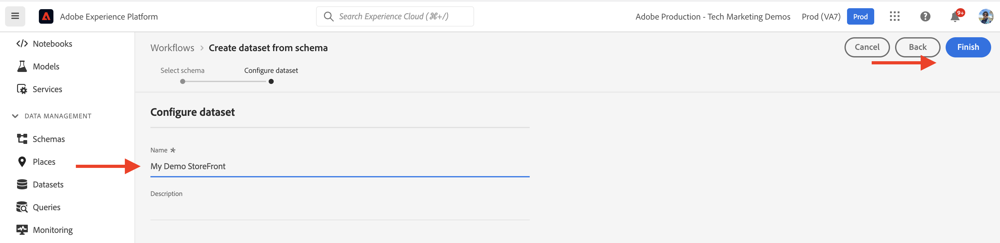
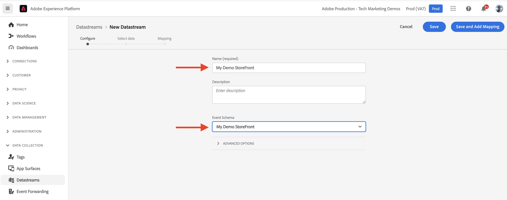

# Componenti core AEM-CIF e integrazione con Adobe Experience Platform {#aem-cif-aep-integration}

Il [Commerce integration framework (CIF)](https://github.com/adobe/aem-core-cif-components) I componenti core forniscono un’integrazione perfetta con [Adobe Experience Platform](https://experienceleague.adobe.com/docs/experience-platform/landing/platform-overview.html?lang=en) per inoltrare gli eventi storefront e i relativi dati da interazioni lato client, ad esempio __aggiungi al carrello__.

Il [Componenti core CIF dell’AEM](https://github.com/adobe/aem-core-cif-components) Il progetto fornisce una libreria JavaScript denominata [Connettore Adobe Experience Platform per Adobe Commerce](https://github.com/adobe/aem-core-cif-components/tree/master/extensions/experience-platform-connector) per raccogliere i dati dell’evento dalla vetrina Commerce. I dati dell’evento vengono inviati all’Experience Platform in cui vengono utilizzati in altri prodotti Adobe Experience Cloud, come Adobe Analytics e Adobe Target, per creare un profilo a 360 gradi che copre un percorso di clienti. Collegando i dati di Commerce ad altri prodotti in Adobe Experience Cloud, puoi eseguire attività come analizzare il comportamento degli utenti sul tuo sito, eseguire test AB e creare campagne personalizzate.

Ulteriori informazioni su [Raccolta dati di Experienci Platform](https://experienceleague.adobe.com/docs/experience-platform/collection/home.html) una suite di tecnologie che consente di raccogliere i dati sull’esperienza del cliente da origini lato client.

## Invia `addToCart` dati evento da Experience Platform {#send-addtocart-to-aep}

I passaggi seguenti mostrano come inviare `addToCart` dati evento dalle pagine di prodotti sottoposte a rendering AEM all’Experience Platform utilizzando il connettore CIF - Experience Platform. Utilizzando l’estensione del browser Adobi Experience Platform Debugger, puoi verificare e rivedere i dati inviati.


## Prerequisiti {#prerequisites}

Per completare questa demo, devi utilizzare un ambiente di sviluppo locale. Ciò include un’istanza in esecuzione dell’AEM configurata e connessa a un’istanza Adobe Commerce. Rivedi i requisiti e i passaggi per [impostazione dello sviluppo locale con l’SDK as a Cloud Service per l’AEM](../develop.md).

È inoltre necessario accedere a [Adobe Experience Platform](https://experienceleague.adobe.com/docs/experience-platform/landing/platform-ui/ui-guide.html) e le autorizzazioni per creare schemi, set di dati e flussi di dati per la raccolta dati. Per ulteriori informazioni, consulta [Gestione delle autorizzazioni](https://experienceleague.adobe.com/docs/experience-platform/collection/permissions.html).

## Configurazione as a Cloud Service per Commerce AEM {#aem-setup}

Per avere un lavoro __AEM Commerce as a Cloud Service__ nell’ambiente locale con il codice e la configurazione necessari, completa i passaggi seguenti.

### Configurazione locale

Segui le [Configurazione locale](https://experienceleague.adobe.com/docs/experience-manager-cloud-service/content/content-and-commerce/storefront/developing/develop.html?#local-setup) passaggi per avere un ambiente as a Cloud Service per l’AEM Commerce funzionante.

### Configurazione del progetto

Segui le [Archetipo progetto AEM](https://experienceleague.adobe.com/docs/experience-manager-cloud-service/content/content-and-commerce/storefront/developing/develop.html?#project) Passaggi per creare un nuovo progetto AEM Commerce (CIF).

>[!TIP]
>
>Nell’esempio seguente, il progetto Commerce dell’AEM è denominato: `My Demo Storefront`Tuttavia, puoi scegliere il nome del tuo progetto.


Crea e distribuisci il progetto AEM Commerce creato nell’SDK AEM locale eseguendo il seguente comando dalla directory principale del progetto.

```bash
$ mvn clean install -PautoInstallSinglePackage
```

Il implementato localmente `My Demo StoreFront` il sito commerce con codice e contenuto predefiniti si presenta come segue:


### Installare le dipendenze dei connettori Peregrine e CIF-AEP

Per raccogliere e inviare i dati dell’evento dalle pagine delle categorie e dei prodotti di questo sito AEM Commerce, è necessario installare la chiave `npm` pacchetti in `ui.frontend` modulo del progetto AEM Commerce.

Accedi a `ui.frontend` e installare i pacchetti richiesti eseguendo i seguenti comandi dalla riga di comando.

```bash
npm i --save lodash.get@^4.4.2 lodash.set@^4.3.2
npm i --save apollo-cache-persist@^0.1.1
npm i --save redux-thunk@~2.3.0
npm i --save @adobe/apollo-link-mutation-queue@~1.1.0
npm i --save @magento/peregrine@~12.5.0
npm i --save @adobe/aem-core-cif-react-components --force
npm i --save-dev @magento/babel-preset-peregrine@~1.2.1
npm i --save @adobe/aem-core-cif-experience-platform-connector --force
```

>[!IMPORTANT]
>
>Il `--force` è richiesto a volte come [PWA Studi](https://developer.adobe.com/commerce/pwa-studio/) è restrittivo con le dipendenze dei peer supportate. Di solito, questo non dovrebbe causare alcun problema.


### Configurare Maven per l’utilizzo `--force` argomento

Come parte del processo di build Maven, il npm clean install (con `npm ci`) viene attivato. Ciò richiede anche `--force` argomento.

Passa al file POM principale del progetto `pom.xml` e individuare `<id>npm ci</id>` blocco di esecuzione. Aggiorna il blocco come segue:

```xml
<execution>
    <id>npm ci</id>
    <goals>
    <goal>npm</goal>
    </goals>
    <configuration>
    <arguments>ci --force</arguments>
    </configuration>
</execution>
```

### Cambia il formato di configurazione di Babel

Passa dal valore predefinito `.babelrc` file configurazione relativa formato file a `babel.config.js` formato. Si tratta di un formato di configurazione per l’intero progetto e consente di applicare i plug-in e i predefiniti al `node_module` con un maggiore controllo.

1. Accedi a `ui.frontend` ed eliminare il `.babelrc` file.

1. Creare un `babel.config.js` file che utilizza `peregrine` predefinito.

   ```javascript
   const peregrine = require('@magento/babel-preset-peregrine');
   
   module.exports = (api, opts = {}) => {
       const config = {
           ...peregrine(api, opts),
           sourceType: 'unambiguous'
       } 
   
       config.plugins = config.plugins.filter(plugin => plugin !== 'react-refresh/babel');
   
       return config;
   }
   ```

### Configurare il webpack per l&#39;utilizzo di Babel

Per eseguire la transpilazione dei file JavaScript mediante Babel loader (`babel-loader`) e webpack, è necessario modificare il `webpack.common.js` file.

Accedi a `ui.frontend` e aggiorna il `webpack.common.js` file per avere la seguente regola all&#39;interno del `module` valore proprietà:

```javascript
{
    test: /\.jsx?$/,
    exclude: /node_modules\/(?!@magento\/)/,
    loader: 'babel-loader'
}
```

### Configura client Apollo

Il [Client Apollo](https://www.apollographql.com/docs/react/) viene utilizzato per gestire dati locali e remoti con GraphQL. Memorizza inoltre i risultati delle query GraphQL in una cache locale normalizzata in memoria.

Per [`InMemoryCache`](https://www.apollographql.com/docs/react/caching/cache-configuration/) per funzionare in modo efficace, è necessario `possibleTypes.js` file. Per generare questo file, vedi [Generazione automatica di possibleTypes](https://www.apollographql.com/docs/react/data/fragments/#generating-possibletypes-automatically). Inoltre, consulta [Implementazione di riferimento PWA Studi](https://github.com/magento/pwa-studio/blob/1977f38305ff6c0e2b23a9da7beb0b2f69758bed/packages/pwa-buildpack/lib/Utilities/graphQL.js#L106-L120) e un esempio di [`possibleTypes.js`](../assets/aep-integration/possibleTypes.js) file.


1. Accedi a `ui.frontend` e salva il file con nome `./src/main/possibleTypes.js`

1. Aggiornare il `webpack.common.js` del file `DefinePlugin` per sostituire le variabili statiche richieste durante la generazione.

   ```javascript
   const { DefinePlugin } = require('webpack');
   const { POSSIBLE_TYPES } = require('./src/main/possibleTypes');
   
   ...
   
   plugins: [
       ...
       new DefinePlugin({
           'process.env.USE_STORE_CODE_IN_URL': false,
           POSSIBLE_TYPES
       })
   ]
   ```

### Inizializzare i componenti core Peregrine e CIF

Per inizializzare i componenti core Peregrine e CIF basati su React, crea la configurazione e i file JavaScript richiesti.

1. Accedi a `ui.frontend` e crea la seguente cartella: `src/main/webpack/components/commerce/App`

1. Creare un `config.js` file con il seguente contenuto:

   ```javascript
   // get and parse the CIF store configuration from the <head>
   const storeConfigEl = document.querySelector('meta[name="store-config"]');
   const storeConfig = storeConfigEl ? JSON.parse(storeConfigEl.content) : {};
   
   // the following global variables are needed for some of the peregrine features
   window.STORE_VIEW_CODE = storeConfig.storeView || 'default';
   window.AVAILABLE_STORE_VIEWS = [
       {
           code: window.STORE_VIEW_CODE,
           base_currency_code: 'USD',
           default_display_currency_code: 'USD',
           id: 1,
           locale: 'en',
           secure_base_media_url: '',
           store_name: 'My Demo StoreFront'
       }
   ];
   window.STORE_NAME = window.STORE_VIEW_CODE;
   window.DEFAULT_COUNTRY_CODE = 'en';
   
   export default {
       storeView: window.STORE_VIEW_CODE,
       graphqlEndpoint: storeConfig.graphqlEndpoint,
       // Can be GET or POST. When selecting GET, this applies to cache-able GraphQL query requests only.
       // Mutations will always be executed as POST requests.
       graphqlMethod: storeConfig.graphqlMethod,
       headers: storeConfig.headers,
   
       mountingPoints: {
           // TODO: define the application specific mount points as they may be used by <Portal> and <PortalPlacer>
       },
       pagePaths: {
           // TODO: define the application specific paths/urls as they may be used by the components
           baseUrl: storeConfig.storeRootUrl
       },
       eventsCollector: {
           eventForwarding: {
               commerce: true,
               aep: false,
           }
       }
   };
   ```

   >[!IMPORTANT]
   >
   >Anche se forse conosci già le [`config.js`](https://github.com/adobe/aem-cif-guides-venia/blob/main/ui.frontend/src/main/components/App/config.js) file da __Guide AEM - Progetto CIF Venia__, è necessario apportare alcune modifiche a questo file. Prima di tutto, rivedi qualsiasi __ATTIVITÀ__ commenti. Quindi, all’interno del `eventsCollector` , trova il `eventsCollector > aed` e aggiornare `orgId` e `datastreamId` ai valori corretti. [Ulteriori informazioni](./aep.md#add-aep-values-to-aem).

1. Creare un `App.js` file con il seguente contenuto. Questo file è simile a un tipico file del punto di avvio dell’applicazione React e contiene gli hook React e personalizzati e l’utilizzo di React Context per facilitare l’integrazione Experience Platform.

   ```javascript
   import config from './config';
   
   import React, { useEffect } from 'react';
   import ReactDOM from 'react-dom';
   import { IntlProvider } from 'react-intl';
   import { BrowserRouter as Router } from 'react-router-dom';
   import { combineReducers, createStore } from 'redux';
   import { Provider as ReduxProvider } from 'react-redux';
   import { createHttpLink, ApolloProvider } from '@apollo/client';
   import { ConfigContextProvider, useCustomUrlEvent, useReferrerEvent, usePageEvent, useDataLayerEvents, useAddToCartEvent } from '@adobe/aem-core-cif-react-components';
   import { EventCollectorContextProvider, useEventCollectorContext } from '@adobe/aem-core-cif-experience-platform-connector';
   import { useAdapter } from '@magento/peregrine/lib/talons/Adapter/useAdapter';
   import { customFetchToShrinkQuery } from '@magento/peregrine/lib/Apollo/links';
   import { BrowserPersistence } from '@magento/peregrine/lib/util';
   import { default as PeregrineContextProvider } from '@magento/peregrine/lib/PeregrineContextProvider';
   import { enhancer, reducers } from '@magento/peregrine/lib/store';
   
   const storage = new BrowserPersistence();
   const store = createStore(combineReducers(reducers), enhancer);
   
   storage.setItem('store_view_code', config.storeView);
   
   const App = () => {
       const [{ sdk: mse }] = useEventCollectorContext();
   
       // trigger page-level events
       useCustomUrlEvent({ mse });
       useReferrerEvent({ mse });
       usePageEvent({ mse });
       // listen for add-to-cart events and enable forwarding to the magento storefront events sdk
       useAddToCartEvent(({ mse }));
       // enable CIF specific event forwarding to the Adobe Client Data Layer
       useDataLayerEvents();
   
       useEffect(() => {
           // implement a proper marketing opt-in, for demo purpose you hard-set the consent cookie
           if (document.cookie.indexOf('mg_dnt') < 0) {
               document.cookie += '; mg_dnt=track';
           }
       }, []);
   
       // TODO: use the App to create Portals and PortalPlaceholders to mount the CIF / Peregrine components to the server side rendered markup
       return <></>;
   };
   
   const AppContext = ({ children }) => {
       const { storeView, graphqlEndpoint, graphqlMethod = 'POST', headers = {}, eventsCollector } = config;
       const { apolloProps } = useAdapter({
           apiUrl: new URL(graphqlEndpoint, window.location.origin).toString(),
           configureLinks: (links, apiBase) =>
               // reconfigure the HTTP link to use the configured graphqlEndpoint, graphqlMethod and storeView header
   
               links.set('HTTP', createHttpLink({
                   fetch: customFetchToShrinkQuery,
                   useGETForQueries: graphqlMethod !== 'POST',
                   uri: apiBase,
                   headers: { ...headers, 'Store': storeView }
               }))
       });
   
       return (
           <ApolloProvider {...apolloProps}>
               <IntlProvider locale='en' messages={{}}>
                   <ConfigContextProvider config={config}>
                       <ReduxProvider store={store}>
                           <PeregrineContextProvider>
                               <EventCollectorContextProvider {...eventsCollector}>
                                   {children}
                               </EventCollectorContextProvider>
                           </PeregrineContextProvider>
                       </ReduxProvider>
                   </ConfigContextProvider>
               </IntlProvider>
           </ApolloProvider>
       );
   };
   
   window.onload = async () => {
       const root = document.createElement('div');
       document.body.appendChild(root);
   
       ReactDOM.render(
           <Router>
               <AppContext>
                   <App />
               </AppContext>
           </Router>,
           root
       );
   };
   ```

   Il `EventCollectorContext` esporta il contesto React che:

   - carica la libreria commerce-events-sdk e commerce-events-collector,
   - li inizializza con una determinata configurazione, ad Experience Platform e/o ACDS
   - si abbona a tutti gli eventi da Peregrine e li inoltra all’SDK degli eventi

   Puoi rivedere i dettagli di implementazione di `EventCollectorContext` [qui](https://github.com/adobe/aem-core-cif-components/blob/3d4e44d81fff2f398fd2376d24f7b7019f20b31b/extensions/experience-platform-connector/src/events-collector/EventCollectorContext.js).

### Creare e distribuire il progetto AEM aggiornato

Per verificare che le modifiche di installazione, codice e configurazione del pacchetto di cui sopra siano corrette, ricompila e distribuisci il progetto Commerce dell’AEM aggiornato utilizzando il seguente comando Maven: `$ mvn clean install -PautoInstallSinglePackage`.

## Configurazione Experience Platform {#aep-setup}

La procedura seguente illustra come ricevere e memorizzare i dati dell’evento provenienti dalle pagine di AEM Commerce, ad esempio categoria e prodotto:

>[!AVAILABILITY]
>
>Assicurati di fare parte della __Profili di prodotto__ in __Adobe Experience Platform__ e __Raccolta dati di Adobe Experience Platform__. Se necessario, rivolgiti all’amministratore di sistema per creare, aggiornare o assegnare __Profili di prodotto__ sotto [Admin Console](https://adminconsole.adobe.com/).

### Crea schema con gruppo di campi Commerce

Per definire la struttura per i dati dell’evento Commerce, devi creare uno schema Experience Data Model (XDM). Uno schema è un insieme di regole che rappresentano e convalidano la struttura e il formato dei dati.

1. Nel browser, passa a __Adobe Experience Platform__ home page del prodotto. Esempio: <https://experience.adobe.com/#/@YOUR-ORG-NAME/sname:prod/platform/home>.

1. Individua il __Schemi__ nella sezione di navigazione a sinistra, fai clic sul pulsante __Crea schema__ nella sezione in alto a destra e seleziona __XDM ExperienceEvent__.

   

1. Denomina lo schema utilizzando __Proprietà schema > Nome visualizzato__ e aggiungere gruppi di campi utilizzando  __Composizione > Gruppi di campi > Aggiungi__ pulsante.

   

1. In __Aggiungi gruppi di campi__ finestra di dialogo, cerca `Commerce`, seleziona la __Dettagli Commerce__ e fai clic su __Aggiungi gruppi di campi__.

   


>[!TIP]
>
>Consulta la [Nozioni di base sulla composizione dello schema](https://experienceleague.adobe.com/docs/experience-platform/xdm/schema/composition.html) per ulteriori informazioni.

### Crea set di dati

Per memorizzare i dati dell’evento, è necessario creare un set di dati conforme alla definizione dello schema. Un set di dati è un costrutto di archiviazione e gestione per una raccolta di dati, in genere una tabella, che contiene uno schema (colonne) e dei campi (righe).

1. Nel browser, passa a __Adobe Experience Platform__ home page del prodotto. Esempio: <https://experience.adobe.com/#/@YOUR-ORG-NAME/sname:prod/platform/home>.

1. Individua il __Set di dati__ nella sezione di navigazione a sinistra e fai clic sul pulsante __Crea set di dati__ nella sezione in alto a destra.

   

1. Nella nuova pagina, seleziona __Crea set di dati dallo schema__ Card.

   

- Nella nuova pagina, __cerca e seleziona__ dello schema creato nel passaggio precedente, quindi fare clic sul pulsante __Successivo__ pulsante.

  

1. Denomina il set di dati utilizzando __Configura set di dati > Nome__ e fare clic sul pulsante __Fine__ pulsante.

   

>[!TIP]
>
>Consulta la [Panoramica sui set di dati](https://experienceleague.adobe.com/docs/experience-platform/catalog/datasets/overview.html) per ulteriori informazioni.


### Crea stream di dati

Per creare uno stream di dati nell’Experience Platform, completa i passaggi seguenti.

1. Nel browser, passa a __Adobe Experience Platform__ home page del prodotto. Esempio: <https://experience.adobe.com/#/@YOUR-ORG-NAME/sname:prod/platform/home>.

1. Individua il __Flussi di dati__ nella sezione di navigazione a sinistra e fai clic sul pulsante __Nuovo flusso di dati__ nella sezione in alto a destra.

   

1. Denomina lo stream di dati utilizzando __Nome__ campo obbligatorio. Sotto __Schema Evento__ , seleziona lo schema creato e fai clic su __Salva__.

   

1. Apri lo stream di dati creato e fai clic su __Aggiungi servizio__.

   

1. Sotto __Servizio__ , selezionare il campo __Adobe Experience Platform__ opzione. Sotto __Set di dati evento__ , seleziona il nome del set di dati dal passaggio precedente e fai clic su __Salva__.

   

>[!TIP]
>
>Consulta la [Panoramica sullo stream di dati](https://experienceleague.adobe.com/docs/experience-platform/edge/datastreams/overview.html) per ulteriori informazioni.

## Aggiungere valore dello stream di dati nella configurazione Commerce dell’AEM {#add-aep-values-to-aem}

Dopo aver completato la configurazione dell’Experience Platform precedente, dovresti avere `datastreamId` nella barra a sinistra dei dettagli dello stream di dati e `orgId` nell&#39;angolo in alto a destra del __Immagine profilo > Informazioni account > Informazioni utente__ modale.


1. Nel progetto Commerce dell’AEM `ui.frontend` , aggiorna il `config.js` e in particolare `eventsCollector > aep` proprietà oggetto.

1. Creare e distribuire il progetto Commerce dell’AEM aggiornato


## Trigger `addToCart` raccolta dati evento e verifica {#event-trigger-verify}

I passaggi precedenti completano la configurazione di Commerce e Experienci Platform dell’AEM. Ora puoi attivare un’ `addToCart` e verificare la raccolta dei dati utilizzando [Ispettore Snowplow](https://chromewebstore.google.com/detail/snowplow-inspector/maplkdomeamdlngconidoefjpogkmljm?pli=1) e set di dati __Metriche e grafici__ nell’interfaccia utente del prodotto.

Per attivare l’evento, puoi utilizzare il servizio di creazione AEM o il servizio di pubblicazione dalla configurazione locale. Per questo esempio, utilizza AEM Author effettuando l’accesso al tuo account.

1. Dalla pagina Sites, seleziona la __Il mio store demoFront > us > it__ pagina e fai clic su __Modifica__ nella barra delle azioni superiore.

1. Dalla barra delle azioni in alto, fai clic su __Visualizza come pubblicato__, quindi fai clic su una categoria preferita nella navigazione della vetrina.

1. Fai clic su una scheda dei prodotti preferiti in __Pagina prodotto__, quindi seleziona __colore, dimensione__ per attivare __Aggiungi al carrello__ pulsante.


1. Apri __Ispettore Snowplow__ dal pannello delle estensioni del browser e seleziona __Experienci Platform Wed SDK__ nella barra a sinistra.


1. Torna a __Pagina prodotto__ e fai clic su __Aggiungi al carrello__ pulsante. In questo modo i dati vengono inviati all’Experience Platform. Il __Adobe Experience Platform Debugger__ L&#39;estensione mostra i dettagli dell&#39;evento.

   


1. Nell’interfaccia utente di Experienci Platform, passa a __Set di dati > Il mio archivio demoFront__, sotto il __Attività set di dati__ scheda. Se il __Metriche e grafici__ se l’opzione è abilitata, vengono visualizzate le statistiche evento-dati.

   


## Dettagli di implementazione {#implementation-details}

Il [Connettore di Experience Platform CIF](https://github.com/adobe/aem-core-cif-components/tree/master/extensions/experience-platform-connector) è basato su [Connessione dati per Adobe Commerce](https://marketplace.magento.com/magento-experience-platform-connector.html), che fa parte del [PWA Studi](https://developer.adobe.com/commerce/pwa-studio/) progetto.

Il progetto PWA Studi consente di creare vetrine di Progressive Web Application (PWA) basate su Adobe Commerce o Magento Open Source. Il progetto contiene anche una libreria di componenti denominata [Peregrina](https://developer.adobe.com/commerce/pwa-studio/api/peregrine/) per aggiungere logica ai componenti visivi. Il [Libreria Peregrin](https://developer.adobe.com/commerce/pwa-studio/api/peregrine/) fornisce anche gli hook React personalizzati utilizzati da [Connettore di Experience Platform CIF](https://github.com/adobe/aem-core-cif-components/tree/master/extensions/experience-platform-connector) integrarsi perfettamente con Experienci Platform.


## Eventi supportati {#supported-events}

Al momento, sono supportati i seguenti eventi:

__Eventi Experience XDM:__

1. Aggiungi al carrello (AEM)
1. Visualizza pagina (AEM)
1. Visualizza prodotto (AEM)
1. Richiesta di ricerca inviata (AEM)
1. Risposta di ricerca ricevuta (AEM)

Quando [Componenti peregrini](https://developer.adobe.com/commerce/pwa-studio/guides/packages/peregrine/) sono riutilizzati nel progetto Commerce dell’AEM:

__Eventi Experience XDM:__

1. Rimuovi dal carrello
1. Apri carrello
1. Visualizza carrello
1. Acquisto immediato
1. Avvia estrazione
1. Completa il checkout

__Eventi XDM per profilo:__

1. Accedi
1. Crea account
1. Modifica account


## Risorse aggiuntive {#additional-resources}

Per ulteriori informazioni, consulta le risorse seguenti:

- [PWA Studi](https://developer.adobe.com/commerce/pwa-studio/)
- [[!DNL Data Connection] panoramica](https://experienceleague.adobe.com/docs/commerce-merchant-services/data-connection/overview.html)
- [[!DNL Data Connection] Eventi](https://experienceleague.adobe.com/docs/commerce-merchant-services/data-connection/event-forwarding/events.html)
- [Panoramica di Adobe Experience Platform](https://experienceleague.adobe.com/docs/experience-platform/landing/home.html)
