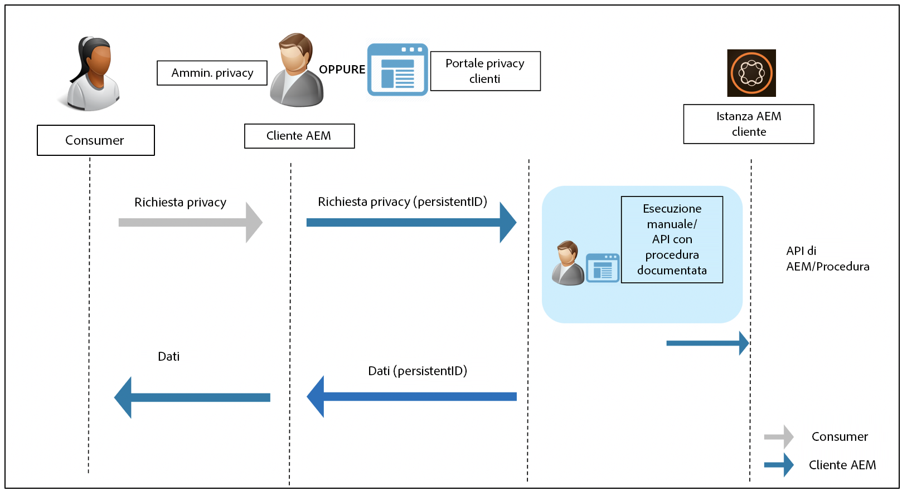

# Preparazione di Adobe Experience Manager as a Cloud Service per le normative su privacy e protezione dei dati {#aem-readiness-for-data-protection-and-data-privacy-regulations}

>[!WARNING]
>
>Il contenuto di questo documento non costituisce una consulenza legale e non intende sostituirsi a una consulenza legale.
>
>Consulta l’ufficio legale della tua azienda per ricevere consigli in merito alle normative su privacy e protezione dei dati.

>[!NOTE]
>
>Per ulteriori informazioni sulla risposta di Adobe ai problemi di privacy e sulle conseguenze di tale privacy per i clienti di Adobe, consulta [Centro per la privacy di Adobe](https://www.adobe.com/it/privacy.html).

Adobe fornisce documentazione e procedure (con API se disponibili) per l’amministratore della privacy del cliente o l’amministratore AEM. Questa documentazione aiuta gli amministratori a gestire le richieste di protezione e privacy dei dati e aiuta i clienti Adobi a rispettare queste normative. Le procedure documentate consentono ai clienti di eseguire le richieste normative manualmente o di richiamare le API, se disponibili, da un portale o servizio esterno.

>[!CAUTION]
>
>I dettagli qui documentati sono limitati ad Adobe Experience Manager as a Cloud Service.
>
>I dati provenienti da un altro servizio Adobe On-demand, insieme a eventuali richieste di accesso a dati personali correlate, richiedono l’esecuzione di azioni su tale servizio.
>
>Per ulteriori informazioni, consulta [Centro per la privacy di Adobe](https://www.adobe.com/it/privacy.html).

## Introduzione {#introduction}

Le istanze di Adobe Experience Manager as a Cloud Service e le applicazioni che vengono eseguite su di esse sono di proprietà e gestite dai clienti Adobe.

Di conseguenza, le normative sulla protezione dei dati, come GDPR, CCPA e altri, sono in gran parte responsabilità dei clienti.

Come breve introduzione, le normative sulla privacy e la protezione dei dati includono nuove regole da seguire dai ruoli di:

* Business Entities (CCPA) e/o Data Controllers (GDPR)

* Service Providers (CCPA) e/o Data Processors (GDPR)

Le principali disposizioni di tali regolamenti sono le seguenti:

1. Definizione ampliata dei dati personali per includere tutti gli ID univoci; come nei dati direttamente e indirettamente identificabili.

2. Requisiti più severi in materia di consenso.

3. Maggiore attenzione ai diritti di eliminazione (Cancellazione dati).

4. Rinuncia alla vendita di dati.

Per Adobe Experience Manager as a Cloud Service:

* Le istanze, e le applicazioni che le eseguono, sono di proprietà e gestite dal cliente.

   * Questa proprietà significa di fatto che il cliente gestisce i ruoli normativi, tra cui Business Entities e Service Provider, Data Controller e Data Processor, tra gli altri.

   * L’Adobe Experience Platform Privacy Service non fa parte del flusso di lavoro per l’AEM, come illustrato nel diagramma seguente.

* AEM include la documentazione e le procedure per l’amministratore della privacy del cliente e/o l’amministratore AEM per eseguire le richieste relative alla normativa sulla privacy, manualmente o tramite API, se disponibili.

* Nessun nuovo servizio o interfaccia utente aggiunto.

   * Le procedure e le API sono invece documentate per l’utilizzo da parte dell’interfaccia utente/dei portali dei clienti che gestiscono le richieste di normativa sulla privacy.

* AEM non include strumenti predefiniti per supportare il flusso di lavoro delle richieste di privacy.

   * L’Adobe fornisce documentazione e procedure per l’amministratore della privacy del cliente, per l’amministratore AEM o per entrambi, consentendo loro di eseguire manualmente le richieste relative alle normative sulla privacy.

Adobe fornisce procedure per la gestione delle richieste di accesso, cancellazione e rinuncia alla privacy relative ad Adobe Experience Manager as a Cloud Service. A volte sono disponibili API che possono essere richiamate da un portale sviluppato dal cliente o da script per facilitare l’automazione.

Il diagramma seguente illustra l’aspetto di un flusso di lavoro per la richiesta di accesso a dati personali (illustrato con Adobe Experience Manager 6.5):

## Adobe Experience Manager as a Cloud Service e preparazione alle normative {#aem-as-a-cloud-service-and-regulatory-readiness}

Consulta le sezioni seguenti per la documentazione regolamentare per le aree di prodotto dell’AEM as a Cloud Service.

## Fondamenti di Adobe Experience Manager as a Cloud Service {#aem-foundation}

Consulta [Preparazione di AEM Foundation per le normative su privacy e protezione dei dati](/help/compliance/data-privacy-and-protection-readiness/foundation-readiness.md).

## Adobe Experience Manager Sites as a Cloud Service {#aem-sites}

Consulta [Preparazione di AEM Sites per le normative su privacy e protezione dei dati](/help/compliance/data-privacy-and-protection-readiness/sites-readiness.md)

## Integrazione di Adobe Experience Manager as a Cloud Service con Adobe Target e Adobe Analytics {#aem-integration-with-adobe-target-adobe-analytics}

Queste integrazioni su Adobe Experience Manager as a Cloud Service si riferiscono ai servizi di protezione dei dati e privacy pronti (ad esempio, GDPR). Nessun dato personale da Adobe Target o Adobe Analytics viene memorizzato in AEM in relazione alle integrazioni.
Per ulteriori informazioni, consulta:

* [Adobe Target - Panoramica sulla privacy](https://experienceleague.adobe.com/docs/target-dev/developer/implementation/privacy/cmp-privacy-and-general-data-protection-regulation.html?lang=it)

* [Flusso di lavoro sulla privacy dei dati di Adobe Analytics](https://experienceleague.adobe.com/docs/analytics/admin/admin-tools/data-governance/an-gdpr-workflow.html)
