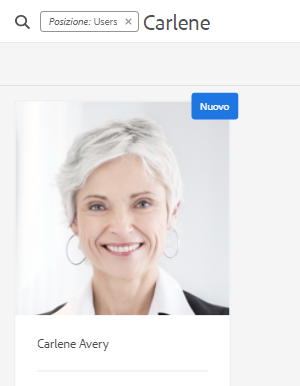
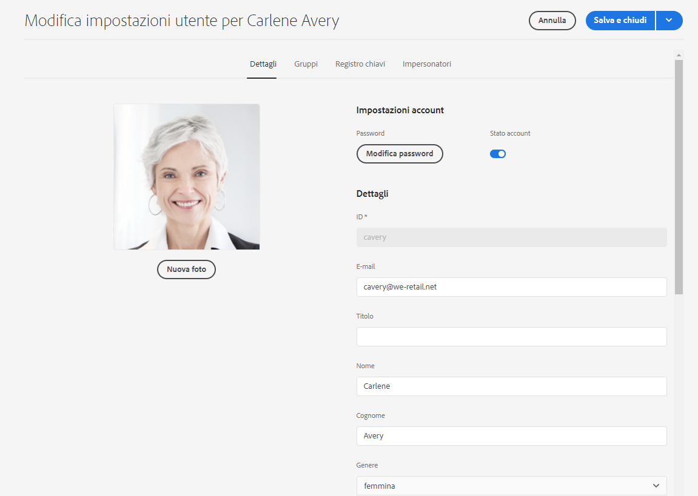
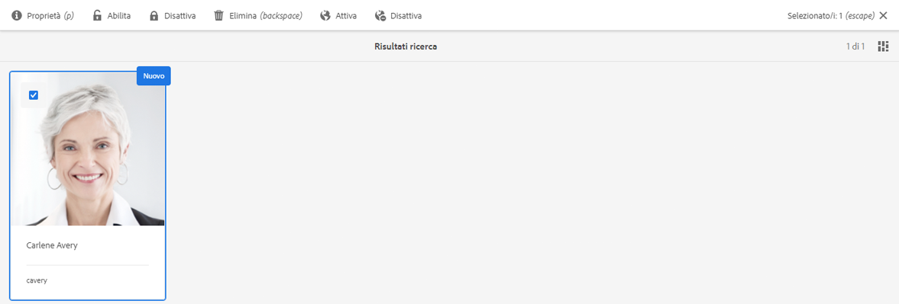
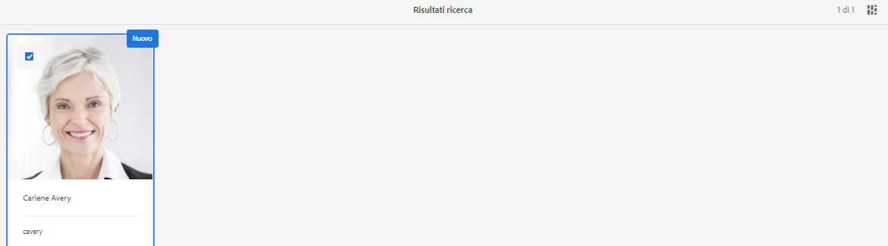

# Preparazione di Adobe Experience Manager as a Cloud Service Foundation per le normative su privacy e protezione dei dati {#aem-foundation-readiness-for-data-protection-and-data-privacy-regulations}

>[!WARNING]
>
>Il contenuto di questo documento non costituisce una consulenza legale e non intende esserne una sostituzione.
>
>Consulta l’ufficio legale della tua azienda per ricevere consigli in merito alle normative su privacy e protezione dei dati.

>[!NOTE]
>
>Per ulteriori informazioni sulla risposta di Adobe ai problemi di privacy e sulle conseguenze per i clienti di Adobe, consulta [Centro per la privacy di Adobe](https://www.adobe.com/it/privacy.html).

## Supporto per la privacy e la protezione dei dati di AEM Foundation {#aem-foundation-data-privacy-and-protection-support}

A livello di AEM Foundation, i dati personali memorizzati vengono mantenuti nel Profilo utente. Pertanto, le informazioni contenute in questo articolo riguardano principalmente come accedere ed eliminare i profili utente, rispettivamente per soddisfare le richieste di accesso e di cancellazione.

## Accesso a un profilo utente {#accessing-a-user-profile}

### Passaggi manuali {#manual-steps}

1. Apri la console di amministrazione degli utenti navigando su **[!UICONTROL Strumenti - Sicurezza - Utenti]** o navigando direttamente in `https://<serveraddress>:<serverport>/security/users.html`

<!--
   
-->

1. Quindi, cerca l’utente in questione digitando il nome nella barra di ricerca nella parte superiore della pagina:

   

1. Infine, apri il profilo utente facendo clic su di esso, quindi seleziona la scheda **[!UICONTROL Dettagli]**.

   

### API HTTP {#http-api}

Come accennato, Adobe fornisce API per l’accesso ai dati utente per facilitare l’automazione. Esistono diversi tipi di API che puoi utilizzare:

**API UserProperties**

```shell
curl -u user:password http://localhost:4502/libs/granite/security/search/profile.userproperties.json\?authId\=cavery
```

**API Sling**

**Individuazione della home utente:**

```xml
curl -g -u user:password 'http://localhost:4502/libs/granite/security/search/authorizables.json?query={"condition":[{"named":"cavery"}]}'
     {"authorizables":[{"type":"user","authorizableId_xss":"cavery","authorizableId":"cavery","name_xss":"Carlene Avery","name":"Carlene Avery","home":"/home/users/we-retail/DSCP-athB1NYLBXvdTuN"}],"total":1}
```

**Recupero dati utente:**

Utilizzo del percorso del nodo dalla proprietà home del payload JSON restituito dal comando precedente:

```shell
curl -u user:password  'http://localhost:4502/home/users/we-retail/DSCP-athB1NYLBXvdTuN/profile.-1.json'
```

```shell
curl -u user:password  'http://localhost:4502/home/users/we-retail/DSCP-athB1NYLBXvdTuN/profiles.-1.json'
```

## Disabilitazione di un utente ed eliminazione dei profili associati {#disabling-a-user-and-deleting-the-associated-profiles}

### Disattiva utente {#disable-user}

1. Apri la console User Administration e cerca l’utente in questione, come descritto sopra.
2. Passa il puntatore sull’utente e fai clic sull’icona di selezione. Il profilo diventa grigio e indica che è stato selezionato.

3. Nel menu superiore, fai clic su **Disabilita** per disabilitare (disattivare) l’utente:

   

4. Infine, conferma l’azione.

   L’interfaccia utente indica che l’account utente è stato disattivato togliendo il grigio e aggiungendo un blocco alla scheda del profilo:

   

### Eliminare informazioni sul profilo utente {#delete-user-profile-information}

>[!NOTE]
>
>Per AEM as a Cloud Service non è disponibile alcuna procedura manuale dall’interfaccia utente per l’eliminazione di un profilo utente, in quanto CRXDE non è accessibile.

### API HTTP {#http-api-1}

Le procedure seguenti utilizzano lo `curl` strumento della riga di comando per illustrare come disabilitare l’utente con **[!UICONTROL cavery]** `userId` ed eliminare i profili disponibili nella posizione predefinita.

**Individuazione della home utente:**

```shell
curl -g -u user:password 'http://localhost:4502/libs/granite/security/search/authorizables.json?query={"condition":[{"named":"cavery"}]}'
     {"authorizables":[{"type":"user","authorizableId_xss":"cavery","authorizableId":"cavery","name_xss":"Carlene Avery","name":"Carlene Avery","home":"/home/users/we-retail/DSCP-athB1NYLBXvdTuN"}],"total":1}
```

**Disabilitazione dell’utente:**

Utilizzo del percorso del nodo dalla proprietà home del payload JSON restituito dal comando precedente:

```shell
curl -X POST -u user:password -FdisableUser="describe the reasons for disabling this user (Data Privacy in this case)" 'http://localhost:4502/home/users/we-retail/DSCP-athB1NYLBXvdTuN.rw.userprops.html'
```

**Eliminazione dei profili utente**

Utilizzo del percorso del nodo dalla proprietà home del payload JSON restituito dal comando di individuazione account e dalle posizioni note dei nodi del profilo predefinite:

```shell
curl -X POST -u user:password -H "Accept: application/json,**/**;q=0.9" -d ':operation=delete' 'http://localhost:4502/home/users/we-retail/DSCP-athB1NYLBXvdTuN/profile'
```

```shell
curl -X POST -u user:password -H "Accept: application/json,**/**;q=0.9" -d ':operation=delete' 'http://localhost:4502/home/users/we-retail/DSCP-athB1NYLBXvdTuN/profile'
```
