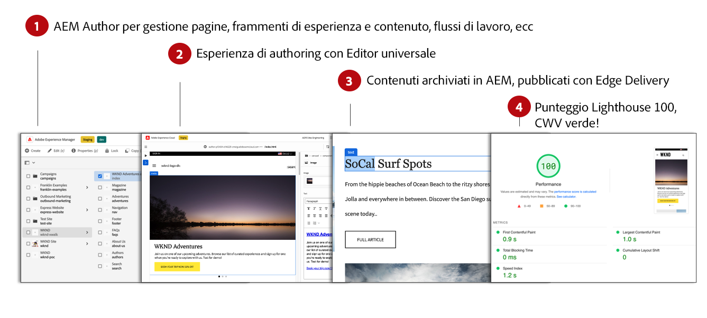
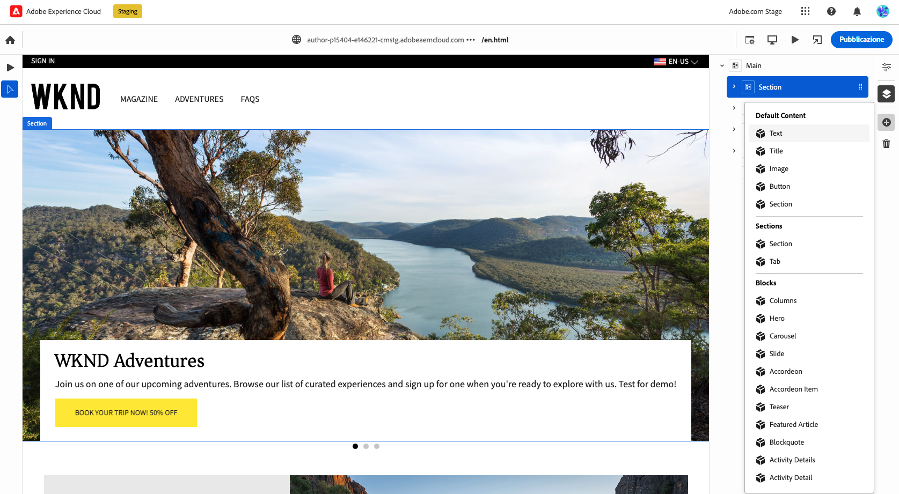
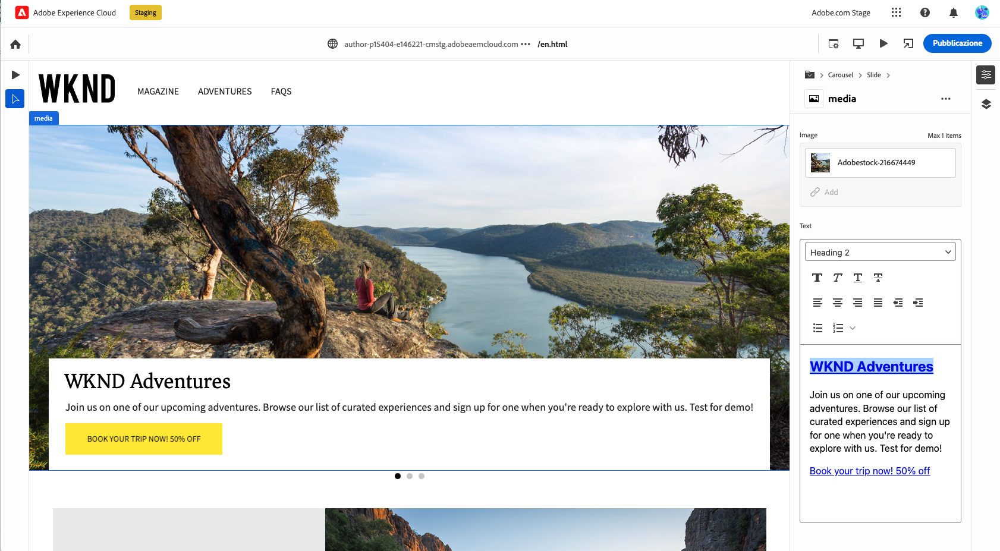

# Authoring dei contenuti per Edge Delivery {#authoring-edge}

Con Edge Delivery Services, l’authoring è semplice, veloce e flessibile. Per creare contenuti per Edge Delivery Services, sono disponibili due opzioni:

* [Editor universale](#universal-editor): interfaccia utente moderna per l’authoring dei contenuti in AEM
* [Authoring basato su documenti](#document-based) - come Microsoft Word o Google Docs

## Authoring nell’Editor universale {#universal-editor}

Quando utilizzi Edge Delivery Services con AEM as a Cloud Service, l’elemento più importante da comprendere è che il contenuto che crei viene mantenuto in AEM as a Cloud Service.

1. [L’ambiente di authoring AEM](/help/sites-cloud/authoring/quick-start.md) viene utilizzato per la gestione dei contenuti, ad esempio per creare nuove pagine, frammenti di esperienza, frammenti di contenuto e così via.
   * Sono disponibili tutte le funzioni di AEM, ad esempio flussi di lavoro, MSM, traduzione, lanci e così via.
1. [L’Editor universale](/help/sites-cloud/authoring/universal-editor/authoring.md) viene utilizzato per creare i contenuti gestiti in AEM.
   * L’Editor universale offre un’interfaccia utente nuova e moderna per l’authoring dei contenuti.
   * Per l’authoring, AEM esegue il rendering dell’HTML ma include gli script, gli stili, le icone e altre risorse di Edge Delivery Services.
   * Anche se viene utilizzato l’Editor universale, tutte le modifiche vengono mantenute in AEM.
   * L’Editor universale non dispone ancora del livello di parità con le funzioni dell’Editor pagina di AEM e alcune funzioni di AEM potrebbero non essere disponibili nell’Editor universale.
1. I contenuti creati con l’Editor universale e che vengono mantenuti in AEM vengono pubblicati in Edge Delivery Services.
   * Il contenuto rimane memorizzato in AEM.
   * AEM esegue il rendering dell’HTML semantico necessario per l’acquisizione.
   * Il contenuto viene pubblicato in Edge Delivery Services.
1. [Edge Delivery Services](/help/edge/developer/keeping-it-100.md) garantisce un punteggio Lighthouse del 100%.

I blocchi sono componenti fondamentali di una pagina distribuita da Edge Delivery Services. Gli autori possono scegliere tra i blocchi predefiniti forniti come standard da Adobe e quelli personalizzati per il progetto dagli sviluppatori.

L’Editor universale fornisce un’interfaccia grafica moderna e intuitiva per l’authoring dei contenuti mediante il trascinamento di blocchi.

I dettagli dei blocchi possono quindi essere configurati nella barra delle Proprietà.

Per informazioni dettagliate su come effettuare l’authoring con l’Editor universale, consulta il documento [Authoring dei contenuti con l’Editor universale.](/help/sites-cloud/authoring/universal-editor/authoring.md)

Consulta la [Guida introduttiva per sviluppatori di authoring di AEM con Edge Delivery Services](/help/edge/aem-authoring/edge-dev-getting-started.md) per scoprire come avviare un proprio progetto per l’authoring di AEM e Edge Delivery Services.

## Authoring basato su documenti  {#document-based}

Quando si utilizza l’authoring basato su documenti, è possibile utilizzare diverse origini, ad esempio documenti Microsoft Word e Google Docs. I documenti provenienti da queste origini diventano pagine del sito web. È possibile trasferire titoli, elenchi, immagini, elementi font e video dall’origine iniziale al tuo sito web. Puoi aggiungere metadati a scopo di SEO o utilizzare blocchi per lavorare con contenuti strutturati e aggiungere funzionalità.

Per ulteriori dettagli sull’authoring basato su documenti, consulta [questo documento nella documentazione di Edge Delivery Services.](/help/edge/docs/authoring.md)

