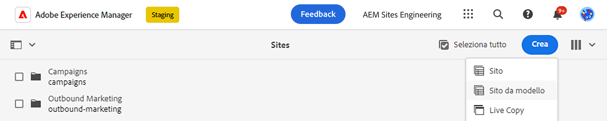
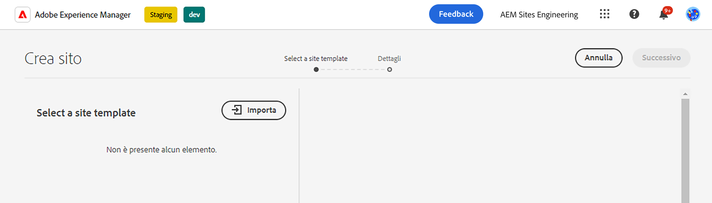
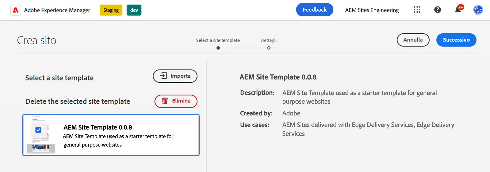
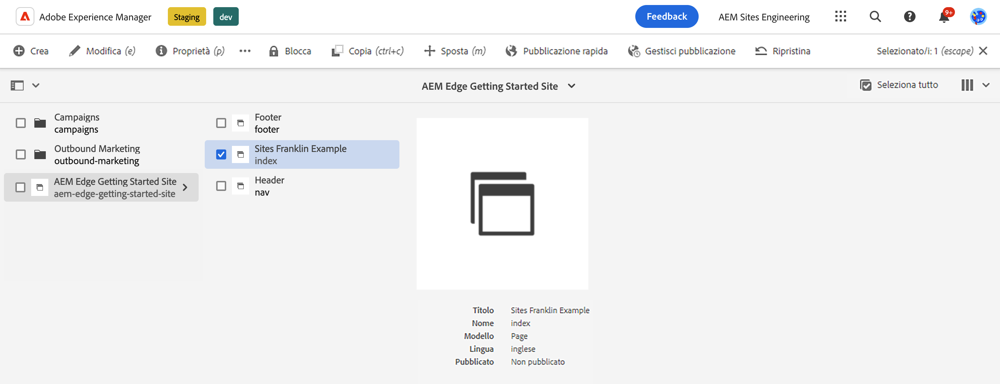
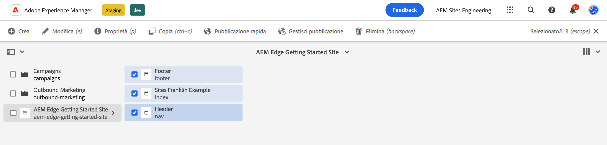
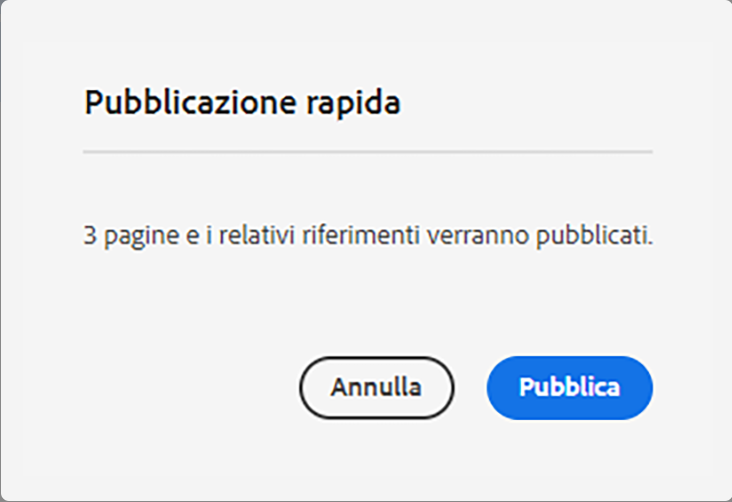

# Guida introduttiva per sviluppatori per l’authoring di AEM con Edge Delivery Services {#edge-dev-getting-started}

Questa guida ti aiuterà a essere subito operativo con un nuovo sito Adobe Experience Manager utilizzando Edge Delivery Services e l’Editor universale per l’authoring dei contenuti.

## Prerequisiti {#prerequisites}

Prima di iniziare questa guida, è necessario avere già familiarità con le nozioni di base di e avere accesso a Edge Delivery Services, quali:

* Il completamento di un [tutorial su Edge Delivery Service.](/help/edge/developer/tutorial.md)
* L’accesso a una [sandbox di AEM Cloud Service.](/help/implementing/cloud-manager/getting-access-to-aem-in-cloud/introduction-sandbox-programs.md)
* L’[attivazione dell’Editor universlae nello stesso ambiente sandbox.](/help/implementing/universal-editor/getting-started.md)

## Scegliere l’editor giusto {#editor-choice}

AEM offre due diversi editor di contenuti; la possibilità di scegliere quale utilizzare dipende dalla tua situazione.

* **Editor universale**: questa dovrebbe essere la scelta predefinita per i nuovi siti.
* **Editor pagina AEM**: deve essere scelto per una migrazione AEM Sites esistente verso Edge Delivery Services.

Questa guida è incentrata sui Progetti AEM di Edge Delivery Services che utilizzano l’Editor universale. Consulta il documento [Uso di Edge Delivery Services con AEM](/help/edge/using.md) per maggiori dettagli sulla scelta dell’editor giusto e sulla migrazione dei siti AEM esistenti verso i Edge Delivery Services.

## Concetti di base durante lo sviluppo per i Edge Delivery Services {#core-concepts}

Edge Delivery Services si basa sul concetto di blocchi. AEM viene fornito con una libreria completa di blocchi predefiniti che possono essere estesi per soddisfare le esigenze del progetto. Il codice per i progetti di Edge Delivery Services viene gestito in GitHub.

### Blocchi {#blocks}

I blocchi sono la parte più importante di una pagina distribuita da Edge Delivery Services. Un blocco incapsula stile e codice che guida un componente logico di una pagina di contenuto.

AEM fornisce blocchi standard come parte del prodotto all’interno del modello di progetto. Tali blocchi includono intestazione, testo, immagini, collegamenti, elenchi e così via.

>[!TIP]
>
>Consulta la [sezione Creare](/help/edge/developer/block-collection.md) della documentazione di Edge Delivery Services per ulteriori dettagli sui blocchi e su come svilupparli per Edge Delivery Services.

### Edge Delivery Services e GitHub {#github-edge}

Edge Delivery sfrutta GitHub per consentirti di gestire e distribuire il codice direttamente dall’archivio GitHub.

Gli autori possono creare contenuti utilizzando l’authoring basato su documenti o contenuti in AEM con l’Editor universale. Gli sviluppatori possono personalizzare la funzionalità del sito utilizzando CSS e JavaScript in GitHub, indipendentemente da come creano il proprio contenuto.

I siti web vengono creati automaticamente per ciascuno dei rami, dall’anteprima del contenuto alla produzione. Ogni risorsa inserita nell’archivio GitHub è disponibile sul sito web senza alcun processo di compilazione.

>[!TIP]
>
>Consulta la [sezione Crea](/help/edge/developer/block-collection.md) della documentazione di Edge Delivery Services per ulteriori dettagli sui blocchi e su come svilupparli per Edge Delivery Services.

## Guida introduttiva all’authoring di AEM e a Edge Delivery Services {#getting-started}

Dopo aver completato [i prerequisiti](#prerequisites) e aver effettuato [la scelta di utilizzare l’Editor universale,](#editor-choice) puoi iniziare a utilizzare il tuo progetto.

### Creare un progetto GitHub {#create-github-project}

Prima devi creare un nuovo progetto su GitHub, basato sul modello di Adobe.

1. Passa a [`https://github.com/adobe-rnd/aem-boilerplate-xwalk`](https://github.com/adobe-rnd/aem-boilerplate-xwalk) e fai clic su **Usa questo modello** e seleziona **Crea un nuovo archivio**.

   * Per visualizzare questa opzione, devi aver effettuato l’accesso a GitHub.

   

1. L’archivio viene assegnato all’utente per impostazione predefinita. Modifica questo stato in base alle esigenze, fornisci un nome e una descrizione all’archivio e fai clic su **Crea archivio**.

   

1. In una nuova scheda nello stesso browser, passa a [`https://github.com/apps/aem-code-sync`](https://github.com/apps/aem-code-sync) e fai clic su **Configura**.

   

1. Fai clic su **Configura** per l’organizzazione in cui hai creato il nuovo archivio nel passaggio precedente.

   

1. Nella pagina GitHub della sincronizzazione del codice AEM in **Accesso archivio**, seleziona **Seleziona solo archivi**, seleziona l’archivio creato nel passaggio precedente e quindi fai clic su **Salva**.

   

1. Dopo aver installato la sincronizzazione del codice AEM, verrà visualizzata una schermata di conferma. Torna alla scheda del browser del nuovo archivio.

   

1. Fai clic sul file `fstab.yaml` per aprirlo e quindi sull’icona **Modifica questo file** per modificarlo.

   

1. Modifica il file `fstab.yaml` per aggiornare il punto di montaggio del progetto. Sostituisci l’URL predefinito dei Documenti Google con l’URL dell’istanza di authoring di AEM as a Cloud Service, quindi fai clic su **Conferma modifiche...**.

   * `https://<aem-author>/bin/franklin.delivery/<owner>/<repository>/main`
   * La modifica del punto di montaggio indica a Edge Delivery Services dove trovare il contenuto del sito.

   

1. Aggiungi un messaggio di conferma come desiderato, quindi fai clic su **Conferma modifiche**, per confermarle direttamente nel ramo `main`.

   

1. Torna alla directory principale dell’archivio e fai clic su `paths.json` e quindi sull’icona **Modifica questo file**.

   

1. La mappatura predefinita utilizza il nome dell’archivio. Aggiorna la mappatura predefinita come richiesto per il progetto con `/content/<site-name>/:/` e fai clic su **Commit modifiche...**.

   * Fornisci il tuo `<site-name>`. Ne avrai bisogno in un passaggio successivo.
   * Le mappature spiegano a Edge Delivery Services come mappare il contenuto nell’archivio AEM all’URL del sito.

   

1. Aggiungi un messaggio di conferma come desiderato, quindi fai clic su **Conferma modifiche**, per confermarle direttamente nel ramo `main`.

   

### Creare e modificare un nuovo sito AEM {#create-aem-site}

Ora che disponi di un progetto GitHub, crea un nuovo sito AEM utilizzabile dal progetto.

>[!NOTE]
>
>Per modificare il sito con l’Editor universale, è necessario utilizzare un browser basato su Chromium.

1. Scarica l’ultimo modello del sito AEM Authoring con Edge Delivery Services da GitHub all’indirizzo [`https://github.com/adobe-rnd/aem-boilerplate-xwalk/releases`](https://github.com/adobe-rnd/aem-boilerplate-xwalk/releases).

1. Accedi all’istanza di authoring AEM as a Cloud Service, passa alla console Sites e tocca o fai clic su **Crea** -> **Sito da modello**.

   

1. Sulla scheda **Seleziona un modello di sito** della procedura guidata di creazuione del sito, fai clic sul pulsante **Importa** per importare un nuovo modello.

   

1. Carica il modello di sito per l’authoring di AEM con Edge Delivery Services scaricato da GitHub.

   * Il modello deve essere caricato una sola volta. Una volta caricato, può essere riutilizzato per creare altri siti.

1. Dopo aver creato il modello, verrà visualizzato nella procedura guidata. Tocca o fai clic per selezionarlo, quindi tocca o fai clic su **Avanti**.

   

1. Fornisci i campi seguenti e tocca o fai clic su **Crea**.

   * **Titolo sito**: aggiungi un titolo descrittivo per il sito.
   * **Titolo sito**: utilizza il `<site-name>` che hai definito nel [passaggio precedente.](#create-github-project)
   * **URL GitHub**: utilizza l’URL del progetto GitHub creato nel passaggio precedente.

   

1. AEM conferma la creazione del sito con una finestra di dialogo. Tocca o fai clic su **OK** per chiudere.

   

1. Nella console Sites, passa al `index.html` del nuovo sito creato e tocca o fai clic su **Modifica** nella barra degli strumenti.

   

1. L’Editor universale si aprirà in una nuova scheda. Potrebbe essere necessario toccare o fare clic su **Accedi con Adobe** per eseguire l’autenticazione e modificare la pagina.

   

È ora possibile modificare il sito utilizzando l’Editor universale. Per ulteriori informazioni, consulta la [documentazione dell’Editor universale](/help/sites-cloud/authoring/universal-editor/authoring.md).

### Pubblicazione del nuovo sito {#publishing}

Una volta terminata la modifica del nuovo sito tramite l’Editor universale, puoi pubblicare i tuoi contenuti.

1. Nella console Sites, seleziona tutte le pagine create per il nuovo sito e tocca o fai clic su **Pubblicazione rapida** nella barra degli strumenti.

   

1. Tocca o fai clic su **Pubblica** nella finestra di dialogo di conferma per avviare il processo.

   

1. Apri una nuova scheda nello stesso browser e passa all’URL del nuovo sito.

   * `https://main--<site-name>--<owner>.hlx.page`

1. Visualizza il tuo contenuto pubblicato.

   

## Passaggi successivi {#next-steps}

Ora che hai un progetto di creazione AEM funzionante con Edge Delivery Services, puoi iniziare a creare e formattare i blocchi.

Per ulteriori informazioni, consulta la guida [Creazione di blocchi preparati per l’utilizzo con l’editor universale](/help/edge/aem-authoring/create-block.md).

>[!TIP]
>
>Per una procedura dettagliata sulla creazione di un nuovo progetto Edge Delivery Services abilitato per la creazione di AEM con AEM as a Cloud Service come origine di contenuto, visualizzare [questo webinar AEM GEMs.](https://experienceleague.adobe.com/en/docs/events/experience-manager-gems-recordings/gems2024/aem-authoring-and-edge-delivery)

