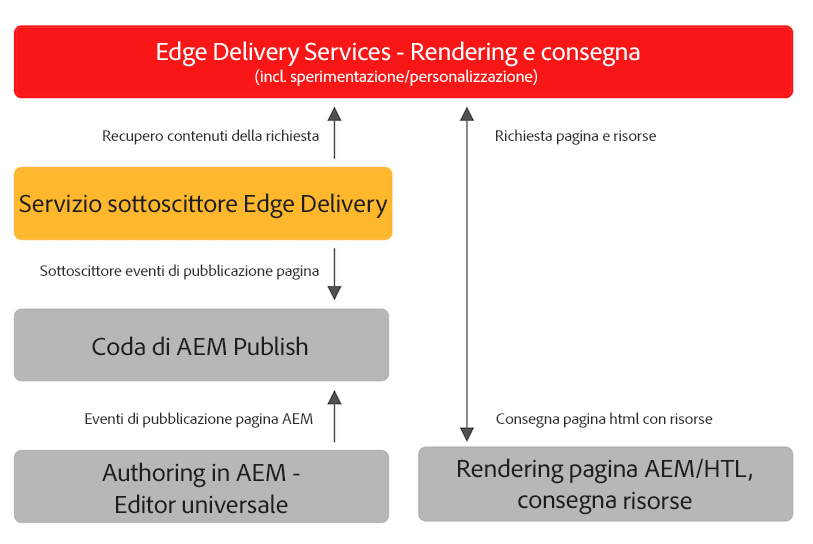

# Pubblicazione di contenuti per Edge Delivery Services {#publishing-edge}

Con Edge Delivery Services, la pubblicazione dei contenuti avviene in modo semplice e diretto, a prescindere dalla loro origine:

* Contenuto basato su documenti: consulta la [sezione Pubblicare](/help/edge/docs/authoring.md) della documentazione di Edge Delivery Services.
* Contenuto AEM: consulta i dettagli di seguito.

## Flusso di pubblicazione da AEM {#publishing-flow}

Quando si utilizza l’Editor universale per creare contenuti AEM, la pubblicazione è semplice: basta fare clic sul pulsante **Pubblica** nell’Editor universale. Consulta il documento [Pubblicazione di contenuti con l’Editor universale.](/help/sites-cloud/authoring/universal-editor/publishing.md)

Il flusso di informazioni durante la pubblicazione è il seguente. Una volta che l’autore avvia la pubblicazione, questo flusso è automatico e viene illustrato qui a scopo informativo.

>[!NOTE]
>
>Sono consentiti fino a un massimo di 5000 percorsi al giorno pubblicati dall’interfaccia utente di authoring o dai flussi di lavoro. Le integrazioni che creano carichi di lavoro per la pubblicazione in blocco non sono supportate.

1. L’autore del contenuto pubblica i contenuti AEM nell’Editor universale.
1. Un evento di pubblicazione viene inviato alla coda della pipeline di Adobe.
1. Il servizio di pubblicazione di Edge Delivery Services inoltra gli eventi rilevanti all’API di amministrazione di Edge Delivery Services.
1. Edge Delivery richiama e acquisisce l’HTML semantico di authoring di AEM.
1. AEM viene aggiornato con lo stato di pubblicazione.

>[!NOTE]
>
>Per impostazione predefinita, l’API di amministrazione di Edge Delivery Services non è protetta e può essere utilizzata per pubblicare o annullare la pubblicazione di documenti senza autenticazione. Per configurare l’autenticazione per l’API amministratore come documentato in [Configurazione dell’autenticazione per gli autori](https://www.aem.live/docs/authentication-setup-authoring), il progetto deve essere fornito con API_KEY, che consente di accedere al servizio di pubblicazione. [Contatta il team di Adobe su Slack](/help/edge/docs/slack.md) per indicazioni.

