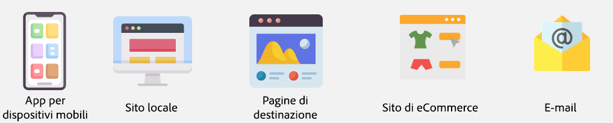
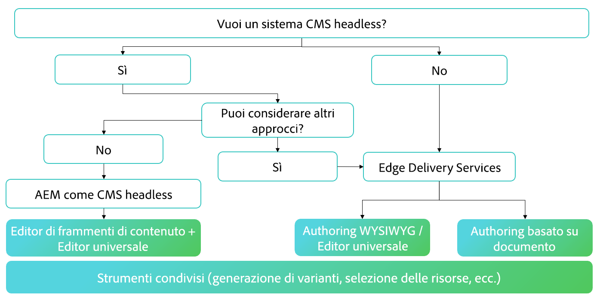
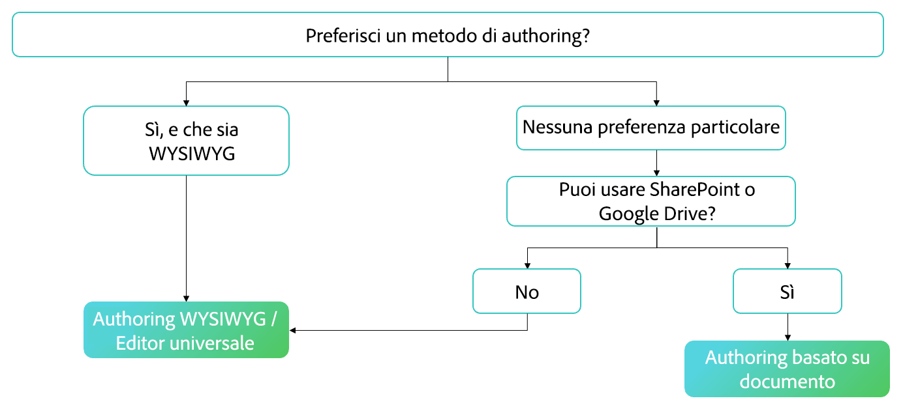

# Scelta di un metodo di authoring {#authoring-methods}

Scopri considerazioni importanti ai fini della creazione di contenuti in AEM, che ti aiuteranno nel prendere la decisione migliore per gli autori di contenuti.

## Panoramica delle considerazioni {#overview}

La flessibilità di AEM garantisce che le esigenze di authoring siano soddisfatte indipendentemente dal fatto che tu scelga l’authoring basato su documenti o l’authoring WYSIWYG. Quando inizi le tue valutazioni, tieni presenti i fatti riportati di seguito.

* **Coinvolgi sempre gli autori dei contenuti in questa decisione.** - Gli autori dei contenuti sono i tuoi esperti e la loro conoscenza approfondita è fondamentale.
* **È possibile implementare più metodi di authoring.** - Sebbene Adobe consigli di iniziare con semplicità e stratificare in base alla complessità, se necessario, più metodi di authoring possono funzionare insieme in un unico progetto.
* **Puoi sempre cambiare metodo di authoring in un secondo tempo.** - A prescindere da ciò che decidi, sai di non avere vincoli. Il passaggio da un metodo all’altro è semplice e immediato con l’assistenza degli strumenti di migrazione automatizzata di Adobe.
* **Non devi decidere prima dell’implementazione, ma piuttosto come parte dell’implementazione stessa.** - AEM è un prodotto unificato, quindi questa importante decisione non deve far parte delle negoziazioni contrattuali. Quando compri AEM, ottieni tutti i componenti. Si tratta piuttosto di una decisione da prendere durante l’implementazione.

Nel corso dell’implementazione Adobe può aiutarti a determinare il metodo (o i metodi) più adatto alle tue esigenze.

## Una dimensione unica non è sempre adatta {#one-size}

Ogni implementazione di AEM ha i propri flussi di lavoro e obiettivi. Un progetto può includere un semplice modello di authoring dove gli autori di contenuti sono responsabili delle proprie pubblicazioni. Mentre un altro potrebbe avere una rete complessa di collaboratori e approvazioni.

Progetti diversi possono avere casi d’uso diversi (e molteplici).

Adobe è consapevole di questo aspetto e pertanto non offre un approccio unico sempre adatto. AEM è l’unica soluzione che offre diversi approcci per la distribuzione dei contenuti e la loro creazione in base alle esigenze.

Per determinare l’approccio migliore, è necessario prendere in considerazione quattro elementi.

1. [Hai una preferenza per la consegna dei contenuti?](#content-delivery)
1. [Hai una preferenza per l’authoring dei contenuti?](#content-authoring)
1. [Qual è l’obiettivo del tuo progetto?](#project-goals)
1. [Quali sono le sfide di authoring che stai affrontando oggi?](#authoring-challenges)

## Preferenze per la distribuzione dei contenuti {#content-delivery}

La prima considerazione da tenere presente dovrebbe essere la modalità di distribuzione dei contenuti. Edge Delivery Services offre siti incredibilmente veloci, ma forse ti stai concentrando maggiormente sulla consegna headless. La seguente struttura decisionale può aiutarti a valutare le diverse opzioni.

Questo può aiutarti a decidere se ti serve:

* [AEM come CMS headless](/help/headless/introduction.md) utilizzando l’Editor frammento di contenuto e/o l’Editor universale.
* Edge Delivery Services AEM che utilizzano la [modifica basata su documenti](/help/edge/docs/authoring.md) o la [creazione di WYSIWYG con Universal Editor](/help/edge/wysiwyg-authoring/authoring.md).

## Preferenze di authoring dei contenuti {#content-authoring}

La considerazione successiva dovrebbe essere come creare i contenuti. La seguente struttura decisionale può aiutarti a valutare le diverse opzioni.

Questo può aiutarti a decidere se ti serve:

* Edge Delivery Services AEM che utilizzano la [modifica basata su documento](/help/edge/docs/authoring.md).
* [Creazione di WYSIWYG con Universal Editor](/help/edge/wysiwyg-authoring/authoring.md).

## Obiettivi del progetto {#project-goals}

Come pensi che sia il successo nell’authoring? Come definisci il successo del progetto?

* Forse desideri consentire a più persone di creare contenuti, ma vuoi evitare la formazione su un nuovo set di strumenti. (pensa all’authoring basato su documenti).
* Potresti avere bisogno di aumentare la quantità di contenuti generati. (pensa all’authoring basato su documenti).
* Forse dovresti concentrarti sul layout del contenuto visivo, riducendo al minimo la necessità di conoscenze di codifica. (pensa all’authoring WYSIWYG).

Obiettivi di progetto chiaramente definiti all’inizio dell’implementazione ti aiuteranno a prendere una decisione informata sul metodo di authoring.

## Sfide relative all’authoring {#authoring-challenges}

Infine, considera le sfide specifiche che devi affrontare oggi nell’authoring dei contenuti.

* Forse devi affrontare la duplicazione del lavoro con contenuti creati al di fuori del CMS, che poi devono essere importati o copiati e incollati. (pensa all’authoring basato su documenti).
* Forse è necessario ridurre il tempo necessario per la formazione degli autori su come utilizzare un CMS. (pensa all’authoring basato su documenti).
* È possibile che gli autori debbano modificare spesso il layout visivo dei contenuti, richiedendo un costante supporto da parte degli sviluppatori. (pensa all’authoring WYSIWYG).
