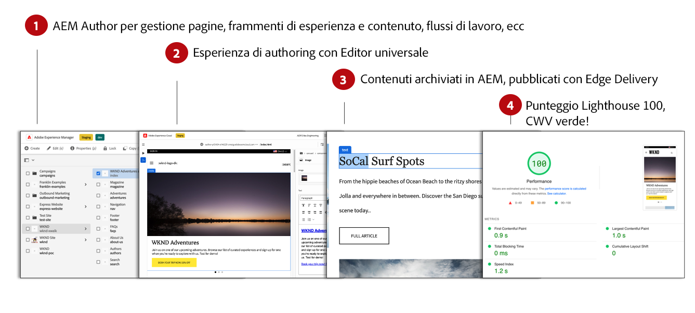
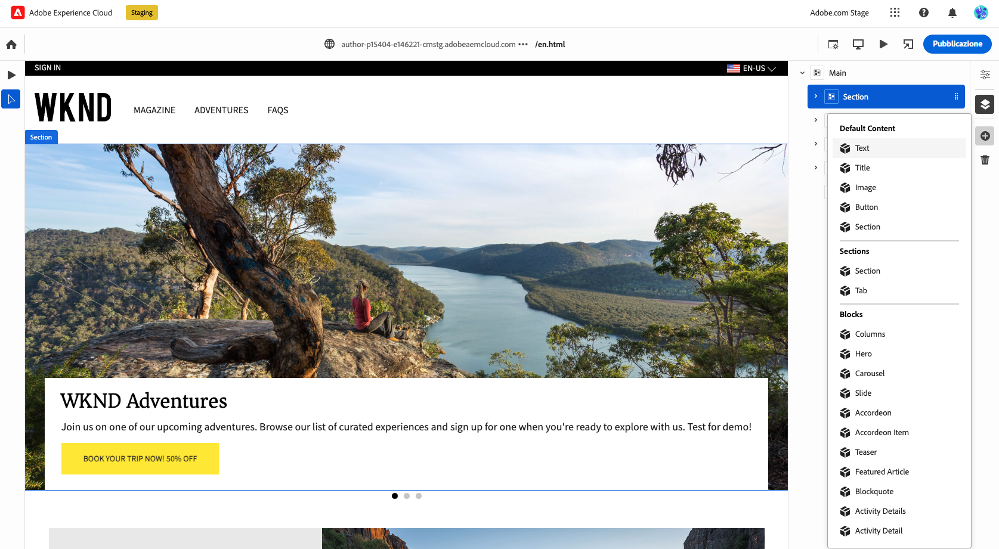
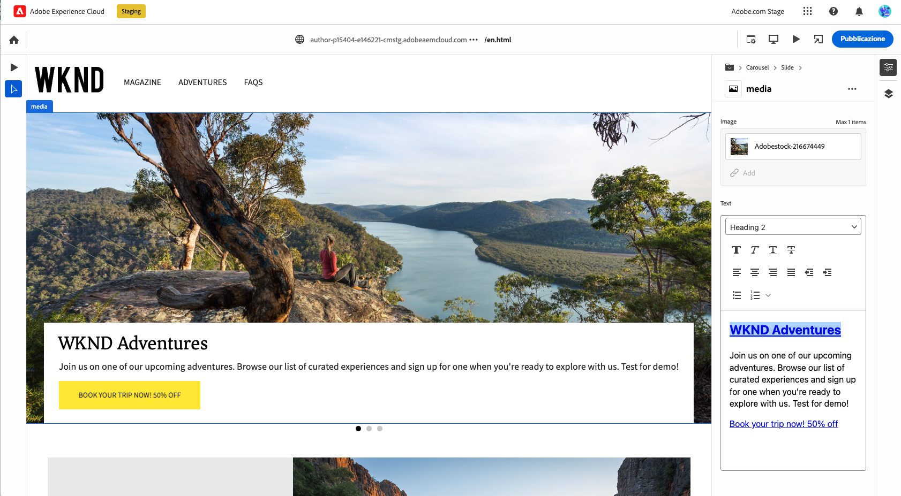

# Authoring di contenuti per Edge Delivery Services {#authoring-edge}

Con Edge Delivery Services, l’authoring è semplice, veloce e flessibile. Sono disponibili due opzioni per l’authoring dei contenuti per i Edge Delivery Services:

* [Authoring basato su documenti](#document-based) - come Microsoft Word o Google Docs
* [Editor universale](#universal-editor) - Interfaccia utente moderna per la creazione di contenuti in AEM

## Authoring basato su documenti {#document-based}

Con l’authoring basato su documenti, puoi utilizzare origini diverse, ad esempio Microsoft Word e Documenti Google. I documenti provenienti da queste origini diventano pagine del sito web. È possibile trasferire titoli, elenchi, immagini, elementi font e video dall’origine iniziale al tuo sito web. Puoi aggiungere metadati a scopo di SEO o utilizzare blocchi per lavorare con contenuti strutturati e aggiungere funzionalità.

Per ulteriori dettagli sull’authoring basato su documenti, consulta [questo documento è disponibile nella documentazione di Edge Delivery Services.](/help/edge/docs/authoring.md)

## Authoring Universal Editor {#universal-editor}

Quando utilizzi Edge Delivery Services con AEM as a Cloud Service, il fatto più fondamentale da capire è che il contenuto che crei viene mantenuto in AEM as a Cloud Service.

1. [Ambiente di authoring AEM](/help/sites-cloud/authoring/quick-start.md) viene utilizzato per la gestione dei contenuti, ad esempio per creare nuove pagine, frammenti di esperienza, frammenti di contenuto e così via.
   * Sono disponibili tutte le funzioni dell’AEM, ad esempio flussi di lavoro, MSM, traduzione, lanci e così via.
1. [Editor universale](/help/implementing/universal-editor/authoring.md) viene utilizzato per creare i contenuti gestiti in AEM.
   * L’editor universale offre un’interfaccia utente nuova e moderna per l’authoring dei contenuti.
   * Per l’authoring, AEM esegue il rendering del HTML ma include gli script, gli stili, le icone e altre risorse dei Edge Delivery Services.
   * Anche se viene utilizzato l’Editor universale, tutte le modifiche vengono mantenute in AEM.
   * L&#39;Editor universale non è ancora in parità con l&#39;Editor pagina AEM e alcune funzioni AEM potrebbero non essere disponibili nell&#39;Editor universale.
1. I contenuti creati con l’Editor universale e che persistono nell’AEM vengono pubblicati nei Edge Delivery Services.
   * Il contenuto rimane memorizzato nell’AEM.
   * L’AEM genera il HTML semantico necessario per l’acquisizione.
   * Il contenuto viene pubblicato in Edge Delivery Services.
1. [Edge Delivery Services](/help/edge/developer/keeping-it-100.md) assicurati un punteggio di Lighthouse del 100%.

I blocchi sono componenti fondamentali di una pagina distribuita da Edge Delivery Services. Gli autori possono scegliere tra i blocchi predefiniti forniti come standard dall’Adobe o tra i blocchi personalizzati per il progetto dagli sviluppatori.

Universal Editor fornisce un’interfaccia grafica moderna e intuitiva per la creazione dei contenuti mediante il trascinamento e il rilascio di blocchi.

I dettagli dei blocchi possono quindi essere configurati nella barra Proprietà.

Per informazioni dettagliate su come effettuare l’authoring con l’Editor universale, consulta il documento [Authoring di contenuti con l’Editor universale.](/help/implementing/universal-editor/authoring.md)

Consulta la [Guida introduttiva per sviluppatori di authoring di AEM con Edge Delivery Services](/help/edge/edge-dev-getting-started.md) per scoprire come avviare un proprio progetto per l’authoring di AEM e Edge Delivery Services.

## Come iniziare {#how-to-get-started}

Per accedere a questa funzione, contatta il rappresentante del tuo Adobe.
