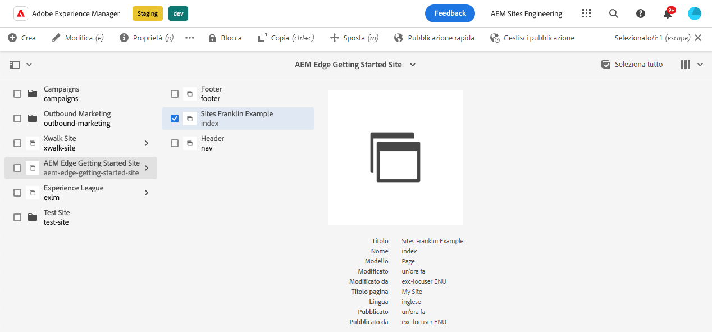
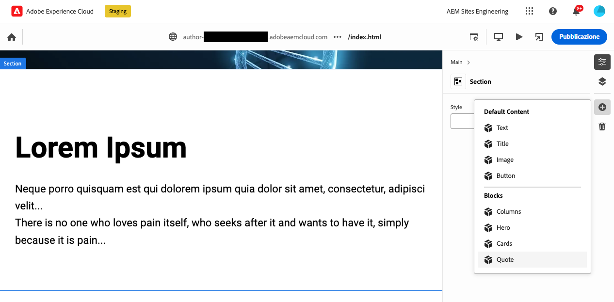

# Creazione di blocchi instrumentati per l’utilizzo con l’editor universale {#create-block}

Scopri come creare blocchi instrumentati per l’utilizzo con l’Editor universale nell’authoring AEM con progetti di Edge Delivery Services.

{{aem-authoring-edge-early-access}}

## Prerequisiti {#prerequisites}

Questa guida fornisce istruzioni dettagliate su come creare blocchi instrumentati per l’editor universale nell’authoring AEM con progetti di Edge Delivery Services. Include l’aggiunta di componenti, il caricamento delle definizioni dei componenti nell’Editor universale, la pubblicazione delle pagine, l’implementazione della decorazione dei blocchi e degli stili, l’introduzione delle modifiche nell’ambiente di produzione e la loro verifica. Al termine di questa guida, puoi creare e distribuire un nuovo blocco per il tuo progetto.

Questa guida richiede necessariamente una conoscenza esistente dell’authoring AEM con progetti di Edge Delivery Services e con l’editor universale. Prima di iniziare questa guida, è necessario avere già accesso ai Edge Delivery Services e conoscere le relative nozioni di base, tra cui:

* Hai completato il [Tutorial sul servizio di consegna Edge.](/help/edge/developer/tutorial.md)
* Hai accesso a un [Sandbox di AEM Cloud Service.](/help/implementing/cloud-manager/getting-access-to-aem-in-cloud/introduction-sandbox-programs.md)
* Hai [ha attivato Universal Editor nello stesso ambiente sandbox.](/help/implementing/universal-editor/getting-started.md)
* Hai completato il [Guida introduttiva per gli sviluppatori per l’authoring di AEM con Edge Delivery Services](/help/edge/edge-dev-getting-started.md) guida.

Questa guida si basa sul lavoro svolto in [Guida introduttiva per gli sviluppatori per l’authoring di AEM con Edge Delivery Services](/help/edge/edge-dev-getting-started.md) guida.

## Aggiunta di un nuovo blocco al progetto {#add-block}

In questa guida verrà creato un blocco per il rendering di un preventivo memorabile sulla pagina.

Per semplificare questo esempio, tutte le modifiche vengono apportate al `main` ramo dell’archivio del progetto. Naturalmente, per il tuo progetto effettivo, [segui le best practice di sviluppo](https://www.aem.live/docs/dev-collab-and-good-practices) sviluppando su un ramo diverso e rivedendo tutte le modifiche tramite richiesta pull prima di unire a `main`.

L’Adobe consiglia di sviluppare blocchi in un approccio in tre fasi:

1. Crea la definizione e il modello per il blocco, rivedilo e portalo in produzione.
1. Crea contenuto con il nuovo blocco.
1. Implementa la decorazione e gli stili per il nuovo blocco.

Il seguente esempio di blocco di virgolette segue questo approccio.

### Crea modello e definizione di blocco {#create-block-model}

1. Clona il progetto GitHub localmente creato in [Guida introduttiva per gli sviluppatori per l’authoring di AEM con Edge Delivery Services](/help/edge/edge-dev-getting-started.md) e aprilo in un editor a tua scelta.

   * Il codice Microsoft viene utilizzato qui a scopo illustrativo.

   

1. Modifica il `component-definition.json` file nella directory principale del progetto e aggiungi la seguente definizione per il nuovo blocco delle virgolette e salva il file.

   ```json
   {
     "title": "Quote",
     "id": "quote",
     "plugins": {
       "xwalk": {
         "page": {
           "resourceType": "core/franklin/components/block/v1/block",
           "template": {
             "name": "Quote",
             "model": "quote",
             "quote": "<p>Think, McFly! Think!</p>",
             "author": "Biff Tannen"
           }
         }
       }
     }
   }
   ```

   

1. Modifica il `component-models.json` nella directory principale del progetto e aggiungi quanto segue [definizione del modello](/help/implementing/universal-editor/field-types.md#model-structure) per il nuovo blocco delle virgolette e salvare il file.

   * Consulta il documento [Modellazione dei contenuti per la creazione di AEM con progetti Edge Delivery Services](/help/edge/content-modeling.md) per ulteriori informazioni su ciò che è importante considerare durante la creazione di modelli di contenuto.

   ```json
   {
     "id": "quote",
     "fields": [
        {
          "component": "text-area",
          "name": "quote",
          "value": "",
          "label": "Quote",
          "valueType": "string"
        },
        {
          "component": "text-input",
          "valueType": "string",
          "name": "author",
          "label": "Author",
          "value": ""
        }
      ]
   }
   ```

   

1. Modifica il `component-filters.json` nella directory principale del progetto e aggiungi il blocco delle virgolette al [definizione filtro](/help/implementing/universal-editor/customizing.md#filtering-components) per consentire l’aggiunta del blocco a qualsiasi sezione e salvare il file.

   ```json
   {
     "id": "section",
     "components": [
       "text",
       "image",
       "button",
       "title",
       "hero",
       "cards",
       "columns",
       "quote"
      ]
   }
   ```

   

1. Utilizzando Git, esegui il commit di queste modifiche in `main` filiale.

   * Commit su `main` è solo a scopo illustrativo. [Segui best practice](https://www.aem.live/docs/dev-collab-and-good-practices) e utilizza una richiesta di pull per il lavoro di progetto effettivo.

### Creare contenuti con il blocco {#create-content}

Dopo aver definito e confermato il blocco del preventivo di base nel progetto di esempio, è possibile aggiungere un blocco del preventivo a una pagina esistente.

1. In un browser, accedi a AEM as a Cloud Service. [Utilizzando la console Sites:](/help/sites-cloud/authoring/getting-started/basic-handling.md) passa al sito creato in [Guida introduttiva per gli sviluppatori per l’authoring di AEM con Edge Delivery Services](/help/edge/edge-dev-getting-started.md) e seleziona una pagina.

   * In questo caso, `index` viene utilizzato a scopo illustrativo.

   

1. Tocca o fai clic su **Modifica** nella barra degli strumenti della console e viene aperto Universal Editor.

   * Per caricare la pagina, potrebbe essere necessario toccare o fare clic su **Accedi con un Adobe** per l&#39;autenticazione all&#39;AEM nell&#39;editor universale.

1. Nell’Editor universale, seleziona una sezione. Nella barra delle proprietà, tocca o fai clic su **Aggiungi** e quindi selezionare il nuovo **Citazione** dal menu.

   * Il **Aggiungi** è un simbolo più.
   * Si sa che è stata selezionata una sezione se il contorno blu dell&#39;oggetto selezionato presenta una scheda etichettata **Sezione**.
   * In questo esempio, tocca o fai clic leggermente sopra il **Lorem Ipsum** titolo seleziona una sezione contenente l&#39;intestazione e il testo lorem ipsum.

   

1. La pagina viene ricaricata e il blocco dell’offerta viene aggiunto nella parte inferiore della sezione selezionata con il contenuto predefinito specificato in `component-definitions.json` file.

   * Il blocco del preventivo può essere selezionato e modificato come qualsiasi altro blocco sul posto o nella barra delle proprietà.
   * Lo stile viene applicato in un passaggio successivo.

   

1. Quando si è soddisfatti del contenuto dell&#39;offerta, è possibile pubblicare la pagina toccando o facendo clic sul pulsante **Pubblica** nella barra degli strumenti di Universal Editor.

1. Verifica che il contenuto sia stato pubblicato accedendo alla pagina pubblicata. Il collegamento sarà simile a `https://<branch>--<repo>--<owner>.hlx.page`

   

### Personalizzare lo stile del blocco {#style-block}

Ora che disponi di un blocco di virgolette di lavoro puoi applicare ad esso lo stile.

1. Torna all’editor per il progetto.

1. Creare un `quote` cartella sotto `blocks` cartella.

   

1. Nel nuovo `quote` cartella, aggiungi un `quote.js` file per implementare la decorazione dei blocchi aggiungendo il seguente JavaScript e salvando il file.

   ```javascript
   export default function decorate(block) {
     const [quoteWrapper] = block.children;
   
     const blockquote = document.createElement('blockquote');
     blockquote.textContent = quoteWrapper.textContent.trim();
     quoteWrapper.replaceChildren(blockquote);
   }
   ```

   


1. In `quote` cartella, aggiungi un `quote.css` file per definire lo stile del blocco aggiungendo il seguente codice CSS e salvando il file.

   ```css
   .block.quote {
       background-color: #ccc;
       padding: 0 0 24px;
       display: flex;
       flex-direction: column;
       margin: 1rem 0;
   }
   
   .block.quote blockquote {
       margin: 16px;
       text-indent: 0;
   }
   
   .block.quote > div:last-child > div {
       margin: 0 16px;
       font-size: small;
       font-style: italic;
       position: relative;
   }
   
   .block.quote > div:last-child > div::after {
       content: "";
       display: block;
       position: absolute;
       left: 0;
       bottom: -8px;
       height: 5px;
       width: 30px;
       background-color: darkgray;
   }
   ```

   

1. Utilizzando Git, esegui il commit di queste modifiche in `main` filiale.

   * Commit su `main` è solo a scopo illustrativo. [Segui best practice](https://www.aem.live/docs/dev-collab-and-good-practices) e utilizza una richiesta di pull per il lavoro di progetto effettivo.

1. Torna alla scheda del browser dell’Editor universale in cui stavi modificando la pagina del progetto e ricarica la pagina per visualizzare il blocco formattato.

1. Visualizzare il blocco delle virgolette formattato sulla pagina.

   

1. Verifica che le modifiche siano state inviate alla produzione passando alla pagina pubblicata. Il collegamento sarà simile a `https://<branch>--<repo>--<owner>.hlx.page`

   

Congratulazioni. Ora disponi di un blocco preventivo completamente funzionante e formattato. Puoi utilizzare questo esempio come base per progettare blocchi specifici per il progetto.

## Utilizzo di altri rami di lavoro {#other-branches}

Questa guida ti ha fatto impegnare direttamente in `main` per semplicità. Per la sperimentazione in un archivio di esempio, in genere non si tratta di un problema. Per il lavoro di progetto effettivo, [segui le best practice di sviluppo](https://www.aem.live/docs/dev-collab-and-good-practices) sviluppando su un ramo diverso e rivedendo tutte le modifiche tramite richiesta pull prima di unire a `main`.

Quando non si sviluppa su `main` ramo, puoi aggiungere `?ref=<branch>` nella barra di posizione di Universal Editor per caricare la pagina dal ramo. `<branch>` è il nome del ramo utilizzato per l’anteprima del progetto o gli URL live, ad esempio `https://<branch>--<repo>--<owner>.hlx.page`.

La pubblicazione di contenuti con un nuovo modello è supportata solo quando il modello viene unito al `main` filiale.
