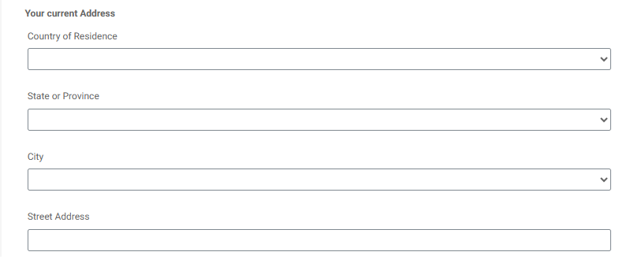

# Creare un modulo con l’editor universale

Crea il seguente modulo utilizzando l’editor universale. Il modulo dispone di 3 elenchi a discesa, i cui valori verranno compilati utilizzando l’integrazione API

## Paese di residenza

Al momento dell’inizializzazione, nel menu a discesa del paese di residenza verranno inseriti i risultati della chiamata API.

## Handler operazione riuscita

Handler operazione riuscita è stato definito per impostare enum e enumNames dell’elenco a discesa del paese con i valori appropriati dall’array dei nomi geografici. L’array di nomi geografici è disponibile nell’opzione Payload evento

## Recupera valori secondari

La voce di elenco Stato o Provincia viene compilato quando l’utente effettua una selezione nell’elenco a discesa Paese di residenza. Il geonameId associato al paese selezionato viene passato come parametro di input all’integrazione API GetChildren

Il handler operazione riuscirta è stato definito per impostare il dato enum/enumNames del campo StateOrProvince

Quando hai selezionato stato o provincia, puoi popolare l’elenco a discesa città seguendo il modello sopra indicato, utilizzato per popolare l’elenco a discesa stato o provincia.