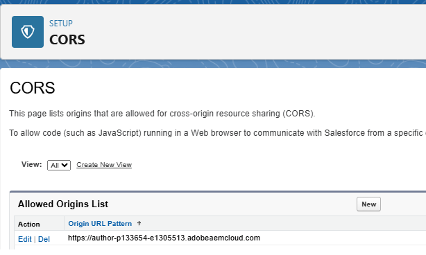
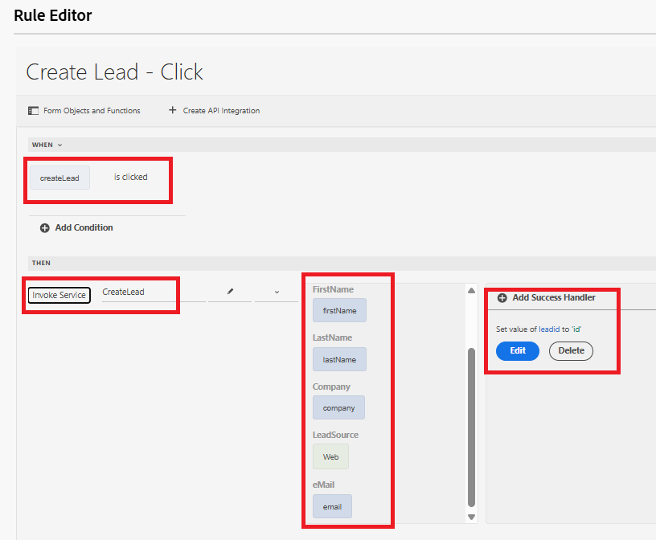

# Creare un oggetto Lead di Salesforce tramite l’integrazione API

Questo caso d’uso illustra come creare un lead in Salesforce utilizzando l’integrazione API. Al termine del processo, sarà possibile:

Configura un&#39;app [connessa in Salesforce](https://help.salesforce.com/s/articleView?id=platform.ev_relay_create_connected_app.htm&type=5) per abilitare l&#39;accesso API protetto.

Configura CORS (Cross-Origin Resource Sharing) per consentire al codice (come JavaScript) in esecuzione in un browser web di comunicare con Salesforce da un’origine specifica, aggiungi l’origine all’elenco Consentiti come mostrato di seguito



## Impostazioni app collegate

Nell&#39;app connessa vengono utilizzate le impostazioni seguenti. Puoi assegnare gli ambiti OAuth in base alle tue esigenze.


## Crea integrazione API

| Nome | Valore |
|--------------------------------|------------------|
| URL API | https://`<your-domain>`d.my.salesforce.com/services/data/v32.0/sobjects/Lead |
| ID client | Specifico per l’app connessa |
| Segreto client | Specifico per l’app connessa |
| URL OAuth | https://login.salesforce.com/services/oauth2/authorize |
| URL token di accesso | https://`<your-domain>`/services/oauth2/token |
| Aggiorna URL token | https://`<your-domain>`/services/oauth2/token |
| Ambito autorizzazione | api chatter_api id completo openid refresh_token visualforce web |
| Intestazione autorizzazione | Supporto autorizzazione |


## Parametri di input e output

Definisci i parametri di input per la chiamata API e mappa i parametri di output utilizzando il seguente json

```json
{
    "id": "00QKY000001LyJR2A0",
    "success": true
}
```


## Creazione di un modulo

Crea un semplice modulo adattivo utilizzando l’Editor universale per acquisire i dettagli dell’oggetto Lead come mostrato di seguito


Gestisci l’evento clic sulla casella di controllo Crea lead utilizzando l’editor di regole. Mappate i parametri di input ai valori degli oggetti modulo appropriati, come mostrato di seguito. Visualizza l&#39;ID del nuovo oggetto Lead creato nell&#39;oggetto TextField `leadid`


## Testare l’integrazione

- Visualizzare l’anteprima del modulo
- Immetti alcuni valori significativi
- Selezionare la casella di controllo `Create Lead` per attivare la chiamata API
- L&#39;ID lead dell&#39;oggetto lead appena creato viene visualizzato nel campo di testo `Lead ID`.
