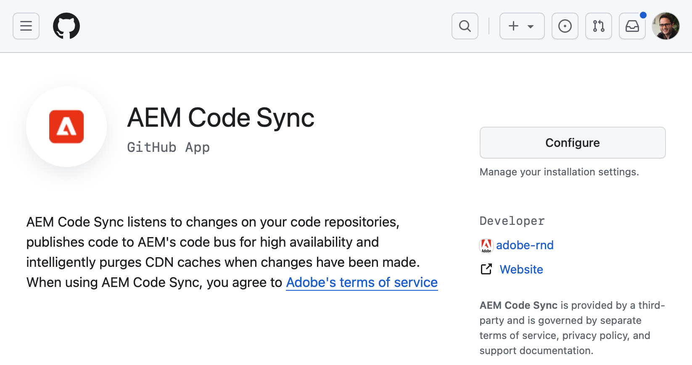
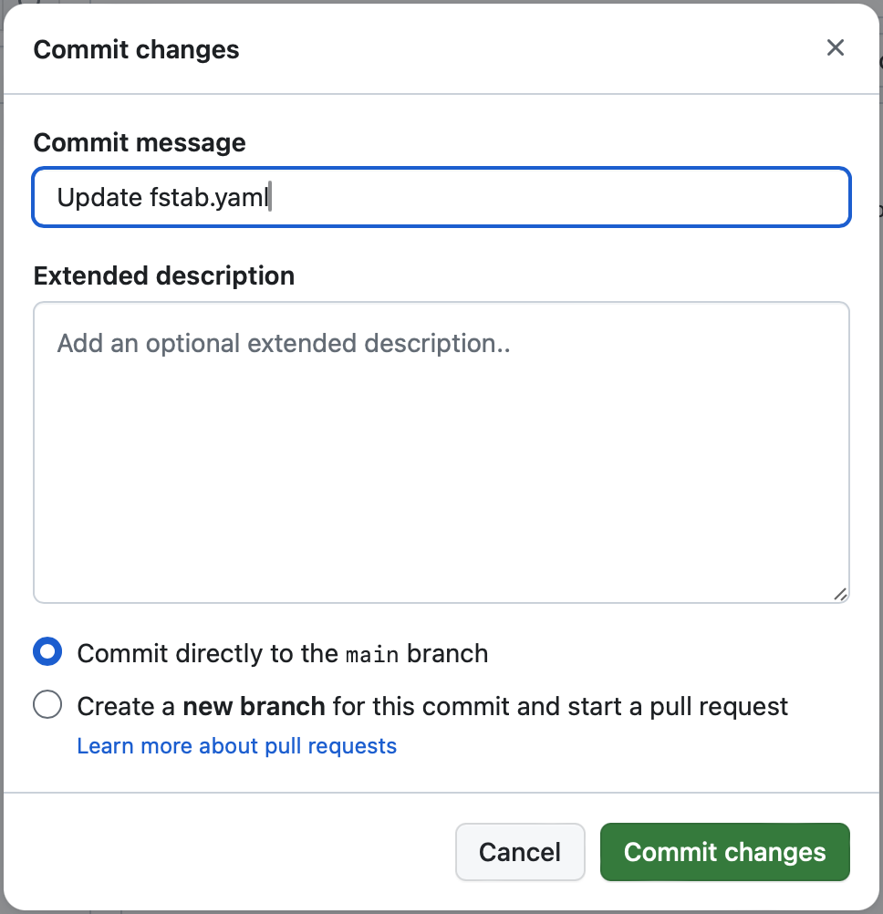
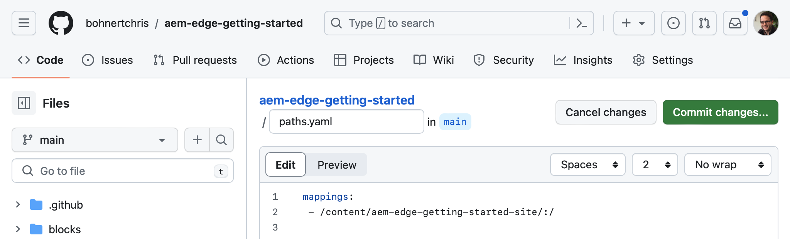
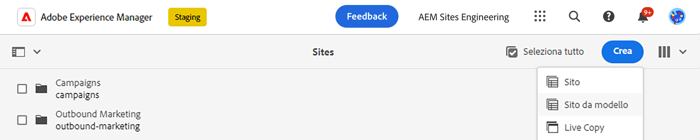
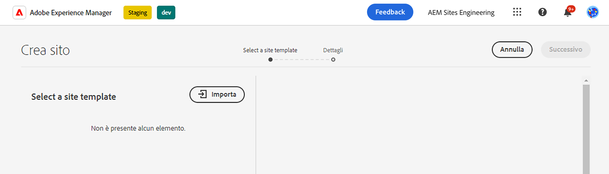
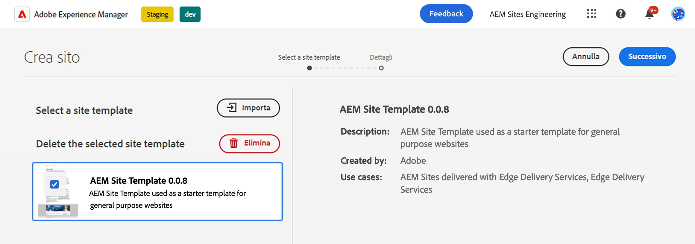
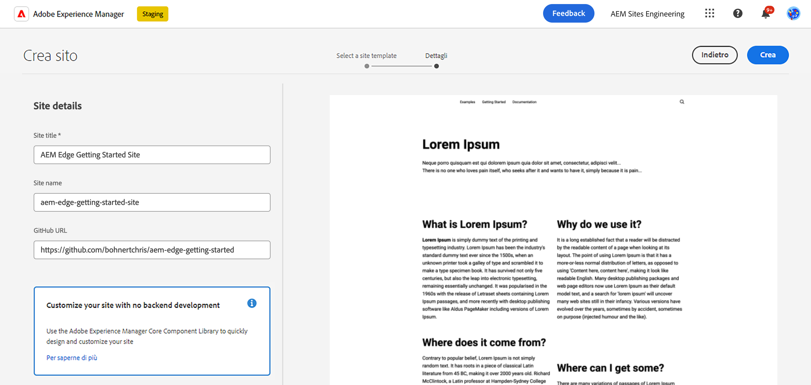
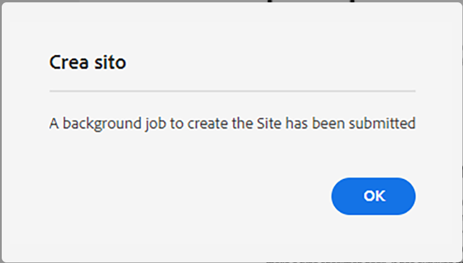
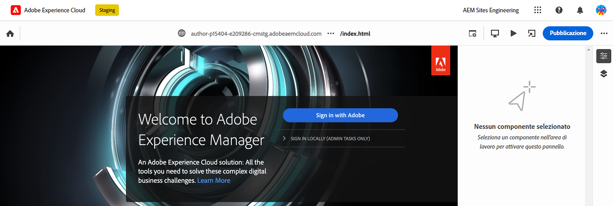
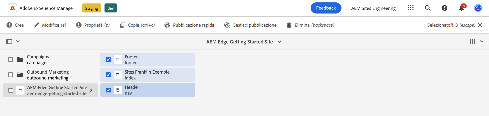

# Authoring AEM con Edge Delivery Services {#edge-dev-getting-started}

Questa guida ti aiuterà a iniziare a utilizzare un nuovo sito Adobe Experience Manager con Edge Delivery Services e l’Editor universale per l’authoring dei contenuti.

{{aem-authoring-edge-early-access}}

## Prerequisiti {#prerequisites}

Prima di iniziare questa guida, è necessario avere già familiarità con le nozioni di base di e avere accesso a Edge Delivery Services quali:

* Hai completato il [Tutorial sul servizio di consegna Edge.](/help/edge/developer/tutorial.md)
* Hai accesso a un [Sandbox di AEM Cloud Service.](/help/implementing/cloud-manager/getting-access-to-aem-in-cloud/introduction-sandbox-programs.md)
* Hai [ha attivato Universal Editor nello stesso ambiente sandbox.](/help/implementing/universal-editor/getting-started.md)

## Scegli l&#39;editor giusto {#editor-choice}

L&#39;AEM offre due diversi editor di contenuti e la scelta di quale utilizzare dipende dalla tua situazione.

* **Editor universale** - Questa dovrebbe essere la scelta predefinita per i nuovi siti.
* **Editor pagina AEM** : deve essere scelto per una migrazione AEM Sites esistente verso i Edge Delivery Services.

Questa guida si concentra sui progetti AEM su Edge Delivery Services che utilizzano Universal Editor. Consulta il documento [Sviluppo per i Edge Delivery Services](/help/edge/developing.md) per maggiori dettagli sulla scelta dell’editor giusto e sulla migrazione dei siti AEM esistenti verso i Edge Delivery Services.

## Guida introduttiva all’authoring e ai Edge Delivery Services AEM {#getting-started}

Una volta completato [i prerequisiti](#prerequisites) e hanno effettuato [la scelta di utilizzare l’editor universale,](#editor-choice) puoi iniziare a lavorare su un tuo progetto.

### Creare un progetto GitHub {#create-github-project}

Innanzitutto devi creare un nuovo progetto su GitHub, basato sul modello di Adobe.

1. Accedi a [`https://github.com/adobe-rnd/aem-boilerplate-xwalk`](https://github.com/adobe-rnd/aem-boilerplate-xwalk) e fai clic su **Usa questo modello** e seleziona **Creare un nuovo archivio**.

   * Per visualizzare questa opzione, devi aver effettuato l’accesso a GitHub.

   

1. Per impostazione predefinita, l’archivio viene assegnato all’utente. Modifica questo stato in base alle esigenze, fornisci un nome e una descrizione dell’archivio e fai clic su **Crea archivio**.

   

1. In una nuova scheda nello stesso browser, passa a [`https://github.com/apps/aem-code-sync`](https://github.com/apps/aem-code-sync) e fai clic su **Configura**.

   

1. Clic **Configura** per l’organizzazione in cui hai creato il nuovo archivio nel passaggio precedente.

   

1. Nella pagina GitHub di sincronizzazione del codice AEM in **Accesso all’archivio**, seleziona **Seleziona solo archivi**, selezionare l&#39;archivio creato nel passaggio precedente e quindi fare clic su **Salva**.

   

1. Una volta installato AEM Code Sync, viene visualizzata una schermata di conferma. Torna alla scheda del browser del nuovo archivio.

   

1. Fai clic su `fstab.yaml` per aprirlo e quindi **Modifica questo file** per modificarlo.

   

1. Modifica il `fstab.yaml` per aggiornare il punto di montaggio del progetto. Sostituisci l’URL predefinito dei documenti di Google con l’URL dell’istanza di authoring as a Cloud Service dell’AEM, quindi fai clic su **Commit modifiche...**.

   * `https://<aem-author>/bin/franklin.delivery/<owner>/<repository>/main`
   * La modifica del punto di montaggio indica ai Edge Delivery Services dove trovare il contenuto del sito.

   

1. Aggiungi un messaggio di commit come desiderato, quindi fai clic su **Conferma modifiche**, impegnandoli direttamente in `main` filiale.

   

1. Torna alla directory principale dell’archivio e fai clic su `paths.yaml` e quindi il **Modifica questo file** icona.

   

1. Sostituisci le mappature predefinite con `/content/<site-name>/:/` e fai clic su **Commit modifiche...**.

   * Fornisci il tuo `<site-name>`. Ne avrai bisogno in un passaggio successivo.
   * Le mappature spiegano ai Edge Delivery Services come mappare il contenuto nell’archivio AEM all’URL del sito.

   

1. Aggiungi un messaggio di commit come desiderato, quindi fai clic su **Conferma modifiche**, impegnandoli direttamente in `main` filiale.

   

### Creare e modificare un nuovo sito AEM {#create-aem-site}

Ora che disponi di un progetto GitHub, devi creare un nuovo sito AEM utilizzabile dal progetto.

>[!NOTE]
>
>Per modificare il sito con Universal Editor, è necessario utilizzare un browser basato su Chromium.

1. Richiedi l’ultimo modello del sito di creazione di AEM con Edge Delivery Services da Adobe Engineering tramite il tuo [canale di Slack del progetto.](/help/edge/docs/slack.md)

1. Accedi all’istanza di authoring as a Cloud Service dell’AEM, passa alla console Sites e tocca o fai clic su **Crea** -> **Sito da modello**.

   

1. Il giorno **Seleziona un modello di sito** della procedura guidata crea sito, fare clic sul pulsante **Importa** per importare un nuovo modello.

   

1. Carica il modello del sito per la creazione di AEM con Edge Delivery Services fornito da Adobe Engineering.

1. Una volta importato, il modello viene visualizzato nella procedura guidata. Tocca o fai clic per selezionarlo, quindi tocca o fai clic su **Successivo**.

   

1. Fornisci i campi seguenti e tocca o fai clic su **Crea**.

   * **Titolo sito** - Aggiungi un titolo descrittivo per il sito.
   * **Titolo sito** - Utilizza il `<site-name>` che hai definito in [passaggio precedente.](#create-github-project)
   * **URL GitHub** : utilizza l’URL del progetto GitHub creato nel passaggio precedente.

   

1. L’AEM conferma la creazione del sito con una finestra di dialogo. Tocca o fai clic su **OK** da ignorare.

   

1. Nella console Sites, passa a `index.html` del nuovo sito creato e tocca o fai clic su **Modifica** nella barra degli strumenti.

   

1. L’Editor universale viene aperto in una nuova scheda. Potrebbe essere necessario toccare o fare clic su **Accedi con un Adobe** per eseguire l&#39;autenticazione e modificare la pagina.

   

È ora possibile modificare il sito utilizzando l’Editor universale. Consulta la [Documentazione di Universal Editor](/help/sites-cloud/authoring/universal-editor/authoring.md) per ulteriori informazioni.

### Pubblicazione del nuovo sito {#publishing}

Una volta terminata la modifica del nuovo sito tramite l’Editor universale, puoi pubblicare i contenuti.

1. Nella console Sites, seleziona tutte le pagine create per il nuovo sito e tocca o fai clic su **Pubblicazione rapida** nella barra degli strumenti.

   

1. Tocca o fai clic su **Pubblica** nella finestra di dialogo di conferma per avviare il processo.

   

1. Apri una nuova scheda nello stesso browser e passa all’URL del nuovo sito.

   * `https://main--<site-name>--<owner>.hlx.page`

1. Vedi il tuo contenuto pubblicato.

   

## Passaggi successivi {#next-steps}

Ora che hai un progetto AEM in fase di elaborazione con Edge Delivery Services, puoi iniziare a creare e formattare i blocchi.

Consulta la guida [Creazione di blocchi instrumentati per l’utilizzo con l’editor universale](/help/edge/create-block.md) per ulteriori informazioni.
