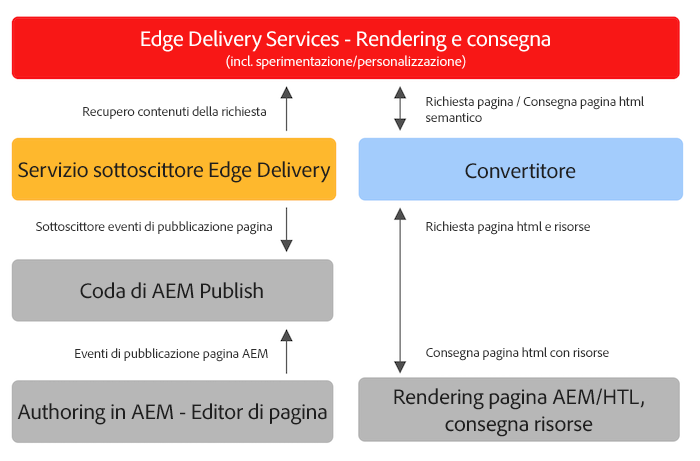

# Utilizzo di Edge Delivery Services con progetti AEM esistenti {#existing-projects}

Non c&#39;è bisogno di aspettare che un nuovo progetto AEM benefici dei Edge Delivery Services. I Edge Delivery Services possono essere integrati nel progetto AEM esistente in modo da sfruttare immediatamente i vantaggi in termini di prestazioni.

## Limitazioni per l’editor di pagine AEM {#page-editor}

Prima dell’avvento dei Edge Delivery Services, il contenuto gestito nell’AEM veniva modificato mediante l’Editor pagina AEM. Se il progetto è iniziato prima dell’introduzione dei Edge Delivery Services, si utilizza quasi certamente l’Editor pagina.

L’Editor pagina AEM funziona solo con [Componenti AEM](/help/implementing/developing/components/overview.md) come il [Componenti core.](https://experienceleague.adobe.com/docs/experience-manager-core-components/using/introduction.html?lang=it) Questi componenti sono incompatibili con i Edge Delivery Services. Per questo motivo, sono necessarie due fasi per introdurre Edge Delivery Services in un progetto AEM esistente:

* [Fase 1 - Sostituzione del front-end](#replace-front-end)
* [Fase 2 - Passare a Universal Editor](#switch-ue)

## Fase 1 - Sostituzione del front-end {#replace-front-end}

Nella fase uno, puoi continuare a utilizzare la struttura del sito AEM esistente, i componenti e gli strumenti di authoring. Il rendering del sito web verrà ricostruito utilizzando i blocchi mediante JavaScript e CSS e verrà distribuito tramite Edge Delivery Services.

Consulta la sezione [Sezione Build](https://www.aem.live/docs/#build) della documentazione dei Edge Delivery Services per ulteriori dettagli sui blocchi e su come sviluppare per i servizi di consegna Edge.

Sarà necessario un convertitore su App Builder per convertire l’output HTML sottoposto a rendering AEM e inviarlo ai Edge Delivery Services.

La fase due completa il processo eliminando la sovrapposizione tecnologica: Componenti core AEM con HTL e Java su AEM Author, Blocchi basati su JS su Edge Delivery e un convertitore basato su nodeJS.

## Fase 2 - Passare a Universal Editor {#switch-ue}

In questa fase, l’Editor pagina AEM viene sostituito con l’Editor universale. Poiché l’editor universale può funzionare direttamente con i blocchi, i componenti core e il convertitore AEM non saranno più necessari.

## Come iniziare {#how-to-get-started}

Per accedere a questa funzione, contatta il rappresentante del tuo Adobe.
