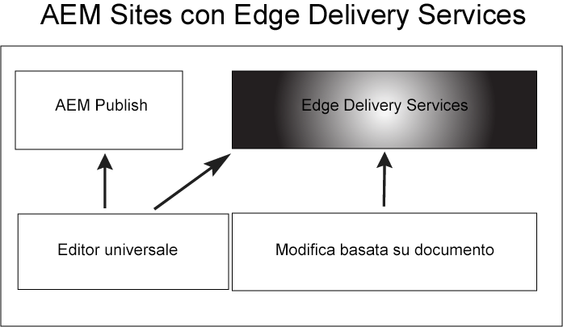

# Introduzione ai Edge Delivery Services {#getstart-edge}

Con i Edge Delivery Services, l&#39;AEM offre esperienze eccezionali che stimolano coinvolgimento e conversioni. L’AEM lo fa offrendo esperienze ad alto impatto veloci da creare e sviluppare. Si tratta di un set componibile di servizi che consente un ambiente di sviluppo rapido in cui gli autori possono aggiornare e pubblicare rapidamente e nuovi siti vengono avviati rapidamente. Con questi Edge Delivery Services è possibile migliorare la conversione, ridurre i costi e velocizzare le attività relative ai contenuti.

Sfruttando la distribuzione Edge, puoi:

* Crea siti veloci con un punteggio Lighthouse perfetto e monitora continuamente le prestazioni del sito tramite il monitoraggio degli utenti reali (RUM, Real User Monitoring).
* Aumentare l’efficienza di authoring disaccoppiando le origini di contenuto. È possibile utilizzare sia l’authoring AEM che l’authoring basato su documenti. Di conseguenza, puoi lavorare con più origini di contenuto sullo stesso sito web.
* Utilizza un framework di sperimentazione integrato che consente di creare e eseguire rapidamente i test senza alcun impatto sulle prestazioni e di rilasciare rapidamente la produzione di un vincitore di test.

## Come funziona la distribuzione Edge {#edge-works}

Il diagramma seguente illustra come modificare il contenuto in Microsoft Word (modifica basata su documento) e pubblicarlo in Edge Delivery. Mostra anche il tradizionale metodo di pubblicazione AEM utilizzando i vari editor.

Edge Delivery è un insieme componibile di servizi che consente un elevato grado di flessibilità nel modo in cui vengono creati i contenuti sul sito web. Come accennato in precedenza, puoi utilizzare entrambi [Authoring AEM](https://experienceleague.adobe.com/docs/experience-manager-cloud-service/content/sites/authoring/getting-started/concepts.html) e [authoring basato su documenti](https://www.hlx.live/docs/authoring).

È ad esempio possibile utilizzare il contenuto direttamente dai documenti di Microsoft Word o Google. Ciò significa che i documenti provenienti da tali origini possono diventare pagine del sito Web. Inoltre, titoli, elenchi, immagini ed elementi font possono essere trasferiti dalla sorgente iniziale al sito web. I nuovi contenuti verranno aggiunti immediatamente senza un processo di ricostruzione.

Edge Delivery sfrutta GitHub per consentire ai clienti di gestire e distribuire il codice direttamente dall’archivio GitHub. Ad esempio, puoi scrivere contenuti nei documenti di Google o in Microsoft Word e le funzionalità del sito possono essere sviluppate utilizzando CSS e JavaScript in GitHub. Quando sei pronto, puoi utilizzare l’estensione del browser del Sidekick per visualizzare in anteprima e pubblicare gli aggiornamenti dei contenuti.

Ulteriori informazioni:

* Per informazioni dettagliate su come iniziare a utilizzare la consegna Edge, consulta [Genera](https://www.hlx.live/docs/#build) sezione della documentazione di consegna Edge.
* Per capire come creare e pubblicare contenuti utilizzando Edge Delivery, consulta [Pubblica sezione](https://www.hlx.live/docs/authoring).
* Per informazioni su come avviare correttamente il progetto del sito web, consulta la sezione [Sezione Launch](https://www.hlx.live/docs/#launch).

## Edge Delivery Services e altri prodotti Adobe Experience Cloud {#edge-other-products}

I Edge Delivery Services fanno parte di Adobe Experience Manager e come tali i siti Edge Delivery e AEM possono coesistere sullo stesso dominio. Questo è un caso d’uso comune per i siti web più grandi. Inoltre, il contenuto di Edge Delivery può essere facilmente utilizzato nelle pagine di AEM Sites e viceversa.

Puoi anche utilizzare i Edge Delivery Services in combinazione con Adobe Target, Analytics e Launch.

## Accesso ai Edge Delivery Services {#getting-access}

È facile iniziare a utilizzare i Edge Delivery Services. Per iniziare, segui [Guida introduttiva - Tutorial per sviluppatori](https://www.hlx.live/developer/tutorial).

## Come trovare assistenza da Adobe {#adobe-gethelp}

Puoi interagire con i team di prodotto di Adobe tramite il canale di collaborazione sui prodotti fornito (consulta di seguito per i dettagli di accesso) per rispondere a domande sull’utilizzo dei prodotti o sulle best practice. Non sono presenti termini del livello di servizio (Service Level Terms, SLT) associati alle conversazioni tramite il canale di collaborazione prodotto. Se un problema relativo a un prodotto richiede un&#39;ulteriore analisi e risoluzione dei problemi e deve soddisfare gli SLT di risposta, puoi inviare un ticket di supporto seguendo la procedura [processo di supporto](https://experienceleague.adobe.com/?lang=en&amp;support-tab=home#support).

Adobe fornisce tre canali per aiutarti con i Edge Delivery Services:

* Interagisci con le risorse della community per informazioni generali
* Accesso al canale di collaborazione per domande specifiche
* Registra un ticket di supporto per risolvere i problemi principali e critici

### Accedi alle risorse della community {#community-resource}

Adobe dispone di due risorse della community per aiutarti con la distribuzione Edge, [Community Experience League](https://adobe.ly/3RzitVw) e un [Discord channel](https://discord.gg/YFTKQK8M).

### Come accedere al canale di collaborazione sui prodotti {#collab-channel}

Dato il valore del canale di comunicazione diretta con i clienti, tutti i clienti AEM al momento del lancio istituiranno un canale di Slack allo scopo di velocizzare le operazioni, aggiornare i dati critici e creare rapporti scalabili sulla qualità dell’esperienza. Riceverai un invito da Adobe a partecipare a un canale di Slack specifico per la tua organizzazione.

Per ulteriori informazioni, consulta [Utilizzo del bot di Slack](https://www.hlx.live/docs/slack) per ulteriori dettagli.

### Registrazione di un ticket di supporto {#support-ticket}

Passaggi per registrare un ticket di supporto tramite l’Admin Console:

1. Aggiungi **Consegna Edge** nel titolo del biglietto.
2. Nella descrizione, si prega di fornire i seguenti dettagli:

   * URL del sito web live. Ad esempio: [www.mydomain.com].
   * URL del sito Web di origine (URL con estensione hlx).

## Passaggio successivo {#whats-next}

Per iniziare, consulta il prossimo articolo: [Utilizzo dei Edge Delivery Services](/help/edge/using.md).

## Risorse utili {#useful-resources}

Per ulteriori dettagli sui Edge Delivery Services, vedi [Documentazione dei Edge Delivery Services](https://www.hlx.live/docs/).
