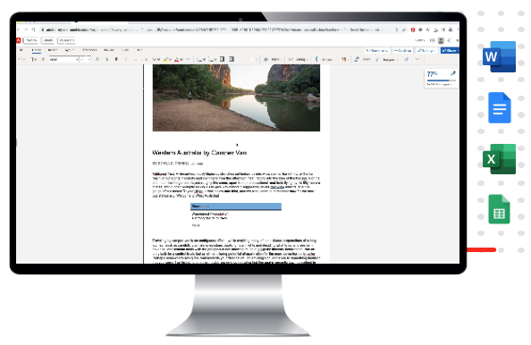

# Panoramica di Edge Delivery Services {#edge-delivery-services}

Con Edge Delivery Services, AEM offre esperienze eccezionali che stimolano coinvolgimento e conversioni. AEM lo fa offrendo esperienze ad alto impatto veloci da creare e sviluppare. Scopri Edge Delivery Services, un set di servizi componibili per un ambiente di sviluppo rapido in cui i contenuti possano essere aggiornati e pubblicati rapidamente dagli autori e che consente il lancio rapido di nuovi siti. Di conseguenza, con Edge Delivery Services è possibile migliorare la conversione, ridurre i costi e velocizzare le attività relative ai contenuti.

Utilizzando Edge Delivery Services, è possibile:

* Creare siti veloci con un punteggio Lighthouse perfetto e monitorare continuamente le prestazioni del sito tramite il monitoraggio dell’utilizzo reale (RUM, Real Use Monitoring).
* Aumentare l’efficienza di authoring separando le origini dei contenuti. Come impostazione predefinita, è possibile utilizzare sia l’authoring WYSIWYG che quello basato su documenti. Di conseguenza, puoi lavorare con più origini di contenuto sullo stesso sito Web.
* Utilizza un framework di sperimentazione integrato che consente di creare e di eseguire rapidamente i test senza alcun impatto sulle prestazioni e di rilasciare rapidamente in produzione un vincitore di test.

## Reazione Agile alle esigenze aziendali {#agile-reaction}

Adobe, da sempre leader del settore, sa quanto sia importante poter creare e pubblicare rapidamente nuovi contenuti significativi per la clientela. Il mercato ha messo in evidenza le sfide comuni in materia di scalabilità della creazione dei contenuti, tra cui:

1. **La domanda di contenuti continua a crescere.**
   * È necessario sbloccare nuovi autori di contenuti per soddisfare questa domanda.
   * Il processo di creazione dei contenuti deve essere scalabile in modo efficace a livello aziendale.
   * Gli autori devono poter reagire rapidamente ai cambiamenti di tendenza.
1. **È necessario il contenuto omni-channel.**
   * Il controllo del layout è necessario indipendentemente dalla consegna dei contenuti.
   * Gli autori devono essere autonomi nel modificare direttamente il layout dei contenuti.
1. **La pressione aumenta per favorire il ROI sui contenuti.**
   * Gli stessi autori devono poter ottimizzare i contenuti creati.

Queste tendenze si sono dimostrate coerenti per il settore. Tuttavia, i requisiti individuali variano inevitabilmente da progetto a progetto. L’obiettivo di qualsiasi progetto di Edge Delivery Services si concentra sul trovare la soluzione che funzioni per i propri utenti.

1. **Concentrarsi sul valore invece che sulle funzioni.** - Determina il flusso di lavoro più ottimizzato che supporti al meglio gli autori, anziché perderti nel vasto set di funzioni di AEM.
1. **Sfrutta la flessibilità di AEM.** - Le funzioni di AEM non devono essere utilizzate in modo isolato. Utilizza le funzioni necessarie per ciascun caso d’uso.
1. **Sfrutta le competenze dell’autore.** - Fin dall’inizio, coinvolgi nel progetto gli autori di contenuti reali per assicurarti di offrire loro il valore di cui hanno bisogno, implementando le funzioni più appropriate.

Concentrandoti sul valore per gli autori, il progetto di Edge Delivery Services può soddisfare le nuove esigenze del settore che i creatori di contenuti devono affrontare, e quindi fornire in tempi brevi contenuti tali da conquistare la tua clientela.

## Strumenti di authoring flessibili per i creatori di contenuti {#overview}

Edge Delivery Services è un set di sevizi componibili che consente un elevato grado di flessibilità per quanto riguarda la creazione di contenuti sul sito web. Puoi utilizzare sia [Gestione dei contenuti AEM](https://experienceleague.adobe.com/docs/experience-manager-cloud-service/content/sites/authoring/getting-started/concepts.html?lang=it) che l’authoring WYSIWYG utilizzando l’[Editor universale](/help/sites-cloud/authoring/universal-editor/authoring.md) nonché l’[authoring basato su documenti.](https://www.aem.live/docs/authoring)

Il diagramma seguente illustra come modificare il contenuto in Microsoft Word (modifica basata su documento) e pubblicarlo in Edge Delivery Services. Mostra anche la modifica WYSIWYG utilizzando l’editor universale.

Edge Delivery Services sfrutta GitHub per consentirti di gestire e distribuire il codice direttamente dall’archivio GitHub. Il nuovo contenuto viene subito aggiunto senza che sia necessario eseguire una nuova build.

### Authoring basato su documenti {#document-based}

Grazie all’authoring basato su documenti, puoi utilizzare i contenuti direttamente da Microsoft Word o Documenti Google in modo che diventino pagine del sito web. I titoli, gli elenchi, le immagini e gli elementi font possono essere tutti trasferiti dall’origine iniziale al sito web.

* Grazie all’authoring basato su documenti, ogni marketer può creare rapidamente contenuti con strumenti di authoring noti (Microsoft Word, Documenti Google, ecc.).
* La creazione dei contenuti è semplificata consentendo l’authoring, la revisione e la pubblicazione direttamente dai documenti di origine.
* Grazie alla possibilità di utilizzare strumenti già noti, gli autori di contenuti non devono seguire alcun percorso di onboarding e la creazione dei contenuti risulta velocizzata.
* Le funzionalità del sito possono essere sviluppate utilizzando CSS e JavaScript in GitHub.

Ulteriori informazioni sono disponibili nella documentazione relativa all’authoring basato su documenti:

* Per informazioni dettagliate su come iniziare a utilizzare Edge Delivery, consulta la [sezione Creare](https://www.aem.live/docs/#build).
* Per capire come creare e pubblicare contenuti utilizzando Edge Delivery, consulta la [sezione Pubblicare.](https://www.aem.live/docs/authoring)
* Per informazioni su come avviare correttamente il progetto del sito Web, consulta la [sezione Avvio](https://www.aem.live/docs/#launch).

### Authoring WYSIWYG {#wysiwyg-authoring}

L’authoring WYSIWYG (What you see is what you get) sfrutta l’editor universale, un’area personalizzabile e completa per la modifica dei contenuti in tempo reale e nel loro contesto, con un’anteprima visiva.

* Con l’authoring WYSIWYG, puoi incrementare l’efficienza dell’authoring sia headless che headful.
* Puoi sfruttare le funzionalità complete di gestione dei contenuti di AEM, incluse quelle per flussi di lavoro e governance.
* Sfrutta numerosi punti di estensione per supportare i processi e le integrazioni che utilizzi.
* Le funzionalità del sito possono essere sviluppate utilizzando CSS e JavaScript in GitHub.

Ulteriori informazioni sono disponibili nella documentazione sull’authoring WYSIWYG:

* Per una panoramica sull’editor universale e sull’authoring WYSIWYG, consulta il documento [Authoring dei contenuti WYSIWYG per Edge Delivery Services.](/help/edge/wysiwyg-authoring/authoring.md)
* Per una panoramica per gli sviluppatori, consulta il documento [Guida introduttiva per gli sviluppatori per l’authoring WYSIWYG con Edge Delivery Services.](/help/edge/wysiwyg-authoring/edge-dev-getting-started.md)

### Scegliere il metodo di authoring più appropriato {#authoring-method}

Grazie alla flessibilità di AEM, puoi soddisfare le tue specifiche esigenze di authoring. Adobe può aiutarti a determinare i metodi più adatti alle tue esigenze.

* Coinvolgi sempre gli autori dei contenuti in questa decisione.
* È possibile implementare più metodi di authoring.
* Puoi sempre cambiare metodo di authoring in un secondo tempo.
* Non devi decidere prima dell’implementazione, ma nell’ambito dell’implementazione stessa.

Per ulteriori informazioni, consulta il documento [Scelta di un metodo di authoring](authoring-methods.md).

## Edge Delivery Services e altri prodotti di Adobe Experience Cloud {#edge-other-products}

Edge Delivery Services fa parte di Adobe Experience Manager e, per questo motivo, i siti di Edge Delivery Services e di AEM possono coesistere sullo stesso dominio, pratica diffusa per quanto riguarda i siti web più grandi. Inoltre, il contenuto di Edge Delivery Services può essere facilmente utilizzato nelle pagine di AEM Sites e viceversa.

Consulta la [Guida introduttiva per sviluppatori di authoring di WYSIWYG con Edge Delivery Services](/help/edge/wysiwyg-authoring/edge-dev-getting-started.md) per scoprire come avviare un proprio progetto per l’authoring con AEM e Edge Delivery Services.

È inoltre possibile utilizzare Edge Delivery Services con [Adobe Target](https://www.aem.live/developer/target-integration), con la funzione di [monitoraggio dell’utilizzo reale](https://www.aem.live/developer/rum) (RUM, Real Use Monitoring) per diagnosticare l’utilizzo e le prestazioni dei siti, e con [Launch.](https://experienceleague.adobe.com/it/docs/experience-platform/tags/home)

## Guida introduttiva a Edge Delivery Service {#getting-started}

È facile iniziare a utilizzare Edge Delivery Services seguendo la [Guida introduttiva: tutorial per sviluppatori.](https://www.aem.live/developer/tutorial)

## Ottenere assistenza da Adobe {#getting-help}

Adobe fornisce tre canali per aiutarti con Edge Delivery Services:

* Interazione con le [risorse della community](#community-resources) per rispondere a domande generali.
* Accesso al [canale di collaborazione sui prodotti](#collaboration-channel) per domande specifiche.
* [Registra un ticket di supporto](#support-ticket) per risolvere i problemi importanti e critici.

### Accesso alle risorse della community {#community-resources}

Adobe si impegna a fornire la migliore community e il miglior supporto per Edge Delivery Services, WYSIWYG e l’authoring basato su documenti.

* Aderisci alla [community Experience League](https://adobe.ly/3Q6kTKl) per rivolgere domande, condividere feedback, avviare discussioni, chiedere assistenza da esperti di Adobe e consulenti ed esperti di AEM e connetterti in tempo reale con altri utenti che condividono i tuoi stessi interessi. 
* Segui il nostro [canale Discord](https://discord.gg/aem-live), una piattaforma più informale per interazioni in tempo reale e rapidi scambi di idee.

### Come accedere al canale di collaborazione sui prodotti {#collaboration-channel}

Dato il valore di un canale di comunicazione diretta con gli utenti, all’avvio di ogni progetto AEM viene stabilito un canale Slack per comunicazioni rapide, aggiornamenti critici e reporting scalabile sulla qualità dell’esperienza. Riceverai un invito da Adobe per partecipare a canale Slack specifico per la tua organizzazione.

Per ulteriori informazioni, consulta [Utilizzo del bot di Slack](https://www.aem.live/docs/slack).

Puoi interagire con i team di prodotto Adobe tramite il canale di collaborazione sui prodotti fornito per domande sull’utilizzo dei prodotti o sulle best practice. Non sono presenti termini di livello di servizio (Service Level Terms, SLT) associati alle conversazioni tramite il canale di collaborazione sui prodotti.

### Registrare un ticket di supporto {#support-ticket}

Se un problema relativo a un prodotto richiede ulteriori indagini e tentativi di risoluzione e deve soddisfare gli SLT di risposta, puoi inviare un ticket di supporto seguendo la Admin Console.

1. Crea un ticket [seguendo la procedura di assistenza standard](https://experienceleague.adobe.com/?support-tab=home?lang=it#support).
1. Aggiungi **Edge Delivery** nel titolo del ticket.
1. Nella descrizione, fornisci i dettagli seguenti oltre alla descrizione del problema:

   * URL del sito web live. Ad esempio: `www.mydomain.com`.
   * URL del sito web di origine (URL `.hlx`).

## Passaggio successivo {#whats-next}

Per iniziare, consulta [Utilizzo di Edge Delivery Services](/help/edge/using.md).
