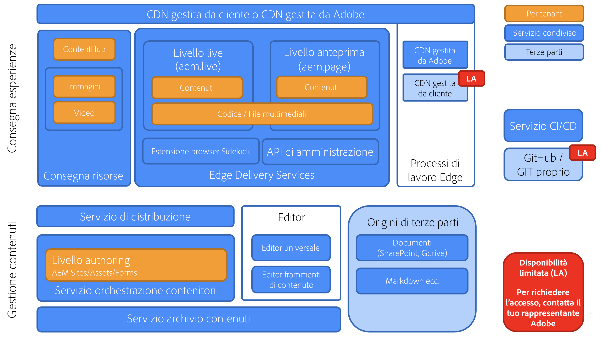

# Panoramica di Edge Delivery Services {#edge-delivery-services}

>[!TIP]
>
>**Desideri metterti subito all’opera?**
>
>Se desideri iniziare subito a utilizzare Edge Delivery Services, hai a disposizione due opzioni.
>
>* [Avvia subito l’authoring con un ambiente di esercitazione predefinito, completamente configurato e pronto per l’uso.](https://www.aem.live/developer/ue-trial)
>* Accedi a ulteriori dettagli e configura il tuo ambiente in meno di 30 minuti [consultando l’esercitazione su aem.live.](https://www.aem.live/developer/ue-tutorial)

## Che cos’è Edge Delivery Services? {#what-is-edge}

Edge Delivery Services è un framework moderno per la distribuzione dei contenuti che reinterpreta il modo in cui vengono creati e distribuiti i siti web, ottimizzandoli per velocità, semplicità e scalabilità. È una parte fondamentale di Adobe Experience Manager e consente esperienze digitali più veloci, rendendo il rendering e la distribuzione più vicini all’utente, alla periferia della rete.

Non sostituisce una rete per la distribuzione dei contenuti (CDN, Content Delivery Network), ma si integra perfettamente con la tua rete CDN o con la rete inclusa [CDN gestita da Adobe.](/help/implementing/dispatcher/cdn.md)

## Perché scegliere Edge Delivery Services? {#why-edge}

### Maggiore reperibilità e aumento del traffico {#increase-traffic}

I siti web di Edge Delivery sono motori di ricerca ottimizzati (SEO) e motori generativi ottimizzati (GEO) per LLM. In questo modo si garantisce un’elevata visibilità e reperibilità su tutte le fonti di traffico organico esistenti e future. L’**architettura end-to-end basata sulle prestazioni** assicura una piacevole esperienza della clientela, con un impatto positivo sul coinvolgimento.

### Efficienza degli sviluppatori {#developer-efficientcy}

Pubblica in pochi giorni o settimane, invece che in mesi o anni! Edge Delivery offre tutti quegli strumenti che **i moderni sviluppatori web** apprezzano: GitHub, sviluppo locale con ricaricamento automatico, prestazioni, semplicità e zero complicazioni: nessuna transpilazione, nessun bundler, nessuna configurazione, nessun sovraccarico.

La semplicità di Edge Delivery non richiede l’utilizzo di framework, strumenti o processi complicati, ideali per la creazione di codice IA. Utilizza HTML semplice, CSS moderno e Vanilla JavaScript per creare esperienze eccezionali più rapidamente che mai. Concentrati sul lavoro e dedica meno tempo alla formazione e all’apprendimento di nuovi strumenti.

Edge Delivery consente a ogni sviluppatore di ottenere un punteggio Lighthouse di 100.

### Supporto per più origini di contenuto {#multiple-content-sources}

I contenuti di varie soluzioni possono essere integrati direttamente con Edge Delivery, **incluse tutte le istanze esistenti di AEM**. Gli autori possono gestire e **pubblicare contenuti da qualsiasi sistema, ad esempio da SharePoint ad Edge Delivery**, per velocizzare l’attività grazie agli strumenti già noti.

### Architettura componibile {#composable-architeture}

Che si tratti di headless o di headful, puoi fornire il contenuto giusto nel formato adatto, aggiungendo decorazioni appropriate e trasformandolo in un’esperienza unica in qualsiasi canale.

## Come funziona {#how-does-it-work}

Edge Delivery Services è un set di sevizi componibili che consente un elevato grado di flessibilità per quanto riguarda la creazione di contenuti sul sito web. Sostituisce AEM Publish/Dispatcher e il modo tradizionale di creare esperienze con i componenti core di AEM con una soluzione SaaS multi-cloud e un approccio di sviluppo front-end puro.

Edge Delivery Services sfrutta GitHub per consentirti di gestire e distribuire il codice direttamente dall’archivio GitHub. Il nuovo contenuto viene subito aggiunto senza che sia necessario eseguire una nuova build.

## Authoring {#authoring}

### Modifica in contesto {#in-context-editing}

[L’editor universale](/help/implementing/universal-editor/introduction.md) è what-you-see-is-what-you-get (WYSIWYG), un’area personalizzabile e completa per la modifica dei contenuti in tempo reale e in contesto, con un’anteprima visiva.

* Grazie all’authoring AEM con l’editor universale, puoi aumentare l’efficienza dell’authoring sia headless che headful.
* Puoi sfruttare le funzionalità complete di gestione dei contenuti di AEM, incluse quelle per flussi di lavoro e governance.
* Sfrutta numerosi punti di estensione per supportare i processi e le integrazioni.
* Le funzionalità del sito possono essere sviluppate utilizzando CSS e JavaScript in GitHub.

### Modifica basata su documento {#document-based-editing}

[Un altro approccio è l’authoring basato su documenti](https://www.aem.live/docs/authoring), in cui il contenuto viene gestito come documento. Microsoft Word è una scelta popolare, in quanto molte aziende dispongono di SharePoint per la creazione del contenuto iniziale. Non è necessario apprendere un nuovo strumento e pubblicare contenuti direttamente da SharePoint e Word elimina il problema di copiare e incollare contenuti in AEM. La clientela che non dispone di SharePoint può inoltre utilizzare Google Drive come alternativa.

## Telemetria operativa {#telemetry}

Adobe Experience Manager utilizza la [telemetria operativa](https://www.aem.live/docs/operational-telemetry) per raccogliere i dati delle operazioni strettamente necessari per individuare e risolvere i problemi funzionali e di prestazioni sui siti basati su Adobe Experience Manager. I dati di telemetria operativa possono essere utilizzati per diagnosticare problemi di prestazioni e per misurare l’efficacia degli esperimenti. La telemetria operativa preserva la privacy dei visitatori attraverso il [campionamento](https://www.aem.live/docs/operational-telemetry#operational-telemetry-data-is-sampled) (verrà monitorata solo una piccola parte di tutte le visualizzazioni di pagina) e un’[attenta esclusione delle informazioni personali identificabili](https://www.aem.live/docs/operational-telemetry#what-data-is-being-collected) (PII).

## Iniziare ad esplorare {#start-exploring}

Introduzione all’authoring AEM con l’editor universale ed Edge Delivery Services:

* Documentazione di Edge Delivery Services [Edge Delivery Services](https://www.aem.live)
* Per una panoramica sull’authoring AEM con l’editor universale, consulta il documento [Authoring con AEM per Edge Delivery Services](https://www.aem.live/docs/aem-authoring) nella documentazione di aem.live.
* Per una panoramica per gli sviluppatori, consulta il documento [Guida introduttiva - Tutorial per sviluppatori di editor universale](https://www.aem.live/developer/ue-tutorial) nella documentazione di aem.live.

## Edge Delivery Services e altri prodotti di Adobe Experience Cloud {#edge-other-products}

Edge Delivery Services fa parte di Adobe Experience Manager. Di conseguenza, Edge Delivery Services e AEM Sites possono coesistere sullo stesso dominio, che rappresenta un caso d’uso comune per i siti web più grandi. Inoltre, le pagine AEM Sites possono utilizzare facilmente i contenuti di Edge Delivery Service e può succedere anche il contrario.

Puoi anche utilizzare Edge Delivery Services con [Adobe Target](https://www.aem.live/developer/target-integration) e [Launch.](https://experienceleague.adobe.com/it/docs/experience-platform/tags/home)

## Ottenere assistenza da Adobe {#getting-help}

Adobe fornisce tre livelli per aiutarti con Edge Delivery Services:

* Interazione con le [risorse della community](#community-resources) per rispondere a domande generali.
* Accesso al [canale di collaborazione sui prodotti](#collaboration-channel) per domande specifiche.
* [Registra un ticket di supporto](#support-ticket) per risolvere i problemi principali e critici **all’interno del supporto contrattuale SLA**.

### Accesso alle risorse della community {#community-resources}

Adobe si impegna a fornire il miglior coinvolgimento della community e il miglior supporto per Edge Delivery Services, l’authoring AEM con l’editor universale e l’authoring basato su documenti.

* Aderisci alla [community Experience League](https://adobe.ly/3Q6kTKl) per rivolgere domande, condividere feedback, avviare discussioni, chiedere assistenza da esperti di Adobe e consulenti ed esperti di AEM e connetterti in tempo reale con altri utenti che condividono i tuoi stessi interessi.
* Segui il [canale Discord](https://discord.gg/aem-live), una piattaforma più informale per interazioni in tempo reale e rapidi scambi di idee.

### Registrare un ticket di supporto {#support-ticket}

{{support-ticket}}
