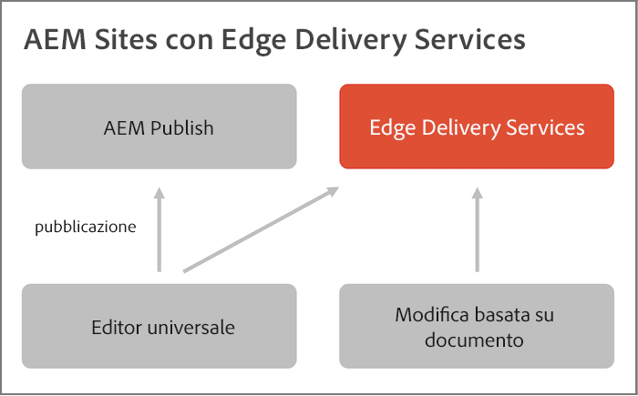

# AEM e Edge Delivery Services {#aem-edge}

Con Edge Delivery Services, AEM offre esperienze eccezionali che stimolano coinvolgimento e conversioni. AEM lo fa offrendo esperienze ad alto impatto veloci da creare e sviluppare. Scopri Edge Delivery Services, un set di servizi componibili per un ambiente di sviluppo rapido in cui i contenuti possano essere aggiornati e pubblicati rapidamente dagli autori e che consente il lancio rapido di nuovi siti. Di conseguenza, con Edge Delivery Services è possibile migliorare la conversione, ridurre i costi e velocizzare le attività relative ai contenuti.

Utilizzando Edge Delivery Services, è possibile:

* Creare siti veloci con un punteggio Lighthouse perfetto e monitorare continuamente le prestazioni del sito tramite il monitoraggio degli utenti reali (RUM, Real User Monitoring).
* Aumentare l’efficienza di authoring separando le origini di contenuto. È possibile utilizzare sia l’authoring di AEM che l’authoring basato su documenti. Di conseguenza, puoi lavorare con più origini di contenuto sullo stesso sito Web.
* Utilizza un framework di sperimentazione integrato che consente di creare e di eseguire rapidamente i test senza alcun impatto sulle prestazioni e di rilasciare rapidamente in produzione un vincitore di test.

## Panoramica di Edge Delivery Services {#edge-overview}

Il diagramma seguente illustra come modificare il contenuto in Microsoft Word (modifica basata su documento) e pubblicarlo in Edge Delivery Services. Mostra anche il metodo di pubblicazione di AEM utilizzando l’editor universale.

Edge Delivery Services è un set di sevizi componibili che consente un elevato grado di flessibilità nel modo in cui vengono creati i contenuti sul sito Web. Come accennato in precedenza, è possibile utilizzare sia la [Gestione dei contenuti AEM](https://experienceleague.adobe.com/docs/experience-manager-cloud-service/content/sites/authoring/getting-started/concepts.html?lang=it) con l’[authoring dell’editor universale](/help/implementing/universal-editor/introduction.md), sia l’[authoring basato su documenti.](https://www.aem.live/docs/authoring)

Ad esempio, è possibile utilizzare il contenuto direttamente da Microsoft Word o Documenti Google. Ciò significa che i documenti provenienti da tali origini possono diventare pagine del sito Web. Inoltre, le intestazioni, gli elenchi, le immagini e gli elementi dei font possono essere trasferiti dalla sorgente iniziale al sito Web. Il nuovo contenuto viene aggiunto immediatamente senza che sia necessario ricrearlo.

Edge Delivery Services sfrutta GitHub per consentire alla clientela di gestire e distribuire il codice direttamente dall’archivio GitHub. Ad esempio, puoi scrivere contenuti in Documenti Google o in Microsoft Word e le funzionalità del sito possono essere sviluppate utilizzando CSS e JavaScript in GitHub. Quando è tutto pronto, puoi utilizzare l’estensione del browser Sidekick per visualizzare in anteprima e pubblicare gli aggiornamenti dei contenuti.

Ulteriori informazioni sono disponibili nella documentazione di Edge Delivery Services:

* Per informazioni dettagliate su come iniziare a utilizzare Edge Delivery, consulta la [sezione Creare](https://www.aem.live/docs/#build).
* Per capire come creare e pubblicare contenuti utilizzando Edge Delivery, consulta la [sezione Pubblicare.](https://www.aem.live/docs/authoring)
* Per informazioni su come avviare correttamente il progetto del sito Web, consulta la [sezione Avvio](https://www.aem.live/docs/#launch).

## Edge Delivery Services e altri prodotti di Adobe Experience Cloud {#edge-other-products}

Edge Delivery Services fa parte di Adobe Experience Manager e, come tale, i siti di Edge Delivery Services e di AEM possono coesistere sullo stesso dominio. Questo è un caso d’uso comune per i siti Web più grandi. Inoltre, il contenuto di Edge Delivery Services può essere facilmente utilizzato nelle pagine di AEM Sites e viceversa.

Consulta la sezione [Guida introduttiva per gli sviluppatori per l’authoring di AEM con Edge Delivery Services](/help/edge/edge-dev-getting-started.md) per scoprire come avviare un progetto personalizzato per l’authoring con AEM e Edge Delivery Services.

Puoi anche utilizzare Edge Delivery Services con Adobe Target, Analytics e Launch.

## Accedere a Edge Delivery Services {#getting-access}

È facile iniziare a utilizzare Edge Delivery Services. Per iniziare, segui la [Guida introduttiva: tutorial per sviluppatori](https://www.aem.live/developer/tutorial).

## Ottenere assistenza da Adobe {#adobe-gethelp}

È possibile interagire con i team di prodotto Adobe tramite il canale di collaborazione sui prodotti fornito (consulta di seguito per i dettagli di accesso) per domande sull’utilizzo dei prodotti o sulle best practice. Non sono presenti termini di livello di servizio (Service Level Terms, SLT) associati alle conversazioni tramite il canale di collaborazione sui prodotti. Se un problema relativo a un prodotto richiede ulteriori indagini e tentativi di risoluzione e deve soddisfare gli SLT di risposta, puoi inviare un ticket di supporto seguendo la [procedura di assistenza](https://experienceleague.adobe.com/?support-tab=home?lang=it#support).

Adobe fornisce tre canali per aiutarti con Edge Delivery Services:

* Interazione con le risorse della community per rispondere a domande generali
* Accesso al canale di collaborazione sui prodotti per domande specifiche
* Registrazione di un ticket di supporto per risolvere i problemi importanti e critici

### Accesso alle risorse della community {#community-resource}

Adobe si impegna a fornire la migliore community e il miglior supporto per Edge Delivery Services e l’authoring basato su documenti.

* Aderisci alla [community Experience League](https://adobe.ly/3Q6kTKl) per rivolgere domande, condividere feedback, avviare discussioni, chiedere assistenza da esperti di Adobe e consulenti ed esperti di AEM e connetterti in tempo reale con altri utenti che condividono i tuoi stessi interessi. 
* Segui il nostro [canale Discord](https://discord.gg/aem-live), una piattaforma più informale per interazioni in tempo reale e rapidi scambi di idee.

### Come accedere al canale di collaborazione sui prodotti {#collab-channel}

Dato il valore di un canale di comunicazione diretta con i clienti, per tutti i clienti AEM al momento dell’avvio viene stabilito un canale Slack per comunicazioni rapide, aggiornamenti critici e reporting scalabile sulla qualità dell’esperienza. Riceverai un invito da Adobe per iscriverti al canale Slack specifico per la tua organizzazione.

Per ulteriori informazioni, consulta [Utilizzo del bot di Slack](https://www.aem.live/docs/slack).

### Registrare un ticket di supporto {#support-ticket}

Passaggi per registrare un ticket di assistenza tramite Admin Console:

1. Crea un ticket [seguendo la procedura di assistenza standard](https://experienceleague.adobe.com/?support-tab=home?lang=it#support).
1. Aggiungi **Edge Delivery** nel titolo del ticket.
1. Nella descrizione, includi i seguenti dettagli:

   * URL del sito web live. Ad esempio: `www.mydomain.com`.
   * URL del sito web di origine (URL `.hlx`).

## Passaggio successivo {#whats-next}

Per iniziare, consulta il prossimo articolo: [Utilizzo di Edge Delivery Services](/help/edge/using.md).
