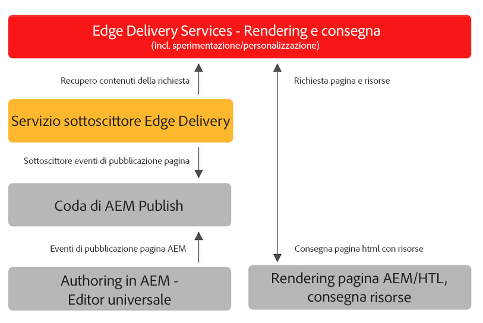

# Pubblicazione di contenuti per Edge Delivery Services {#publishing-edge}

Con i Edge Delivery Services, la pubblicazione dei contenuti avviene senza soluzione di continuità indipendentemente dall&#39;origine:

* Contenuto basato su documenti - Consulta [Pubblica sezione](https://www.aem.live/docs/#publish) della documentazione dei Edge Delivery Services.
* Contenuto AEM - Vedere i dettagli di seguito.

## Flusso di pubblicazione dall’AEM {#publishing-flow}

Quando si utilizza l’Editor universale per creare contenuti AEM, pubblicare è semplice come fare clic sul pulsante **Pubblica** nell&#39;editor universale. Consulta il documento [Pubblicazione di contenuti con l’editor universale.](/help/implementing/universal-editor/publishing.md)

Il flusso di informazioni durante la pubblicazione è il seguente. Una volta che l’autore avvia la pubblicazione, questo flusso è automatico e viene illustrato qui a scopo informativo.

1. L’autore del contenuto pubblica i contenuti AEM nell’editor universale.
1. Un evento di pubblicazione viene inviato alla coda della pipeline Adobe.
1. Il servizio di pubblicazione della consegna Edge inoltra gli eventi rilevanti all’API di amministrazione della consegna Edge.
1. Edge Delivery richiama e acquisisce i HTML semantici dall’autore AEM.
1. AEM aggiornato con lo stato di pubblicazione.

## Come iniziare {#how-to-get-started}

Per accedere a questa funzione, contatta il rappresentante del tuo Adobe.
