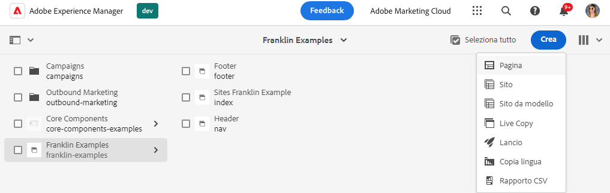
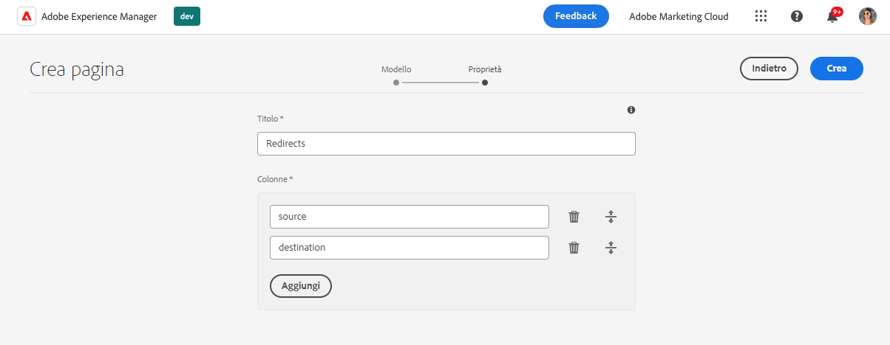
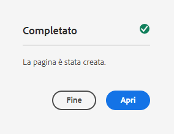
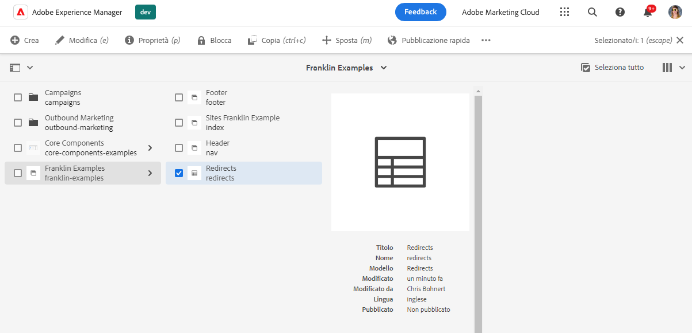
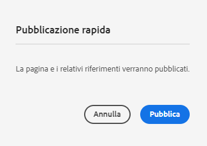
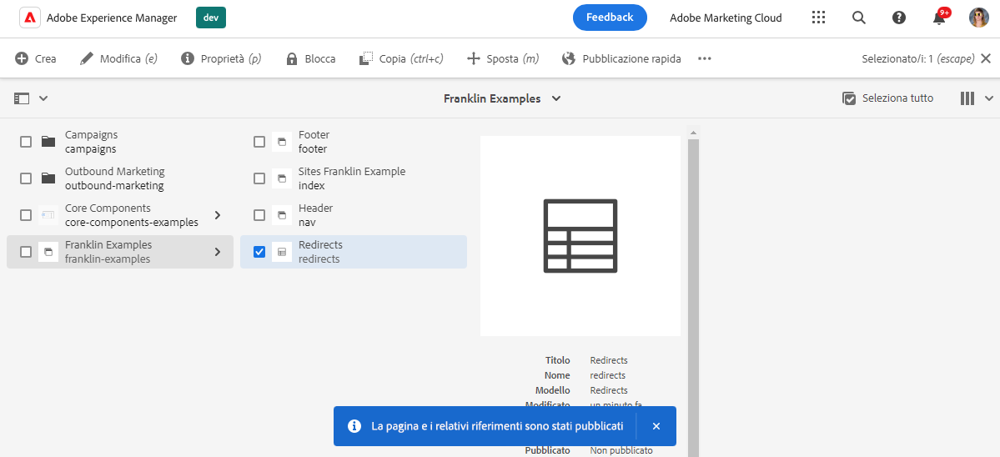
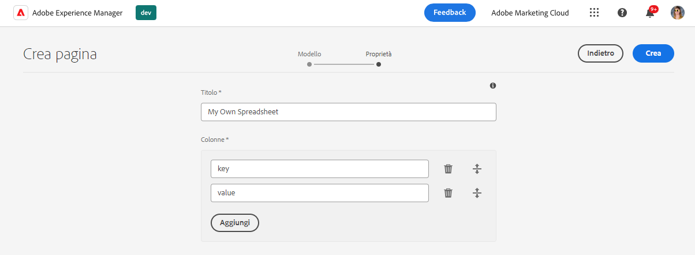

# Utilizzo dei fogli di calcolo per gestire i dati tabulari {#tabular-data}

Scopri come utilizzare i fogli di calcolo per gestire i dati tabulari per vari valori, come metadati e reindirizzamenti per il sito Edge Delivery Services dell’AEM.

{{aem-authoring-edge-early-access}}

## Casi d’uso {#use-cases}

Per qualsiasi sito AEM con Edge Delivery Services, è necessario mantenere elenchi di dati tabulari, ad esempio per le mappature chiave-valore. Possono essere elenchi di molti valori diversi, ad esempio metadati e reindirizzamenti. Edge Deliver Services consente di mantenere tali elenchi tabulari utilizzando uno strumento intuitivo: il foglio di calcolo. AEM traduce questi fogli di calcolo in file JSON che possono essere facilmente utilizzati dal sito web o dall’applicazione web.

I casi d’uso comuni includono:

* [Segnaposto](/help/edge/docs/placeholders.md)
* [Metadati](/help/edge/docs/bulk-metadata.md)
* [Intestazioni](/help/edge/docs/custom-headers.md)
* [Reindirizzamenti](/help/edge/docs/redirects.md)
* [Configurazioni](/help/edge/docs/setup-byo-cdn-push-invalidation.md) ad esempio per le impostazioni CND

Inoltre, è possibile [creare i fogli di calcolo](#own-spreadsheet) di qualsiasi struttura per memorizzare le mappature per le tue finalità.

Questo documento utilizza l’esempio dei reindirizzamenti per illustrare come creare tali fogli di calcolo. Per informazioni dettagliate su ciascun caso d’uso, consulta gli argomenti precedentemente collegati nella documentazione di Edge Delivery Services.

>[!TIP]
>
>Per ulteriori informazioni sul funzionamento generale dei fogli di calcolo con i Edge Delivery Services, consultare il documento [Fogli di calcolo e JSON.](/help/edge/developer/spreadsheets.md)

>[!TIP]
>
>I fogli di calcolo devono essere utilizzati solo per conservare i dati tabulari. Per l&#39;archiviazione di dati strutturati, [consulta le funzioni headless dell’AEM.](/help/headless/introduction.md)

## Prerequisiti {#prerequisites}

Per creare mappature utilizzando i fogli di calcolo nel progetto AEM con Edge Delivery Services, è necessario aver creato il sito utilizzando il modello di sito più recente.

Consulta il documento [Guida introduttiva per gli sviluppatori per l’authoring di AEM con Edge Delivery Services](/help/edge/edge-dev-getting-started.md) per ulteriori informazioni.

## Creazione di un foglio di calcolo {#spreadsheet}

In questo esempio verrà creato un foglio di calcolo per gestire i reindirizzamenti per il sito Edge Delivery Services dell’AEM. Gli stessi passaggi si applicano a [altri tipi di fogli di calcolo](#other) che desideri creare.

1. Accedi all’istanza di authoring as a Cloud Service dell’AEM, vai al **Sites** e passare alla directory principale del sito che richiede un foglio di calcolo. Tocca o fai clic su **Crea** -> **Pagina**.

   

1. Il giorno **Modello** della procedura guidata Crea pagina, tocca o fai clic sul pulsante **Reindirizzamenti** modello per selezionarlo, quindi tocca o fai clic su **Successivo**.

   

1. Il **Proprietà** Questa scheda della procedura guidata presenta i valori predefiniti per il foglio di calcolo reindirizzamenti. Tocca o fai clic su **Crea**.

   * **Titolo** - Lascia questo valore invariato.
   * **Colonne** - Le colonne minime necessarie per i reindirizzamenti sono precompilate.
      * **sorgente** - Pagina da reindirizzare
      * **destinazione** : pagina a cui reindirizzare

   

1. In **Completato** , tocca o fai clic su **Apri**.

   

1. Si apre una nuova scheda con il foglio di calcolo caricato in un editor con il predefinito **sorgente** e **destinazione** colonne. Per definire i reindirizzamenti, tocca o fai clic sulla riga vuota del **sorgente** colonna. Le modifiche vengono salvate automaticamente durante la modifica del foglio di calcolo.

   

   * Il **sorgente** è relativo al dominio del sito web, quindi contiene solo il percorso relativo.
   * Il **destinazione** può essere un URL completo se stai reindirizzando a un sito web diverso, o può essere un percorso relativo se stai reindirizzando all’interno del tuo sito web.
   * Utilizza il tasto TAB per spostare lo stato attivo sulla cella successiva.
   * Se necessario, l’editor aggiunge nuove righe al foglio di calcolo.
   * Per eliminare o spostare una riga, utilizzare **Elimina** alla fine di ogni riga e le maniglie di trascinamento all&#39;inizio di ogni riga, rispettivamente.

1. Al termine della definizione dei reindirizzamenti, chiudi la scheda e torna a **Sites** console.

1. Tocca o fai clic per selezionare il foglio di calcolo dei reindirizzamenti creato nella console, quindi tocca o fai clic **Pubblicazione rapida** nella barra delle azioni per pubblicare il foglio di calcolo.

   

1. In **Pubblicazione rapida** , tocca o fai clic su **Pubblica**.

   

1. Un banner conferma la pubblicazione.

   

Il foglio di calcolo dei reindirizzamenti ora è pubblicato e accessibile al pubblico.

## Aggiornare paths.json {#paths-json}

Affinché l’AEM possa utilizzare i dati nel foglio di calcolo, è inoltre necessario aggiornare `paths.json` del progetto.

1. Apri la directory principale del progetto in GitHub.

1. Tocca o fai clic su `paths.json` per aprirne i dettagli e quindi **Modifica** icona.

   

1. Aggiungi una riga per mappare il nuovo foglio di calcolo su una `redirects.json` risorsa.

   ```json
   {
     "mappings": [
      "/content/<site-name>/:/",
      "/content/<site-name>/redirects:/redirects.json"
     ]
   }
   ```

1. Clic **Commit modifiche...** per salvare le modifiche apportate `main`.

   * Eseguire il commit a `main` o crea una richiesta di pull in base al processo.

Una volta apportate le modifiche a `paths.json` vengono uniti, i reindirizzamenti sono attivi per il tuo sito.

## Altri tipi di fogli di calcolo {#other}

Ora che sai come creare un foglio di calcolo di reindirizzamento, puoi creare qualsiasi altro tipo di foglio di calcolo standard:

* Segnaposto
* Metadati
* Intestazioni
* Configurazione

Segui semplicemente gli stessi passaggi descritti nelle sezioni [Crea foglio di calcolo](#spreadsheet) e [Aggiornare paths.json](#paths-json) e scegliere il modello appropriato e aggiornare `paths.json` file in modo appropriato.

Inoltre, è possibile [creare un foglio di calcolo personalizzato](#own-spreadsheet) con colonne arbitrarie per uso personale.

>[!NOTE]
>
>Non è necessario creare un foglio di calcolo per gestire l’indicizzazione per i progetti AEM as a Cloud Service ai Edge Delivery Services.
>
>Se si desidera creare indici personalizzati, [segui questa documentazione](https://www.aem.live/developer/indexing#setting-up-more-index-configurations) per creare `helix-query.yaml` file.

## Creazione di un proprio foglio di calcolo {#own-spreadsheet}

1. Segui gli stessi passaggi descritti nella sezione [Creare un foglio di calcolo.](#spreadsheet)

1. Quando selezioni il modello, scegli **Foglio di calcolo**.

1. In **Proprietà** della procedura guidata, è possibile aggiungere colonne personalizzate.

   

   * In **Colonne** sezione, tocca o fai clic su **Aggiungi** per aggiungere una nuova colonna.
   * Immetti un nome per la colonna.
   * Rimuovere o riorganizzare le colonne utilizzando **Elimina** e trascinare le icone delle maniglie, rispettivamente.

1. Crea il foglio di calcolo e pubblicalo seguendo le istruzioni del foglio di calcolo dei reindirizzamenti.

1. Aggiungi una mappatura a `paths.json` come indicato nelle istruzioni per il foglio di calcolo dei reindirizzamenti.
