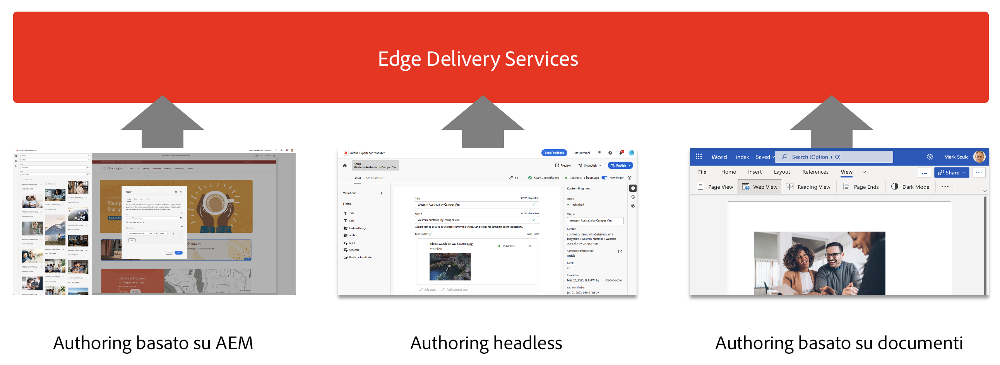
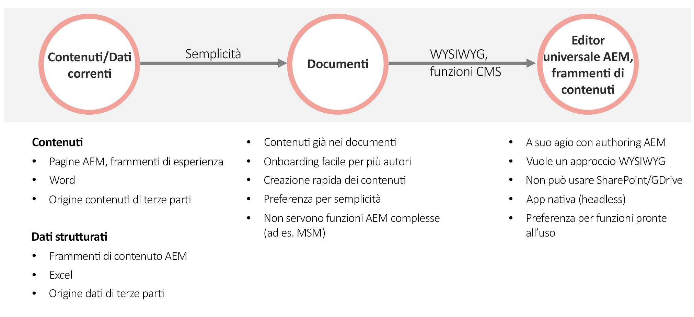

# Utilizzo di Edge Delivery Services con AEM {#using-edge}

Edge Delivery Services è scollegato dall’origine del contenuto, che può acquisire da diverse origini. Ciò significa che puoi lavorare con più origini di contenuto sullo stesso sito web con una pubblicazione fluida e semplificata, indipendentemente dall’origine scelta.

Con Edge Delivery Services, puoi creare ambienti di sviluppo rapido in cui gli autori possono aggiornare e pubblicare rapidamente i contenuti e che consentono il lancio rapido di nuovi siti. In un paio di secondi potrai passare dall’editing al contenuto live in Internet.

L’acquisizione da più origini di contenuto offre all’utente la massima flessibilità. Adobe offre informazioni utili per scegliere le origini di contenuto più adatte al progetto.

In alcuni casi, l’origine di contenuto è predefinita o non è flessibile (ad esempio, il progetto non può utilizzare SharePoint o Google Drive). Ma in molti casi, lo strumento non è preordinato e la scelta dello stesso non è facile.

Il principio guida di Adobe è la semplicità. Inizia con l’authoring basato su documenti e aggiungi complessità quando necessario. Se è necessario cambiare strumento, l’integrazione di Edge Delivery Services di AEM comprende la migrazione dei contenuti.

## Authoring {#authoring-edge}

Con Edge Delivery Services, l’authoring è semplice, veloce e flessibile. Con l’Editor universale è possibile scegliere di eseguire l’authoring basato su documento o basato su AEM.

Per ulteriori informazioni, consulta il documento [Authoring di contenuti per Edge Delivery Services](/help/edge/aem-authoring/authoring.md).

## Pubblicazione {#publishing-edge}

Con Edge Delivery Services, la pubblicazione dei contenuti avviene in modo semplice e diretto, a prescindere dalla loro origine.

Per ulteriori informazioni, consulta il documento [Pubblicazione di contenuti per Edge Delivery Services](/help/edge/aem-authoring/publishing.md).

## Sviluppo {#developing-edge}

Edge Delivery Services si basa sul concetto di blocchi. AEM viene fornito con una libreria completa di blocchi predefiniti che possono essere estesi per soddisfare le esigenze del progetto. Il codice per i progetti di Edge Delivery Services viene gestito in GitHub.

Per ulteriori informazioni, consulta il documento [Guida introduttiva per gli sviluppatori per l’authoring di AEM con Edge Delivery Services](/help/edge/aem-authoring/edge-dev-getting-started.md).

## Progetti AEM esistenti {#existing-projects}

Non occorre aspettare che un nuovo progetto AEM usufruisca di Edge Delivery Services. Edge Delivery Services può essere integrato nel progetto AEM esistente in modo da sfruttare immediatamente i vantaggi in termini di prestazioni.

Per ulteriori informazioni, consulta il documento [Utilizzo di Edge Delivery Services con progetti AEM esistenti](/help/edge/aem-authoring/existing-projects.md).
