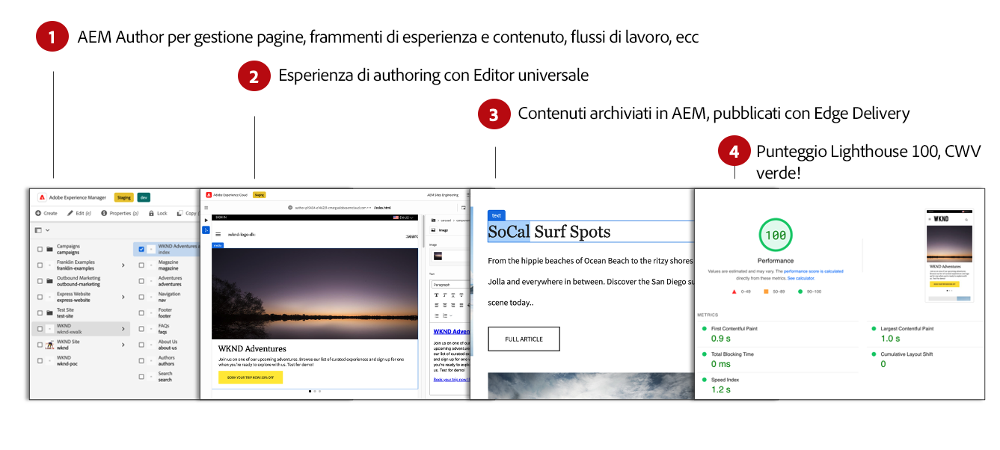
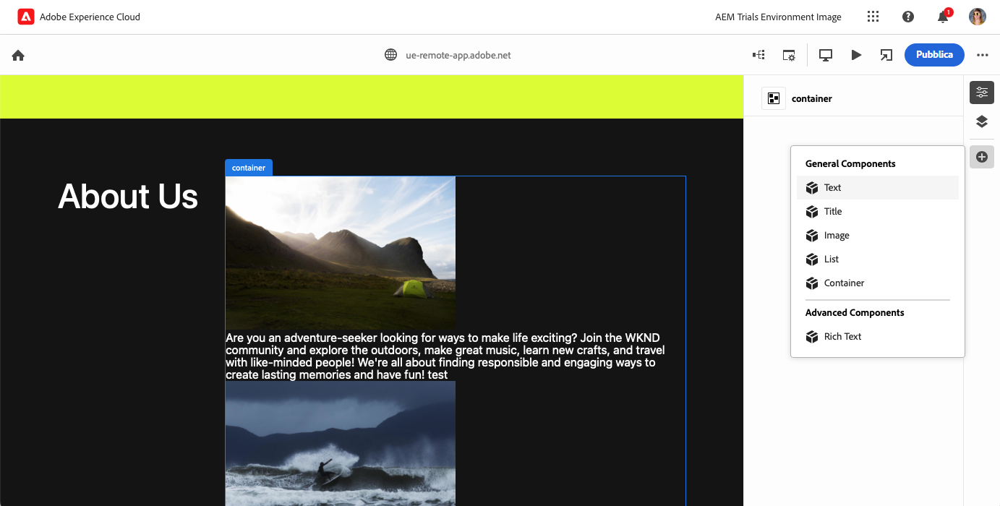

# Authoring dei contenuti WYSIWYG per Edge Delivery Services {#authoring-edge}

Con Edge Delivery Services, l’authoring è semplice, veloce e flessibile. Per creare contenuti per Edge Delivery Services, sono disponibili due opzioni:

* [Editor universale](#universal-editor): un’interfaccia utente moderna per l’authoring dei contenuti WYSIWYG (What-you-see-is-what-you-get)
* [Authoring basato su documenti](#document-based): come Microsoft Word o documenti Google

## Authoring nell’Editor universale {#universal-editor}

Quando utilizzi Edge Delivery Services con AEM as a Cloud Service, l’elemento più importante da comprendere è che il contenuto che crei viene mantenuto in AEM as a Cloud Service.

1. [L’ambiente di AEM Sites](/help/sites-cloud/authoring/quick-start.md) viene utilizzato per la gestione dei contenuti, ad esempio per creare nuove pagine, frammenti esperienza, frammenti di contenuto e così via.
   * Sono disponibili tutte le funzioni di AEM, ad esempio flussi di lavoro, MSM, traduzione, lanci e così via.
1. [L’Editor universale](/help/sites-cloud/authoring/universal-editor/authoring.md) viene utilizzato per creare i contenuti gestiti in AEM.
   * L’Editor universale offre un’interfaccia utente nuova e moderna per l’authoring dei contenuti.
   * Per l’authoring, AEM esegue il rendering dell’HTML ma include gli script, gli stili, le icone e altre risorse di Edge Delivery Services.
   * Anche se viene utilizzato l’Editor universale, tutte le modifiche vengono mantenute in AEM.
   * L’Editor universale non dispone ancora del livello di parità con le funzioni dell’Editor pagina di AEM e alcune funzioni di AEM potrebbero non essere disponibili nell’Editor universale.
1. I contenuti creati con l’Editor universale e che vengono mantenuti in AEM vengono pubblicati in Edge Delivery Services.
   * Il contenuto rimane memorizzato in AEM.
   * AEM esegue il rendering dell’HTML semantico necessario per l’acquisizione.
   * Il contenuto viene pubblicato in Edge Delivery Services.
1. [Edge Delivery Services](/help/edge/developer/keeping-it-100.md) garantisce un punteggio Lighthouse del 100%.

I blocchi sono componenti fondamentali di una pagina distribuita da Edge Delivery Services. Gli autori possono scegliere tra i blocchi predefiniti forniti come standard da Adobe e quelli personalizzati per il progetto dagli sviluppatori.

L’editor universale fornisce un’interfaccia grafica moderna e intuitiva per l’authoring dei contenuti mediante l’aggiunta e la disposizione di blocchi.

I dettagli dei blocchi possono quindi essere configurati nel pannello delle Proprietà.

Per informazioni dettagliate su come utilizzare l’editor universale, consulta il documento [Authoring dei contenuti con l’editor universale](/help/sites-cloud/authoring/universal-editor/authoring.md).

Consulta la [Guida introduttiva per sviluppatori di authoring WYSIWYG con Edge Delivery Services](/help/edge/wysiwyg-authoring/edge-dev-getting-started.md) per scoprire come avviare un proprio progetto per l’authoring di AEM e Edge Delivery Services.

## Metodi di authoring aggiuntivi  {#authoring-methods}

L’authoring WYSIWYG è uno strumento potente e intuitivo per gli autori di contenuti. Tuttavia, esistono molti casi d’uso diversi per l’authoring ed è per questo che AEM offre soluzioni di authoring aggiuntive.

Per ulteriori informazioni sulle soluzioni per l’authoring offerte da AEM, tra cui quello basato su documenti e headless, consulta il documento [Scelta di un metodo di authoring](/help/edge/authoring-methods.md).
