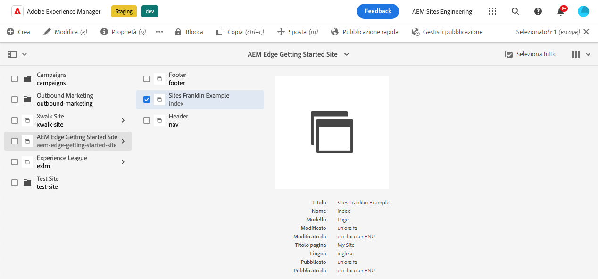
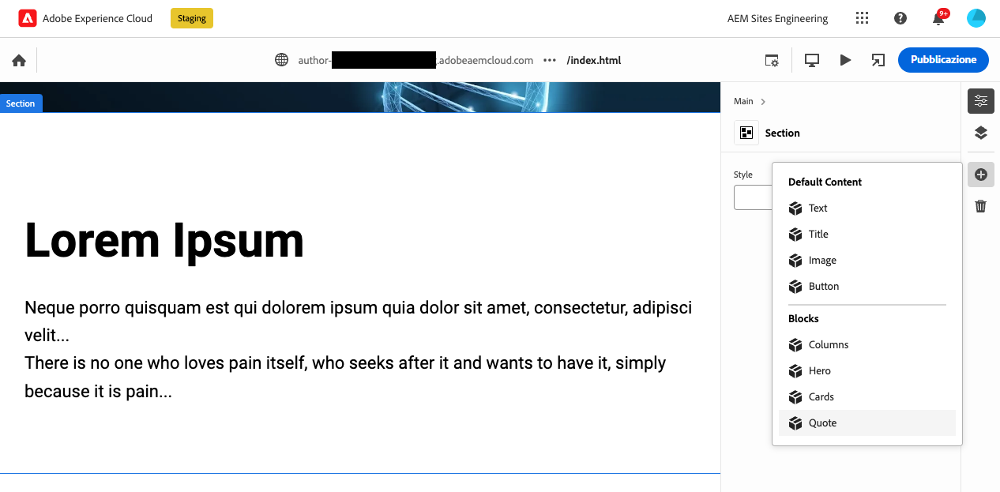
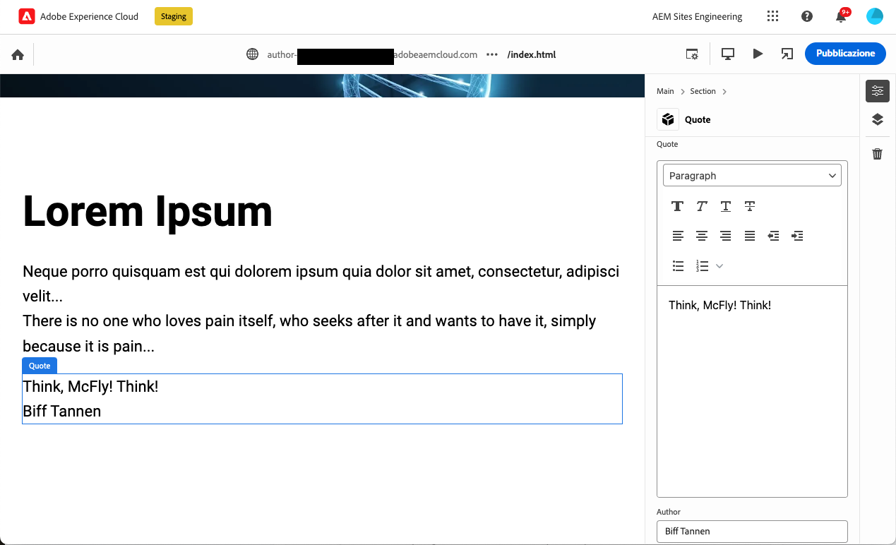
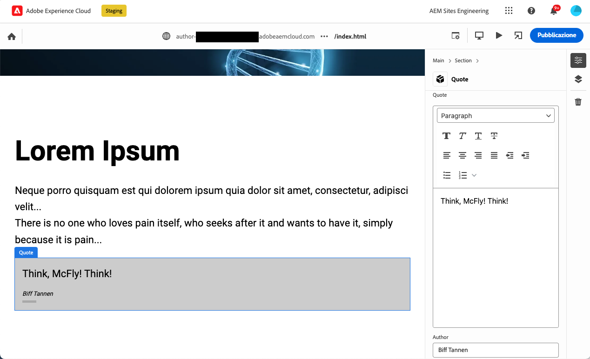

# Creazione di blocchi abilitati per l’utilizzo con l’editor universale {#create-block}

Scopri come creare blocchi abilitati per l’utilizzo con l’editor universale nell’authoring WYSIWYG con progetti di Edge Delivery Services.

## Prerequisiti {#prerequisites}

Questa guida fornisce istruzioni dettagliate su come creare blocchi abilitati per l’editor universale nell’authoring WYSIWYG con progetti di Edge Delivery Services. Include l’aggiunta di componenti, il caricamento delle definizioni dei componenti nell’editor universale, la pubblicazione delle pagine, l’implementazione della decorazione dei blocchi e degli stili, l’introduzione delle modifiche nell’ambiente di produzione e la loro verifica. Al termine di questa guida, potrai creare e distribuire un nuovo blocco per il tuo progetto.

Questa guida richiede necessariamente una conoscenza esistente dell’authoring WYSIWYG con progetti di Edge Delivery Services e con l’editor universale. Prima di iniziare questa guida, dovresti avere già accesso a Edge Delivery Services e conoscere le relative nozioni di base, tra cui:

* Hai completato il [tutorial su Edge Delivery Service](/help/edge/developer/tutorial.md).
* Hai accesso a una [sandbox di AEM Cloud Service](/help/implementing/cloud-manager/getting-access-to-aem-in-cloud/introduction-sandbox-programs.md).
* Hai [attivato dell’editor universale nello stesso ambiente sandbox](/help/implementing/universal-editor/getting-started.md).
* Hai completato la [Guida introduttiva per gli sviluppatori per l’authoring WYSIWYG con Edge Delivery Services](/help/edge/wysiwyg-authoring/edge-dev-getting-started.md).

Questa guida si basa sul lavoro svolto nella [Guida introduttiva per gli sviluppatori per l’authoring WYSIWYG con Edge Delivery Services](/help/edge/wysiwyg-authoring/edge-dev-getting-started.md).

## Aggiunta di un nuovo blocco al progetto {#add-block}

In questa guida, creerai un blocco per il rendering di un preventivo facile da ricordare sulla pagina.

Per semplificare questo esempio, tutte le modifiche vengono apportate al ramo `main` dell’archivio del progetto. Naturalmente, per il tuo progetto effettivo, [dovresti seguire le best practice di sviluppo](https://www.aem.live/docs/dev-collab-and-good-practices) sviluppando su un ramo diverso e rivedendo tutte le modifiche tramite richiesta pull prima dell’unione con `main`.

Adobe consiglia di sviluppare blocchi in un approccio in tre fasi:

1. Creare la definizione e il modello per il blocco, rivederlo e portarlo in produzione.
1. Crea contenuto con il nuovo blocco.
1. Implementa la decorazione e gli stili per il nuovo blocco.

Il seguente esempio di blocco citazione segue questo approccio.

### Crea modello e definizione di blocco {#create-block-model}

1\. Clona localmente il progetto GitHub che hai creato nella [Guida introduttiva per sviluppatori per l’authoring WYSIWYG con Edge Delivery Services](/help/edge/wysiwyg-authoring/edge-dev-getting-started.md) e aprilo in un editor a tua scelta.

* Il codice Microsoft viene utilizzato qui a scopo illustrativo.


2\. Modifica del file [`component-definition.json` ](/help/implementing/universal-editor/component-definition.md) nella directory principale del progetto e aggiungere la seguente definizione per il nuovo blocco citazione e salvare il file.

>[!BEGINTABS]

>[!TAB Esempio JSON]

```json
{
  "title": "Quote",
  "id": "quote",
  "plugins": {
    "xwalk": {
      "page": {
        "resourceType": "core/franklin/components/block/v1/block",
        "template": {
          "name": "Quote",
          "model": "quote",
          "quote": "<p>Think, McFly! Think!</p>",
          "author": "Biff Tannen"
        }
      }
    }
  }
}
```

>[!TAB Schermata]


>[!ENDTABS]

3\. Modifica il file `component-models.json` nella directory principale del progetto e aggiungi la seguente [definizione del modello](/help/implementing/universal-editor/field-types.md#model-structure) per il nuovo blocco citazione e salva il file.

* Per ulteriori informazioni su quello che è importante considerare durante la creazione di modelli di contenuto, consulta il documento [Modellazione dei contenuti per l’authoring WYSIWYG con progetti Edge Delivery Services](/help/edge/wysiwyg-authoring/content-modeling.md).

>[!BEGINTABS]

>[!TAB Esempio JSON]

```json
{
  "id": "quote",
  "fields": [
     {
       "component": "richtext",
       "name": "quote",
       "value": "",
       "label": "Quote",
       "valueType": "string"
     },
     {
       "component": "text",
       "valueType": "string",
       "name": "author",
       "label": "Author",
       "value": ""
     }
   ]
}
```

>[!TAB Schermata]


>[!ENDTABS]

4\. Modifica del file [`component-filters.json` ](/help/implementing/universal-editor/filtering.md) nella directory principale del progetto e aggiungi il blocco citazione alla [definizione di filtro](/help/implementing/universal-editor/filtering.md) per consentire l’aggiunta del blocco a qualsiasi sezione e salvare il file.

>[!BEGINTABS]

>[!TAB Esempio JSON]

```json
{
  "id": "section",
  "components": [
    "text",
    "image",
    "button",
    "title",
    "hero",
    "cards",
    "columns",
    "quote"
   ]
}
```

>[!TAB Schermata]


>[!ENDTABS]

5\. Utilizzando Git, conferma queste modifiche nel ramo `main`.

* La conferma di `main` è solo a scopo illustrativo. [Segui le best practice](https://www.aem.live/docs/dev-collab-and-good-practices) e utilizza una richiesta pull per il lavoro di progetto effettivo.

### Creare contenuti con il blocco {#create-content}

Dopo aver definito e confermato il blocco del preventivo di base nel progetto di esempio, è possibile aggiungere un blocco citazione a una pagina esistente.

1. In un browser, accedi a AEM as a Cloud Service. [Utilizzando la console Sites](/help/sites-cloud/authoring/basic-handling.md), passa al sito creato nella [Guida introduttiva per sviluppatori per l’authoring WYSIWYG con Edge Delivery Services](/help/edge/wysiwyg-authoring/edge-dev-getting-started.md) e seleziona una pagina.

   * In questo caso, `index` viene utilizzato a scopo illustrativo.

   

1. Tocca o fai clic su **Modifica** nella barra degli strumenti della console e l’editor universale si aprirà.

   * Per caricare la pagina, potrebbe essere necessario toccare o fare clic su **Accedi con Adobe** per autenticarsi ad AEM nell’editor universale.

1. Nell’editor universale, seleziona una sezione. Nella barra delle proprietà, tocca o fai clic sull’icona **Aggiungi** e quindi seleziona il nuovo blocco **Citazione** dal menu.

   * L’icona **Aggiungi** è un simbolo più.
   * Sai di aver selezionato una sezione se il contorno blu dell’oggetto selezionato presenta una scheda etichettata come **Sezione**.
   * In questo esempio, toccando o facendo clic leggermente sopra l’intestazione **Lorem Ipsum** viene selezionata una sezione contenente l’intestazione e il testo lorem ipsum.

   

1. La pagina viene ricaricata e il blocco della citazione viene aggiunto nella parte inferiore della sezione selezionata con il contenuto predefinito specificato nel file `component-definitions.json`.

   * Il blocco della citazione può essere selezionato e modificato come qualsiasi altro blocco nella stessa posizione o nel pannello delle proprietà.
   * Lo stile viene applicato in un passaggio successivo.

   

1. Quando sei soddisfatto del contenuto della citazione, puoi pubblicare la pagina toccando o facendo clic sul pulsante **Pubblica** nella barra degli strumenti dell’editor universale.

1. Verifica che il contenuto sia stato pubblicato passando alla pagina pubblicata. Il collegamento sarà simile a `https://<branch>--<repo>--<owner>.aem.page`

   

### Applicare uno stile al blocco {#style-block}

Ora che disponi di un blocco della citazione di lavoro puoi applicare ad esso lo stile.

1\. Torna all’editor per il progetto.

2\. Crea una cartella `quote` sotto la cartella `blocks`.


3\. Nella nuova cartella delle `quote`, aggiungi un file delle `quote.js` per implementare il blocco decorativo aggiungendo il seguente JavaScript e salva il file.

>[!BEGINTABS]

>[!TAB Esempio JavaScript]

```javascript
export default function decorate(block) {
  const [quoteWrapper] = block.children;
 
  const blockquote = document.createElement('blockquote');
  blockquote.textContent = quoteWrapper.textContent.trim();
  quoteWrapper.replaceChildren(blockquote);
}
```

>[!TAB Schermata]


>[!ENDTABS]

4\. Nella cartella delle `quote`, aggiungi un file delle `quote.css` per definire lo stile del blocco aggiungendo il seguente codice CSS e salva il file.

>[!BEGINTABS]

>[!TAB Esempio CSS]

```css
.block.quote {
    background-color: #ccc;
    padding: 0 0 24px;
    display: flex;
    flex-direction: column;
    margin: 1rem 0;
}
 
.block.quote blockquote {
    margin: 16px;
    text-indent: 0;
}
 
.block.quote > div:last-child > div {
    margin: 0 16px;
    font-size: small;
    font-style: italic;
    position: relative;
}
 
.block.quote > div:last-child > div::after {
    content: "";
    display: block;
    position: absolute;
    left: 0;
    bottom: -8px;
    height: 5px;
    width: 30px;
    background-color: darkgray;
}
```

>[!TAB Schermata]


>[!ENDTABS]

5\. Utilizzando Git, conferma queste modifiche nel ramo `main`.

* La conferma di `main` è solo a scopo illustrativo. [Segui le best practice](https://www.aem.live/docs/dev-collab-and-good-practices) e utilizza una richiesta pull per il lavoro di progetto effettivo.

6\. Torna alla scheda del browser dell’editor universale in cui stavi modificando la pagina del progetto e ricarica la pagina per visualizzare il blocco con lo stile.

7\. Visualizza il blocco delle citazioni ora formattato sulla pagina.



8\. Verifica che le modifiche siano state inviate alla produzione passando alla pagina pubblicata. Il collegamento sarà simile a `https://<branch>--<repo>--<owner>.aem.page`


Congratulazioni Ora disponi di un blocco delle citazioni completamente funzionante e formattato. Puoi utilizzare questo esempio come base per progettare blocchi specifici per il progetto.

### Opzioni di blocco {#block-options}

Se un blocco deve avere un aspetto o un comportamento leggermente diverso a seconda di determinate circostanze, ma non abbastanza diverso da diventare un nuovo blocco in sé, puoi consentire agli autori di scegliere tra le [opzioni di blocco](content-modeling.md#type-inference).

Aggiungendo una proprietà `classes` al blocco, quella di cui è stato eseguito il rendering nell’intestazione della tabella per i blocchi semplici o come elenco di valori per gli elementi in un blocco contenitore.

```json
{
  "id": "simpleMarquee",
  "fields": [
    {
      "component": "text",
      "valueType": "string",
      "name": "marqueeText",
      "value": "",
      "label": "Marquee text",
      "description": "The text you want shown in your marquee"
    },
    {
      "component": "select",
      "name": "classes",
      "value": "",
      "label": "Background Color",
      "description": "The marquee background color",
      "valueType": "string",
      "options": [
        {
          "name": "Red",
          "value": "bg-red"
        },
        {
          "name": "Green",
          "value": "bg-green"
        },
        {
          "name": "Blue",
          "value": "bg-blue"
        }
      ]
    }
  ]
}
```

## Utilizzo di altri rami di lavoro {#other-branches}

Con questa guida hai eseguito la conferma direttamente nel ramo `main` per semplicità. La sperimentazione in un archivio di esempio in genere non è un problema. Per il lavoro effettivo del progetto, [dovresti seguire le best practice di sviluppo](https://www.aem.live/docs/dev-collab-and-good-practices) sviluppando in un ramo diverso e rivedendo tutte le modifiche tramite richiesta pull prima di unire nel `main`.

Se non stai sviluppando nel ramo `main`, puoi aggiungere `?ref=<branch>` nella barra di posizione dell’editor universale per caricare la pagina dal ramo. `<branch>` è il nome del ramo utilizzato per l’anteprima del progetto o gli URL live, ad esempio `https://<branch>--<repo>--<owner>.aem.page`.

## Riutilizzo dei blocchi per l’authoring basato su documenti {#reusing-blocks}

Se aderisci allo stesso modello di contenuto, puoi utilizzare i blocchi creati per l’authoring WYSIWYG utilizzando l’editor universale per l’authoring basato su documenti.

Per ulteriori informazioni, consulta il documento [Blocchi per WYSIWYG e authoring basato su documenti](/help/edge/wysiwyg-authoring/wysiwyg-doc-blocks.md).

## Passaggi successivi {#next-steps}

Ora che sai come creare i blocchi, è fondamentale comprendere come modellare i contenuti in modo semantico per ottenere un’esperienza di sviluppo più snella.

Per scoprire come funziona la modellazione dei contenuti per l’authoring WYSIWYG con i progetti Edge Delivery Services, consulta il documento [Modellazione dei contenuti per l’authoring WYSIWYG con progetti Edge Delivery Services](/help/edge/wysiwyg-authoring/content-modeling.md).

>[!TIP]
>
>Per una guida completa sulla creazione di un nuovo progetto Edge Delivery Services abilitato per l’authoring WYSIWYG con AEM as a Cloud Service come origine dei contenuti, guarda [questo webinar della serie AEM GEMs](https://experienceleague.adobe.com/it/docs/events/experience-manager-gems-recordings/gems2024/aem-authoring-and-edge-delivery).
