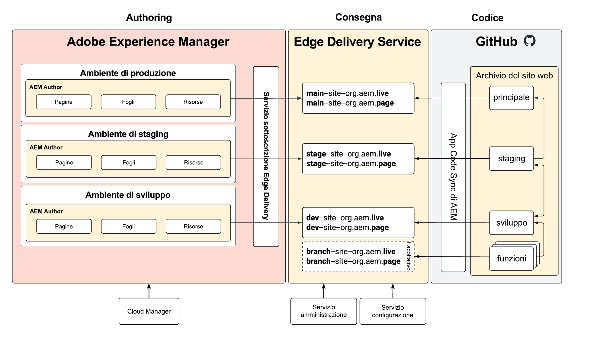

# Ambienti di produzione e staging senza archivio {#repoless-stage-prod}

Scopri come impostare siti separati per gli ambienti di staging e di produzione sfruttando un’unica base di codice in modalità senza archivio.

## Panoramica {#overview}

È possibile impostare un sito per l’ambiente di produzione separato dall’ambiente di staging. L’impostazione di un secondo sito per una configurazione separata di staging e di produzione è simile alla [configurazione richiesta per la gestione di più siti](/help/edge/wysiwyg-authoring/repoless-msm.md). Infatti, può essere combinata con le strutture del sito MSM se necessario.

Questo documento utilizza l’esempio tipico di ambienti di staging e di produzione separati. Puoi creare ambienti separati per qualsiasi ambiente.

## Requisiti {#requirements}

Per configurare gli ambienti di staging e di produzione senza archivio, è necessario prima completare le seguenti attività:

* In questo documento si presuppone che sia già stato creato un sito per il progetto in base alla [Guida introduttiva per sviluppatori per l’authoring di WYSIWYG con Edge Delivery Services.](/help/edge/wysiwyg-authoring/edge-dev-getting-started.md)
* Devi avere già [abilitato la funzionalità senza archivio per il progetto.](/help/edge/wysiwyg-authoring/repoless.md)

## Configurazione {#configuration}

Questo documento descrive come impostare un sito di produzione separato per il progetto utilizzando la stessa base di codice. Vengono effettuate le seguenti ipotesi.

* Il sito di staging è già configurato e ora desideri creare una configurazione per il sito di produzione.
* La struttura del contenuto nell’authoring AEM è simile.
* Le stesse mappature percorsi verranno utilizzate per staging e produzione.

In questo esempio, si presume che sia già stato creato un sito di produzione per il progetto denominato WKND, il cui archivio GitHub è anche denominato WKND.

Esistono due passaggi per configurare un sito di produzione separato.

1. [Creare nuovi siti Edge Delivery Services per l’ambiente di produzione](#create-edge-site).
1. [Aggiornare la configurazione cloud in AEM per il sito di produzione](#update-cloud-configuration).

### Creare nuovi siti Edge Delivery Services per l’ambiente di produzione {#create-edge-site}

1. Recupera il token di autenticazione e l’account tecnico per il programma.
   * Per informazioni dettagliate su come [ottenere il token di accesso](/help/edge/wysiwyg-authoring/repoless.md#access-token) e l’account tecnico[ del programma, consulta il documento **Riutilizzare il codice in siti diversi**.](/help/edge/wysiwyg-authoring/repoless.md#access-control)
1. Crea un nuovo sito effettuando la seguente chiamata al servizio di configurazione. Tieni presente che:
   * il nome del progetto nell’URL POST deve essere il nuovo nome del sito che stai creando. In questo esempio è `wknd-prod`.
   * La configurazione di `code` deve essere la stessa utilizzata per la creazione del progetto iniziale.
   * `content` > `source` > `url` deve essere adattato al nome del nuovo sito che stai creando. In questo esempio è `wknd-prod`.
   * Ad esempio, il nome del sito nell’URL POST e `content` > `source` > `url` devono essere uguali.
   * Adatta il blocco `admin` per definire gli utenti che devono disporre di accesso amministrativo completo al sito.
      * Si tratta di un array di indirizzi e-mail.
      * È possibile utilizzare il carattere jolly `*`.
      * Per ulteriori informazioni, consulta il documento [Configurazione dell’autenticazione per gli autori](https://www.aem.live/docs/authentication-setup-authoring#default-roles).

   ```text
   curl --request POST \
     --url https://admin.hlx.page/config/<your-github-org>/sites/wknd-prod.json \
     --header 'x-auth-token: <your-token>' \
     --header 'Content-Type: application/json' \
     --data '{
       "code": {
           "owner": "<your-github-org>",
           "repo": "wknd",
           "source": {
               "type": "github",
               "url": "https://github.com/<your-github-org>/wknd"
           }
       },
       "content": {
           "source": {
               "url": "https://author-p<programID>-e<environmentID>.adobeaemcloud.com/bin/franklin.delivery/<your-github-org>/wknd-prod/main",
               "type": "markup",
               "suffix": ".html"
           }
       },
       "access": {
           "admin": {
               "role": {
                   "admin": [
                       "<email>@<domain>.<tld>"
                   ],
                   "config_admin": [
                       "<tech-account-id>@techacct.adobe.com"
                   ]
               },
               "requireAuth": "auto"
           }
       }
   }'
   ```

1. Aggiungi la mappatura del percorso per il nuovo sito effettuando la seguente chiamata al servizio di configurazione.

   ```text
   curl --request POST \
     --url https://admin.hlx.page/config/<your-github-org>/sites/wknd-prod/public.json \
     --header 'x-auth-token: <your-token>' \
     --header 'Content-Type: application/json' \
     --data '{
       "paths": {
           "mappings": [
               "/content/wknd/:/"
           ],
           "includes": [
               "/content/wknd/"
           ]
       }
   }'
   ```

Verifica che la configurazione pubblica del nuovo sito funzioni chiamando `https://main--wknd-prod--<your-github-org>.aem.page/config.json` e verificando il contenuto del file JSON restituito.

### Aggiornare le configurazioni cloud in AEM per il sito di produzione {#update-cloud-configuration}

Il sito AEM di produzione deve essere configurato per utilizzare i nuovi siti Edge Delivery creati nella sezione precedente per un sito di produzione dedicato. In questo esempio, il contenuto in `/content/wknd` dell’ambiente di produzione deve sapere come utilizzare il sito `wknd-prod` creato.

1. Accedi all’istanza di produzione AEM e passa a **Strumenti** -> **Servizi cloud** -> **Configurazione Edge Delivery Services**.
1. Seleziona la configurazione creata automaticamente per il progetto.
1. Nella barra degli strumenti, tocca o fai clic su **Proprietà**.
1. Nella finestra **Configurazione Edge Delivery Services**:
   * Fornisci l’organizzazione GitHub nel campo **Organizzazione**.
   * Modifica il nome del sito nel nome del sito che hai creato nella sezione precedente. In questo caso, sarebbe `wknd-prod`.
   * Cambia il tipo di progetto in **aem.live con configurazione senza archivio**.
1. Tocca o fai clic su **Salva e chiudi**.

## Verificare la configurazione {#verify}

Dopo aver apportato tutte le modifiche di configurazione necessarie, verifica che tutto funzioni come previsto.

1. Accedi all’istanza di authoring AEM.
1. Passa alla **console Sites** da **Navigazione** -> **Sites**.
1. Seleziona una pagina del sito.
1. Nella barra degli strumenti, tocca o fai clic su **Modifica**.
1. Assicurati che la pagina esegua il rendering correttamente nell’editor universale e utilizzi lo stesso codice della directory principale del sito.
1. Apporta una modifica alla pagina e ripubblicala.
1. Visita il nuovo sito Edge Delivery Services per quella pagina all’indirizzo `https://main--wknd-prod--<your-github-org>.aem.page`.

Se vengono visualizzate le modifiche apportate, la configurazione separata del sito di produzione funziona correttamente.

## Utilizzo {#usage}

Dopo aver configurato il progetto con gli ambienti di staging e di produzione senza archivio, puoi gestire il codice per tali ambienti in modo indipendente. Il diagramma seguente illustra la relazione del contenuto nei vari ambienti in AEM, nei siti Edge Delivery Services e negli archivi GitHub.


