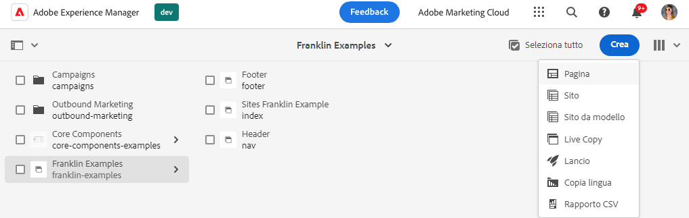
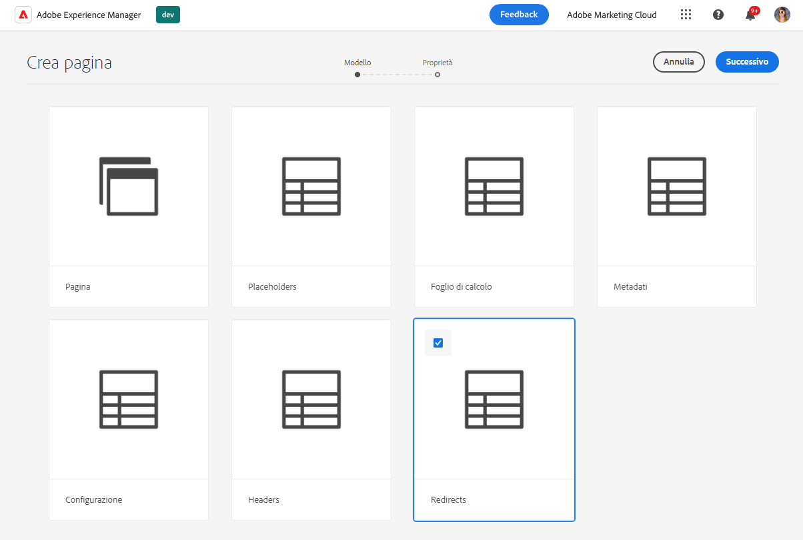
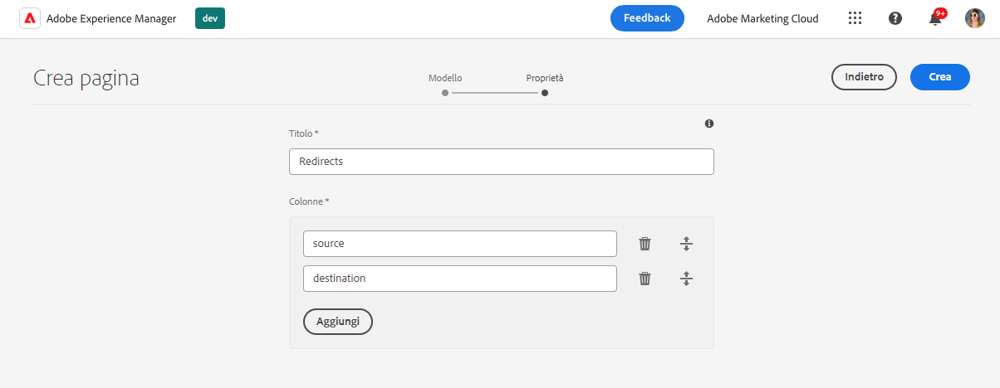
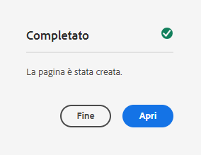
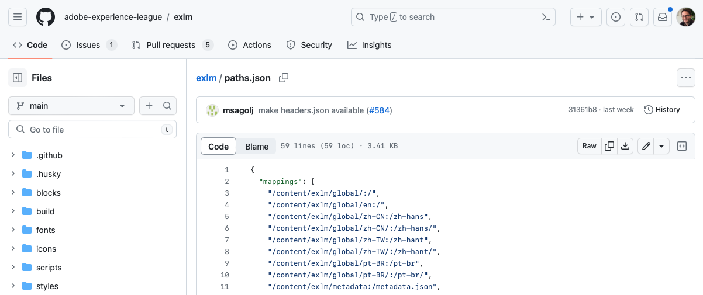
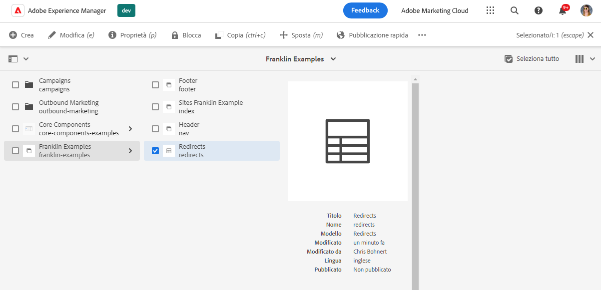
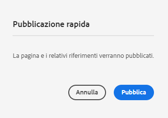
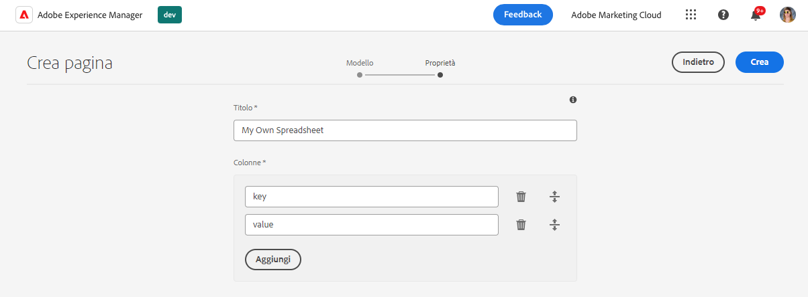

# Utilizzo dei fogli di calcolo per gestire i dati tabulari {#tabular-data}

Scopri come utilizzare i fogli di calcolo per gestire i dati tabulari per vari valori, come metadati e reindirizzamenti per AEM con il sito Edge Delivery Services.

## Casi d’uso {#use-cases}

Per qualsiasi sito AEM con Edge Delivery Services, è necessario mantenere elenchi di dati tabulari, ad esempio per le mappature chiave-valore. Possono essere elenchi di molti valori diversi, ad esempio metadati e reindirizzamenti. Edge Deliver Services consente di mantenere tali elenchi tabulari utilizzando uno strumento intuitivo: il foglio di calcolo. AEM traduce questi fogli di calcolo in file JSON che possono essere facilmente utilizzati dal sito web o dall’applicazione web.

I casi d’uso comuni includono:

* [Segnaposto](/help/edge/docs/placeholders.md)
* [Metadati](/help/edge/docs/bulk-metadata.md)
* [Intestazioni](/help/edge/docs/custom-headers.md)
* [Reindirizzamenti](/help/edge/docs/redirects.md)
* [Configurazioni](/help/edge/docs/setup-byo-cdn-push-invalidation.md) come per le impostazioni CND

Inoltre, è possibile [creare i fogli di calcolo](#own-spreadsheet) di qualsiasi struttura per memorizzare le mappature per le tue finalità.

Questo documento utilizza l’esempio dei reindirizzamenti per illustrare come creare tali fogli di calcolo. Per informazioni dettagliate su ciascun caso d’uso, consulta gli argomenti precedentemente collegati nella documentazione di Edge Delivery Services.

>[!TIP]
>
>Per ulteriori informazioni sul funzionamento generale dei fogli di calcolo con Edge Delivery Services, consulta il documento [Fogli di calcolo e JSON](/help/edge/developer/spreadsheets.md).

>[!TIP]
>
>I fogli di calcolo devono essere utilizzati solo per conservare i dati tabulari. Per l’archiviazione di dati strutturati, [approfondisci le funzionalità headless di AEM](/help/headless/introduction.md).

## Prerequisiti {#prerequisites}

Per creare mappature utilizzando i fogli di calcolo nel progetto AEM con Edge Delivery Services, è necessario aver creato il sito utilizzando il relativo modello più recente.

Per ulteriori informazioni, consulta il documento [Guida introduttiva per gli sviluppatori per l’authoring WYSIWYG con Edge Delivery Services](/help/edge/wysiwyg-authoring/edge-dev-getting-started.md).

## Creazione di un foglio di calcolo {#spreadsheet}

In questo esempio verrà creato un foglio di calcolo per gestire i reindirizzamenti per il sito AEM con Edge Delivery Services. Gli stessi passaggi si applicano ad [altri tipi di fogli di calcolo](#other) che desideri creare.

1. Accedi all’istanza di authoring as a Cloud Service di AEM, vai alla console **Sites** e passa alla directory principale del sito che richiede un foglio di calcolo. Tocca o fai clic su **Crea** -> **Pagina**.

   

1. Nella scheda **Modello** della procedura guidata Crea pagina, tocca o fai clic sul modello **Reindirizzamenti** per selezionarlo, quindi tocca o fai clic su **Successivo**.

   

1. La scheda **Proprietà** della procedura guidata presenta i valori predefiniti per il foglio di calcolo dei reindirizzamenti. Tocca o fai clic su **Crea**.

   * **Titolo**: lascia questo valore invariato.
   * **Colonne**: le colonne minime necessarie per i reindirizzamenti sono precompilate.
      * **sorgente**: pagina da reindirizzare
      * **destinazione**: pagina a cui reindirizzare

   

1. Nella finestra di dialogo **Completato**, tocca o fai clic su **Apri**.

   

1. Si apre una nuova scheda con il foglio di calcolo caricato in un editor con le colonne predefinite **sorgente** e **destinazione**. Per definire i reindirizzamenti, tocca o fai clic sulla riga vuota della colonna **sorgente**. Le modifiche vengono salvate automaticamente durante la modifica del foglio di calcolo.

   

   * La **sorgente** è relativa al dominio del sito web, quindi contiene solo il percorso relativo.
   * La **destinazione** può essere un URL completo se stai reindirizzando a un sito web diverso, o può essere un percorso relativo se stai reindirizzando all’interno del tuo sito web.
   * Utilizza il tasto Tab per spostarti sulla cella successiva.
   * Se necessario, l’editor aggiunge nuove righe al foglio di calcolo.
   * Per eliminare o spostare una riga, utilizza l’icona **Elimina** alla fine di ogni riga e le maniglie di trascinamento all’inizio di ogni riga, rispettivamente.

## Importazione di dati da un foglio di calcolo {#importing}

Oltre a modificare i fogli di calcolo nell’Editor pagina di AEM, puoi anche importare dei dati da un file CSV.

1. Durante la modifica del foglio di calcolo in AEM, tocca o fai clic sul pulsante **Carica** in alto a sinistra.
1. Nell’elenco a discesa, seleziona la modalità di importazione dei dati.
   * **Sostituisci documento** per sostituire il contenuto dell’intero foglio di calcolo con il contenuto del file CSV che verrà caricato.
   * **Aggiungi al documento** per aggiungere i dati del file CSV che verranno caricati nel contenuto del foglio di calcolo esistente.
1. Nella finestra di dialogo visualizzata, seleziona il file CSV, quindi tocca o fai clic su **Apri**.

Durante l’elaborazione dell’importazione, viene visualizzata una finestra di dialogo. Al termine, i dati del file CSV vengono aggiunti o sostituiti al contenuto del foglio di calcolo. Se si verificano errori, ad esempio una mancata corrispondenza delle colonne, questi vengono segnalati in modo da poter correggere il file CSV.

>[!NOTE]
>
>* Le intestazioni nel file CSV devono corrispondere esattamente alle colonne nel foglio di calcolo.
>* L’importazione dell’intero file CSV non modifica le intestazioni di colonna, ma solo le righe del contenuto.
>* Se devi aggiornare le colonne, devi farlo nell’Editor pagina di AEM prima di importare il file CSV.
>* È possibile importare file CSV con una dimensione massima di 10 MB.

A seconda della modalità (`mode`) selezionata, è possibile anche creare (`create`), sostituire (`replace`) o aggiungere (`append`) ai fogli di calcolo utilizzando un CSV e un comando cURL simile al seguente.

```text
curl --request POST \
  --url http://<aem-instance>/bin/asynccommand \
  --header 'content-type: multipart/form-data' \
  --form file=@/path/to/your.csv \
  --form spreadsheetPath=/content/<your-site>/<your-spreadsheet> \
  --form 'spreadsheetTitle=Your Spreadsheet' \
  --form cmd=spreadsheetImport \
  --form operation=asyncSpreadsheetImport \
  --form _charset_=utf-8 \
  --form mode=append
```

La chiamata restituisce una pagina HTML con informazioni sull’ID del processo.

```text
Message | Job(Id:2024/9/18/15/27/5cb0cacc-585d-4176-b018-b684ad2dfd02_90) created successfully. Please check status at Async Job Status Navigation.
```

[Puoi utilizzare la console **Processi**](/help/operations/asynchronous-jobs.md) per visualizzare lo stato del processo o utilizzare l’ID restituito per eseguire una query.

```text
https://<aem-instance>/bin/asynccommand?optype=JOBINF&jobid=2024/10/24/14/1/8da63f9e-066b-4134-95c9-21a9c57836a5_1
```

## Pubblicazione di un foglio di calcolo paths.json {#paths-json}

Affinché AEM possa pubblicare i dati nel foglio di calcolo, è inoltre necessario aggiornare il file `paths.json` del progetto.

1. Apri la directory principale del progetto in GitHub.

1. Tocca o fai clic sul file `paths.json` per aprirne i dettagli e quindi l’icona **Modifica**.

   

1. Aggiungi una riga per mappare il nuovo foglio di calcolo su una risorsa `redirects.json`.

   ```json
   {
     "mappings": [
      "/content/<site-name>/:/",
      "/content/<site-name>/redirects:/redirects.json"
     ]
   }
   ```

   >[!NOTE]
   >
   >Questa voce `paths.json` si basa sull’esempio di creazione di reindirizzamenti utilizzando dati tabulari. Assicurati di aggiornare il percorso appropriato per il [tipo di foglio di calcolo che stai creando](#other).

1. Fai clic su **Conferma modifiche...** per salvare le modifiche apportate a `main`.

   * Conferma `main` o crea una richiesta di pull in base al processo.

1. Dopo aver definito i reindirizzamenti e aggiornato la mappatura del percorso, torna alla console **Sites**.

1. Tocca o fai clic per selezionare il foglio di calcolo dei reindirizzamenti creato nella console, quindi tocca o fai clic su **Pubblicazione rapida** nella barra delle azioni per pubblicare il foglio di calcolo.

   

1. Nella finestra di dialogo **Pubblicazione rapida**, tocca o fai clic su **Pubblica**.

   

1. Un banner conferma la pubblicazione.

   

Il foglio di calcolo dei reindirizzamenti ora è pubblicato e accessibile al pubblico.

>[!TIP]
>
>Per ulteriori informazioni sulle mappature dei percorsi, consulta il documento [Mappatura percorsi per Edge Delivery Services](/help/edge/wysiwyg-authoring/path-mapping.md).

## Altri tipi di fogli di calcolo {#other}

Ora che sai come creare un foglio di calcolo di reindirizzamento, puoi creare qualsiasi altro tipo di foglio di calcolo standard:

* [Segnaposto](https://www.aem.live/docs/placeholders)
* [Metadati](https://www.aem.live/docs/bulk-metadata)
* [Intestazioni](https://www.aem.live/docs/custom-headers)
* [Configurazione](https://www.aem.live/docs/configuration) - Ad esempio per [invalidazione della cache](https://www.aem.live/docs/byo-cdn-adobe-managed#setup-push-invalidation)
* [Tassonomia](/help/edge/wysiwyg-authoring/taxonomy.md)

Segui semplicemente gli stessi passaggi descritti nelle sezioni [Crea foglio di calcolo](#spreadsheet) e [Aggiorna paths.json](#paths-json), scegli il modello appropriato e aggiorna il file `paths.json` in modo appropriato.

Per [Configurazione](https://www.aem.live/docs/configuration), [Intestazioni](https://www.aem.live/docs/custom-headers) e [Metadati](https://www.aem.live/docs/bulk-metadata) assicurati di aggiungere una mappatura per pubblicarli nelle loro posizioni predefinite:

* Configurazione: `/.helix/config.json`
* Intestazioni: `/.helix/headers.json`
* Metadati: `/metadata.json`
* Tassonomia: per ulteriori informazioni, consulta il documento [Gestione dei dati di tassonomia](/help/edge/wysiwyg-authoring/taxonomy.md).

Inoltre, è possibile [creare un foglio di calcolo personalizzato](#own-spreadsheet) con colonne arbitrarie per uso personale.

>[!NOTE]
>
>Non è necessario creare un foglio di calcolo per gestire l’indicizzazione per i progetti AEM as a Cloud Service con i progetti Edge Delivery Services.
>
>Se desideri creare indici personalizzati, [segui questa documentazione](https://www.aem.live/developer/indexing#setting-up-more-index-configurations) per creare il file `helix-query.yaml`.

## Creazione di un proprio foglio di calcolo {#own-spreadsheet}

1. Segui gli stessi passaggi descritti nella sezione [Creare un foglio di calcolo](#spreadsheet).

1. Quando selezioni il modello, scegli **Foglio di calcolo**.

1. Nella scheda **Proprietà** della procedura guidata, è possibile aggiungere colonne personalizzate.

   

   * Nella sezione **Colonne**, tocca o fai clic su **Aggiungi** per aggiungere una nuova colonna.
   * Fornisci un nome per la colonna.
   * Rimuovi o riorganizza le colonne utilizzando **Elimina** e trascina le icone delle maniglie, rispettivamente.

1. Crea il foglio di calcolo e pubblicalo seguendo le istruzioni del foglio di calcolo dei reindirizzamenti.

1. Aggiungi una mappatura al file `paths.json` come indicato nelle istruzioni per il foglio di calcolo dei reindirizzamenti.

