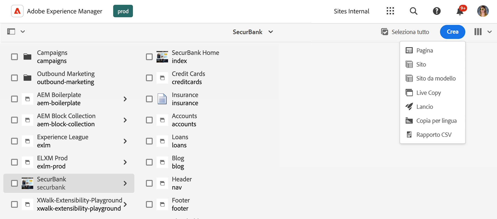
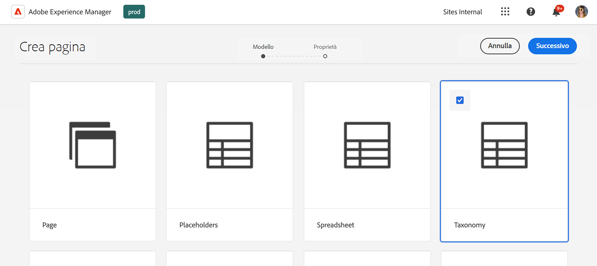
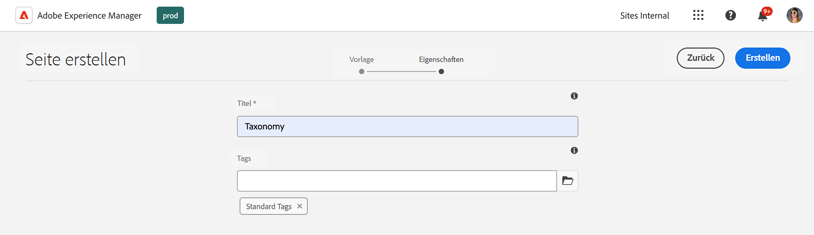
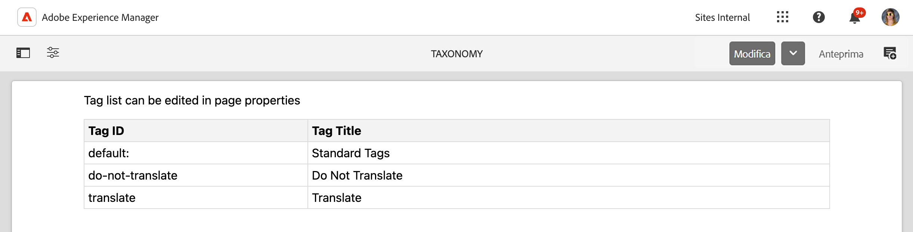
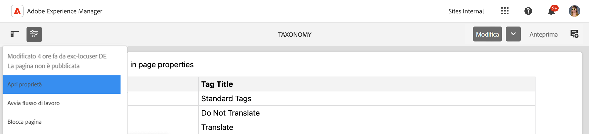
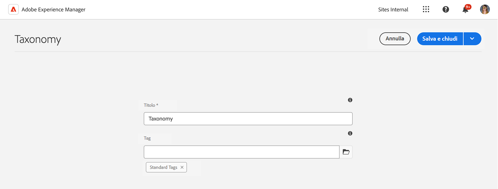

# Gestione dei dati di tassonomia {#managing-taxonomy-data}

Scopri come gestire i dati di tassonomia per utilizzare i tag in AEM con i siti Edge Delivery Services.

## Introduzione {#introduction}

L’assegnazione tag è una funzione importante che consente di organizzare e gestire le pagine. [La console Assegnazione tag](/help/sites-cloud/administering/tags.md#tagging-console) in AEM consente di creare una tassonomia avanzata dei tag per organizzare le pagine.

Questi tag sono utili non solo per te e i tuoi autori nell’organizzazione dei contenuti, ma possono anche essere utili per i tuoi lettori. I tag e la relativa tassonomia possono essere utilizzati nei componenti della pagina per facilitare la navigazione del contenuto da parte dei lettori.

L’editor universale funziona solo con gli ID dei tag. Creando una pagina di tassonomia per il contenuto, è possibile esporre le descrizioni di questi tag in tutte le lingue all’editor universale in modo che possa utilizzare tali informazioni durante il rendering del contenuto.

>[!TIP]
>
>Per ulteriori informazioni sul campo Tag di AEM disponibile per l’editor universale, che può essere utilizzato con la tassonomia, consulta il documento [Definizioni di modello, campi e tipi di componenti](/help/implementing/universal-editor/field-types.md).

## Creazione di una pagina di tassonomia {#creating}

Una tassonomia viene creata come [qualsiasi altra pagina in AEM](/help/sites-cloud/authoring/sites-console/creating-pages.md).

1. Passa alla console [**Sites**](/help/sites-cloud/authoring/sites-console/introduction.md).

1. Seleziona il percorso in cui desideri creare la tassonomia.

1. Tocca o fai clic su **Crea** -> **Pagina**.

   

1. Nella scheda **Modello** della procedura guidata **Crea pagina**, seleziona il modello **Tassonomia** e tocca o fai clic su **Avanti**.

   

1. Nella scheda **Proprietà** della procedura guidata **Crea pagina**, fornisci un **Titolo** significativo per la pagina e nel campo **Tag**, [utilizza il selettore di tag](/help/sites-cloud/authoring/sites-console/tags.md) per selezionare i tag o gli spazi dei nomi da includere nella tassonomia.

   

1. Tocca o fai clic su **Crea**.

Viene creata la pagina della tassonomia. Nella finestra di dialogo **Operazione completata**, tocca o fai clic sulla finestra di dialogo **Fine** per chiudere il messaggio o su **Apri** per modificare la pagina nell’[editor pagina](/help/sites-cloud/authoring/page-editor/introduction.md).

Prendi nota del nome della pagina risultante della tassonomia da utilizzare nei passaggi seguenti.

## Modificare una pagina di tassonomia {#editing}

Inizia a modificare una pagina di tassonomia come qualsiasi altra pagina in AEM.

1. Passa alla console [**Sites**](/help/sites-cloud/authoring/sites-console/introduction.md).

1. Seleziona la tassonomia che desideri modificare.

1. Tocca o fai clic su **Modifica** nella barra delle azioni.

1. Viene aperto l’Editor pagina che mostra la tassonomia.

   * Nell’Editor pagina, la pagina della tassonomia è in modalità di sola lettura.

   

1. Tocca o fai clic sull’icona **Informazioni pagina** nella barra degli strumenti e seleziona **Apri proprietà**.

   

1. Nella finestra **Proprietà pagina**, è possibile aggiornare il nome della pagina e utilizzare il selettore di tag per aggiornare i tag e gli spazi dei nomi inclusi nella tassonomia.

   

1. Tocca o fai clic su **Salva e chiudi**.

La pagina visualizzata nell’Editor pagina è in modalità di sola lettura perché il contenuto della tassonomia viene generato automaticamente dai tag e dagli spazi dei nomi selezionati. Questi fungono da filtro per generare automaticamente il contenuto della tassonomia. Pertanto, non vi è alcun motivo di modificare direttamente la pagina nell’editor.

AEM aggiorna automaticamente il contenuto della pagina della tassonomia quando si aggiornano i tag e gli spazi dei nomi sottostanti. Tuttavia, è necessario [ripubblicare la tassonomia](#publishing) dopo eventuali modifiche per renderle disponibili agli utenti.

## Aggiornare paths.json per la pubblicazione della tassonomia {#paths-json}

Nello stesso modo in cui [gestisci e pubblichi dati tabulari per il tuo sito Edge Delivery Services](/help/edge/wysiwyg-authoring/tabular-data.md), è necessario aggiornare il file `paths.json` del tuo progetto per consentire la pubblicazione dei dati della tassonomia.

1. Apri la directory principale del progetto in GitHub.

1. Tocca o fai clic sul file `paths.json` per aprirne i dettagli e quindi l’icona **Modifica**.

   

1. Aggiungi una riga per mappare la nuova pagina di tassonomia su una risorsa `.json`.

   ```json
   {
     "mappings": [
      "/content/<site-name>/:/",
      "/content/<site-name>/<taxonomy-page-name>:/<taxonomy-json-name>.json"
     ]
   }
   ```

   * `<taxonomy-page-name>` deve corrispondere al nome della [pagina di tassonomia che hai creato](#creating).
   * `<taxonomy-json-name>` può essere qualsiasi nome valido scelto.

1. Fai clic su **Conferma modifiche...** per salvare le modifiche apportate a `main`.

   * Conferma `main` o crea una richiesta di pull in base al processo.

Questo processo deve essere eseguito una sola volta per pagina di tassonomia. Al termine, puoi pubblicare la tassonomia.

>[!TIP]
>
>Per ulteriori informazioni sulle mappature dei percorsi, consulta il documento [Mappatura percorsi per Edge Delivery Services](/help/edge/wysiwyg-authoring/path-mapping.md).

## Pubblicazione di una tassonomia {#publishing}

Una tassonomia non è disponibile per l’editor universale o per i tuoi utenti fino a quando non viene pubblicata.

Le pagine di tassonomia vengono pubblicate come qualsiasi altra pagina [utilizzando le icone **Pubblicazione rapida** o **Gestisci pubblicazione** nella barra degli strumenti](/help/sites-cloud/authoring/sites-console/publishing-pages.md).

È necessario ripubblicare la pagina di tassonomia ogni volta che:

* Modifichi la pagina della tassonomia.
* Effettui modifiche o aggiunte ai tag e agli spazi dei nomi inclusi nella pagina della tassonomia.

Se crei una nuova pagina di tassonomia, è necessario prima [aggiungervi una mappatura al file `paths.json` del progetto](#paths-json).

## Accesso alle informazioni sulla tassonomia {#accessing}

Una volta pubblicata la tassonomia, le relative informazioni possono essere utilizzate dall’editor universale e rese visibili agli utenti.

Puoi accedere alla tassonomia come dati JSON al seguente indirizzo.

`https://<branch>--<repository>--<owner>.aem.page/<taxonomy-json-name>.json`

Utilizza il `<taxonomy-json-name>` definito durante la [mappatura della tassonomia al file `paths.json` nel progetto](#paths-json). I dati della tassonomia vengono restituiti come dati JSON, come nell’esempio seguente.

```json
{
  "total": 3,
  "offset": 0,
  "limit": 3,
  "data": [
    {
      "tag": "default:",
      "title": "Standard Tags"
    },
    {
      "tag": "do-not-translate",
      "title": "Do Not Translate"
    },
    {
      "tag": "translate",
      "title": "Translate"
    }
  ],
  "columns": [
    "tag",
    "title"
  ],
  ":type": "sheet"
}
```

Questi dati JSON verranno aggiornati automaticamente durante l’aggiornamento della tassonomia e la ripubblicano. L’app può accedere a queste informazioni a livello di programmazione per i tuoi utenti.

[Se mantieni i tag in più lingue](/help/sites-cloud/administering/tags.md#managing-tags-in-different-languages), è possibile accedere a tali lingue passando il codice della lingua ISO2 come valore di un parametro `sheet=`.

## Esposizione di proprietà tag aggiuntive {#additional-properties}

Per impostazione predefinita, la tassonomia conterrà i valori `tag` e `title` come mostrato [nell’esempio precedente](#accessing). È possibile configurare la tassonomia per esporre proprietà tag aggiuntive. In questo esempio verrà esposta la descrizione del tag.

1. Utilizza la console Sites per selezionare la tassonomia creata.
1. Tocca o fai clic sull’icona **Proprietà** nella barra degli strumenti.
1. Nella sezione **Proprietà aggiuntive**, tocca o fai clic su **Aggiungi** per aggiungere un campo.
1. Nel nuovo campo, inserisci il nome della proprietà JRC da esporre. In questo caso, immetti `jcr:description` per la descrizione del tag.
1. Tocca o fai clic su **Salva e chiudi**.
1. Con la tassonomia ancora selezionata, tocca o fai clic su **Pubblicazione rapida** nella barra degli strumenti.

Ora [quando accedi alla tassonomia](#accessing), la descrizione del tag (o qualsiasi proprietà scelta da esporre) è inclusa nel JSON.

```json
{
  "total": 3,
  "offset": 0,
  "limit": 3,
  "data": [
    {
      "tag": "default:",
      "title": "Standard Tags",
      "jcr:description": "These are the standard tags"
    },
    {
      "tag": "do-not-translate",
      "title": "Do Not Translate",
      "jcr:description": "Tag to mark pages that should not be translated"
    },
    {
      "tag": "translate",
      "title": "Translate",
      "jcr:description": "Tag to mark pages that should be translated"
    }
  ],
  "columns": [
    "tag",
    "title",
    "jcr:description"
  ],
  ":type": "sheet"
}
```
