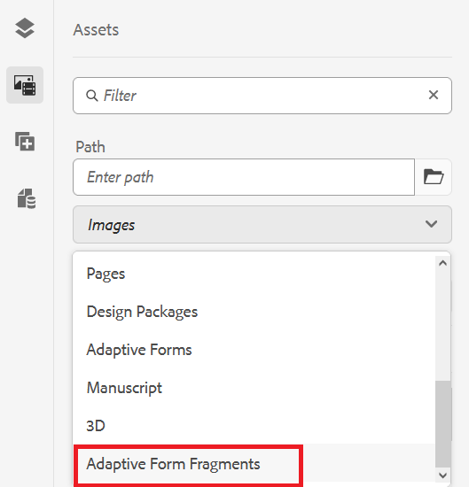

# Crea e utilizzare frammenti di Forms adattivi in un modulo adattivo basato sui componenti core {#adaptive-form-fragments}

| Versione | Collegamento articolo |
| -------- | ---------------------------- |
| AEM as a Cloud Service | Questo articolo |
| AEM 6.5 | [Fai clic qui](https://experienceleague.adobe.com/docs/experience-manager-65/forms/adaptive-forms-basic-authoring/adaptive-form-fragments.html) |

Anche se ogni modulo è progettato per uno scopo specifico, nella maggior parte dei moduli sono presenti alcuni segmenti comuni, ad esempio per fornire dati personali come nome e indirizzo, dettagli sulla famiglia e dettagli sul reddito. Gli sviluppatori di moduli devono creare questi segmenti comuni ogni volta che viene creato un nuovo modulo.

L’Adaptive Forms fornisce un comodo meccanismo per creare segmenti di modulo una sola volta, ad esempio un pannello o un gruppo di campi, e riutilizzarli in Adaptive Forms. Questi segmenti riutilizzabili e autonomi sono denominati frammenti di modulo adattivo.

I frammenti di modulo si integrano perfettamente in più moduli, semplificando la creazione di moduli coerenti e dall’aspetto professionale. I frammenti di modulo garantiscono riutilizzabilità, standardizzazione e coerenza del brand attraverso la funzionalità &quot;cambia una volta e riflette ovunque&quot;. Aumenta la manutenibilità e l’efficienza, poiché gli aggiornamenti apportati in un’unica posizione vengono propagati automaticamente in tutti i moduli che utilizzano questi frammenti.

È possibile aggiungere più volte un frammento a un documento e utilizzare le proprietà di associazione dati dei relativi componenti per collegarlo a diverse origini dati o schemi. Ad esempio, puoi utilizzare lo stesso frammento di indirizzo per un indirizzo permanente, di comunicazione e di fatturazione e collegarlo a campi diversi di un’origine dati o di uno schema.

## Creare un frammento di modulo {#create-a-fragment}

Puoi creare un frammento di modulo adattivo da zero o salvare un pannello in un modulo adattivo esistente come frammento. Per creare un frammento di modulo:

1. Accedi all’istanza di AEM Forms all’indirizzo https://[*nome host*]:[*porta*]/aem/forms.html.
1. Clic **Crea > Frammento modulo adattivo**.
1. Specifica titolo, nome, descrizione e tag per il frammento. Assicurati di specificare un nome univoco per il frammento. Se esiste già un altro frammento con lo stesso nome, la creazione del frammento non riesce.
1. Selezionare un modello di modulo. Forms Puoi creare un frammento di modulo per Forms adattivo basato su Componenti core o su Componenti di base.
   * Per creare un frammento di modulo per moduli basati su Componenti core, seleziona un modello basato su Componenti core.
   * Per creare un frammento di modulo per moduli basati su Componenti di base, seleziona un modello Componenti di base. Ad esempio, /libs/fd/af/templateForFragment/defaultFragmentTemplate.

   Quando crei un frammento di modulo per moduli basati su Componenti core, utilizza l’opzione Seleziona tema modulo per selezionare un tema basato su Componenti core.

1. Fai clic per aprire **Modello modulo** e dalla scheda **Seleziona da** dal menu a discesa, seleziona uno dei seguenti modelli per il frammento:

   

   * **Nessuno**: specifica di creare il frammento da zero senza utilizzare alcun modello di modulo.

     >[!NOTE]
     >
     > In Adaptive Forms puoi utilizzare più volte un singolo frammento di modulo (basato su Componenti core). Supporta sia frammenti di modulo basati su nessuno che basati su schema.

   * **Schema**: specifica di creare il frammento utilizzando uno schema XML o JSON caricato in AEM Forms. È possibile caricare o selezionare tra gli schemi XML o JSON disponibili come modello del modulo per il frammento. Quando si seleziona uno schema XML, è anche possibile creare un frammento di modulo adattivo selezionando un oggetto complexType presente nello schema selezionato dalla **[!UICONTROL casella a discesa Tipo complesso schema]** XML. Quando si seleziona uno schema JSON, è anche possibile creare un frammento di modulo adattivo selezionando una definizione di schema presente nello schema selezionato dalla **[!UICONTROL casella di riepilogo a discesa Definizioni]** schema JSON.
   * **Modello** dati modulo: specifica di creare il frammento utilizzando un modello dati modulo. È possibile creare un frammento di modulo adattivo basato su un solo oggetto modello dati in un modello dati modulo. Espandi il menu a discesa Definizioni modello dati modulo. Elenca tutti gli oggetti modello dati nel modello dati del modulo specificato. Seleziona un oggetto modello dati dall’elenco.

   

1. Clic **Crea** e quindi fare clic su **Apri** per aprire il frammento, con un modello predefinito, in modalità di modifica. In modalità di modifica puoi aggiungere qualsiasi componente Modulo adattivo al frammento.

<!-- For information about Adaptive Form components, see [Introduction to authoring Adaptive Forms](../../forms/using/introduction-forms-authoring.md). --> Inoltre, se hai selezionato uno schema XML o un modello di modulo XDP come modello di modulo per il frammento, nel Finder contenuto viene visualizzata una nuova scheda che mostra la gerarchia del modello di modulo. Consente di trascinare gli elementi del modello di modulo sul frammento. Gli elementi del modello modulo aggiunti vengono convertiti in componenti modulo mantenendo le proprietà originali dell’XDP o XSD associato.

Una volta creato il frammento di modulo adattivo basato su uno schema o un modello di dati del modulo, gli elementi del modello di dati del modulo o dello schema vengono visualizzati nella scheda Origini dati del browser Contenuto nell’editor di moduli adattivi. Puoi trascinare gli elementi del modello di modulo sul frammento. Gli elementi del modello modulo aggiunti vengono convertiti in componenti modulo mantenendo le proprietà originali dallo schema associato.

## Aggiungere un frammento a un modulo adattivo {#insert-a-fragment-in-an-adaptive-form}

Per aggiungere un frammento di modulo adattivo a un modulo adattivo:

1. Apri il modulo adattivo in modalità di modifica.
1. Aggiungere il **componente Frammento** modulo adattivo al modulo.
1. Fai clic sul **Assets** contenuto browser barra laterale. Nella risorse browser, sotto i percorsi, selezionare l&#39;opzione **Frammenti di** modulo adattivo. Vengono visualizzati tutti i frammenti di Forms adattivi disponibili per il modulo, a seconda del modello del modulo.

   

1. Trascina un frammento di modulo adattivo nel componente frammento **di** modulo adattivo del modulo adattivo.

   >[!NOTE]
   >
   >Il frammento di modulo adattivo non è abilitato per l’authoring dall’interno del modulo adattivo. Inoltre, non è possibile utilizzare un frammento basato su XSD in un modulo adattivo basato su JSON e viceversa.

Il frammento di modulo adattivo viene aggiunto facendo riferimento al modulo adattivo e rimane sincronizzato con il frammento di modulo adattivo autonomo. Ciò implica che qualsiasi modifica apportata al frammento del modulo adattivo si rifletta su tutte le istanze in cui il frammento è incorporato in Adaptive Forms.

### Incorporare un frammento in un modulo adattivo {#embed-a-fragment-in-adaptive-form}

Puoi scegliere di incorporare un frammento di modulo adattivo in un modulo adattivo facendo clic sul pulsante  icona nella barra degli strumenti del pannello del frammento aggiunto

Il frammento incorporato non è più collegato al frammento autonomo. Puoi modificare i componenti nel frammento incorporato direttamente dal modulo adattivo.

<!-- 
## Configure fragment appearance {#configure-fragment-appearance}

Any fragment you insert in Adaptive Forms appears as a placeholder image. The placeholder displays titles of up to a maximum of ten child panels in the fragment. You can configure AEM Forms to show the complete fragment instead of the placeholder image.

Perform the following steps to show complete fragments in forms:

1. Go to AEM web console configuration page at https:[*host*]:[*port*]/system/console/configMgr.

1. Search and click **[!UICONTROL Adaptive Form and Interactive Communication Web Channel Configuration]** to open it in edit mode.
1. Disable **[!UICONTROL Enable Placeholder in place of Fragment]** checkbox to show complete fragments rather than the placeholder image.

-->

### Utilizzo di frammenti all’interno di frammenti {#using-fragments-within-fragments}

Puoi creare frammenti di modulo adattivo nidificati, il che significa che puoi trascinare un frammento all’interno di un altro frammento e disporre di una struttura di frammenti nidificata.

### Utilizzo di un frammento di modulo più volte in un modulo adattivo {#using-form-fragment-mutiple-times-in-af}

È possibile utilizzare più volte un frammento di modulo basato su nessuno o schema in un modulo adattivo per salvare i dati in modo univoco per ogni campo dei frammenti di modulo. Ad esempio, puoi utilizzare un frammento di modulo indirizzo per raccogliere i dettagli dell’indirizzo per indirizzi permanenti, di comunicazione e di presentazione in un modulo di richiesta di prestito.

## Mappatura automatica dei frammenti per l’associazione dati {#auto-mapping-of-fragments-for-data-binding}

Quando crei un frammento di modulo adattivo utilizzando un modello di modulo XFA o un tipo complesso XSD e trascini il frammento in un modulo adattivo, il frammento XFA o il tipo complesso XSD viene sostituito automaticamente dal frammento di modulo adattivo corrispondente la cui radice del modello di frammento è mappata al frammento XFA o al tipo complesso XSD.

Puoi modificare la risorsa del frammento e i relativi binding dalla finestra di dialogo Modifica componente.

Puoi anche trascinare un frammento di modulo adattivo associato dalla libreria Frammento di modulo adattivo nel Finder di contenuti AEM e fornire il riferimento di associazione corretto dalla finestra di dialogo Modifica componente del pannello Frammento di modulo adattivo.

## Gestire i frammenti {#manage-fragments}

Puoi eseguire diverse operazioni sui frammenti di moduli adattivi utilizzando l’interfaccia utente di AEM Forms.

1. Passa a `https://[hostname]/aem/forms.html`.

1. Clic **Seleziona** nella barra degli strumenti dell’interfaccia utente di AEM Forms e seleziona un frammento di modulo adattivo. La barra degli strumenti mostra le seguenti operazioni che è possibile eseguire sul frammento di modulo adattivo selezionato.

<table>
 <tbody>
  <tr>
   <td>
<strong>Operazione</strong>
 </td>
   <td>
<strong>Descrizione</strong>
 </td>
  </tr>
  <tr>
   <td>
Modifica
 </td>
   <td>
Apre il frammento di modulo adattivo selezionato in modalità di modifica.    
 </td>
  </tr>
  <tr>
   <td>
Proprietà
 </td>
   <td>
Apre il pannello Proprietà. Dal pannello Proprietà puoi visualizzare e modificare le proprietà, generare un’anteprima e caricare un’immagine in miniatura per il frammento selezionato. Per ulteriori informazioni, consulta <a>Gestione dei metadati</a>.    
 </td>
  </tr>
  <tr>
   <td>
Copiare
 </td>
   <td>
Copia il frammento selezionato. Il pulsante Incolla viene visualizzato nella barra degli strumenti.    
 </td>
  </tr>
  <tr>
   <td>
Scarica
 </td>
   <td>
Scarica il frammento selezionato.    
 </td>
  </tr>
  <tr>
   <td>
Anteprima
 </td>
   <td>
Fornisce opzioni per visualizzare in anteprima il frammento come HTML o come anteprima personalizzata unendo i dati di un file XML con il frammento. Per ulteriori informazioni, consulta <a>Anteprima di un modulo</a>.    
 </td>
  </tr>
  <tr>
   <td>
Avvia revisione/Gestisci revisione
 </td>
   <td>
Consente di avviare e gestire una revisione del frammento selezionato. Per ulteriori informazioni, consulta <a>Creazione e gestione delle revisioni</a>.    
 </td>
  </tr>
  <tr>
   <td>
Aggiungi dizionario
 </td>
   <td>
Genera un dizionario per la localizzazione del frammento selezionato. Per ulteriori informazioni, consulta <a>Localizzazione di Forms</a> adattivi.    
 </td>
  </tr>
  <tr>
   <td>
Pubblicare/Annullare la pubblicazione
 </td>
   <td>
Pubblica/annulla la pubblicazione del frammento selezionato.    
 </td>
  </tr>
  <tr>
   <td>
Eliminare
 </td>
   <td>
Elimina il frammento selezionato.    
 </td>
  </tr>
 </tbody>
</table>

## Aspetti chiave da tenere a mente quando si lavora con i frammenti {#key-points-to-remember-when-working-with-fragments}

* Assicurati che il nome del frammento sia univoco. Il frammento non viene creato se è presente un frammento con lo stesso nome.
* In un modulo adattivo basato su XDP, se salvi un pannello come frammento che include un altro frammento XDP, il frammento risultante verrà associato automaticamente al frammento XDP secondario. Nel caso di un modulo adattivo basato su XSD, il frammento risultante sarà associato alla directory principale dello schema.
* Quando crei un frammento di modulo adattivo, viene creato un nodo di frammento in CRXDe Lite, simile al nodo guideContainer per un modulo adattivo.
* Un frammento in un modulo adattivo che utilizza un modello di dati del modulo diverso non è supportato. Ad esempio, un frammento basato su XDP non è supportato in un modulo adattivo basato su XSD e viceversa.
* I frammenti di moduli adattivi sono disponibili per l’utilizzo tramite la scheda Frammenti di moduli adattivi nel Finder di contenuti AEM.
* Qualsiasi espressione, script o stile in un frammento di modulo adattivo autonomo viene mantenuto quando viene inserito per riferimento o incorporato in un modulo adattivo.
* Non è possibile modificare un frammento di modulo adattivo, inserito per riferimento, dall’interno di un modulo adattivo. Per apportare modifiche, puoi modificare il frammento di modulo adattivo autonomo o incorporarlo nel modulo adattivo.
* Quando pubblichi un modulo adattivo, devi pubblicare i frammenti di modulo adattivo autonomi inseriti per riferimento nel modulo adattivo.
* Quando ripubblichi un frammento di modulo adattivo aggiornato, le modifiche si riflettono nelle istanze pubblicate del modulo adattivo in cui viene utilizzato il frammento.
* Il modulo adattivo contenente il componente Verifica non supporta gli utenti anonimi. Inoltre, non è possibile utilizzare il componente Verifica in un frammento di modulo adattivo.
* (**Solo Mac**) Per garantire che la funzionalità dei frammenti di modulo funzioni perfettamente in tutti gli scenari, aggiungere la seguente voce al file /private/etc/hosts:
  `127.0.0.1 <Host machine>`**Computer host**: il computer Apple Mac su cui è distribuito AEM Forms.

## Frammenti di riferimento {#reference-fragments}

Sono disponibili frammenti di moduli adattivi di riferimento che è possibile utilizzare per creare il modulo.
<!-- For more information, see [Reference Fragments](../../forms/using/reference-adaptive-form-fragments.md). -->

## Consulta anche {#see-also}

{{see-also}}