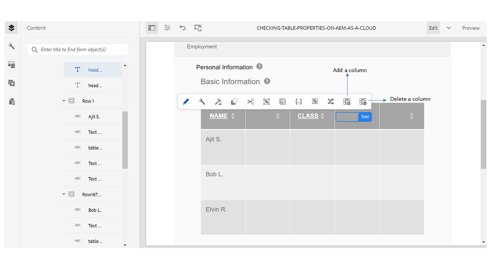

# Tabelle in modulo adattivo {#tables-in-adaptive-forms}

>[!NOTE]
>
> Adobe consiglia di utilizzare l&#39;acquisizione dati moderna ed estensibile [Componenti core](https://experienceleague.adobe.com/docs/experience-manager-core-components/using/adaptive-forms/introduction.html?lang=it) per [la creazione di un nuovo Forms adattivo](/help/forms/creating-adaptive-form-core-components.md) o [l&#39;aggiunta di Forms adattivo alle pagine AEM Sites](/help/forms/create-or-add-an-adaptive-form-to-aem-sites-page.md). Questi componenti rappresentano un progresso significativo nella creazione di Forms adattivi, garantendo esperienze utente straordinarie. Questo articolo descrive un approccio precedente all’authoring di Forms adattivi utilizzando i componenti di base.


| Versione | Collegamento articolo |
| -------- | ---------------------------- |
| AEM 6.5 | [Fai clic qui](https://experienceleague.adobe.com/docs/experience-manager-65/forms/adaptive-forms-basic-authoring/adaptive-forms-tables.html?lang=it) |
| AEM as a Cloud Service | Questo articolo |


L’utilizzo delle tabelle è un modo efficace, semplificato e organizzato di presentare dati complessi. Consente agli utenti di identificare facilmente le informazioni e di fornire input in una disposizione ordinata di righe e colonne. La maggior parte dei moduli di organizzazioni governative e di servizi finanziari richiede tabelle di dati di grandi dimensioni per inserire numeri ed eseguire calcoli.

AEM Forms fornisce un componente Tabella nella barra laterale del browser Componenti che consente di creare tabelle in moduli adattivi. Alcune delle funzionalità chiave fornite sono:

* Layout reattivo su dispositivi mobili
* Righe e colonne configurabili
* Aggiunta ed eliminazione dinamica di righe in fase di runtime
* Combinare o unire e dividere le celle
* Accessibile dagli assistenti vocali
* Layout personalizzato con CSS
* Compatibile e mappato con il componente tabella XDP
* Supporto per l&#39;aggiunta di righe o celle utilizzando elementi di tipo complesso XSD
* Unire dati da un file XML

## Creare una tabella {#create-a-table}

Per creare una tabella, trascina il componente Tabella dal browser Componenti nella barra laterale del modulo adattivo. Per impostazione predefinita, la tabella contiene due colonne e tre righe, inclusa la riga di intestazione.


### Informazioni sulle celle di intestazione e corpo {#about-header-and-body-cells}

Le celle di intestazione sono campi di testo. Per modificare l&#39;etichetta di un&#39;intestazione, fare clic con il pulsante destro del mouse sulla cella dell&#39;intestazione e scegliere **Modifica**. Nella finestra di dialogo Modifica, aggiorna l&#39;etichetta nel campo **Valore** e fai clic su **OK**.

Per impostazione predefinita, le celle del corpo sono caselle di testo. È possibile sostituire una cella del corpo con qualsiasi altro componente di moduli adattivi disponibile nella barra laterale, ad esempio una casella numerica, un selettore data o un elenco a discesa.

Ad esempio, la prima riga del corpo della tabella seguente include i componenti casella di testo, selezione data e elenco a discesa come celle.


È possibile unire due o più celle del corpo selezionando le celle da unire, facendo clic con il pulsante destro del mouse e selezionando **Unisci**. È inoltre possibile dividere una cella unita facendo clic con il pulsante destro del mouse e selezionando **Dividi celle**.

### Aggiungere, eliminare e spostare righe e colonne {#add-delete-move-rows-and-columns}

È possibile aggiungere ed eliminare una riga o una colonna e spostare una riga verso l&#39;alto o il basso in una tabella.

#### Aggiungere, eliminare o spostare una riga

Per aggiungere, eliminare o spostare la riga, fare clic su una cella della riga. apri il browser dei contenuti  e seleziona la riga corrispondente, evidenzia la riga selezionata con l&#39;opzione della barra degli strumenti da cui puoi aggiungere, eliminare o spostare la riga verso l&#39;alto o verso il basso.

* L&#39;operazione **[!UICONTROL Sposta su]** e **[!UICONTROL Sposta giù]** sposta la riga selezionata verso l&#39;alto e verso il basso.

* L&#39;operazione **[!UICONTROL Aggiungi colonna]** aggiunge una riga sotto la riga selezionata.

* L&#39;operazione **[!UICONTROL Elimina colonna]** elimina la riga selezionata.


Fai doppio clic sulla riga per configurare le proprietà di una riga, ad esempio Nome, Riferimento binding, Impostazioni ripetizione e Classe CSS.


#### Aggiungere o eliminare una colonna

Per aggiungere o eliminare una colonna, fai clic sulla cella di testo nella sezione dell’intestazione; viene visualizzata una barra degli strumenti con le opzioni per aggiungere o eliminare una colonna:



>[!NOTE]
>
>Anche se è possibile aggiungere un numero qualsiasi di righe in una tabella, il numero massimo di colonne che è possibile aggiungere è sei. Inoltre, non è possibile eliminare la riga di intestazione dalla tabella.

### Aggiungi descrizione tabella {#add-table-description}

È possibile aggiungere una descrizione della tabella per spiegare come sono organizzate le informazioni che gli assistenti vocali possono interpretare e leggere. Per aggiungere la descrizione:

1. Selezionare la tabella e selezionare  per visualizzarne le proprietà nella barra laterale.
1. Specificare il riepilogo nella scheda Accessibilità.
1. Fai clic su **Fine**.

### Ordinare le colonne in una tabella {#sortcolumnstable}

Puoi ordinare i dati in base a qualsiasi colonna di una tabella nel modulo adattivo. I valori nella colonna possono essere ordinati in ordine crescente o decrescente.

L’ordinamento può essere applicato alle colonne della tabella contenenti:

* Testo statico
* Proprietà oggetto modello dati
* Combinazione di testo statico e proprietà dell’oggetto modello dati

Per applicare l&#39;ordinamento alle colonne della tabella, le celle delle colonne della tabella devono contenere uno dei seguenti componenti: Casella numerica, Stepper numerico, Campo immissione data, Selettore data, Testo o Casella di testo.

Per abilitare l&#39;ordinamento:

1. Selezionare la tabella e selezionare  (Configura). Puoi anche selezionare la tabella utilizzando il browser **Contenuto** nella barra laterale della comunicazione interattiva.
1. Selezionare **Abilita ordinamento**.
1. Seleziona  per salvare le proprietà della tabella. Le icone di ordinamento, frecce verso l’alto o il basso, nelle intestazioni di colonna indicano che l’ordinamento è stato abilitato.

   

1. Passa alla modalità **Anteprima** per visualizzare l&#39;output. La tabella viene ordinata automaticamente in base alla prima colonna della tabella.
1. Fai clic sull’intestazione della colonna per ordinare i valori in base alla colonna.

   Un’intestazione di colonna con una freccia su indica che la tabella è ordinata in base a tale colonna. Inoltre, i valori nella colonna vengono visualizzati in ordine crescente.

   

   Analogamente, un&#39;intestazione di colonna con una freccia in giù indica che i valori nella colonna vengono visualizzati in ordine decrescente.

   È inoltre possibile apportare modifiche alla tabella in modalità **Anteprima** e fare di nuovo clic sull&#39;intestazione della colonna per ordinare i valori della colonna.

## Impostare la larghezza delle colonne per una tabella {#set-column-width}

Per impostare la larghezza delle colonne per una tabella, eseguire la procedura seguente:

1. Nella scheda **[!UICONTROL Contenuto]**, selezionare il componente **[!UICONTROL Tabella]** e l&#39;icona Configura ().

1.Immettere l&#39;elenco di valori separati da virgole nel campo **[!UICONTROL Larghezza colonna]** per specificare la larghezza proporzionale di ogni colonna della tabella. Ad esempio, per una tabella che include 3 colonne, specificando 2,4,6 come valore nel campo **[!UICONTROL Larghezza colonna]**, la larghezza delle colonne verrà impostata su 2/12 per la prima colonna, 4/12 per la seconda colonna e 6/12 per la terza colonna. 2/12, in quanto la larghezza della prima colonna si riferisce a un sesto della larghezza della tabella. Analogamente, 4/12 imposta la larghezza della seconda colonna come un terzo della larghezza della tabella e 6/12 imposta la larghezza della terza colonna come metà della larghezza della tabella.

## Configura stile tabella {#configure}

È possibile definire lo stile di una tabella utilizzando la modalità Stile nella barra degli strumenti della pagina. Per passare alla modalità stile e modificare lo stile della tabella, effettuare le seguenti operazioni

1. Nella barra degli strumenti della pagina, prima di Anteprima, seleziona  > **Stile**.

1. Nella barra laterale, seleziona la tabella e fai clic sul pulsante di modifica .
Le proprietà di stile sono visibili nella barra laterale.


>[!NOTE]
>
>È possibile modificare il tema del colore per le righe di intestazione e corpo modificando i valori di [VARIABILI MINORI](https://lesscss.org//). Per ulteriori informazioni, vedere [Temi in AEM Forms](/help/forms/themes.md).

## Aggiungere o eliminare una riga in modo dinamico {#add-or-delete-a-row-dynamically}

Le tabelle forniscono supporto preconfigurato per l’aggiunta o l’eliminazione dinamica di righe in fase di esecuzione.

1. Selezionare una riga di tabella e selezionare .
1. Nella scheda Impostazioni ripetizione, specifica i conteggi minimo e massimo per limitare il numero di righe nella tabella.
1. Fai clic su **Fine**.

In fase di esecuzione o di anteprima, sono presenti i pulsanti **+** e  per aggiungere o eliminare una riga.


>[!NOTE]
>
>L’aggiunta o l’eliminazione dinamica di una riga non è supportata nelle intestazioni nel layout mobile sinistro delle tabelle.

## Espressioni in una tabella {#expressions-in-a-table}

Le tabelle nei moduli adattivi consentono di scrivere espressioni in JavaScript per indurre comportamenti quali mostrare o nascondere una tabella o una riga, sommare tutti i numeri e visualizzare il totale in una cella, abilitare o disabilitare una cella, convalidare l’input dell’utente e così via. Queste espressioni utilizzano API di modelli di script per moduli adattivi.

Mentre le tabelle e le righe supportano solo le espressioni di visibilità per controllarne la visibilità in base al valore restituito da un&#39;espressione, le celle supportano le espressioni seguenti:

* **Script di inizializzazione:** per eseguire un&#39;azione sull&#39;inizializzazione di un campo.
* **Script di conferma del valore:** per modificare i componenti di un modulo dopo la modifica del valore di un campo.

>[!NOTE]
>
>Se lo script di modifica/uscita XFA viene applicato anche allo stesso campo, lo script di modifica/uscita XFA viene eseguito prima dello script di conferma del valore.

* **Calcola espressioni**: per calcolare automaticamente il valore di un campo.
* **Espressioni di convalida**: per convalidare un campo.
* **Accedere alle espressioni**: per abilitare/disabilitare un campo.
* **Espressione di visibilità**: per controllare la visibilità di un campo e di un pannello.

L’espressione di visibilità per una tabella o una riga può essere definita nella scheda Proprietà pannello della finestra di dialogo Modifica componente corrispondente. Le espressioni per una cella possono essere definite nella scheda Script della finestra di dialogo Modifica componente.

Per l&#39;elenco completo delle classi di moduli adattivi, degli eventi, degli oggetti e delle API pubbliche, consulta [Riferimento API della libreria JavaScript per i moduli adattivi](https://helpx.adobe.com/it/experience-manager/6-5/forms/javascript-api/index.html).

## Layout dispositivi mobili {#mobile-layouts}

Le tabelle nei moduli adattivi forniscono ai dispositivi mobili di esperienza senza precedenti grazie ai loro layout fluidi e reattivi. AEM Forms offre due tipi di layout mobili per tabelle: Intestazioni a sinistra e Colonne comprimibili.

Puoi configurare un layout mobile per una tabella dalla scheda Stile della finestra di dialogo Modifica componente per una tabella.

### Intestazioni a sinistra {#headers-on-left}

Nel layout Intestazioni a sinistra, l’intestazione della tabella viene trasposta a sinistra, con una sola cella visualizzata sopra un’intestazione. Ogni riga in questo layout viene visualizzata come una sezione distinta. Le immagini seguenti confrontano una tabella su un desktop con quella su un dispositivo mobile.


Vista desktop di una tabella con intestazione sul layout sinistro


Vista mobile di una tabella con intestazione sul layout a sinistra

### Layout colonne comprimibile {#collapsible-columns-layout}

Nel layout Colonne comprimibili, le colonne della tabella vengono compresse per mostrare una o due colonne, a seconda della dimensione del dispositivo, mentre le altre colonne vengono compresse. Puoi fare clic sull’icona di compressione/espansione per visualizzare altre colonne della tabella.

>[!NOTE]
>
>Anche se il layout Colonne comprimibili è ottimizzato per i dispositivi mobili, funziona anche sul desktop, se la larghezza disponibile non è sufficiente per mostrare tutte le colonne in una tabella.

Le immagini seguenti confrontano l’aspetto di una tabella su un dispositivo con colonne compresse ed espanse.


Colonne compresse di una tabella con solo due colonne visualizzate su un dispositivo mobile


Colonna espansa di una tabella su un dispositivo mobile

## Unire i dati in una tabella {#merge-data-in-a-table}

Le tabelle nei moduli adattivi consentono di compilare la tabella in fase di esecuzione utilizzando i dati di un file XML. Il file XML dati può trovarsi nel file system locale del computer in cui è in esecuzione il server AEM Forms o nell’archivio CRX.

Prendiamo ad esempio la seguente tabella di riepilogo delle transazioni bancarie che si desidera compilare con i dati di un file XML.


In questo esempio, la proprietà Nome elemento per:

* la riga è **Row1**
* la cella del corpo in Data transazione è **tableItem1**
* la cella del corpo in Descrizione è **tableItem2**
* la cella del corpo sotto il tipo di transazione è **type**
* la cella del corpo in Importo in USD è **tableItem3**

Il file XML che contiene i dati nel formato seguente:

```xml
<?xml version="1.0" encoding="UTF-8"?><afData>
  <afUnboundData>
    <data>
 <typeSelect>0</typeSelect>
 <Row1>
      <tableItem1>2015-01-08</tableItem1>
      <tableItem2>Purchase laptop</tableItem2>
      <type>0</type>
      <tableItem3>12000</tableItem3>
 </Row1>
 <Row1>
      <tableItem1>2015-01-05</tableItem1>
      <tableItem2>Transport expense</tableItem2>
      <type>0</type>
      <tableItem3>120</tableItem3>
 </Row1>
 <Row1>
      <tableItem1>2014-01-08</tableItem1>
      <tableItem2>Laser printer</tableItem2>
      <type>0</type>
      <tableItem3>500</tableItem3>
 </Row1>
 <Row1>
      <tableItem1>2014-12-08</tableItem1>
      <tableItem2>Credit card payment</tableItem2>
      <type>0</type>
      <tableItem3>300</tableItem3>
 </Row1>
 <Row1>
      <tableItem1>2015-01-06</tableItem1>
      <tableItem2>Interest earnings</tableItem2>
      <type>1</type>
      <tableItem3>12000</tableItem3>
 </Row1>
 <Row1>
      <tableItem1>2015-01-05</tableItem1>
      <tableItem2>Payment from a client</tableItem2>
      <type>1</type>
      <tableItem3>500</tableItem3>
 </Row1>
 <Row1>
      <tableItem1>2015-01-08</tableItem1>
      <tableItem2>Food expense</tableItem2>
      <type>0</type>
      <tableItem3>120</tableItem3>
 </Row1>
 </data>
  </afUnboundData>
  <afBoundData>
    <data/>
  </afBoundData>
  <afBoundData/>
</afData>
```

Nel codice XML di esempio, i dati di una riga sono definiti dai tag `<Row1>`, che rappresentano il nome dell&#39;elemento per la riga nella tabella. All&#39;interno del tag `<Row1>`, i dati di ogni cella sono definiti nel tag per il relativo nome elemento, ad esempio `<tableItem1>`, `<tableItem2>`, `<tableItem3>` e `<type>`.

Per unire questi dati alla tabella in fase di esecuzione, è necessario puntare il modulo adattivo contenente la tabella alla posizione XML assoluta con wcmmode disabilitato. Ad esempio, se il modulo adattivo si trova in *https://localhost:4502/myForms/bankTransaction.html* e il file XML dei dati viene salvato in *C:/myTransactions/bankSummary.xml*, è possibile visualizzare la tabella con i dati al seguente URL:

*https://localhost:4502/myForms/bankTransaction.html?dataRef=file:/// C:/myTransactions/bankSummary.xml&amp;wcmmode=disabled*


## Utilizzare componenti XDP e tipi complessi XSD {#use-xdp-components-and-xsd-complex-types}

Se hai creato un modulo adattivo basato su un modello di modulo XFA, gli elementi XFA sono disponibili nella scheda Modello dati di AEM Content Finder. Puoi trascinare e rilasciare questi elementi XFA, comprese le tabelle, nel modulo adattivo.

L’elemento della tabella XFA è mappato al componente Table e funziona come preconfigurato nei moduli adattivi. Tutte le proprietà e le funzionalità della tabella XDP vengono mantenute quando viene spostata in un modulo adattivo e puoi eseguirvi qualsiasi operazione proprio come con la tabella nativa del modulo adattivo. Ad esempio, se una riga in una tabella XDP è contrassegnata come ripetibile, viene ripetuta anche quando viene rilasciata in moduli adattivi.

Inoltre, puoi trascinare la sottomaschera XDP per aggiungere una nuova riga nella tabella. Si noti tuttavia che l&#39;eliminazione di una sottomaschera nidificata non funziona.

>[!NOTE]
>
>Una tabella XDP senza una riga di intestazione non verrà mappata al componente Tabella del modulo adattivo. Viene invece mappato al componente Pannello modulo adattivo con layout fluido. Inoltre, quando si aggiunge una tabella nidificata da un XDP a un modulo adattivo, la tabella esterna viene convertita in un pannello mantenendo la tabella interna.

Inoltre, puoi trascinare un gruppo di elementi di tipo complesso XSD per creare una riga di tabella. Viene creata una nuova riga appena sotto la riga in cui sono stati rilasciati gli elementi. Le celle create utilizzando gli elementi di tipo complesso XSD mantengono un riferimento di associazione a XSD. È inoltre possibile sostituire una cella body con un elemento di tipo complesso XSD rilasciando l&#39;elemento sulla cella.

>[!NOTE]
>
>Il numero di elementi in un componente di tabella XDP, una sottomaschera o un tipo complesso XSD non può superare il numero di celle di una riga. Ad esempio, non è possibile rilasciare quattro elementi su una riga contenente solo tre celle. Si verificherà un errore.
>
>Se il numero di elementi è inferiore al numero di celle di una riga, la nuova riga aggiunge prima le celle in base agli elementi e quindi le celle predefinite vengono aggiunte per riempire le celle rimanenti nella riga. Ad esempio, se si rilascia un gruppo di tre elementi in una riga contenente quattro celle, le prime tre celle si basano sugli elementi eliminati e la cella rimanente è la cella di tabella predefinita.

## Considerazioni chiave {#key-considerations}

* Se si spostano le righe verso l&#39;alto o verso il basso durante la creazione di una tabella basata su XSD, nell&#39;XML dati generato all&#39;invio del modulo viene visualizzata una perdita di dati dalle righe della tabella.
* A ogni cella body di una tabella predefinita è associato un nome elemento predefinito. Se aggiungi un’altra tabella nel modulo adattivo, le celle del corpo predefinite nella nuova tabella avranno lo stesso nome elemento della prima tabella. In questo caso, i dati generati durante l&#39;invio del modulo includeranno i dati nelle celle predefinite del corpo di una sola tabella. Assicurati pertanto di rinominare i nomi degli elementi per le celle del corpo predefinite per mantenerli univoci nelle tabelle ed evitare la perdita di dati.

  Applicabile solo alle celle del corpo di default. Se si aggiungono più righe o colonne a una tabella, verranno generati automaticamente nomi di elementi univoci per le celle del corpo non predefinite.

## Consulta anche {#see-also}

{{see-also}}

