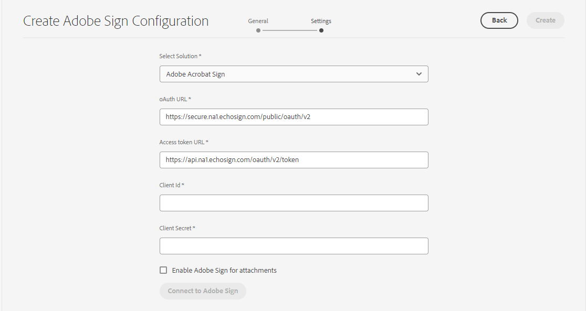

# Connetti [!DNL AEM Forms] as a Cloud Service con [!DNL Adobe Acrobat Sign] {#integrate-adobe-sign-with-aem-forms}

[!DNL Adobe Acrobat Sign] abilita i flussi di lavoro di firma elettronica per i flussi di lavoro di Forms adattivo e AEM. Le firme elettroniche consentono di migliorare i flussi di lavoro per l&#39;elaborazione di documenti relativi a questioni legali, vendite, retribuzioni, gestione delle risorse umane e molte altre aree.

In un tipico [!DNL Adobe Acrobat Sign] e nello scenario Forms adattivo, un utente compila un modulo adattivo da applicare a un servizio. Ad esempio, la richiesta di una carta di credito e il modulo relativo ai benefit per i cittadini. Quando un utente compila, invia e firma il modulo di richiesta, questo viene inviato al fornitore di servizi per ulteriori azioni. Il provider di servizi esamina l&#39;applicazione e utilizza [!DNL Adobe Acrobat Sign] per contrassegnare la domanda approvata. AEM Forms supporta sia Adobe Acrobat Sign che Adobe Acrobat Sign Solutions for Government. A seconda della licenza e dei requisiti, puoi integrare o collegare AEM Forms con una delle seguenti soluzioni:

* [Collegare AEM Forms a Adobe Acrobat Sign](#adobe-sign)
* [Collegare AEM Forms ad Adobe Acrobat Sign Solutions for Government](#adobe-acrobat-sign-for-government)

## Collegare AEM Forms a Adobe Acrobat Sign {#adobe-sign}

Per connettersi **[!DNL AEM Forms]** con **[!DNL Adobe Acrobat Sign]**, configura il software e gli account elencati nella sezione prerequisiti e configura Adobe Sign Cloud Service nelle istanze Forms as a Cloud Service Author e Publish:

### Prerequisiti per collegare AEM Forms a Adobe Acrobat Sign {#prerequisites-for-adobe-sign}

È necessario integrare la seguente configurazione [!DNL Adobe Acrobat Sign] con [!DNL AEM Forms]:

1. Un elemento attivo [account sviluppatore Adobe Acrobat Sign](https://acrobat.adobe.com/us/en/sign/developer-form.html).
1. Un [applicazione API Adobe Acrobat Sign](https://www.adobe.io/apis/documentcloud/sign/docs.html#!adobedocs/adobe-sign/master/gstarted/create_app.md).
1. Credenziali (ID client e segreto client) di [!DNL Adobe Acrobat Sign] applicazione API.
1. (Solo per autenticazione basata su documento ufficiale) [Abilita il metodo di autenticazione](https://helpx.adobe.com/sign/using/adobesign-authentication-government-id.html#AuditReport) per l’autenticazione tramite documento ufficiale.


### Connettere le istanze di authoring e pubblicazione di AEM Forms con Adobe Acrobat Sign {#configure-adobe-sign-with-aem-forms}

Dopo aver impostato i prerequisiti, effettua le seguenti operazioni per configurare [!DNL Adobe Acrobat Sign] con [!DNL AEM Forms] sulle istanze Autore.

1. Nell’istanza di authoring di AEM Forms, passa a **[!UICONTROL Strumenti]**  > **[!UICONTROL Generale]** > **[!UICONTROL Browser configurazioni]**.
1. Il giorno **[!UICONTROL Browser configurazioni]** pagina, tocca **[!UICONTROL Crea]**.
1. In **[!UICONTROL Crea configurazione]** , specifica un **[!UICONTROL Titolo]** per la configurazione, abilita **[!UICONTROL Configurazioni cloud]**, e tocca **[!UICONTROL Crea]**. Crea un contenitore di configurazione per archiviare i Cloud Services. Verificare che il nome della cartella non contenga spazio.
1. Accedi a **[!UICONTROL Strumenti]**  > **[!UICONTROL Cloud Services]** > **[!UICONTROL Adobe Acrobat Sign]** e apri il contenitore di configurazione creato nel passaggio precedente.

   >[!NOTE]
   >
   >Quando crei un modulo adattivo, specifica il nome del contenitore in **[!UICONTROL Contenitore configurazione]** campo.

1. Nella pagina di configurazione, tocca **[!UICONTROL Crea]** per creare [!DNL Adobe Acrobat Sign] in AEM Forms.
1. In **[!UICONTROL Generale]** scheda di **[!UICONTROL Crea configurazione Adobe Acrobat Sign]** , specificare un **[!UICONTROL Nome]** per la configurazione, quindi tocca **[!UICONTROL Successivo]**. Facoltativamente, puoi specificare un valore **[!UICONTROL Titolo]** e sfoglia per selezionare un **[!UICONTROL Miniatura]** per la configurazione.

1. Ora puoi **[!UICONTROL Seleziona soluzione]** per selezionare [!DNL Adobe Acrobat Sign].

   

1. Copiare l&#39;URL presente nella finestra del browser corrente in un blocco note e rimuovere la parte `/ui#/aem` dall’URL. L’URL modificato è quindi necessario per configurare [!DNL Adobe Acrobat Sign] applicazione con [!DNL AEM Forms], in un passaggio successivo. Tocca **[!UICONTROL Successivo]**.

1. In **[!UICONTROL Impostazioni]** , la scheda **[!UICONTROL URL OAuth]** contiene l’URL predefinito. Il formato dell’URL è:

   `https://<shard>/public/oAuth/v2`

   Ad esempio:
   `https://secure.na1.echosign.com/public/oauth/v2`

   Dove:

   **na1** fa riferimento alla partizione di database predefinita. È possibile modificare il valore della partizione del database. Assicurati che [!DNL  Adobe Acrobat Sign] Le configurazioni cloud puntano al [partitura corretta](https://helpx.adobe.com/sign/using/identify-account-shard.html).

   Se ne crei un altro [!DNL Adobe Acrobat Sign] per una funzione o un componente di Adobe Experience Manager, assicurati che tutte le [!DNL Adobe Acrobat Sign] Le configurazioni cloud puntano alla stessa partizione.

   >[!NOTE]
   >
   > Mantieni **Crea configurazione Adobe Acrobat Sign** pagina aperta. Non chiuderlo. Puoi recuperare **ID client** e **Segreto client** dopo aver configurato le impostazioni OAuth per [!DNL Adobe Acrobat Sign] come descritto nei passaggi successivi.


1. Configurare le impostazioni OAuth per [!DNL Adobe Acrobat Sign] applicazione:

   1. Apri una finestra del browser e accedi al tuo [!DNL Adobe Acrobat Sign] account sviluppatore.
   1. Seleziona l’applicazione configurata per [!DNL AEM Forms], e tocca **[!UICONTROL Configurare OAuth per l’applicazione]**.
   1. In **[!UICONTROL URL di reindirizzamento]** , aggiungere l&#39;URL copiato in un passaggio precedente (passaggio 8) e fare clic su **[!UICONTROL Salva]**.
   1. Abilita il seguente ambito per [!DNL Adobe Acrobat Sign] e fare clic su **[!UICONTROL Salva]**.

   * [!DNL aggrement_read]
   * [!DNL aggrement_write]
   * [!DNL aggrement_send]
   * [!DNL widget_read]
   * [!DNL widget_write]
   * [!DNL workflow_read]

   Per informazioni dettagliate su come configurare le impostazioni OAuth per un [!DNL Adobe Acrobat Sign] e ottenere le chiavi, consulta [Configurare le impostazioni OAuth per l&#39;applicazione](https://www.adobe.io/apis/documentcloud/sign/docs.html#!adobedocs/adobe-sign/master/gstarted/configure_oauth.md) documentazione per gli sviluppatori.

   

1. Torna a **[!UICONTROL Crea configurazione Adobe Acrobat Sign]** pagina. In **[!UICONTROL Impostazioni]** , specificare il [**[!UICONTROL ID client]** (indicato anche come ID applicazione) e **[!UICONTROL Segreto client]**]. Utilizza il [ID client e segreto client dell’applicazione Adobe Acrobat Sign](https://opensource.adobe.com/acrobat-sign/developer_guide/helloworld.html#get-the-app-id-and-secret) creato nel passaggio precedente.

1. Seleziona la **[!UICONTROL Abilita Adobe Acrobat Sign per allegati]** opzione per aggiungere i file allegati a un modulo adattivo al [!DNL Adobe Acrobat Sign] documento inviato per la firma.

1. Tocca **[!UICONTROL Connetti a Adobe Acrobat Sign]**. Quando vengono richieste le credenziali, fornisci **nome utente** e **password** dell’account utilizzato durante la creazione [!DNL Adobe Acrobat Sign] applicazione. Quando ti viene richiesto di confermare, accedi a `your developer account`, fai clic su **[!UICONTROL Consenti accesso]**. Se le credenziali sono corrette e si consente [!DNL AEM Forms] per accedere al [!DNL Adobe Acrobat Sign] per gli sviluppatori, viene visualizzato un messaggio di successo simile al seguente.

   

1. Tocca **[!UICONTROL Crea]** per creare [!DNL Adobe Acrobat Sign] configurazione.

1. Seleziona la configurazione e fai clic su **[!UICONTROL Pubblica]**, seleziona la configurazione e fai clic su **[!UICONTROL Pubblica]**. Replica la configurazione negli ambienti di pubblicazione corrispondenti.

1. Ripeti tutti i passaggi precedenti sulle istanze di sviluppo, staging e produzione (a seconda di quale sia il passaggio rimasto) per completare la configurazione [!DNL Adobe Acrobat Sign] con [!DNL AEM Forms] per il tuo ambiente.

Ora puoi [utilizzare aggiungere campi Adobe Acrobat Sign a un modulo adattivo](working-with-adobe-sign.md). Accertati di aggiungere il contenitore di configurazione utilizzato per il Cloud Service a tutti i Forms adattivi abilitati per [!DNL Adobe Acrobat Sign]. È possibile specificare un contenitore di configurazione dalle proprietà di un modulo adattivo.

## Collegare AEM Forms ad Adobe Acrobat Sign Solutions for Government {#adobe-acrobat-sign-for-government}

[!BADGE documentazione preliminare]{type=Caution tooltip="Stato giallo"}
<span class="preview"> Questa sezione contiene la documentazione pre-release e soggetta a modifiche.</span>

La connessione di AEM Forms ad Adobe Acrobat Sign Solutions for Government è un processo in più fasi. Comporta:

* Creazione di un URL di reindirizzamento per le istanze AEM
* Condivisione dell’URL di reindirizzamento e degli ambiti con il team Adobe Sign Solutions for Government
* Ricezione delle credenziali dal team di Adobe Sign
* Utilizzo delle credenziali ricevute per collegare AEM Forms ad Adobe Acrobat Sign Solutions for Government


AEM Forms as a Cloud Service fornisce ambienti di sviluppo, staging e produzione. È possibile iniziare con la connessione dell’ambiente di sviluppo per con Adobe Acrobat Sign Solutions for Government e collegare successivamente l’area di visualizzazione e gli ambienti di produzione.

### Prima di iniziare {#prerequisites-for-adobe-sign-for-acrobat-sign-for-government}

Prima di iniziare a collegare AEM Forms a Adobe Acrobat Sign Solution, assicurati che il tuo [Adobe Acrobat Sign Solutions for Government](https://opensource.adobe.com/acrobat-sign/signgov/gstarted.html#account-provisioning) è stato eseguito il provisioning dell’account.


### Connettere AEM Forms as a Cloud Service ad Adobe Acrobat Sign Solutions for Government {#connect-adobe-acrobat-sign-for-government}

#### Creare un URL di reindirizzamento per l’istanza AEM

1. Nell’istanza di authoring di Forms as a Cloud Service, passa a **[!UICONTROL Strumenti]**  > **[!UICONTROL Generale]** > **[!UICONTROL Browser configurazioni]**.
1. Il giorno **[!UICONTROL Browser configurazioni]** pagina, tocca **[!UICONTROL Crea]**.
1. In **[!UICONTROL Crea configurazione]** , specifica un **[!UICONTROL Titolo]** per la configurazione, abilita **[!UICONTROL Configurazioni cloud]**, e tocca **[!UICONTROL Crea]**. Crea un contenitore di configurazione per archiviare i Cloud Services. Verificare che il nome della cartella non contenga spazio.
1. Accedi a **[!UICONTROL Strumenti]**  > **[!UICONTROL Cloud Services]** > **[!UICONTROL Adobe Acrobat Sign]** e apri il contenitore di configurazione creato nel passaggio precedente. Quando crei un modulo adattivo, specifica il nome del contenitore in **[!UICONTROL Contenitore configurazione]** campo.
1. Nella pagina di configurazione, tocca **[!UICONTROL Crea]** per creare [!DNL Adobe Acrobat Sign] in AEM Forms.
1. Copiare l&#39;URL della finestra del browser corrente in un blocco note e rimuoverlo `/ui#/aem` dall’URL. Questo URL è denominato `re-direct URL`. Nella sezione successiva, condividi `re-direct URL` e `Scopes` con il team di Adobe Sign e le credenziali di richiesta (ID client e Segreto client).


#### Condividi l’URL di reindirizzamento e gli ambiti con il team di Adobe Sign e ricevi le credenziali

Il team Adobe Acrobat Sign for Government Solutions richiede `re-direct URL` e determinati ambiti da abilitare per l’applicazione Adobe Acrobat Sign (elencati di seguito) per la generazione di credenziali (ID client e segreto client) che consentono di collegare AEM Forms ad Adobe Acrobat Sign Solutions for Government.

Condividi `scopes` (elencati di seguito) e `re-direct URL` ha creato e annotato l&#39;ultimo passaggio della sezione precedente con il rappresentante Adobe Acrobat Sign for Government Solution ([membro del team Adobe Professional Services](https://opensource.adobe.com/acrobat-sign/signgov/gstarted.html#password)).

**_Ambiti_**

* [!DNL aggrement_read]
* [!DNL aggrement_write]
* [!DNL aggrement_send]
* [!DNL widget_read]
* [!DNL widget_write]
* [!DNL workflow_read]
* [!DNL offline_access]

Il rappresentante genera e condivide le credenziali con te. Nella sezione successiva utilizzi le credenziali (ID client e Segreto client) per collegare AEM Forms ad Adobe Acrobat Sign Solutions for Government.

#### Utilizza le credenziali ricevute per collegare AEM Forms ad Adobe Acrobat Sign Solutions for Government

1. Apri `re-direct URL` nel browser. Hai creato e annotato il `re-direct URL` nell&#39;ultimo passaggio della [creare un URL di reindirizzamento nell’istanza AEM](#create-redirect-url) sezione.

1. In **[!UICONTROL Generale]** scheda di **[!UICONTROL Crea configurazione Adobe Sign]** , specificare un **[!UICONTROL Nome]** per la configurazione, quindi tocca **[!UICONTROL Successivo]**. Facoltativamente, puoi specificare un valore **[!UICONTROL Titolo]** e sfoglia per selezionare un **[!UICONTROL Miniatura]** per la configurazione. Fai clic su **[!UICONTROL Avanti]**.

1. In **[!UICONTROL Impostazioni]** scheda di **[!UICONTROL Crea configurazione Adobe Sign]** pagina, per **[!UICONTROL Seleziona soluzione]** , seleziona [!DNL Adobe Acrobat Sign Solutions for Government].

   

1. In **[!UICONTROL E-mail]** archiviato, specifica l’indirizzo e-mail associato al tuo account Adobe Acrobat Sign Solutions for Government.

1. Il **[!UICONTROL URL OAuth]** specifica la partizione del database di Adobe Sign. Il campo contiene l’URL predefinito. Non modificare l’URL.

1. Utilizza le credenziali condivise da Adobe Acrobat Sign per il rappresentante della soluzione governativa ([membro del team Adobe Professional Services]) nella sezione precedente come [**[!UICONTROL ID client]** e **[!UICONTROL Segreto client]**].

1. Seleziona la **[!UICONTROL Abilita Adobe Acrobat Sign per allegati]** opzione per aggiungere i file allegati a un modulo adattivo al [!DNL Adobe Acrobat Sign] documento inviato per la firma.

1. Tocca **[!UICONTROL Connettersi ad Adobe Sign]**. Quando vengono richieste le credenziali, specifica il nome utente e la password dell’account utilizzato durante la creazione [!DNL Adobe Acrobat Sign] applicazione. Quando ti viene richiesto di confermare l’accesso per `your developer account`, fai clic su **[!UICONTROL Consenti accesso]**. Se le credenziali sono corrette e si consente [!DNL AEM Forms] per accedere al [!DNL Adobe Acrobat Sign] per gli sviluppatori, viene visualizzato un messaggio di successo simile al seguente.

   

   <!-- > When prompted for credentials, provide username and password of the account used while creating [!DNL Adobe Acrobat Sign] application. When asked to confirm access for `your developer account`, Click **[!UICONTROL Allow Access]**. -->

1. Tocca **[!UICONTROL Crea]** per creare la configurazione.

1. Seleziona la configurazione e fai clic su **[!UICONTROL Pubblica]**, seleziona la configurazione e fai clic su **[!UICONTROL Pubblica]**. Replica la configurazione negli ambienti di pubblicazione corrispondenti.

1. Ripeti tutti i passaggi precedenti sulle istanze di sviluppo, staging e produzione (a seconda di quale sia il passaggio rimasto) per completare la configurazione [!DNL Adobe Acrobat Sign Solutions for Government] con [!DNL AEM Forms] per il tuo ambiente.

Ora puoi [utilizzare aggiungere campi Adobe Acrobat Sign in un modulo adattivo](working-with-adobe-sign.md) o [Flusso di lavoro AEM](/help/forms/aem-forms-workflow-step-reference.md#sign-document-step-sign-document-step). Accertati di aggiungere il contenitore di configurazione utilizzato per la configurazione del Cloud Service a tutto il Forms adattivo abilitato per [!DNL Adobe Acrobat Sign]. È possibile specificare un contenitore di configurazione dalle proprietà di un modulo adattivo.

## (Solo per flussi di lavoro AEM) Configura [!DNL Adobe Acrobat Sign] per sincronizzare lo stato della firma {#configure-adobe-sign-scheduler-to-sync-the-signing-status}

Quando si utilizza [!DNL Adobe Acrobat Sign] Passaggio del flusso di lavoro per firmare un modulo adattivo, il modulo può essere trasmesso tra i firmatari uno dopo l’altro o può essere inviato a tutti i firmatari contemporaneamente, a seconda della configurazione del passaggio del flusso di lavoro. [!DNL Adobe Acrobat Sign] Forms adattivo abilitato vengono inviati a Experience Manager Forms Server solo dopo che tutti i firmatari hanno completato il processo di firma.

Per impostazione predefinita, il [!DNL Adobe Acrobat Sign] I servizi di pianificazione controllano (polling) la risposta del firmatario dopo ogni 24 ore. È possibile modificare l’intervallo predefinito per l’ambiente.

Per modificare l&#39;intervallo predefinito, specificare un [espressione cron](https://en.wikipedia.org/wiki/Cron#CRON_expression) per **sign.status.exp** proprietà del **Servizio di configurazione Adobe Acrobat Sign** configurazione.

Ad esempio, per eseguire il servizio di configurazione ogni giorno alle 00:00, impostare **sign.status.exp** proprietà del **Servizio di configurazione Adobe Acrobat Sign** configurazione da specificare `0 0 0 1/1 * ? *`. Il seguente file JSON mostra l’esempio per eseguire il servizio di configurazione ogni giorno alle 00:00:

```json
{
  "sign.status.exp":"0 0 0 1/1 * ? *"
}
```

Per impostare i valori di una configurazione: [Generare configurazioni OSGi utilizzando l’SDK per AEM](https://experienceleague.adobe.com/docs/experience-manager-cloud-service/implementing/deploying/configuring-osgi.html?lang=en#generating-osgi-configurations-using-the-aem-sdk-quickstart), e [distribuire la configurazione](https://experienceleague.adobe.com/docs/experience-manager-cloud-service/implementing/using-cloud-manager/deploy-code.html?lang=en#deployment-process) all’istanza di Cloud Service.


## Articoli correlati {#related-articles}

* [Utilizzo di Adobe Acrobat Sign in un modulo adattivo](working-with-adobe-sign.md)

* [Best practice per l’utilizzo di Adobe Acrobat Sign con Adaptive Forms](https://medium.com/adobetech/using-adobe-sign-to-e-sign-an-adaptive-form-heres-the-best-way-to-do-it-dc3e15f9b684)
