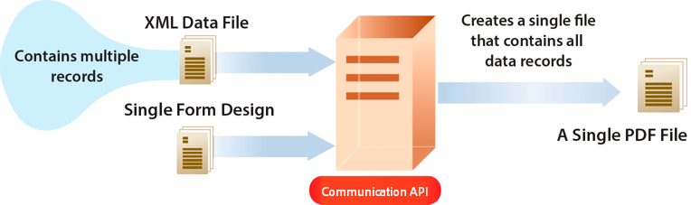

# Usare AEM Forms as a Cloud Service Communications {#frequently-asked-questions}

La funzionalità di comunicazione consente di creare documenti approvati, personalizzati e standardizzati per il marchio, ad esempio corrispondenze aziendali, dichiarazioni, lettere di elaborazione delle richieste di rimborso, note sui benefit, fatture mensili o kit di benvenuto.

La funzionalità fornisce API per generare e manipolare i documenti. È possibile generare o manipolare un documento su richiesta oppure creare un processo batch per generare più documenti a intervalli definiti. Le API di comunicazione forniscono:

* funzionalità ottimizzate di generazione della documentazione on-demand e batch.

* capacità di combinare, ridisporre e convalidare documenti PDF su richiesta.

* API HTTP per una più semplice integrazione con sistemi esterni. Sono incluse API separate per le operazioni on-demand (bassa latenza) e batch (operazioni con produttività elevata).

* un accesso sicuro ai dati. Le API di comunicazione si connettono e accedono ai dati solo dagli archivi di dati designati dal cliente e dalla cliente, il che rende le comunicazioni estremamente sicure.

È possibile creare un rendiconto di una carta di credito utilizzando le API di comunicazione. Questo esempio di rendiconto utilizza lo stesso modello, ma separa i dati per ogni cliente a seconda dell’uso della carta di credito.

## Generazione di documenti

Le API di comunicazione per la generazione di documenti consentono di combinare un modello (XFA o PDF) con i dati dei clienti e delle clienti (XML) per generare documenti in formati PDF e Print come i formati PS, PCL, DPL, IPL e ZPL. Queste API utilizzano modelli PDF e XFA con [dati XML](communications-known-issues-limitations.md#form-data) per generare un singolo documento su richiesta o più documenti utilizzando un processo batch.

In genere, si crea un modello con [Designer](use-forms-designer.md) e si utilizzano le API di comunicazione per unire i dati al modello. L’applicazione può inviare il documento di output a una stampante di rete, a una stampante locale o a un sistema di archiviazione. I flussi di lavoro predefiniti e personalizzati si presentano così:

A seconda del tipo di uso, è possibile rendere disponibili questi documenti anche per il download tramite il sito web o un server di archiviazione.

Alcuni esempi di API per la generazione di documenti:

### Creazione di documenti PDF {#create-pdf-documents}

Le API per la generazione dei documenti possono essere utilizzate per creare un documento PDF basato sulla struttura di un modulo e sui dati del modulo XML. L’output è un documento PDF non interattivo. In altre parole, gli utenti non possono inserire o modificare i dati del modulo. Un flusso di lavoro fondamentale consiste nell’unire i dati del modulo XML a una struttura del modulo per creare un documento PDF. Nell’immagine seguente viene illustrata l’unione della struttura di un modulo e dei dati del modulo XML per produrre un documento PDF.

Figura: flusso di lavoro tipico per la creazione di un documento PDF

### Creazione di documenti PostScript (PS), PCL (Printer Command Language) e Zebra Printing Language (ZPL) {#create-PS-PCL-ZPL-documents}

Le API per la generazione di documenti possono essere usate per creare documenti PostScript (PS), Printer Command Language (PCL) e Zebra Printing Language (ZPL) basati sulla struttura di un modulo XDP o su un documento PDF. Queste API consentono di unire la struttura di un modulo ai dati del modulo per generare un documento. È possibile salvare il documento in un file e sviluppare un processo personalizzato per inviarlo a una stampante.

<!-- ### Processing batch data to create multiple documents

Communications APIs can create separate documents for each record within an XML batch data source. The APIs can also create a single document that contains all records (this functionality is the default). Assume that an XML data source contains ten records and you instruct the APIs to create a separate document for each record (for example, PDF documents). As a result, the APIs generate ten PDF documents.

The following illustration also shows Communications APIs processing an XML data file that contains multiple records. However, assume that you instruct the APIs to create a single PDF document that contains all data records. In this situation, the APIs generate one document that contains all of the records.

The following illustration shows Communications APIs processing an XML data file that con tains multiple records. Assume that you instruct the Communications APIs to create a separate PDF document for each data record. In this situation, the APIs generates a separate PDF document for each data record.

 -->

### Elaborazione di dati batch per creare più documenti {#processing-batch-data-to-create-multiple-documents}

Le API per la generazione di documenti possono essere utilizzate per creare documenti separati per ogni record all’interno di una fonte di dati batch XML. Puoi generare documenti in blocco e in modalità asincrona. Puoi configurare vari parametri per la conversione e quindi avviare l’elaborazione in batch.

<!-- You can can also create a single document that contains all records (this functionality is the default).  Assume that an XML data source contains ten records and you have a requirement to create a separate document for each record (for example, PDF documents). You can use the Communication APIs to generate ten PDF documents. -->

<!-- The following illustration shows the Communication APIs processing an XML data file that contains multiple records. However, assume that you instruct the Communication APIs to create a single PDF document that contains all data records. In this situation, the Communication APIs generate one document that contains all of the records.

The following illustration shows the Communication APIs processing an XML data file that contains multiple records. Assume that you instruct the Communication APIs to create a separate PDF document for each data record. In this situation, the Communication APIs generates a separate PDF document for each data record.

For detailed information on using Batch APIs, see Communication APIs: Processing batch data to create multiple documents. 

### Flatten interactive PDF documents {#flatten-interactive-pdf-documents}

You can use document generation APIs to transform an interactive PDF document (for example, a form) to a non-interactive PDF document. An interactive PDF document lets users enter or modify data located in the PDF document fields. The process of transforming an interactive PDF document to a non-interactive PDF document is called flattening. When a PDF document is flattened, a user cannot modify the data located in the document’s fields. One reason to flatten a PDF document is to ensure that data cannot be modified.

You can flatten the following types of PDF documents:

* Interactive PDF documents created in Designer (that contain XFA streams).

* Acrobat PDF forms

If you attempt to flatten a non-interactive PDF document, an exception occurs.

### Retain Form State {#retain-form-state}

An interactive PDF document contains various elements that constitute a form. These elements may include fields (to accept or display data), buttons (to trigger events), and scripts (commands to perform a specific action). Clicking a button may trigger an event that changes the state of a field. For example, choosing a gender option may change the color of a field or the appearance of the form. This is an example of a manual event causing the form state to change.

When such an interactive PDF document is flattened using the Communications APIs, the state of the form is not retained. To ensure that the state of the form is retained even after the form is flattened, set the Boolean value _retainFormState_ to True to save and retain the state of the form. -->

## Manipolazione dei documenti

API di comunicazione per la manipolazione di documenti che aiutano a combinare, ridisporre e convalidare i documenti PDF. In genere, si crea un DDX e lo si invia alle API di manipolazione dei documenti per assemblare o ridisporre un documento. Il [Documento DDX](https://helpx.adobe.com/content/dam/help/en/experience-manager/forms-cloud-service/ddxRef.pdf) fornisce istruzioni su come utilizzare i documenti di origine per produrre un set di documenti richiesti. La documentazione di riferimento DDX fornisce informazioni dettagliate su tutte le operazioni supportate. Alcuni esempi di manipolazione dei documenti sono:

### assemblare documenti PDF

È possibile utilizzare le API di manipolazione dei documenti per assemblare due o più documenti PDF o XDP in un singolo documento PDF o Portfolio PDF. Di seguito sono riportati alcuni modi per assemblare documenti PDF:

* Assemblare un semplice documento PDF
* Creare un portfolio PDF
* Assemblare documenti crittografati
* Assemblare documenti utilizzando la numerazione Bates
* Uniformare e assemblare documenti

Figura: assemblaggio di un semplice documento PDF da più documenti PDF

### Separare i documenti PDF

È possibile utilizzare le API di manipolazione del documento per smontare un documento PDF. Le API possono estrarre pagine dal documento di origine o dividere un documento di origine basato sui segnalibri. In genere, questa attività è utile se il documento PDF è stato creato in origine da molti documenti singoli, ad esempio da una raccolta di istruzioni.

* Estrarre pagine da un documento di origine
* Dividere un documento di origine basato sui segnalibri

Figura: dividere un documento di origine basato sui segnalibri in più documenti

### Convertire e convalidare documenti conformi a PDF/A

È possibile utilizzare le API per la manipolazione dei documenti per convertire un documento PDF in un documento conforme a PDF/A e per determinare se un documento PDF è conforme a PDF/A. PDF/A è un formato di archiviazione destinato alla conservazione a lungo termine del contenuto del documento. I font vengono incorporati nel documento e il file non è compresso. Di conseguenza, un documento PDF/A è generalmente più grande di un documento PDF standard. Inoltre, un documento PDF/A non include contenuti audio e video.

<!-- 

## Document utilities

Document utilities synchronous APIs helps you convert documents between PDF and XDP file formats, and query information about a PDF document. For example, you can determine whether a PDF document contains comments or attachments. 

### Retrieve PDF document properties

You can [query a PDF document](https://developer.adobe.com/experience-manager-forms-cloud-service-developer-reference/references/pdf-utility-sync/#tag/Document-Extraction/) for the following information:

* Is a PDF Document: Check whether the source document is a PDF document.
* Is a fillable form: Check whether the source PDF document is a fillable form.
* Form Type: Retrieve the form type of the document.
* Check for Attachments: Check whether the source PDF document has any attachments.
* Check for Comments: Check whether the source PDF document has any review comments.
* Is a PDF Package: Check whether the document is a PDF package.
* Get the PDF Version: Retrieve the [version of the PDF document](https://en.wikipedia.org/wiki/History_of_PDF).
* Recommended Acrobat Version: Retrieve the required version of Acrobat (Reader) to open the PDF document.
* Is an XFA Document: Check whether the source PDF document is an XFA-based PDF document.
* Is Shell PDF: Check whether the source PDF document is shell PDF. A shell PDF contains only an XFA stream, font and image resources, and one page that is either blank or contains a warning that the document must be opened using Acrobat or Adobe Reader. The shell PDF is used with PDF transformation to optimize delivery of PDFForm transformations only.
* Get the XFA Version: Retrieve the [XFA Version for an XFA-based PDF document](https://en.wikipedia.org/wiki/XFA#XFA_versions).

### Convert PDF Documents into XDP Documents

The [PDF to XDP API](https://developer.adobe.com/experience-manager-forms-cloud-service-developer-reference/references/pdf-utility-sync/#tag/Document-Conversion) converts a PDF document to an XDP file. For a PDF document to be successfully converted to an XDP file, the PDF document must contain an XFA stream in the dictionary. -->

## Tipi di API di comunicazione

Le comunicazioni forniscono API HTTP per la generazione di documenti on-demand e batch:

* Le **[API sincrone](https://developer.adobe.com/experience-manager-forms-cloud-service-developer-reference/)** sono adatte a scenari di generazione di documenti a richiesta, a bassa latenza e a record singolo. Queste API sono più adatte ai casi d’uso basati su azioni dell’utente. Ad esempio, la generazione di un documento al termine della compilazione del modulo da parte dell’utente.

* Le **[API batch (API asincrone)](https://developer.adobe.com/experience-manager-forms-cloud-service-developer-reference/)** sono adatte a scenari di generazione pianificati, di produttività elevata e di documenti multipli. Queste API generano documenti in batch. Ad esempio, bollette telefoniche, rendiconti per carta di credito e rendiconti dei benefit generati ogni mese.

## Onboarding

La funzionalità di comunicazione è disponibile come modulo indipendente e aggiuntivo per gli utenti e le utenti di Forms as a Cloud Service. È possibile contattare il team di vendita Adobe o il proprio rappresentante Adobe per richiedere l’accesso. Adobe abilita l’accesso per la tua organizzazione e fornisce i privilegi richiesti alla persona designata come amministratore dell’organizzazione. L’amministratore può concedere l’accesso agli sviluppatori (utenti) di Forms as a Cloud Service della tua organizzazione per l’utilizzo delle API.

Dopo l’onboarding, per abilitare la funzionalità di comunicazione per l’ambiente di Forms as a Cloud Service:

1. Accedi a Cloud Manager e apri la tua istanza AEM Forms as a Cloud Service.

1. Apri l’opzione Modifica programma, vai alla scheda Soluzioni e componenti aggiuntivi e seleziona l’opzione **[!UICONTROL Forms - Comunicazioni]**.

   

   Se hai già abilitato l’opzione **[!UICONTROL Forms - Registrazione digitale]**, allora seleziona l’opzione **[!UICONTROL Forms - Componente aggiuntivo per le comunicazioni]**.

   

1. Fai clic su **[!UICONTROL Aggiorna]**.

1. Esegui la pipeline di compilazione. Una volta che la pipeline di compilazione ha esito positivo, le API di comunicazione sono abilitate per l’ambiente.

>[!NOTE]
>
> Per abilitare e configurare le API di manipolazione dei documenti, aggiungi la seguente regola a [Configurazione del Dispatcher](setup-local-development-environment.md#forms-specific-rules-to-dispatcher):
>
> `# Allow Forms Doc Generation requests`
> `/0062 { /type "allow" /method "POST" /url "/adobe/forms/assembler/*" }`

<!--

Communication help you combine a template and XML data to generate print documents in various formats. The service allows you to generate documents in synchronous and batch modes. The APIs enables you to create applications that let you:

  * Generate documents by populating template files (PDF and XDP) with XML data.
  * Generate output forms in various formats, including non-interactive PDF print streams.

Consider a scenario where you have one or more templates and multiple records of XML data for each template. You can use Communications APIs to generate a print document for each record.  You can also combine the records into a single document.  The result is a non-interactive PDF document. A non-interactive PDF document does not let users enter data into its fields.

 There are two main Communications APIs. The _generatePDFOutput_ generates PDFs, while the _generatePrintedOutput_ generates PostScript, ZPL, and PCL formats. These APIs are available as REST endpoints on your environment, both on author and publish instances. Since the publish instances are configured to scale faster than the author instances, it is recommended use these APIs via publish instances.

The first parameter of both the operations accept the path and name of the template file (for example ExpenseClaim.xdp). You can specify a fully qualified path, reference path of your AEM Repository, or path of a binary file. The second parameter accepts an XML document that is merged with the template while generating the output document.  

The [API reference documentation](https://documentcloud.adobe.com/link/track?uri=urn:aaid:scds:US:b1223732-ae0f-4921-bdc0-c31e48b56044) provides detailed information about all the parameters, authentication methods, and various services provided by APIs. The API reference documentation is also available in the .yaml format. You can download the .yaml for [Batch APIs](assets/batch-api.yaml) or [non-Batch API.yaml](assets/non-batch-api.yaml) file and upload it to postman to check functionality of APIs.

>[!VIDEO](https://video.tv.adobe.com/v/335771)

Uploading Communication APIs .yaml file to postman to check functionality of APIs.

## Using the Communications APIs {#workflows}

Typically, you create a template using [Designer](use-forms-designer.md) and use communications APIs ( generatePDFOutput and generatePrintedOutput) to:

* Convert these templates to various formats, including PDF, PostScript, ZPL, and PCL.
* Merge XML form data with a form design to generate a document.
* Generate a document without merging XML form data into the document. However, the primary workflow is merging data into the document.

Then, the output document is stored to a file. You can design custom workflows to send the file to a network printer, a local printer, or to a storage system for archival. A typical out of the box and custom workflows look like the following:

### Create PDF documents {#create-pdf-documents}

You can use the _generatePDFOutput_ API to create PDF document that is based on a form design and XML form data. The output is a non-interactive PDF document. That is, users cannot enter or modify form data. A basic workflow is to merge XML form data with a form design to create a PDF document. The following illustration shows the merging of a form design and XML form data to produce a PDF document.

### Create PostScript (PS), Printer Command Language (PCL), Zebra Printing Language (ZPL) document {#create-PS-PCL-ZPL-documents}

You can use Communications APIs to create PostScript (PS), Printer Command Language (PCL), and Zebra Printing Language (ZPL) document that are based on a XDP form design or PDF document. The _generatePrintedOutput_ API merges a form design with form data to generate a document. You can save the document to a file and develop a custom process to send it to a printer.

 ### Processing batch data to create multiple documents

Communications APIs can create separate documents for each record within an XML batch data source. The APIs can also create a single document that contains all records (this functionality is the default). Assume that an XML data source contains ten records and you instruct the APIs to create a separate document for each record (for example, PDF documents). As a result, the APIs generate ten PDF documents.

The following illustration also shows Communications APIs processing an XML data file that contains multiple records. However, assume that you instruct the APIs to create a single PDF document that contains all data records. In this situation, the APIs generate one document that contains all of the records.

The following illustration shows Communications APIs processing an XML data file that contains multiple records. Assume that you instruct the Communications APIs to create a separate PDF document for each data record. In this situation, the APIs generates a separate PDF document for each data record.

### Processing batch data to create multiple documents {#processing-batch-data-to-create-multiple-documents}

You create separate documents for each record within an XML batch data source. You can can also create a single document that contains all records (this functionality is the default). Assume that an XML data source contains ten records and you have a requirement to create a separate document for each record (for example, PDF documents). You can use the Communication APIs to generate ten PDF documents.

The following illustration shows the Communication APIs processing an XML data file that contains multiple records. However, assume that you instruct the Communication APIs to create a single PDF document that contains all data records. In this situation, the Communication APIs generate one document that contains all of the records.

The following illustration shows the Communication APIs processing an XML data file that contains multiple records. Assume that you instruct the Communication APIs to create a separate PDF document for each data record. In this situation, the Communication APIs generates a separate PDF document for each data record.

For detailed information on using Batch APIs, see Communication APIs: Processing batch data to create multiple documents.

### Flatten interactive PDF documents {#flatten-interactive-pdf-documents}

You can use the Communications APIs to transform an interactive PDF document (for example, a form) to a non-interactive PDF document. An interactive PDF document lets users enter or modify data located in the PDF document fields. The process of transforming an interactive PDF document to a non-interactive PDF document is called flattening. When a PDF document is flattened, a user cannot modify the data located in the document’s fields. One reason to flatten a PDF document is to ensure that data cannot be modified.

You can flatten the following types of PDF documents:

* Interactive PDF documents created in Designer (that contain XFA streams).

* Acrobat PDF forms

If you attempt to flatten a non-interactive PDF document, an exception occurs.

### Retain Form State {#retain-form-state}

An interactive PDF document contains various elements that constitute a form. These elements may include fields (to accept or display data), buttons (to trigger events), and scripts (commands to perform a specific action). Clicking a button may trigger an event that changes the state of a field. For example, choosing a gender option may change the color of a field or the appearance of the form. This is an example of a manual event causing the form state to change.

When such an interactive PDF document is flattened using the Communications APIs, the state of the form is not retained. To ensure that the state of the form is retained even after the form is flattened, set the Boolean value _retainFormState_ to True to save and retain the state of the form.  -->
