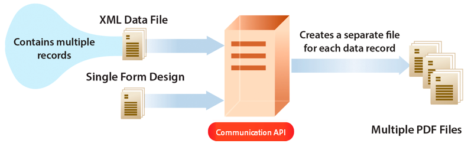

# Usa comunicazioni as a Cloud Service di AEM Forms {#frequently-asked-questions}

**La funzione di comunicazione as a Cloud Service di AEM Forms è in versione beta.**

La funzionalità di comunicazione ti consente di creare documenti orientati al marchio, personalizzati e standardizzati, come corrispondenze aziendali, dichiarazioni, lettere di elaborazione delle richieste, note sui benefit, fatture mensili o kit di benvenuto.

È possibile generare un documento su richiesta o creare un processo batch per generare più documenti a intervalli definiti. Le API di comunicazione forniscono:

* funzionalità semplificate di generazione della documentazione on-demand e batch.

* API HTTP per una più semplice integrazione con sistemi esterni. Sono incluse API separate per le operazioni on-demand (bassa latenza) e batch (operazioni con throughput elevato). La generazione dei documenti è un compito efficiente.

* un accesso sicuro ai dati. Le API di comunicazione si connettono e accedono ai dati solo dagli archivi di dati designati dal cliente, non effettuano copie locali dei dati, il che rende le comunicazioni altamente sicure.

È possibile creare un rendiconto della carta di credito utilizzando le API di comunicazione. Questa istruzione di esempio utilizza lo stesso modello ma dati separati per ogni cliente a seconda dell&#39;uso della carta di credito.

## Come funziona?

Le comunicazioni utilizzano [Modelli PDF e XFA](#supported-document-types) con [Dati XML](#form-data) per generare un singolo documento su richiesta o più documenti utilizzando un processo batch a un intervallo definito.

Le API di comunicazione consentono di combinare un modello (XFA o PDF) con i dati dei clienti ([Dati XML](#form-data)) per generare documenti nei formati PDF e Print come i formati PS, PCL, DPL, IPL e ZPL.

In genere, si crea un modello utilizzando [Designer](use-forms-designer.md) e utilizza le API di comunicazione per unire i dati con il modello. L&#39;applicazione può inviare il documento di output a una stampante di rete, a una stampante locale o a un sistema di storage per l&#39;archiviazione. I flussi di lavoro predefiniti e personalizzati si presentano come segue:

A seconda del caso d’uso, è anche possibile rendere disponibili questi documenti per il download tramite il sito web o un server di storage.

## API di comunicazione

Le comunicazioni forniscono API HTTP per la generazione di documenti on-demand e batch:

* **[API sincrone](https://www.adobe.io/experience-manager-forms-cloud-service-developer-reference/)** sono adatti a scenari di generazione di documenti a richiesta, a bassa latenza e a record singolo. Queste API sono più adatte ai casi d’uso basati su azioni dell’utente. Ad esempio, la generazione di un documento al termine della compilazione del modulo da parte dell’utente.

* **[API batch (API asincrone)](https://www.adobe.io/experience-manager-forms-cloud-service-developer-reference/)** sono adatti a scenari di generazione pianificati, di alta velocità e di documenti multipli. Queste API generano documenti in batch. Ad esempio, bollette telefoniche, dichiarazioni con carta di credito e dichiarazioni con benefit generate ogni mese.

Alcuni dei principali utilizzi delle API di comunicazione sono:

### Creare documenti PDF {#create-pdf-documents}

È possibile utilizzare le API di comunicazione per creare un documento PDF basato su una struttura del modulo e sui dati del modulo XML. L’output è un documento PDF non interattivo. In altre parole, gli utenti non possono immettere o modificare i dati del modulo. Un flusso di lavoro di base consiste nell’unire i dati del modulo XML a una struttura del modulo per creare un documento PDF. Nell’illustrazione seguente viene illustrato l’unione di una struttura del modulo e dei dati del modulo XML per produrre un documento PDF.

### Crea documento PostScript (PS), PCL (Printer Command Language), Zebra Printing Language (ZPL) {#create-PS-PCL-ZPL-documents}

È possibile utilizzare le API di comunicazione per creare documenti PostScript (PS), PCL (Printer Command Language) e Zebra Printing Language (ZPL) basati su una struttura del modulo XDP o su un documento PDF. Queste API consentono di unire una struttura del modulo ai dati del modulo per generare un documento. È possibile salvare il documento in un file e sviluppare un processo personalizzato per inviarlo a una stampante.

<!-- ### Processing batch data to create multiple documents

Communications APIs can create separate documents for each record within an XML batch data source. The APIs can also create a single document that contains all records (this functionality is the default). Assume that an XML data source contains ten records and you instruct the APIs to create a separate document for each record (for example, PDF documents). As a result, the APIs generate ten PDF documents.

The following illustration also shows Communications APIs processing an XML data file that contains multiple records. However, assume that you instruct the APIs to create a single PDF document that contains all data records. In this situation, the APIs generate one document that contains all of the records.

The following illustration shows Communications APIs processing an XML data file that contains multiple records. Assume that you instruct the Communications APIs to create a separate PDF document for each data record. In this situation, the APIs generates a separate PDF document for each data record.

 -->

### Elaborazione di dati batch per creare più documenti {#processing-batch-data-to-create-multiple-documents}

È possibile creare documenti separati per ogni record all&#39;interno di un&#39;origine dati batch XML. Puoi generare documenti in modalità collettiva e asincrona. Puoi configurare vari parametri per la conversione e quindi avviare il processo batch. <!-- You can can also create a single document that contains all records (this functionality is the default).  Assume that an XML data source contains ten records and you have a requirement to create a separate document for each record (for example, PDF documents). You can use the Communication APIs to generate ten PDF documents. -->

<!-- The following illustration shows the Communication APIs processing an XML data file that contains multiple records. However, assume that you instruct the Communication APIs to create a single PDF document that contains all data records. In this situation, the Communication APIs generate one document that contains all of the records.

The following illustration shows the Communication APIs processing an XML data file that contains multiple records. Assume that you instruct the Communication APIs to create a separate PDF document for each data record. In this situation, the Communication APIs generates a separate PDF document for each data record.

For detailed information on using Batch APIs, see Communication APIs: Processing batch data to create multiple documents. -->

### Flatten interattivi documenti PDF {#flatten-interactive-pdf-documents}

È possibile utilizzare le API di comunicazione per trasformare un documento PDF interattivo (ad esempio un modulo) in un documento PDF non interattivo. Un documento PDF interattivo consente agli utenti di immettere o modificare i dati contenuti nei campi del documento di PDF. Il processo di trasformazione di un documento PDF interattivo in un documento PDF non interattivo è denominato appiattimento. Quando un documento PDF viene appiattito, un utente non può modificare i dati presenti nei campi del documento. Un motivo per appiattire un documento di PDF è garantire che i dati non possano essere modificati.

È possibile appiattire i seguenti tipi di documenti PDF:

* Documenti PDF interattivi creati in Designer (che contengono flussi XFA).

* PDF forms Acrobat

Se si tenta di appiattire un documento PDF non interattivo, si verifica un’eccezione.

### Mantieni stato modulo {#retain-form-state}

Un documento PDF interattivo contiene vari elementi che costituiscono un modulo. Questi elementi possono includere campi (per accettare o visualizzare dati), pulsanti (per attivare eventi) e script (comandi per eseguire un’azione specifica). Facendo clic su un pulsante è possibile attivare un evento che modifica lo stato di un campo. Ad esempio, la scelta di un’opzione di genere può modificare il colore di un campo o l’aspetto del modulo. Questo è un esempio di un evento manuale che causa la modifica dello stato del modulo.

Quando un documento PDF interattivo di questo tipo viene appiattito utilizzando le API di comunicazione, lo stato del modulo non viene mantenuto. Per garantire che lo stato del modulo sia mantenuto anche dopo l’appiattimento del modulo, impostare il valore booleano _keepFormState_ su True per salvare e mantenere lo stato del modulo.

## Onboarding

Le comunicazioni sono disponibili come modulo indipendente e aggiuntivo per l’utente as a Cloud Service di Forms. Per richiedere l’accesso, contatta il team di vendita Adobe o il tuo rappresentante Adobe.

Adobe abilita l’accesso per la tua organizzazione e fornisce i privilegi richiesti alla persona designata come amministratore dell’organizzazione. L’amministratore può concedere l’accesso agli sviluppatori AEM Forms (utenti) della tua organizzazione per utilizzare le API.

Dopo l’onboarding, per abilitare le comunicazioni per l’ambiente as a Cloud Service di Forms:

1. Accedi a Cloud Manager e apri la tua istanza as a Cloud Service di AEM Forms.

1. Apri l’opzione Modifica programma , vai alla scheda Soluzioni e componenti aggiuntivi e seleziona la **[!UICONTROL Forms - Comunicazioni]** opzione .

   

   Se hai già abilitato la **[!UICONTROL Forms - Registrazione digitale]** , quindi seleziona la **[!UICONTROL Forms - Componente aggiuntivo per le comunicazioni]** opzione .

   

1. Fai clic su **[!UICONTROL Aggiorna]**.

1. Esegui la pipeline di compilazione.

Una volta che la pipeline di build ha esito positivo, le API di comunicazione sono abilitate per l’ambiente.

<!--

Communication help you combine a template and XML data to generate print documents in various formats. The service allows you to generate documents in synchronous and batch modes. The APIs enables you to create applications that let you:

  * Generate documents by populating template files (PDF and XDP) with XML data.
  * Generate output forms in various formats, including non-interactive PDF print streams.

Consider a scenario where you have one or more templates and multiple records of XML data for each template. You can use Communications APIs to generate a print document for each record.  You can also combine the records into a single document.  The result is a non-interactive PDF document. A non-interactive PDF document does not let users enter data into its fields.

 There are two main Communications APIs. The _generatePDFOutput_ generates PDFs, while the _generatePrintedOutput_ generates PostScript, ZPL, and PCL formats. These APIs are available as REST endpoints on your environment, both on author and publish instances. Since the publish instances are configured to scale faster than the author instances, it is recommended use these APIs via publish instances.

The first parameter of both the operations accept the path and name of the template file (for example ExpenseClaim.xdp). You can specify a fully qualified path, reference path of your AEM Repository, or path of a binary file. The second parameter accepts an XML document that is merged with the template while generating the output document.  

The [API reference documentation](https://documentcloud.adobe.com/link/track?uri=urn:aaid:scds:US:b1223732-ae0f-4921-bdc0-c31e48b56044) provides detailed information about all the parameters, authentication methods, and various services provided by APIs. The API reference documentation is also available in the .yaml format. You can download the .yaml for [Batch APIs](assets/batch-api.yaml) or [non-Batch API.yaml](assets/non-batch-api.yaml) file and upload it to postman to check functionality of APIs.

>[!VIDEO](https://video.tv.adobe.com/v/335771)

Uploading Communication APIs .yaml file to postman to check functionality of APIs.

## Using the Communications APIs {#workflows}

Typically, you create a template using [Designer](use-forms-designer.md) and use communications APIs ( generatePDFOutput and generatePrintedOutput) to:

* Convert these templates to various formats, including PDF, PostScript, ZPL, and PCL.
* Merge XML form data with a form design to generate a document.
* Generate a document without merging XML form data into the document. However, the primary workflow is merging data into the document.

Then, the output document is stored to a file. You can design custom workflows to send the file to a network printer, a local printer, or to a storage system for archival. A typical out of the box and custom workflows look like the following:

### Create PDF documents {#create-pdf-documents}

You can use the _generatePDFOutput_ API to create PDF document that is based on a form design and XML form data. The output is a non-interactive PDF document. That is, users cannot enter or modify form data. A basic workflow is to merge XML form data with a form design to create a PDF document. The following illustration shows the merging of a form design and XML form data to produce a PDF document.

### Create PostScript (PS), Printer Command Language (PCL), Zebra Printing Language (ZPL) document {#create-PS-PCL-ZPL-documents}

You can use Communications APIs to create PostScript (PS), Printer Command Language (PCL), and Zebra Printing Language (ZPL) document that are based on a XDP form design or PDF document. The _generatePrintedOutput_ API merges a form design with form data to generate a document. You can save the document to a file and develop a custom process to send it to a printer.

 ### Processing batch data to create multiple documents

Communications APIs can create separate documents for each record within an XML batch data source. The APIs can also create a single document that contains all records (this functionality is the default). Assume that an XML data source contains ten records and you instruct the APIs to create a separate document for each record (for example, PDF documents). As a result, the APIs generate ten PDF documents.

The following illustration also shows Communications APIs processing an XML data file that contains multiple records. However, assume that you instruct the APIs to create a single PDF document that contains all data records. In this situation, the APIs generate one document that contains all of the records.

The following illustration shows Communications APIs processing an XML data file that contains multiple records. Assume that you instruct the Communications APIs to create a separate PDF document for each data record. In this situation, the APIs generates a separate PDF document for each data record.

### Processing batch data to create multiple documents {#processing-batch-data-to-create-multiple-documents}

You create separate documents for each record within an XML batch data source. You can can also create a single document that contains all records (this functionality is the default). Assume that an XML data source contains ten records and you have a requirement to create a separate document for each record (for example, PDF documents). You can use the Communication APIs to generate ten PDF documents.

The following illustration shows the Communication APIs processing an XML data file that contains multiple records. However, assume that you instruct the Communication APIs to create a single PDF document that contains all data records. In this situation, the Communication APIs generate one document that contains all of the records.

The following illustration shows the Communication APIs processing an XML data file that contains multiple records. Assume that you instruct the Communication APIs to create a separate PDF document for each data record. In this situation, the Communication APIs generates a separate PDF document for each data record.

For detailed information on using Batch APIs, see Communication APIs: Processing batch data to create multiple documents.

### Flatten interactive PDF documents {#flatten-interactive-pdf-documents}

You can use the Communications APIs to transform an interactive PDF document (for example, a form) to a non-interactive PDF document. An interactive PDF document lets users enter or modify data located in the PDF document fields. The process of transforming an interactive PDF document to a non-interactive PDF document is called flattening. When a PDF document is flattened, a user cannot modify the data located in the document’s fields. One reason to flatten a PDF document is to ensure that data cannot be modified.

You can flatten the following types of PDF documents:

* Interactive PDF documents created in Designer (that contain XFA streams).

* Acrobat PDF forms

If you attempt to flatten a non-interactive PDF document, an exception occurs.

### Retain Form State {#retain-form-state}

An interactive PDF document contains various elements that constitute a form. These elements may include fields (to accept or display data), buttons (to trigger events), and scripts (commands to perform a specific action). Clicking a button may trigger an event that changes the state of a field. For example, choosing a gender option may change the color of a field or the appearance of the form. This is an example of a manual event causing the form state to change.

When such an interactive PDF document is flattened using the Communications APIs, the state of the form is not retained. To ensure that the state of the form is retained even after the form is flattened, set the Boolean value _retainFormState_ to True to save and retain the state of the form.  -->
