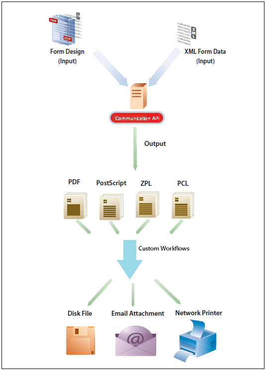

# Utilizzare le API di AEM Forms as a Cloud Service Communications {#frequently-asked-questions}

**La funzione Comunicazioni è in versione beta.**

Le API di comunicazione consentono di combinare modelli XDP, documenti PDF basati su XDP e Acrobat Forms (AcroForm) con dati XML per generare documenti di stampa in vari formati e di creare applicazioni che consentono di:

- Genera i documenti compilando i file modello con dati XML.

- Generare moduli in vari formati, compresi flussi di stampa PDF non interattivi.

- Genera PDF di stampa da PDF modulo XFA.

- Generare in blocco documenti PDF, PostScript, PCL e ZPL unendo più set di dati con modelli di origine.

Considerare uno scenario in cui si dispone di uno o più modelli e più record di dati XML per ciascun modello. Puoi utilizzare le API di comunicazione per generare un documento di stampa per ogni record. <!-- You can also combine the records into a single document. --> Il risultato è un documento PDF non interattivo. Un documento PDF non interattivo non consente agli utenti di immettere dati nei campi.

La [Documentazione di riferimento API](https://documentcloud.adobe.com/link/track?uri=urn:aaid:scds:US:b1223732-ae0f-4921-bdc0-c31e48b56044) fornisce informazioni dettagliate su tutte le API, i parametri, i metodi di autenticazione e i vari servizi forniti dalle API. La documentazione di riferimento API è disponibile anche in formato .yaml. Puoi scaricare il file .yaml per [API batch](assets/batch-api.yaml) o [API.yaml non batch](assets/non-batch-api.yaml) e caricalo su postman per verificare la funzionalità delle API.

>[!VIDEO](https://video.tv.adobe.com/v/335771)

Caricamento del file .yaml delle API di comunicazione in postman per verificare la funzionalità delle API.

>[!NOTE]
>
>Solo i membri del gruppo utenti moduli possono accedere alle API di comunicazione.

## Abilitazione delle comunicazioni

Per abilitare le comunicazioni per l’ambiente as a Cloud Service di Forms:

1. Accedi a Cloud Manager e apri la tua istanza as a Cloud Service di AEM Forms.

1. Apri l’opzione Modifica programma , vai alla scheda Soluzioni e componenti aggiuntivi e seleziona la **[!UICONTROL Forms - Comunicazioni]** opzione .

   <!-- 

    If you have already enabled the **[!UICONTROL Forms - Digital Enrollment]** option, then select the **[!UICONTROL Forms - Communications Add-On]** option.  

    <!--  -->

1. Fai clic su **[!UICONTROL Aggiorna]**.

1. Esegui la pipeline di compilazione.

Una volta che la pipeline di build ha esito positivo, le API di comunicazione sono abilitate per l’ambiente.

## Utilizzo delle API di comunicazione {#workflows}

In genere, si crea un modello utilizzando [Designer](use-forms-designer.md) e utilizza le API di comunicazione per:

- Convertire questi modelli in vari formati, tra cui PDF, PostScript, ZPL e PCL.
- Unire i dati del modulo XML a una struttura del modulo per generare un documento.
- Generare un documento senza unire i dati del modulo XML nel documento. Tuttavia, il flusso di lavoro principale sta unendo i dati nel documento.

Quindi, il documento di output viene memorizzato in un file. È possibile progettare flussi di lavoro personalizzati per l&#39;invio del file a una stampante di rete, a una stampante locale o a un sistema di storage per l&#39;archiviazione. I flussi di lavoro predefiniti e personalizzati si presentano come segue:



### Creare documenti PDF {#create-pdf-documents}

È possibile utilizzare _generatePDFOutput_ API per creare un documento PDF basato su una struttura del modulo e sui dati del modulo XML. L’output è un documento PDF non interattivo. In altre parole, gli utenti non possono immettere o modificare i dati del modulo. Un flusso di lavoro di base consiste nell’unire i dati del modulo XML a una struttura del modulo per creare un documento PDF. Nell’illustrazione seguente viene illustrato l’unione di una struttura del modulo e dei dati del modulo XML per produrre un documento PDF.


### Crea documento PostScript (PS), PCL (Printer Command Language), Zebra Printing Language (ZPL) {#create-PS-PCL-ZPL-documents}

È possibile utilizzare le API di comunicazione per creare documenti PostScript (PS), PCL (Printer Command Language) e Zebra Printing Language (ZPL) basati su una struttura del modulo XDP o su un documento PDF. La _generatePrintOutput_ L’API unisce una struttura del modulo ai dati del modulo per generare un documento. È possibile salvare il documento in un file e sviluppare un processo personalizzato per inviarlo a una stampante.

<!-- ### Processing batch data to create multiple documents

Communications APIs can create separate documents for each record within an XML batch data source. The APIs can also create a single document that contains all records (this functionality is the default). Assume that an XML data source contains ten records and you instruct the APIs to create a separate document for each record (for example, PDF documents). As a result, the APIs generate ten PDF documents.

The following illustration also shows Communications APIs processing an XML data file that contains multiple records. However, assume that you instruct the APIs to create a single PDF document that contains all data records. In this situation, the APIs generate one document that contains all of the records.

The following illustration shows Communications APIs processing an XML data file that contains multiple records. Assume that you instruct the Communications APIs to create a separate PDF document for each data record. In this situation, the APIs generates a separate PDF document for each data record.

 -->

### Elaborazione di dati batch per creare più documenti {#processing-batch-data-to-create-multiple-documents}

È possibile creare documenti separati per ogni record all&#39;interno di un&#39;origine dati batch XML. Puoi generare documenti in modalità collettiva e asincrona. Puoi configurare vari parametri per la conversione e quindi avviare il processo batch. <!-- You can can also create a single document that contains all records (this functionality is the default).  Assume that an XML data source contains ten records and you have a requirement to create a separate document for each record (for example, PDF documents). You can use the Communication APIs to generate ten PDF documents. -->

<!-- The following illustration shows the Communication APIs processing an XML data file that contains multiple records. However, assume that you instruct the Communication APIs to create a single PDF document that contains all data records. In this situation, the Communication APIs generate one document that contains all of the records.


The following illustration shows the Communication APIs processing an XML data file that contains multiple records. Assume that you instruct the Communication APIs to create a separate PDF document for each data record. In this situation, the Communication APIs generates a separate PDF document for each data record.


For detailed information on using Batch APIs, see Communication APIs: Processing batch data to create multiple documents. -->

### Flatten interattivi documenti PDF {#flatten-interactive-pdf-documents}

È possibile utilizzare le API di comunicazione per trasformare un documento PDF interattivo (ad esempio un modulo) in un documento PDF non interattivo. Un documento PDF interattivo consente agli utenti di immettere o modificare i dati contenuti nei campi del documento di PDF. Il processo di trasformazione di un documento PDF interattivo in un documento PDF non interattivo è denominato appiattimento. Quando un documento PDF viene appiattito, un utente non può modificare i dati presenti nei campi del documento. Un motivo per appiattire un documento di PDF è garantire che i dati non possano essere modificati.

È possibile appiattire i seguenti tipi di documenti PDF:

- Documenti PDF interattivi creati in Designer (che contengono flussi XFA).

- PDF forms Acrobat

Se si tenta di appiattire un documento PDF non interattivo, si verifica un’eccezione.

### Mantieni stato modulo {#retain-form-state}

Un documento PDF interattivo contiene vari elementi che costituiscono un modulo. Questi elementi possono includere campi (per accettare o visualizzare dati), pulsanti (per attivare eventi) e script (comandi per eseguire un’azione specifica). Facendo clic su un pulsante è possibile attivare un evento che modifica lo stato di un campo. Ad esempio, la scelta di un’opzione di genere può modificare il colore di un campo o l’aspetto del modulo. Questo è un esempio di un evento manuale che causa la modifica dello stato del modulo.

Quando un documento PDF interattivo di questo tipo viene appiattito utilizzando le API di comunicazione, lo stato del modulo non viene mantenuto. Per garantire che lo stato del modulo sia mantenuto anche dopo l’appiattimento del modulo, impostare il valore booleano _keepFormState_ su True per salvare e mantenere lo stato del modulo.

### Considerazioni per le API di comunicazione {#considerations-for-communications-apis}

#### Dati modulo {#form-data}

Le API di comunicazione accettano come input sia una struttura del modulo generalmente creata in Designer che i dati del modulo XML. Per compilare un documento con i dati, nei dati del modulo XML deve esistere un elemento XML per ogni campo del modulo che si desidera compilare. Il nome dell&#39;elemento XML deve corrispondere al nome del campo. Un elemento XML viene ignorato se non corrisponde a un campo modulo o se il nome dell’elemento XML non corrisponde al nome del campo. Non è necessario stabilire una corrispondenza con l’ordine di visualizzazione degli elementi XML. Il fattore importante è che gli elementi XML sono specificati con i valori corrispondenti.

Prendi in considerazione il seguente modulo di richiesta di prestito:


Per unire i dati alla struttura del modulo, creare un’origine dati XML corrispondente al modulo. L&#39;XML seguente rappresenta un&#39;origine dati XML corrispondente al modulo di applicazione per l&#39;ipoteca di esempio.

```XML
<?xml version="1.0" encoding="UTF-8" ?>
- <xfa:datasets xmlns:xfa="http://www.xfa.org/schema/xfa-data/1.0/">
- <xfa:data>
- <data>
    - <Layer>
        <closeDate>1/26/2007</closeDate>
        <lastName>Johnson</lastName>
        <firstName>Jerry</firstName>
        <mailingAddress>JJohnson@NoMailServer.com</mailingAddress>
        <city>New York</city>
        <zipCode>00501</zipCode>
        <state>NY</state>
        <dateBirth>26/08/1973</dateBirth>
        <middleInitials>D</middleInitials>
        <socialSecurityNumber>(555) 555-5555</socialSecurityNumber>
        <phoneNumber>5555550000</phoneNumber>
    </Layer>
    - <Mortgage>
        <mortgageAmount>295000.00</mortgageAmount>
        <monthlyMortgagePayment>1724.54</monthlyMortgagePayment>
        <purchasePrice>300000</purchasePrice>
        <downPayment>5000</downPayment>
        <term>25</term>
        <interestRate>5.00</interestRate>
    </Mortgage>
</data>
</xfa:data>
</xfa:datasets>
```

#### Tipi di documenti supportati {#supported-document-types}

Per un accesso completo alle funzionalità di rendering delle API di comunicazione, si consiglia di utilizzare un file XDP come input. In alcuni casi, è possibile utilizzare un file PDF. Tuttavia, l’utilizzo di un file PDF come input presenta le seguenti limitazioni:

- Un documento PDF che non contiene un flusso XFA non può essere rappresentato come PostScript, PCL o ZPL. Le API di comunicazione possono eseguire il rendering dei documenti PDF con flussi XFA (ovvero moduli creati in Designer) in formati laser ed etichette. Se il documento PDF è firmato, certificato o contiene diritti di utilizzo (applicati utilizzando il servizio AEM Forms Reader Extensions), non può essere sottoposto a rendering in questi formati di stampa.

<!-- * Run-time options such as PDF version and tagged PDF are not supported for Acrobat forms. They are valid for PDF forms that contain XFA streams; however, these forms cannot be signed or certified. 

#### Email support {#email-support}

For email functionality, you can create a process in AEM Workflows that uses the Email Step. A workflow represents a business process that you are automating. -->

#### Aree stampabili {#printable-areas}

Il margine non stampabile predefinito da 0,25&quot; non è esatto per le stampanti di etichette e varia dalla stampante alla stampante e dalle dimensioni dell&#39;etichetta alle dimensioni dell&#39;etichetta. Si consiglia di mantenere o ridurre il margine di 0,25&quot;. Tuttavia, si consiglia di non aumentare il margine non stampabile. In caso contrario, le informazioni contenute nell&#39;area stampabile non vengono stampate correttamente.

Assicurarsi sempre di utilizzare il file XDC corretto per la stampante. Ad esempio, evitare di scegliere un file XDC per una stampante a 300 dpi e inviare il documento a una stampante a 200 dpi.

#### Script {#scripts}

Una struttura del modulo utilizzata con le API di comunicazione può contenere script eseguiti sul server. Assicurarsi che una struttura del modulo non contenga script eseguiti sul client. Per informazioni sulla creazione degli script di struttura del modulo, vedere la Guida di Designer.

<!-- #### Working with Fonts
 Document Considerations for Working with Fonts>> -->

#### Mappatura dei font {#font-mapping}

Se un font è installato in un computer client, è disponibile nell’elenco a discesa in Designer. Se il font non è installato, è necessario specificare manualmente il nome del font. L’opzione &quot;Sostituisci definitivamente font non disponibili&quot; in Designer può essere disattivata. In caso contrario, quando il file XDP viene salvato in Designer, il nome del font sostitutivo viene scritto nel file XDP. Ciò significa che il font residente nella stampante non viene utilizzato.

Per progettare un modulo che utilizza font residenti nella stampante, scegliere un nome di font corrispondente ai font disponibili nella stampante in Designer. Un elenco di font supportati per PCL o PostScript si trova nei corrispondenti profili dispositivo (file XDC). In alternativa, è possibile creare la mappatura dei font per associare i font non residenti nella stampante ai font residenti nella stampante con un nome di font diverso. Ad esempio, in uno scenario PostScript, i riferimenti al carattere Arial® possono essere mappati al carattere Helvetica® residente nella stampante.

Esistono due tipi di font OpenType®. Un tipo è un font TrueType OpenType® supportato da PCL. L&#39;altro è CFF OpenType®. L&#39;output PDF e PostScript supporta i font incorporati Type-1, TrueType e OpenType®. L&#39;output PCL supporta i font TrueType incorporati.

I font Type-1 e OpenType® non sono incorporati nell&#39;output PCL. Il contenuto formattato con font Type-1 e OpenType® viene rasterizzato e generato come immagine bitmap di grandi dimensioni e più lento da generare.

I font scaricati o incorporati vengono sostituiti automaticamente durante la generazione dell’output PostScript, PCL o PDF. Ciò significa che solo il sottoinsieme dei glifi di font necessari per il corretto rendering del documento generato è incluso nell’output generato.

#### Utilizzo dei file di profilo del dispositivo (file XDC) {#working-with-xdc-files}

Un profilo dispositivo (file XDC) è un file di descrizione della stampante in formato XML. Questo file consente alle API di comunicazione di inviare i documenti come formati laser o di stampa delle etichette. Le API di comunicazione utilizzano i file XDC, tra cui:

- hppcl5c.xdc

- hppcl5e.xdc

- ps_plain_level3.xdc

- ps_plain.xdc

- zpl300.xdc

- zpl600.xdc

- zpl300.xdc

- ipl300.xdc

- ipl400.xdc

- tpcl600.xdc

- dpl300.xdc

- dpl406.xdc

- dpl600.xdc

Non è necessario modificare questi file per creare documenti. Tuttavia, puoi modificarli per soddisfare le tue esigenze aziendali.

Questi file sono file XDC di esempio che supportano le caratteristiche di stampanti specifiche, ad esempio font residenti, vassoi di carta e adesivi. Lo scopo di questi esempi è quello di aiutarti a capire come impostare le tue stampanti utilizzando i profili dei dispositivi. I campioni sono anche un punto di partenza per stampanti simili nella stessa linea di prodotti.

#### Utilizzo del file di configurazione XCI {#working-with-xci-files}

Le API di comunicazione utilizzano un file di configurazione XCI per eseguire attività quali controllare se l’output è un singolo pannello o impaginato. Anche se questo file contiene impostazioni che possono essere impostate, non è tipico modificare questo valore. <!-- The default.xci file is located in the svcdata\XMLFormService folder. -->

Puoi trasmettere un file XCI modificato mentre utilizzi un’API di comunicazione. In questo modo, crea una copia del file predefinito, modifica solo i valori che richiedono modifiche per soddisfare i requisiti aziendali e utilizza il file XCI modificato.

Le API di comunicazione iniziano con il file XCI predefinito (o il file modificato). Quindi applica i valori specificati utilizzando le API di comunicazione. Questi valori sostituiscono le impostazioni XCI.

La tabella seguente specifica le opzioni XCI.

| Opzione XCI | Descrizione |
| ------------------------------------- | ----------------------------------------------------------------------------------------------------------------------------------------------------------------------------------------------------------------------------------------------------------------------------------------------------------------------------------------------------------------------------------------------------------------------------------------------------------------------------------------------------------- |
| config/current/pdf/creator | Identifica il creatore del documento utilizzando la voce Creatore nel dizionario Informazioni documento. Per informazioni su questo dizionario, consultare la guida di riferimento di PDF. |
| config/present/pdf/produttore | Identifica il produttore del documento utilizzando la voce Produttore nel dizionario Informazioni documento. Per informazioni su questo dizionario, consultare la guida di riferimento di PDF. |
| configurazione/attuale/layout | Controlla se l&#39;output è un singolo pannello o impaginato. |
| config/current/pdf/compressione/level | Specifica il grado di compressione da utilizzare per la generazione di un documento PDF. |
| config/current/pdf/scriptModel | Controlla se le informazioni specifiche di XFA sono incluse nel documento PDF di output. |
| config/current/common/data/adjustData | Controlla se l&#39;applicazione XFA regola i dati dopo l&#39;unione. |
| config/current/pdf/renderPolicy | Controlla se la generazione del contenuto della pagina viene eseguita sul server o differita al client. |
| config/present/common/locale | Specifica le impostazioni internazionali predefinite utilizzate nel documento di output. |
| configurazione/presente/destinazione | Se contenuto da un elemento presente, specifica il formato di output. Se contenuto in un elemento openAction, specifica l&#39;azione da eseguire all&#39;apertura del documento in un client interattivo. |
| configurazione/attuale/uscita/tipo | Specifica il tipo di compressione da applicare a un file o il tipo di output da produrre. |
| config/current/common/temp/uri | Specifica l’URI del modulo. |
| config/present/common/template/base | Fornisce una posizione di base per gli URI nella struttura del modulo. Quando questo elemento è assente o vuoto, la posizione della struttura del modulo viene utilizzata come base. |
| config/present/common/log/to | Controlla la posizione in cui vengono scritti i dati di registro o di output. |
| config/current/output/to | Controlla la posizione in cui vengono scritti i dati di registro o di output. |
| config/present/script/currentPage | Specifica la pagina iniziale all&#39;apertura del documento. |
| config/present/script/exclude | Indica alle API server/comunicazioni di AEM Forms gli eventi da ignorare. |
| config/current/pdf/linearized | Controlla se il documento PDF di output è linearizzato. |
| config/present/script/runScripts | Controlla quale insieme di script viene eseguito da AEM Forms. |
| config/present/pdf/tagged | Controlla l’inclusione dei tag nel documento PDF di output. I tag, nel contesto di PDF, sono informazioni aggiuntive incluse in un documento per esporre la struttura logica del documento. I tag facilitano gli strumenti di accessibilità e la riformattazione. Ad esempio, un numero di pagina può essere contrassegnato come artefatto in modo che l’assistente vocale non lo pronunci al centro del testo. Anche se i tag rendono un documento più utile, aumentano anche le dimensioni del documento e il tempo di elaborazione necessario per crearlo. |
| config/present/pdf/version | Specifica la versione del documento PDF da generare. |

### Problemi noti

- Assicurati che le dimensioni del modello e dei file di configurazione XCI siano superiori a 16 KB.

- Assicurati che il file xml dei dati non contenga l&#39;intestazione della dichiarazione XML. Esempio, `<?xml version="1.0" encoding="UTF-8"?>`

- Per una configurazione batch, una sola istanza di combinazione di valori di OutputType(PDF, PRINT) e RenderType(PostScript, PCL, IPL, ZPL, ecc.) è consentito.

- Non modificare la configurazione USC/Azure Cloud dell’origine dati utilizzata in una configurazione batch mentre il batch è in esecuzione. Anche dopo l&#39;esecuzione, se è necessario un aggiornamento, crea una copia della configurazione invece di aggiornare quella utilizzata in una configurazione batch esistente.

### Best practice  

- Adobe consiglia di ospitare l’archivio dei contenitori BLOB di file di dati nell’area cloud utilizzata da AEM Cloud Service.

<!-- Using API

 There are two main Communications APIs. The _generatePDFOutput_ generates PDFs, while the _generatePrintedOutput_ generates PostScript, ZPL, and PCL formats. These APIs are available as HTTP endpoints on your environment, both on author and publish instances. Since the publish instances are configured to scale faster than the author instances, it is recommended use these APIs via publish instances.

The first parameter of both the operations accept the path and name of the template file (for example ExpenseClaim.xdp). You can specify a fully qualified path, reference path of your AEM Repository, or path of a binary file. The second parameter accepts an XML document that is merged with the template while generating the output document. -->


