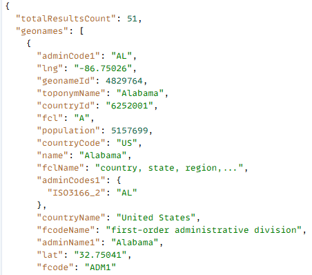
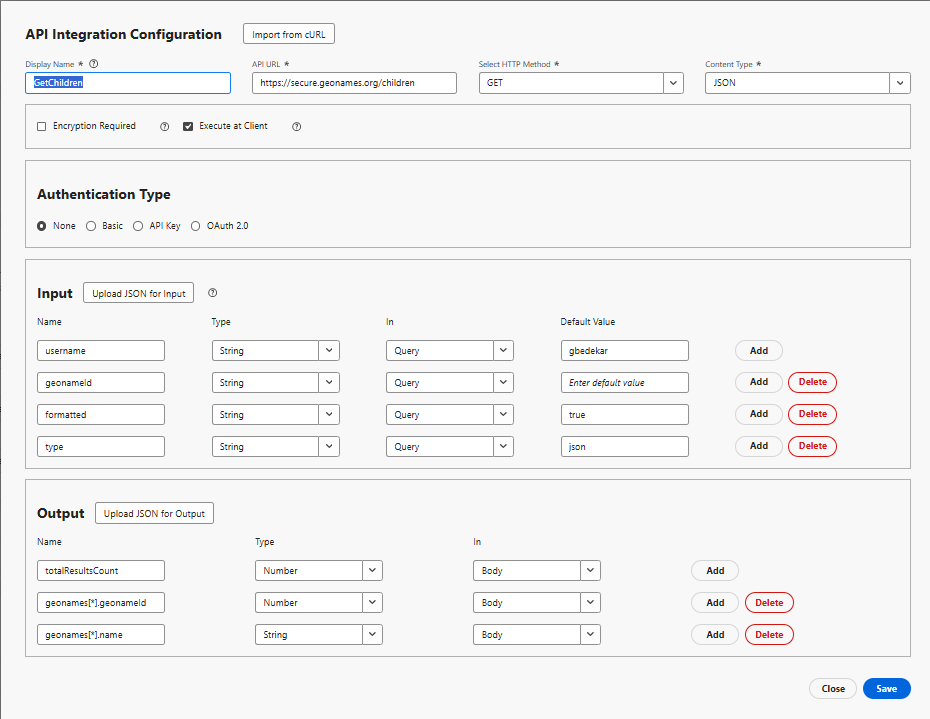

# Creare integrazione API

In questa esercitazione, vengono create 2 integrazioni API

- GetAllCountries restituisce un elenco di paesi
- GetChildren - Restituire gli elementi figlio di primo livello del paese o dello stato rappresentato dal geonameId

## GetAllCountries: configurazione dell’integrazione API

- Configurazione dell’integrazione API

   - Nome visualizzato: GetAllCountries → etichetta per questa API nel sistema.

   - URL API: `https://secure.geonames.org/countryInfoJSON` - l’endpoint che stai chiamando.

   - Metodo HTTP: GET - stai effettuando una semplice richiesta GET.

   - Tipo di contenuto: JSON - è prevista una risposta in formato JSON.

- Opzioni:

   - Crittografia obbligatoria deselezionata: nessun livello di crittografia oltre HTTPS.

   - Eseguire sul client selezionato: la chiamata viene eseguita dal client/browser, non lato server.
- Tipo di autenticazione
   - Nessuno: poiché l’API GeoNames non richiede le chiavi OAuth o API nelle intestazioni
- Input:
   - La sezione di input definisce ciò che viene inviato nell’API
   - **nomeutente** →:tipo stringa, inviato nella query. Impostazione predefinita: gbedekar.
   - Ogni richiesta aggiunge ?username=gbedekar all’URL
- Output
   - L’output definisce quali campi della risposta JSON devono essere estratti e utilizzati.
La risposta GeoNames si presenta così:

  
   - Due campi mappati dall’interno dell’array geonames:

     geonames[*].geonameId → come numero

     geonames[*].countryName → come stringa

     [*] significa che si ripete per ogni paese nell&#39;array.

## GetChildren

Richiede a GeoNames gli elementi figlio di primo livello del luogo il cui geonamesId viene passato come parametro di query

- Configurazione dell’integrazione API

   - Nome visualizzato: GetAllCountries → etichetta per questa API nel sistema.

   - URL API: `https://secure.geonames.org/children` → l’endpoint che stai chiamando.

   - Metodo HTTP: GET → stai effettuando una semplice richiesta GET.

   - Tipo di contenuto: JSON → è prevista una risposta in formato JSON.

- Opzioni:

   - Crittografia obbligatoria deselezionata → nessun livello di crittografia oltre HTTPS.

   - Eseguire sul client selezionato → la chiamata viene eseguita dal client/browser, non lato server.
- Tipo di autenticazione
   - Nessuno: poiché l’API GeoNames non richiede le chiavi OAuth o API nelle intestazioni
- Input:
   - Definisce cosa viene inviato nell’API
   - **nomeutente** →tipo: stringa, inviato nella query. Impostazione predefinita: gbedekar.
   - Ogni richiesta aggiunge ?username=gbedekar all’URL
   - **geonameId** -> tipo: stringa. Restituisce gli elementi figlio del paese/stato rappresentato dal geonameId
   - **tipo** =>stringa. L’impostazione su json restituisce la risposta in formato JSON.
- Output
   - Definisce quali campi della risposta JSON devono essere estratti e utilizzati.
La risposta GeoNames si presenta così:

  
   - Due campi mappati dall’interno dell’array geonames:

     geonames[*].geonameId → come numero

     geonames[*].name → come stringa

     [*] significa che si ripete per ogni paese nell&#39;array.

