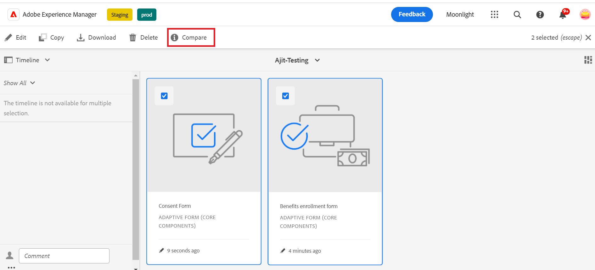

## Confronta Forms adattivo {#compare-two-forms}

 Si tratta di una funzione pre-release accessibile tramite [canale preliminare](https://experienceleague.adobe.com/docs/experience-manager-cloud-service/content/release-notes/prerelease.html#new-features). 

Quando gli autori dei moduli devono confrontare due moduli distinti in base ai campi, al contenuto e ai componenti dei moduli, confrontano i due moduli. Per poter confrontare i due moduli, l&#39;autore deve assicurarsi che si trovino nella stessa directory o cartella. Per confrontare due moduli adattivi distinti, effettua le seguenti operazioni:

1. Seleziona i moduli adattivi e fai clic su **[!UICONTROL Confronta]**.

   

1. Facendo clic su, vengono visualizzati due moduli in modalità anteprima. Seleziona il primo modulo come modulo di base da confrontare con il secondo modulo e confronta il contenuto tra i due moduli, che sono simili e differenziati. Il contenuto differenziato del primo modulo è contrassegnato in verde come mostrato nell’immagine.

   

## Consulta anche {#see-also}

{{see-also}}

