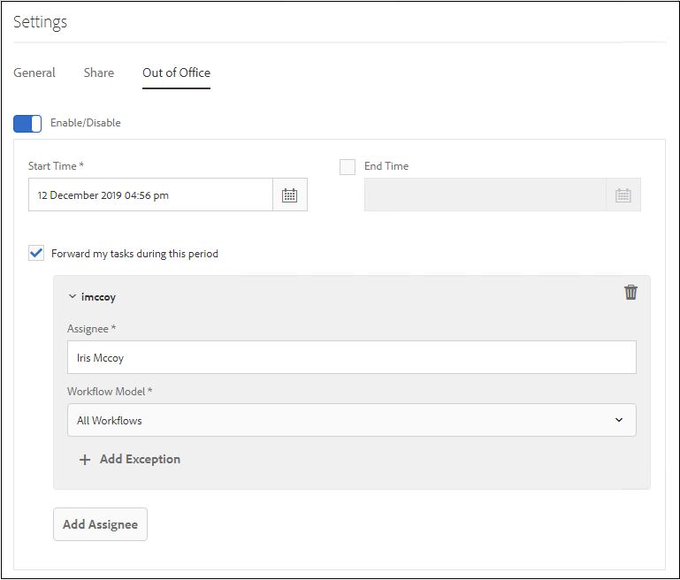

# Configura impostazione Fuori sede {#configure-out-of-office-settings}

| Versione | Collegamento articolo |
| -------- | ---------------------------- |
| AEM 6.5 | [Fai clic qui](https://experienceleague.adobe.com/docs/experience-manager-65/forms/workflows/configure-out-of-office-settings.html) |
| AEM as a Cloud Service | Questo articolo |

Se si prevede di uscire dall&#39;ufficio, è possibile specificare cosa accade agli articoli assegnati per quel periodo.

È possibile specificare una data e un&#39;ora di inizio e una data e un&#39;ora di fine per rendere effettive le impostazioni di fuori sede. Se ti trovi in un fuso orario diverso da quello del server, quello del client.

Puoi impostare una persona predefinita a cui vengono inviati tutti gli elementi. È inoltre possibile specificare eccezioni per gli elementi di processi specifici da inviare a un utente diverso o da rimanere nella Posta in arrivo fino a quando non si torna indietro. Se anche la persona designata è fuori dall&#39;ufficio, l&#39;elemento va all&#39;utente che ha designato. Se l&#39;oggetto non può essere assegnato a un utente che non è fuori sede, l&#39;oggetto rimarrà nella Posta in arrivo.

Puoi segregare la delega di elementi in base ai modelli di flusso di lavoro. Ad esempio, è possibile assegnare un elemento relativo al flusso di lavoro A all&#39;utente A e assegnare un elemento relativo al flusso di lavoro B all&#39;utente B.

>[!NOTE]
>
>* Quando si attiva l&#39;impostazione Fuori sede, tutti gli elementi disponibili nella cartella Posta in arrivo prima dell&#39;attivazione rimangono nella cartella Posta in arrivo. Vengono delegati solo gli elementi ricevuti dopo l’abilitazione dell’impostazione.
>* Quando si disattiva l&#39;impostazione Fuori sede, gli elementi delegati non vengono riassegnati automaticamente all&#39;utente. È possibile utilizzare la funzionalità di richiesta di risarcimento per assegnare gli articoli.
>* Quando l&#39;utente A delega gli elementi all&#39;utente B e l&#39;utente B delega ulteriormente all&#39;utente C, gli elementi vengono assegnati solo all&#39;utente C e non all&#39;utente B.
>* Quando è presente un ciclo nell&#39;assegnazione, le attività rimangono all&#39;utente originale. Ad esempio, quando l&#39;utente A delega gli elementi all&#39;utente B, l&#39;utente B delega all&#39;utente C, l&#39;utente C delega all&#39;utente D e l&#39;utente D delega all&#39;utente B, viene creato un loop. In tale situazione, l’elemento rimane con l’Utente originale. L’utente A è l’utente originale nell’esempio precedente.

## Abilitare l&#39;impostazione Fuori sede per l&#39;account {#enable-out-of-office}

Per abilitare l&#39;impostazione Fuori sede per l&#39;account e delegare gli elementi della casella in entrata a un altro utente, effettuare le operazioni riportate di seguito.

1. Accedi all’istanza AEM. Selezionare l&#39;icona  e selezionare **[!UICONTROL Visualizza tutto]**. Viene visualizzato un elenco degli elementi della casella in entrata.
1. Seleziona l&#39;icona  o  accanto al pulsante **[!UICONTROL Crea]** e seleziona **[!UICONTROL Impostazioni]**. Viene visualizzata la finestra di dialogo delle impostazioni.
1. Apri la scheda **[!UICONTROL Fuori sede]** nella finestra di dialogo delle impostazioni.
1. Selezionare il pulsante **[!UICONTROL Abilita/Disabilita]** per abilitare l&#39;impostazione Fuori sede.
1. Specifica l&#39;**[!UICONTROL Ora inizio]** e l&#39;**[!UICONTROL Ora fine]** per l&#39;impostazione. Gli elementi vengono delegati solo durante il periodo specificato. Lascia vuoto il campo **[!UICONTROL Ora di fine]** per delegare gli elementi per un periodo di tempo indefinito.
1. Selezionare la casella di controllo **[!UICONTROL Inoltra elementi personali durante questo periodo]**. Se non selezioni l’opzione e non specifichi un assegnatario, gli elementi non vengono inoltrati ad alcun utente. Anche se sei assente e l’impostazione è abilitata, gli elementi rimangono nella casella in entrata.
1. Seleziona **[!UICONTROL Aggiungi assegnatario]**. Specifica un utente nel campo **[!UICONTROL Assegnatario]** a cui delegare gli elementi. Specifica il **[!UICONTROL modello flusso di lavoro]** da delegare all&#39;utente specificato. È possibile selezionare più modelli di flusso di lavoro.

   Inoltre, per assegnare tutti gli elementi, indipendentemente dal modello di flusso di lavoro, a un utente specifico, selezionare **[!UICONTROL Tutti i flussi di lavoro]** dall&#39;elenco a discesa Modello flusso di lavoro.  

   Per assegnare gli elementi a un utente specifico per tutti i modelli di workflow ad eccezione di alcuni, selezionare **[!UICONTROL Tutti i flussi di lavoro]** dall&#39;elenco a discesa Modello di workflow, selezionare **[!UICONTROL + Aggiungi eccezioni]** e specificare i modelli di workflow da escludere.
    

   Ripeti il passaggio per aggiungere altri assegnatari.  

   >[!NOTE]
   >
   >L&#39;ordine degli assegnatari è importante. Quando un elemento viene assegnato a un utente che ha abilitato l&#39;impostazione Fuori sede, l&#39;elemento viene valutato in base all&#39;elenco degli assegnatari specificato nell&#39;ordine in cui vengono aggiunti gli assegnatari. Quando un elemento corrisponde ai criteri, viene assegnato all&#39;assegnatario e l&#39;assegnatario successivo non viene selezionato.

1. Seleziona **[!UICONTROL Salva]**. L&#39;impostazione ha effetto alla data e all&#39;ora di inizio specificate. Se si effettua l&#39;accesso mentre si è fuori sede, non si viene considerati in ufficio fino a quando non si modificano le impostazioni.

Ora gli elementi assegnati durante il periodo Fuori sede vengono assegnati automaticamente all&#39;assegnatario specificato.

>[!NOTE]
>
>(Solo per elementi del flusso di lavoro incentrati su Forms) Abilita l&#39;assegnatario **[!UICONTROL Consenti delega utilizzando l&#39;opzione &quot;Fuori sede&quot;]** del passaggio **[!UICONTROL Assegna attività]** nel flusso di lavoro. Solo gli elementi per i quali è attivata l&#39;opzione sopra indicata vengono delegati ad altri utenti.
>(Solo per elementi del flusso di lavoro incentrati su Forms) Abilita l&#39;opzione **[!UICONTROL Consenti all&#39;assegnatario di delegare utilizzando le impostazioni &quot;Fuori sede&quot;]** del passaggio **[!UICONTROL Assegna attività]** nel flusso di lavoro. Solo gli elementi per i quali è abilitata l’opzione precedentemente indicata vengono delegati ad altri utenti.

## Limitazioni {#limitations}

* L&#39;assegnazione di elementi a un gruppo non è supportata.
* L&#39;abilitazione Fuori sede per le attività di progetto non è attualmente supportata.
