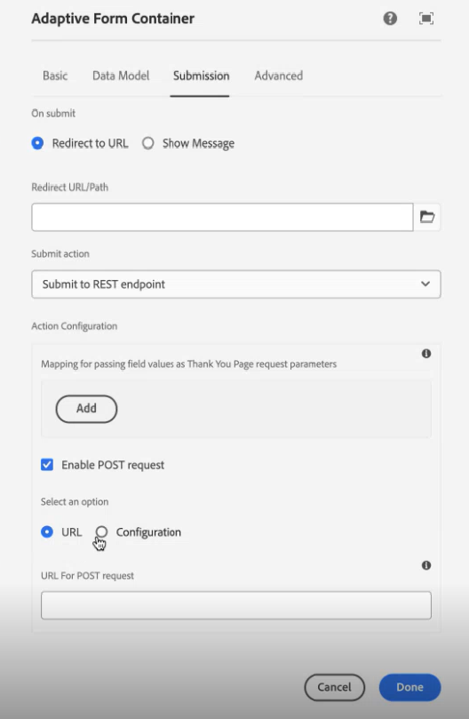

# Configurare un modulo adattivo per l’azione di invio dell’endpoint REST

 La funzionalità per specificare l&#39;endpoint REST utilizzando la configurazione è un programma per l&#39;adozione anticipata ed è applicabile solo ai Componenti core e a Edge Delivery Services Forms. Puoi scrivere a `aem-forms-ea@adobe.com` dal tuo ID e-mail ufficiale per partecipare al programma early adopter e richiedere l&#39;accesso alla funzionalità. 

Utilizza l&#39;azione **[!UICONTROL Invia all&#39;endpoint REST]** per inviare i dati inviati a un URL REST. L’URL può essere interno (il server sul quale viene eseguito il rendering del modulo) o esterno.

AEM as a Cloud Service offre diverse azioni di invio pronte all’uso per la gestione degli invii di moduli. Ulteriori informazioni su queste opzioni sono disponibili nell&#39;articolo [Azione di invio modulo adattivo](/help/forms/aem-forms-submit-action.md).

## Vantaggi

Alcuni dei vantaggi della configurazione dell&#39;azione di invio **[!UICONTROL Invia all&#39;endpoint REST]** per Adaptive Forms sono:

* Consente l’integrazione diretta dei dati dei moduli con sistemi e servizi esterni tramite API RESTful.
* Fornisce flessibilità nella gestione delle richieste di dati da Adaptive Forms, supportando strutture di dati dinamiche e complesse.
* Supporta la mappatura dinamica dei campi modulo ai parametri nell’URL dell’endpoint REST, consentendo l’invio di dati adattabili e personalizzabili.

## Configurare l’azione di invio Invia a endpoint REST {#steps-to-configure-submit-to-restendpoint-submit-action}

>[!BEGINTABS]

>[!TAB Componente di base]

Per configurare l’azione di invio in base alla specifica API aperta Swagger per un modulo adattivo basato su componenti di base, procedi come segue:

1. Apri il modulo adattivo per la modifica e passa alla sezione **[!UICONTROL Invio]** delle proprietà Contenitore modulo adattivo.
1. Dall&#39;elenco a discesa **[!UICONTROL Invia azione]**, selezionare **[!UICONTROL Invia all&#39;endpoint REST]**.

   

   Per pubblicare i dati su un server interno, specifica il percorso della risorsa. I dati vengono inseriti nel percorso della risorsa. Ad esempio, `/content/restEndPoint`. Per tali richieste successive, vengono utilizzate le informazioni di autenticazione della richiesta di invio.
Questa opzione consente di immettere direttamente l’endpoint REST di destinazione.
Per pubblicare dati su un server esterno, fornisci un URL. Il formato dell’URL è `https://host:port/path_to_rest_end_point`. Assicurati di configurare il percorso per gestire la richiesta POST in modo anonimo.
   

   Nell&#39;esempio precedente, le informazioni immesse dall&#39;utente in `textbox` vengono acquisite tramite il parametro `param1`. La sintassi per pubblicare i dati acquisiti tramite `param1` è:

   `String data=request.getParameter("param1");`

   Analogamente, i parametri utilizzati per la registrazione di dati e allegati XML sono `dataXml` e `attachments`.

   Ad esempio, questi due parametri vengono utilizzati nello script per analizzare i dati in un punto finale rest. Utilizza la sintassi seguente per archiviare e analizzare i dati:

   `String data=request.getParameter("dataXml");`
   `String att=request.getParameter("attachments");`

   In questo esempio, `data` memorizza i dati XML e `att` i dati dell&#39;allegato.
L&#39;azione di invio **[!UICONTROL Invia all&#39;endpoint REST]** invia i dati compilati nel modulo a una pagina di conferma configurata come parte della richiesta HTTP GET. Puoi aggiungere il nome del campo da richiedere. Il formato della richiesta è:
   `{fieldName}={request parameter name}`

   Come mostrato nell&#39;immagine seguente, `param1` e `param2` vengono passati come parametri con valori copiati dai campi **textbox** e **numericbox** per l&#39;azione successiva.

   

   Puoi anche **[!UICONTROL abilitare la richiesta POST]** e fornire un URL per pubblicare la richiesta. Per inviare i dati al server AEM che ospita il modulo, utilizza un percorso relativo corrispondente al percorso principale del server AEM. Ad esempio, `/content/forms/af/SampleForm.html`. Per inviare dati a qualsiasi altro server, utilizzare il percorso assoluto.

1. Fai clic su **[!UICONTROL Fine]**.

>[!TAB Componente core]

Per configurare l’azione di invio in base alle specifiche API aperte di Swagger per un modulo adattivo basato su componenti core:

1. Apri il browser Contenuto e seleziona il componente **[!UICONTROL Contenitore guida]** del modulo adattivo.
1. Fare clic sull&#39;icona delle proprietà del Contenitore Guida TV . Viene visualizzata la finestra di dialogo Contenitore modulo adattivo (Adaptive Form Container).
1. Fare clic sulla scheda **[!UICONTROL Invio]**.
1. Dall&#39;elenco a discesa **[!UICONTROL Invia azione]**, selezionare **[!UICONTROL Invia all&#39;endpoint REST]**.

   

   Per pubblicare i dati su un server interno, specifica il percorso della risorsa. I dati vengono inseriti nel percorso della risorsa. Ad esempio, `/content/restEndPoint`. Per tali richieste POST, vengono utilizzate le informazioni di autenticazione della richiesta di invio.

   Sono disponibili due opzioni per specificare l’endpoint REST:

   +++URL

   Questa opzione consente di immettere direttamente l’endpoint REST di destinazione.
Per pubblicare dati su un server esterno, fornisci un URL. Il formato dell’URL è `https://host:port/path_to_rest_end_point`. Assicurati di configurare il percorso per gestire la richiesta POST in modo anonimo.

   

   Nell&#39;esempio precedente, le informazioni immesse dall&#39;utente in `textbox` vengono acquisite tramite il parametro `param1`. La sintassi per pubblicare i dati acquisiti tramite `param1` è:

   `String data=request.getParameter("param1");`

   Analogamente, i parametri utilizzati per la registrazione di dati e allegati XML sono `dataXml` e `attachments`.

   Ad esempio, questi due parametri vengono utilizzati nello script per analizzare i dati in un punto finale rest. Utilizza la sintassi seguente per archiviare e analizzare i dati:

   `String data=request.getParameter("dataXml");`
   `String att=request.getParameter("attachments");`

   In questo esempio, `data` memorizza i dati XML e `att` i dati dell&#39;allegato.

   L&#39;azione di invio **[!UICONTROL Invia all&#39;endpoint REST]** invia i dati compilati nel modulo a una pagina di conferma configurata come parte della richiesta HTTP GET. Puoi aggiungere il nome del campo da richiedere. Il formato della richiesta è:

   `{fieldName}={request parameter name}`

   Come mostrato nell&#39;immagine seguente, `param1` e `param2` vengono passati come parametri con valori copiati dai campi **textbox** e **numericbox** per l&#39;azione successiva.

   

   Puoi anche **[!UICONTROL abilitare la richiesta POST]** e fornire un URL per pubblicare la richiesta. Per inviare i dati al server AEM che ospita il modulo, utilizza un percorso relativo corrispondente al percorso principale del server AEM. Ad esempio, `/content/forms/af/SampleForm.html`. Per inviare dati a qualsiasi altro server, utilizzare il percorso assoluto.

   +++

   +++Configurazione

   Questa opzione consente di aggiungere una configurazione HTTP predefinita gestita tramite il browser configurazioni di AEM. È possibile selezionare la configurazione creata per il tipo di autenticazione dell&#39;endpoint REST del servizio e i tipi di contenuto. Per ulteriori informazioni sul tipo di autenticazione e sui tipi di contenuto, visita [configura origini dati](/help/forms/configure-data-sources.md#configure-restful-services-using-service-endpoint-configure-restful-services-service-endpoint)

   +++

1. Fai clic su **[!UICONTROL Fine]**.

>[!TAB Editor universale]

Per configurare l’azione di invio in base alle specifiche dell’API aperta Swagger per il modulo adattivo creato nell’editor universale, procedi come segue:

1. Apri il modulo adattivo per la modifica.
1. Fai clic sull&#39;estensione **Modifica proprietà modulo** nell&#39;editor.
Viene visualizzata la finestra di dialogo **Proprietà modulo**.
   >[!NOTE]
   >
   > * Se l&#39;icona **Modifica proprietà modulo** non è visibile nell&#39;interfaccia di Universal Editor, abilitare l&#39;estensione **Modifica proprietà modulo** in Extension Manager.
   > * Per informazioni su come abilitare o disabilitare le estensioni nell&#39;editor universale, consulta l&#39;articolo [Caratteristiche principali di Extension Manager](https://developer.adobe.com/uix/docs/extension-manager/feature-highlights/#enablingdisabling-extensions).
1. Fai clic sulla scheda **Invio** e seleziona **[!UICONTROL Invia all&#39;endpoint REST]** azione di invio.

   Per pubblicare i dati su un server interno, specifica il percorso della risorsa. I dati vengono inseriti nel percorso della risorsa. Ad esempio, `/content/restEndPoint`. Per tali richieste POST, vengono utilizzate le informazioni di autenticazione della richiesta di invio.

   Sono disponibili due opzioni per specificare l’endpoint REST:

   +++URL

   Questa opzione consente di immettere direttamente l’endpoint REST di destinazione.
Per pubblicare dati su un server esterno, fornisci un URL. Il formato dell’URL è `https://host:port/path_to_rest_end_point`. Assicurati di configurare il percorso per gestire la richiesta POST in modo anonimo.

   

   Nell&#39;esempio precedente, le informazioni immesse dall&#39;utente in `textbox` vengono acquisite tramite il parametro `param1`. La sintassi per pubblicare i dati acquisiti tramite `param1` è:

   `String data=request.getParameter("param1");`

   Analogamente, i parametri utilizzati per la registrazione di dati e allegati XML sono `dataXml` e `attachments`.

   Ad esempio, questi due parametri vengono utilizzati nello script per analizzare i dati in un punto finale rest. Utilizza la sintassi seguente per archiviare e analizzare i dati:

   `String data=request.getParameter("dataXml");`
   `String att=request.getParameter("attachments");`

   In questo esempio, `data` memorizza i dati XML e `att` i dati dell&#39;allegato.

   L&#39;azione di invio **[!UICONTROL Invia all&#39;endpoint REST]** invia i dati compilati nel modulo a una pagina di conferma configurata come parte della richiesta HTTP GET. Puoi aggiungere il nome del campo da richiedere. Il formato della richiesta è:

   `{fieldName}={request parameter name}`

   Come mostrato nell&#39;immagine seguente, `param1` e `param2` vengono passati come parametri con valori copiati dai campi **textbox** e **numericbox** per l&#39;azione successiva.

   

   Puoi anche **[!UICONTROL abilitare la richiesta POST]** e fornire un URL per pubblicare la richiesta. Per inviare i dati al server AEM che ospita il modulo, utilizza un percorso relativo corrispondente al percorso principale del server AEM. Ad esempio, `/content/forms/af/SampleForm.html`. Per inviare dati a qualsiasi altro server, utilizzare il percorso assoluto.

   +++

   +++Configurazione

   Questa opzione consente di aggiungere una configurazione HTTP predefinita gestita tramite il browser configurazioni di AEM. È possibile selezionare la configurazione creata per il tipo di autenticazione dell&#39;endpoint REST del servizio e i tipi di contenuto. Per ulteriori informazioni sul tipo di autenticazione e sui tipi di contenuto, visita [configura origini dati](/help/forms/configure-data-sources.md#configure-restful-services-using-service-endpoint-configure-restful-services-service-endpoint)

   +++

1. Fai clic su **[!UICONTROL Salva&amp;Chiudi]**.

>[!ENDTABS]

<!-- ### Configure submit action based on Service Rest Endpoint {#config-service-endpoint-auth}

1. Open the Content browser, and select the **[!UICONTROL Guide Container]** component of your Adaptive Form.
2. Click the Guide Container properties  icon. The Adaptive Form Container dialog box opens. 
3. Click the  **[!UICONTROL Submission]** tab. 
4. From the **[!UICONTROL Submit Action]** drop-down list, select **[!UICONTROL Submit to Rest endpoint]**.
5. Enable the POST request.
6. Specify the REST endpoint URL.
7. Select the Configuration you have created for your Service Rest Endpoint Authentication Type and the Content Types. To know more about Authentication Type and the Content Types, visit [configure data sources](/help/forms/configure-data-sources.md#configure-restful-services-using-service-endpoint-configure-restful-services-service-endpoint).
    
8. Click Done. -->

## Best practice

* Quando pubblichi i dati su un server esterno, accertati che l’URL sia sicuro e configura il percorso in modo da gestire la richiesta POST in modo anonimo per proteggere le informazioni riservate.
* Per passare i campi come parametri in un URL REST, tutti i campi devono avere nomi di elementi diversi, anche se i campi sono posizionati su pannelli diversi.

## Articoli correlati

{{af-submit-action}}
