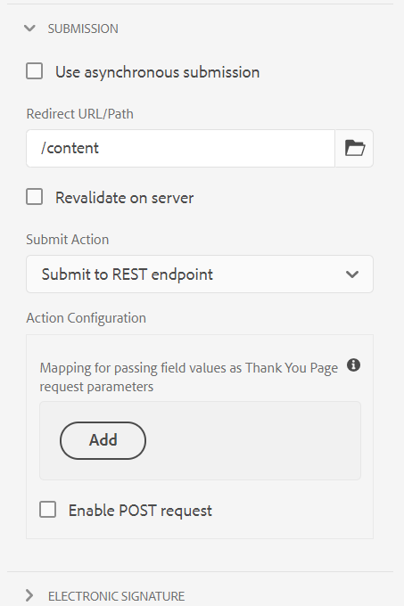

# Configurazione della pagina di reindirizzamento {#configuring-redirect-page}

Gli autori dei moduli possono configurare una pagina per ciascun modulo, a cui verranno reindirizzati gli utenti dopo l’invio.

1. In modalità di modifica, seleziona un componente, quindi fai clic su  > **[!UICONTROL Contenitore di moduli adattivi]**, quindi fai clic su .

1. Nella barra laterale, fai clic su **[!UICONTROL Invio]**.

1. Fornisci l&#39;URL della pagina di reindirizzamento in **[!UICONTROL URL/percorso di reindirizzamento]** in **[!UICONTROL Invio]** sezione .
1. Facoltativamente, in Azione di invio per l’azione Invia a endpoint REST è possibile configurare il parametro da passare alla pagina di reindirizzamento.

   

   Reindirizza la configurazione della pagina

Gli autori dei moduli possono utilizzare i seguenti parametri passati alla pagina di ringraziamento. Per tutte le azioni di invio disponibili, `status` e `owner` vengono passati i parametri . Oltre a questi due parametri, alcuni parametri aggiuntivi vengono passati per le seguenti azioni di invio:

* **[!UICONTROL Invia all’endpoint REST]**: I parametri aggiunti per la mappatura in-field ai parametri vengono passati. `status` e `owner` i parametri non vengono passati in questa azione di invio. Per ulteriori informazioni, consulta [Configurazione dell’azione di invio all’endpoint REST](configuring-submit-actions.md).
