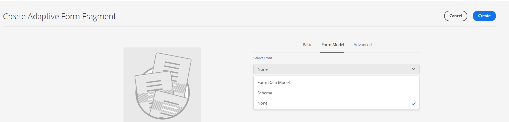

# Guida introduttiva di Form Builder {#creating-an-adaptive-form}

| Versione | Collegamento articolo |
| -------- | ---------------------------- |
| AEM 6.5 | [Fai clic qui](https://experienceleague.adobe.com/docs/experience-manager-65/forms/adaptive-forms-basic-authoring/creating-adaptive-form.html?lang=it) |
| AEM as a Cloud Service | Questo articolo |

Il generatore di moduli di AEM Forms consente di creare moduli coinvolgenti, reattivi, dinamici e adattivi. Che tu sia un creatore di moduli che crea moduli professionali o desideri creare rapidamente moduli reattivi, AEM Forms offre una procedura guidata intuitiva. La procedura guidata offre una navigazione rapida a schede per selezionare facilmente modelli, stili, campi e opzioni di invio preconfigurati.

{width="100%" align="center"}

Prima di iniziare, scopri i tipi di componenti dei moduli disponibili:

* [Componenti core dei moduli adattivi](https://experienceleague.adobe.com/docs/experience-manager-core-components/using/adaptive-forms/introduction.html?lang=it): si tratta di componenti di acquisizione dati standardizzati. Questi componenti forniscono funzionalità di personalizzazione e riducono i tempi di sviluppo e i costi di manutenzione per le esperienze di registrazione digitale. Uno sviluppatore può facilmente personalizzare e assegnare uno stile a questi componenti. Puoi visitare [https://aemcomponents.dev/](https://aemcomponents.dev/) per visualizzare i componenti core disponibili in azione **Adobe consiglia di utilizzare questi componenti moderni ed estensibili per sviluppare moduli adattivi**.

* [Componenti di base dei moduli adattivi](creating-adaptive-form.md): si tratta dei classici (precedenti) componenti di acquisizione dati. Puoi continuare a utilizzarli per modificare i componenti di base esistenti basati su modulo adattivo. Se stai creando nuovi moduli, Adobe consiglia di utilizzare i [Componenti core dei moduli adattivi per la creazione di un modulo adattivo](#create-an-adaptive-form-core-components).

>[!BEGINTABS]

>[!TAB Creazione di un modulo adattivo con i componenti core (scelta consigliata)]

Per creare un modulo adattivo è necessario quanto segue:

* **Abilita i componenti core adattivi di Forms per il tuo ambiente**: quando crei un programma, i componenti core adattivi di Forms sono già abilitati per il tuo ambiente. Installa la versione più recente per abilitare i componenti core Adaptive Forms per il tuo ambiente AEM Cloud Service. Quando abiliti i componenti core per il tuo ambiente, vengono aggiunti il modello e l&#39;area di lavoro del **componente core moduli adattivi**. Se la tua versione dell’SDK di AEM è precedente alla 2023.02.0, [assicurati di aver abilitato il flag `prerelease` nel tuo ambiente &#x200B;](https://experienceleague.adobe.com/docs/experience-manager-cloud-service/content/release-notes/prerelease.html?lang=it#new-features), poiché i componenti core dei moduli adattivi facevano parte della versione prerelease precedente alla versione 2023.02.0.

* **Un modello per moduli adattivi**: un modello fornisce una struttura di base e definisce l’aspetto (layout e stili) di un modulo adattivo. Include componenti preformattati contenenti determinate proprietà e struttura del contenuto. Fornisce inoltre le opzioni per definire un tema e un’azione di invio. Il tema definisce l’aspetto, mentre l’azione di invio definisce l’azione da intraprendere al momento dell’invio di un modulo adattivo. Ad esempio, l’invio dei dati raccolti a un’origine dati. Il Cloud Service fornisce un modello OOTB, denominato vuoto:

   * Il modello `blank` è incluso in ogni nuovo programma AEM Forms as a Cloud Service.
   * È possibile installare il pacchetto di riferimento tramite Gestione pacchetti per aggiungere il `blank` modello al programma AEM Forms as a Cloud Service.
   * È inoltre possibile [creare un modello di Forms adattivo (Componenti core)](template-editor.md) da zero.

* **Un tema per moduli adattivi**: un tema contiene dettagli sullo stile dei componenti e dei pannelli. Gli stili includono proprietà quali i colori di sfondo, i colori degli stati, la trasparenza, l’allineamento e le dimensioni. Quando applichi un tema, lo stile specificato si riflette sui componenti corrispondenti.  Il modello `Canvas` è incluso in ogni nuovo programma AEM Forms as a Cloud Service.
  <!-- * You can install the reference package, via package manager, to add the `Canvas` template to your AEM Forms as a Cloud Service program.
    * You can also [create an Adaptive Forms theme (Core Components)](template-editor.md) and deploy it to your AEM Forms as a Cloud Service program. -->

* **Autorizzazioni**: aggiungi gli utenti a un gruppo [!DNL forms-users]. I membri del gruppo [!DNL forms-users] dispongono delle autorizzazioni per creare un modulo adattivo. Per un elenco dettagliato dei gruppi di utenti specifici per moduli, consulta [Gruppi e autorizzazioni](forms-groups-privileges-tasks.md).

## Creare un modulo adattivo {#create-an-adaptive-form-core-components}

1. Accedi all’istanza di authoring [!DNL Experience Manager Forms]. Può essere un’istanza Cloud o un’istanza di sviluppo locale.

1. Inserisci le credenziali nella pagina di accesso di Experience Manager. Dopo aver effettuato l’accesso, nell’angolo in alto a sinistra seleziona **[!UICONTROL Adobe Experience Manager]** > **[!UICONTROL Moduli]** > **[!UICONTROL Moduli e documenti]**.

1. Seleziona **[!UICONTROL Crea]**  > **[!UICONTROL Moduli adattivi]**. Viene aperta la procedura guidata. Nella scheda Sorgente, seleziona un modello:

   {width="100%" align="center"}

   Quando selezioni un modello, vengono selezionati automaticamente un tema e un’azione di invio specificati nel modello, mentre viene abilitato il pulsante **[!UICONTROL Crea]**. È possibile passare alle schede **[!UICONTROL Stile]** o **[!UICONTROL Invio]** per selezionare un tema o un’azione di invio diversi. Se il modello selezionato non specifica un tema, il pulsante Crea rimane disabilitato. È possibile passare alla scheda **[!UICONTROL Stili]** per selezionare manualmente un tema.

   >[!NOTE]
   >
   >
   > Se non disponi del modello **Moduli adattivi (componente core)** nell’ambiente, [abilita la funzione Componenti core dei moduli adattivi per il tuo ambiente](setup-local-development-environment.md#enable-adaptive-forms-core-components-for-an-existing-aem-archetype-based-project). Quando abiliti i componenti core per il tuo ambiente, viene aggiunto il modello **Moduli adattivi (componente core)**.

1. Nella scheda **[!UICONTROL Stile]**, seleziona un tema:

   * Quando il modello selezionato specifica un tema, lo stesso viene selezionato automaticamente nella procedura guidata. È possibile inoltre scegliere un tema diverso dalla scheda Stile.

   * Se il modello selezionato non specifica un tema, è possibile utilizzare la scheda Stile per sceglierne uno. Il pulsante **[!UICONTROL Crea]** viene abilitato solo dopo la selezione di un tema.

1. (Facoltativo) Nella scheda Dati, seleziona un modello dati:

   * **Modello dati modulo**: un [Modello dati modulo (FDM)](data-integration.md) consente di integrare entità e servizi da origini dati diverse a un Modulo adattivo. Scegli Modello dati modulo (FDM) se il modulo adattivo che stai creando richiede il recupero e la scrittura di dati da e verso più origini dati.

   * **Schema JSON**: lo [Schema JSON](adaptive-form-json-schema-form-model.md) è nostro modulo adattivo basato su componenti core che consente l’integrazione perfetta con il sistema back-end della tua organizzazione, grazie alla possibilità di associare uno schema JSON, che rappresenta la struttura dei dati prodotti o utilizzati. Questa associazione consente agli autori di aggiungere contenuti al modulo adattivo in modo dinamico, utilizzando gli elementi dello schema. Gli elementi dello schema sono facilmente accessibili nella scheda Oggetti modello dati del browser Contenuto durante il processo di authoring e tutti i campi vengono aggiunti automaticamente a qualsiasi modulo adattivo creato.

   Per impostazione predefinita, tutti i campi dello schema JSON associato vengono selezionati e convertiti automaticamente nei componenti corrispondenti del modulo adattivo, semplificando il processo di authoring. La procedura guidata offre l’ulteriore comodità di consentire la scelta selettiva dei campi da includere nel modulo adattivo tramite l’utilizzo di caselle di controllo.

1. Nella scheda **[!UICONTROL Invio]**, seleziona un’azione di invio:

   * Quando selezioni un modello, l’azione di invio specificata in quel modello viene selezionata automaticamente. Dalla scheda Invio puoi selezionare un’azione di invio diversa. La scheda **[!UICONTROL Invio]** mostra tutte le azioni di invio disponibili.

   * Se nel modello selezionato non è specificata un’azione di invio, è possibile utilizzare la scheda **[!UICONTROL Invio]** per selezionarne una.

1. (Facoltativo) Nella scheda **[!UICONTROL Consegna]**, è possibile specificare una data di pubblicazione o di annullamento della pubblicazione per un modulo adattivo.

1. Seleziona **[!UICONTROL Crea]**. Viene visualizzata una finestra di dialogo che specifica il titolo, il nome e la posizione in cui salvare il modulo adattivo:

   * **[!UICONTROL Titolo]**: specifica il nome visualizzato del modulo. Il titolo consente di identificare il modulo nell’interfaccia utente di [!DNL Experience Manager Forms].
   * **[!UICONTROL Nome:]** specifica il nome del modulo. Nell’archivio viene creato un nodo con il nome specificato. Quando si inizia a digitare un titolo, il valore del campo nome viene generato automaticamente. Puoi modificare il valore suggerito. Il campo nome può contenere solo caratteri alfanumerici, trattini e caratteri di sottolineatura. Tutti gli input non validi vengono sostituiti da un trattino.
   * **[!UICONTROL Percorso:]** specifica la posizione in cui salvare il modulo adattivo. Puoi salvare il modulo adattivo direttamente all’indirizzo `/content/dam/formsanddocuments` o creare una cartella di salvataggio come `/content/dam/formsanddocuments/adaptiveforms`. Assicurati di creare la cartella prima di utilizzarla nel percorso. Il campo **[!UICONTROL Percorso]** non crea cartelle automaticamente.

1. Seleziona **[!UICONTROL Crea]**. Viene creato un modulo adattivo che viene aperto nell’editor di moduli adattivi. L’editor mostra i contenuti disponibili nel modello.  In base al tipo di modulo adattivo, gli elementi del modulo presenti nello schema JSON o nel modello dati del modulo (FDM) <!--XFA form template, XML schema or --> associato vengono visualizzati nella scheda **[!UICONTROL Oggetti modello dati]** del **[!UICONTROL Browser contenuti]** nella barra laterale.

Ora puoi trascinare i [Componenti core dei moduli adattivi](https://experienceleague.adobe.com/docs/experience-manager-core-components/using/adaptive-forms/introduction.html?lang=it#components) o gli elementi dello schema, per creare il tuo modulo adattivo.

## Modificare le proprietà di un modello di modulo adattivo {#edit-form-model-core-components-based-adaptive-forms}

1. Seleziona il modulo adattivo e seleziona  > **[!UICONTROL Apri proprietà]**. Viene visualizzata la pagina Proprietà modulo.

1. Vai alla scheda **[!UICONTROL Modello modulo]** e scegli un modello di modulo. Se il modulo adattivo non dispone di un modello di modulo, puoi scegliere uno schema JSON o un modello di dati del modulo (FDM). Se invece il modulo adattivo si basa già su un modello di modulo, puoi passare a un altro modello dello stesso tipo. Ad esempio, se il modulo utilizza uno schema JSON, puoi passare facilmente a un altro schema JSON e, analogamente, se il modulo utilizza un modello di dati del modulo (FDM), puoi passare a un altro modello di dati del modulo (FDM).

1. Seleziona **[!UICONTROL Salva]** per salvare le proprietà.

>[!TAB Creare moduli adattivi con i componenti di base]

Per creare un modulo adattivo è necessario quanto segue:

* **Autorizzazioni**: aggiungi gli utenti a [!DNL forms-users] per fornire loro le autorizzazioni per creare un modulo adattivo. Per un elenco dettagliato dei gruppi di utenti specifici dei moduli, consulta [Gruppi e autorizzazioni](forms-groups-privileges-tasks.md).

* **Tema per modulo adattivo**: un tema contiene dettagli sullo stile dei componenti e dei pannelli. Gli stili includono proprietà quali i colori di sfondo, i colori degli stati, la trasparenza, l’allineamento e le dimensioni. Quando applichi un tema, lo stile specificato si riflette sui componenti corrispondenti. Puoi [creare un tema](themes.md) o [importare un tema esistente](import-export-forms-templates.md#uploading-a-theme). Puoi anche distribuire l’[archetipo più recente](https://experienceleague.adobe.com/docs/experience-manager-core-components/using/developing/archetype/using.html?lang=it#create-project) per alcuni temi campioni.

* **Modello per moduli adattivi**: un modello fornisce una struttura di base e definisce l’aspetto (layout e stili) di un modulo adattivo. Include componenti preformattati contenenti determinate proprietà e struttura del contenuto. Fornisce inoltre le opzioni per definire un tema e un’azione di invio. Il tema definisce l’aspetto, mentre l’azione di invio definisce l’azione da intraprendere al momento dell’invio di un modulo adattivo. Ad esempio, l’invio dei dati raccolti a un’origine dati. Cloud Service supporta due tipi di modelli:

   * **Modello modificabile**: è possibile [creare un](template-editor.md) o [importare un modello modificabile esistente](migrate-to-forms-as-a-cloud-service.md). Puoi anche distribuire l’[archetipo più recente](https://experienceleague.adobe.com/docs/experience-manager-core-components/using/developing/archetype/using.html?lang=it#:~:text=The%20AEM%20Archetype%20is%20made%20up%20of%20modules%3A,and%20request%20filters.%20it.tests%3A%20are%20Java-based%20integration%20tests.) per ottenere alcuni modelli modificabili campioni.

   * **Modello statico**: si tratta di modelli legacy e sono consigliati solo se si esegue la migrazione da installazioni di AEM Forms On-Premise o Adobe Managed Services (AMS) (AEM Forms 6.5 o versioni precedenti). Consentono di continuare a sfruttare quanto hai già investito in modelli statici. Quando crei un modulo adattivo, utilizza un modello modificabile.

## Creare un modulo adattivo {#create-an-adaptive-form-foundation-components}

1. Accedi all’istanza di authoring di [!DNL Experience Manager Forms]. Può essere un’istanza Cloud o un’istanza di sviluppo locale.

1. Inserisci le credenziali nella pagina di accesso di Experience Manager.

   Dopo aver effettuato l’accesso, nell’angolo in alto a sinistra seleziona **[!UICONTROL Adobe Experience Manager]** > **[!UICONTROL Moduli]** > **[!UICONTROL Moduli e documenti]**.

1. Seleziona **[!UICONTROL Crea]**  > **[!UICONTROL Moduli adattivi]**. Viene aperta la procedura guidata.
1. Nella scheda Sorgente, seleziona un modello:

   * Quando selezioni un modello modificabile, vengono selezionati automaticamente il tema e l’azione di invio specificati nel modello e viene abilitato il pulsante **[!UICONTROL Crea]**. Puoi per selezionare un altro tema o un’altra azione di invio dalla scheda **[!UICONTROL Stile]** o **[!UICONTROL Invio]**. Se nel modello modificabile selezionato non è stato specificato un tema, il pulsante Crea rimane disattivato. Puoi selezionare manualmente un tema dalla scheda **[!UICONTROL Stili]**.

     >[!NOTE]
     >
     > Puoi anche creare un modello di [!UICONTROL Documento record] tramite un editor di moduli adattivi. Per ulteriori informazioni, consulta [Supporto per documenti di record nell’editor di moduli adattivi](/help/forms/generate-document-of-record-for-non-xfa-based-adaptive-forms.md#document-of-record-support-in-adaptive-form-editor-dor-support-in-adaptiveform).

   * Quando selezioni un modello statico, le opzioni di dati, stile, invio, consegna e anteprima non sono disponibili. Durante la creazione di un modulo adattivo, si consiglia di utilizzare un modello modificabile.

1. Nella scheda **[!UICONTROL Stile]**, seleziona un tema:

   * Quando il modello selezionato specifica un tema, lo stesso viene selezionato automaticamente nella procedura guidata. È possibile inoltre scegliere un tema diverso dalla scheda Stile.
   * Se il modello selezionato non specifica un tema, è possibile utilizzare la scheda Stile per sceglierne uno. Il pulsante **[!UICONTROL Crea]** viene abilitato solo dopo la selezione di un tema.

1. (Facoltativo) Nella scheda **[!UICONTROL Dati]**, seleziona un modello dati:

   * **Modello dati modulo**: un [Modello dati modulo (FDM)](data-integration.md) consente di integrare entità e servizi da origini dati diverse a un Modulo adattivo. Scegli Modello dati modulo (FDM) se il modulo adattivo che stai creando richiede il recupero e la scrittura di dati da e verso più origini dati.

   * **Schema JSON**: lo [schema JSON](adaptive-form-json-schema-form-model.md) rappresenta la struttura in cui i dati vengono prodotti o utilizzati dal sistema di back-end dell’organizzazione. È possibile associare lo schema a un modulo adattivo e utilizzarne gli elementi per aggiungere contenuto dinamico al modulo adattivo. Gli elementi dello schema sono disponibili per l’utilizzo nella scheda Oggetti modello dati del browser Contenuto durante l’authoring di Forms adattivo. Tutti i campi vengono aggiunti anche al modulo adattivo creato.

   Per impostazione predefinita, sono selezionati tutti i campi del modello di dati. Quando crei il modulo adattivo, tutti i campi del modello di dati selezionati vengono convertiti nei corrispondenti componenti del modulo adattivo. La procedura guidata fornisce caselle di controllo perché possano essere selezionati solo i campi da includere nel modulo adattivo.

   <!-- 
   
   If your JSON schema contains a fragment, the fragment is considered a single unit. You can select or deselect a complete fragment and all the fields of the fragment are selected or deselected accordingly. 
   
   -->

1. Nella scheda **[!UICONTROL Invio]**, seleziona un’azione di invio:

   * Quando selezioni un modello, l’azione di invio specificata in quel modello viene selezionata automaticamente. Dalla scheda Invio puoi selezionare un’azione di invio diversa. La scheda **[!UICONTROL Invio]** mostra tutte le azioni di invio disponibili.

   * Se nel modello selezionato non è specificata un&#39;azione di invio, è possibile utilizzare la scheda **[!UICONTROL Invio]** per selezionarne una.

1. (Facoltativo) Nella scheda Consegna, puoi specificare una data di pubblicazione o di annullamento della pubblicazione per un modulo adattivo.

1. Seleziona **[!UICONTROL Crea]**. Viene visualizzata una finestra di dialogo che specifica il titolo, il nome e la posizione in cui salvare il modulo adattivo:

   * **[!UICONTROL Titolo]**: specifica il nome visualizzato del modulo. Il titolo consente di identificare il modulo nell’interfaccia utente di [!DNL Experience Manager Forms].
   * **[!UICONTROL Nome:]** specifica il nome del modulo. Nell’archivio viene creato un nodo con il nome specificato. Quando si inizia a digitare un titolo, il valore del campo nome viene generato automaticamente. Puoi modificare il valore suggerito. Il campo nome può contenere solo caratteri alfanumerici, trattini e caratteri di sottolineatura. Tutti gli input non validi vengono sostituiti da un trattino.
   * **[!UICONTROL Percorso:]** specifica la posizione in cui salvare il modulo adattivo. Puoi salvare il modulo adattivo direttamente all’indirizzo `/content/dam/formsanddocuments` o creare una cartella di salvataggio come `/content/dam/formsanddocuments/adaptiveforms`. Assicurati di creare la cartella prima di utilizzarla nel percorso. Il campo **[!UICONTROL Percorso:]** non crea automaticamente una cartella.

1. Seleziona **[!UICONTROL Crea]**. Viene creato un modulo adattivo che viene aperto nell’editor di moduli adattivi. L’editor mostra i contenuti disponibili nel modello. Viene inoltre visualizzata la barra laterale per personalizzare il modulo creato in base alle esigenze.

   In base al tipo di modulo adattivo, gli elementi del modulo presenti nello schema JSON o nel modello dati del modulo (FDM) <!--XFA form template, XML schema or --> associato vengono visualizzati nella scheda **[!UICONTROL Oggetti modello dati]** del **[!UICONTROL Browser contenuti]** nella barra laterale. Puoi anche trascinare questi elementi per creare il modulo adattivo.

<!-- ## Create an Adaptive Form based on a Form Data Model {#fdm}

[Data integration](data-integration.md) lets you integrate multiple data sources and bring their entities and services together to create a form data model. It is an extension of JSON schema. You can use a Form Data Model to create an Adaptive Form. The entities or data model objects configured in a Form Data Model are available as data model objects for form authoring. They are bound to respective data sources and used to prefill a form and write submitted data back to the respective data sources. You can also call services configured in a Form Data Model using Adaptive Form rules.

To use a Form Data Model for creating an Adaptive Form:

1. In Form Model tab on Add Properties screen, select **[!UICONTROL Form Data Model]** in the **[!UICONTROL Select From]** drop-down list.

   

1. Select to expand **[!UICONTROL Select Form Data Model]**. All available form data models are listed.Select a from data model.

>[!NOTE]
>
>You can also change the Form Data Model for an Adaptive Form. For detailed steps, see [Edit Form Model properties of an Adaptive Form](#edit-form-model).

## Create an adaptive form based on XML or JSON schema {#create-an-adaptive-form-based-on-xml-or-json-schema}

XML and JSON schemas represent the structure in which data is produced or consumed by the back-end system in your organization. You can associate a schema to an Adaptive Form and use its elements to add dynamic content to the Adaptive Form. The elements of the schema are available in the Data Model Object tab of the content browser for authoring Adaptive Forms. You can drag-drop the schema elements to build the form.

See the following documents to understand how to design XML or JSON schema for authoring Adaptive Forms.

* [Creating Adaptive Forms using XML schema](adaptive-form-xml-schema-form-model.md)
* [Creating Adaptive Forms using JSON schema](adaptive-form-json-schema-form-model.md)

Do the following to use XML or JSON schema as form model for an Adaptive Form:

1. On the **[!UICONTROL Add Properties]** step of Adaptive Form creation page, select on the **[!UICONTROL Form Model]** tab.
1. In the Form Model tab, select **[!UICONTROL Schema]** from the **[!UICONTROL Select From]** drop-down field.

1. Select **[!UICONTROL Select Schema]** and do one of the following:

    * **[!UICONTROL Upload from disk]** - Select this option and select Upload Schema Definition to browse and upload an XML schema or JSON schema from your file system. The uploaded schema file resides with the form and is not accessible to other Adaptive Forms.
    * **[!UICONTROL Search in repository]** - Select this option to select from the list of schema definition files available in the repository. Select the XML or JSON schema file as form model. The selected schema is associated with the form by reference and is accessible for use in other Adaptive Forms.

      Ensure that the JSON schema filename ends with **.schema.json**. For example: mySchema.schema.json

   
**Figure:** *Selecting XML or JSON schema*

1. (For XML schema only) After you select or upload an XML Schema, specify a root element of the selected XSD file to map with the Adaptive Form.

   
**Figure:** *Selecting XSD root element*

>[!NOTE]
>
>You can also change the schema for an Adaptive Form. For detailed steps, see [Edit Form Model properties of an Adaptive Form](#edit-form-model2). -->

## Modificare le proprietà di un modello di modulo adattivo {#edit-form-model-foundation-components}

Puoi modificare il modello di modulo per un modulo adattivo (basato su JSON o Modello dati modulo (FDM)). Non è possibile passare da un modello di modulo a un altro.

1. Seleziona il modulo adattivo e l&#39;icona **Proprietà**.
1. Apri la scheda **[!UICONTROL Modello modulo]** ed effettua una delle seguenti operazioni.

   * Se il modulo adattivo non dispone di un modello di modulo, è possibile scegliere un altro modello di modulo e di conseguenza selezionare lo schema XML o JSON <!-- a form template, --> o il modello di dati del modulo (FDM).
   * Se il modulo adattivo è basato su un modello di modulo, è possibile scegliere un altro schema XML o JSON <!-- form template, --> o modello dati modulo (FDM) per lo stesso modello di modulo.

1. Seleziona **[!UICONTROL Salva]** per salvare le proprietà.

È inoltre possibile modificare le proprietà del modello di modulo dal generatore di moduli adattivi o dal generatore di modelli di moduli adattivi.

1. Seleziona il componente **[!UICONTROL Contenitore per modulo adattivo (principale)]**.
1. Fai clic sull’icona  per aprire le **[!UICONTROL proprietà]** del contenitore per modulo adattivo.
1. Seleziona la scheda **[!UICONTROL Modello di dati]** ed effettua una delle seguenti operazioni:

   * Se il modulo adattivo non dispone di un modello di modulo, è possibile scegliere un modello di modulo e di conseguenza selezionare lo schema XML o JSON <!-- a form template, --> o il modello di dati del modulo (FDM).
   * Se il modulo adattivo si basa su un modello di modulo, non è possibile modificarlo. È possibile scegliere un altro schema XML o JSON <!-- form template, --> o modello dati modulo (FDM) per lo stesso modello di modulo applicabile.
1. Seleziona  per salvare le proprietà.

{width="100%" align="center"}

>[!NOTE]
>
> Puoi salvare inoltre un modulo adattivo come modello. Per ulteriori informazioni, consulta [Creare un modello utilizzando un modulo adattivo](/help/forms/template-editor.md#saving-an-adaptive-form-as-template-saving-adaptive-form-as-template).

>[!ENDTABS]

## Passaggi successivi

* [Utilizzare Adobe Sign con i moduli](working-with-adobe-sign.md)
* [Utilizzare il servizio reCaptcha di Google con i moduli](captcha-adaptive-forms.md)
* [Aggiungere una sezione ripetibile a un modulo](create-forms-repeatable-sections.md)
* [Precompilare i campi di un modulo](prepopulate-adaptive-form-fields.md)

>[!MORELIKETHIS]
>
>* [Creare un modulo adattivo](/help/forms/creating-adaptive-form-core-components.md)
