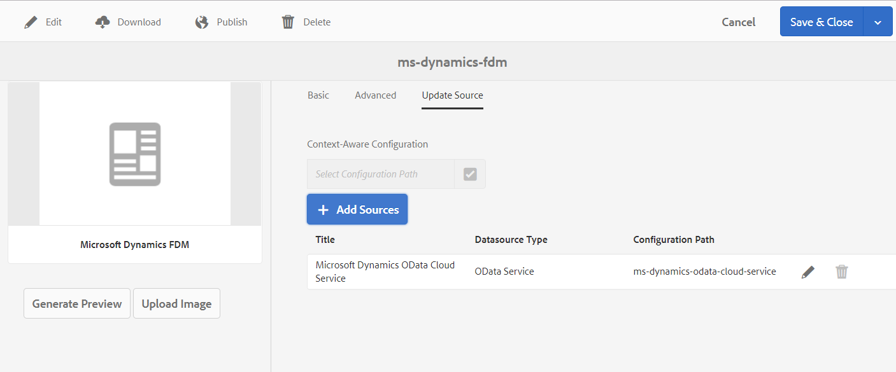

# Crea modello dati modulo (FDM) {#create-form-data-model}

| Versione | Collegamento articolo |
| -------- | ---------------------------- |
| AEM 6.5 | [Fai clic qui](https://experienceleague.adobe.com/docs/experience-manager-65/forms/form-data-model/create-form-data-models.html?lang=it) |
| AEM as a Cloud Service | Questo articolo |

L&#39;integrazione dei dati di [!DNL Experience Manager Forms] offre un&#39;interfaccia utente intuitiva per la creazione e l&#39;utilizzo dei modelli di dati dei moduli. Un modello di dati modulo (FDM) si basa su origini dati per lo scambio di dati; tuttavia, è possibile creare un modello di dati modulo (FDM) con o senza un&#39;origine dati. Esistono due approcci per creare un modello dati da a seconda che siano state configurate o meno le origini dati:

* **Utilizzo di origini dati preconfigurate**: se le origini dati sono state configurate come descritto in [Configurazione di origini dati](configure-data-sources.md), è possibile selezionarle durante la creazione di un modello dati modulo (FDM). Raccoglie tutti gli oggetti, le proprietà e i servizi del modello dati dalle origini dati selezionate disponibili per l’utilizzo nel modello dati del modulo (FDM).

* **Senza origini dati**: se non sono state configurate origini dati per il modello dati del modulo, è comunque possibile crearlo senza origini dati. È possibile utilizzare il modello di dati del modulo (FDM) per creare Forms adattivo <!--and interactive communication--> e testarli utilizzando dati di esempio. Quando le origini dati sono disponibili, è possibile associare il modello dati del modulo (FDM) alle origini dati, che si riflette automaticamente nel Forms adattivo associato<!--and interactive communications-->.

>[!NOTE]
>
>Per poter creare e utilizzare il modello dati modulo (FDM) è necessario essere membri sia del gruppo **fdm-author** che del gruppo **forms-user**. Contatta l&#39;amministratore [!DNL Experience Manager] per diventare membro dei gruppi.

## Crea modello dati modulo (FDM) {#data-sources}

Verificare di aver configurato le origini dati che si intende utilizzare nel modello dati del modulo come descritto in [Configurare le origini dati](configure-data-sources.md). Per creare un modello dati modulo (FDM) basato su origini dati configurate, effettuare le seguenti operazioni:

1. Nell&#39;istanza di authoring [!DNL Experience Manager], passa a **[!UICONTROL Forms > Integrazioni dati]**.
1. Selezionare **[!UICONTROL Crea > Modello dati modulo]**.
1. Nella finestra di dialogo Crea modello dati modulo:

   * Specificare un nome per il modello dati modulo (FDM).
   * (**Facoltativo**) Specificare titolo, descrizione e tag per il modello dati del modulo (FDM).
   * (**Facoltativo e applicabile solo se le origini dati sono configurate**) Selezionare l&#39;icona di spunta accanto al campo **[!UICONTROL Configurazione Source dati]** e selezionare il nodo di configurazione in cui risiedono i servizi cloud per le origini dati che si desidera utilizzare. Limita l’elenco delle origini dati disponibili per la selezione nella pagina successiva a quelle disponibili nel nodo di configurazione selezionato. Tuttavia, tutte le origini dati del profilo utente [!DNL Experience Manager] sono elencate per impostazione predefinita. Se non si seleziona un nodo di configurazione, vengono elencate le origini dati di tutti i nodi di configurazione.

1. Seleziona **[!UICONTROL Avanti]**.

1. (**Applicabile solo se le origini dati sono configurate**) Nella schermata **[!UICONTROL Seleziona origine dati]** sono elencate le origini dati disponibili, se presenti. Selezionare le origini dati da utilizzare nel modello dati del modulo.
1. Seleziona **[!UICONTROL Crea]** e nella finestra di dialogo di conferma seleziona **[!UICONTROL Apri]** per aprire l&#39;editor modello dati modulo.

   Esaminiamo i diversi componenti dell’interfaccia utente dell’editor del modello dati modulo.

   ![Un modello dati modulo con tre origini dati: un servizio RESTful, un profilo utente [!DNL Experience Manager] e un RDBMS](assets/fdm-ui.png)

   A. **[!UICONTROL Origini dati]** Elenca le origini dati in un modello dati modulo. Espandere un&#39;origine dati per visualizzare i relativi servizi e oggetti modello dati.

   B. **[!UICONTROL Aggiorna definizioni Source dati]** Recupera le modifiche apportate alle definizioni delle origini dati dalle origini dati configurate e le aggiorna nella scheda Origini dati dell&#39;editor modello dati modulo.

   C. **[!UICONTROL Modello]** Area contenuto in cui vengono visualizzati gli oggetti modello dati aggiunti.

   D. **[!UICONTROL Servizi]** Area contenuto in cui vengono visualizzati operazioni o servizi dell&#39;origine dati aggiunti.

   E. **[!UICONTROL Barra degli strumenti]** Strumenti per l&#39;utilizzo del modello dati modulo (FDM). La barra degli strumenti mostra più opzioni a seconda dell’oggetto selezionato nel modello dati del modulo (FDM).

   F. **[!UICONTROL Aggiungi selezionati]** Aggiunge gli oggetti e i servizi del modello dati selezionati al modello dati del modulo.

Per ulteriori informazioni sull&#39;editor del modello dati modulo e su come utilizzarlo per modificare e configurare il modello dati modulo, vedere [Utilizzare il modello dati modulo](work-with-form-data-model.md).

## Aggiornare le origini dati {#update}

Per aggiungere o aggiornare origini dati a un modello dati modulo (FDM) esistente, eseguire le operazioni seguenti.

1. Vai a **[!UICONTROL Forms > Integrazioni dati]**, seleziona il modello dati del modulo (FDM) in cui desideri aggiungere o aggiornare le origini dati e seleziona **[!UICONTROL Proprietà]**.
1. Nelle proprietà del modello dati modulo, vai alla scheda **[!UICONTROL Aggiorna Source]**.

   Nella scheda **[!UICONTROL Aggiorna Source]**:

   * Selezionare l&#39;icona Sfoglia nel campo **[!UICONTROL Configurazione in base al contesto]** e selezionare un nodo di configurazione in cui risiede la configurazione cloud per l&#39;origine dati che si desidera aggiungere. Se non si seleziona un nodo, le configurazioni cloud che risiedono solo nel nodo `global` vengono elencate quando si seleziona **[!UICONTROL Aggiungi origini]**.

   * Per aggiungere una nuova origine dati, selezionare **[!UICONTROL Aggiungi origini]** e selezionare le origini dati da aggiungere al modello dati del modulo (FDM). Vengono visualizzate tutte le origini dati configurate in `global` e l&#39;eventuale nodo di configurazione selezionato.

   * Per sostituire un&#39;origine dati esistente con un&#39;altra origine dati dello stesso tipo, selezionare l&#39;icona **[!UICONTROL Modifica]** per l&#39;origine dati e selezionarla dall&#39;elenco delle origini dati disponibili.
   * Per eliminare un&#39;origine dati esistente, selezionare l&#39;icona **[!UICONTROL Elimina]** per l&#39;origine dati. L’icona Elimina è disabilitata se nell’origine dati viene aggiunto un oggetto modello dati nel modello dati del modulo (FDM).

     

1. Seleziona **[!UICONTROL Salva e chiudi]** per salvare gli aggiornamenti.

>[!NOTE]
>
>Dopo aver aggiunto nuove origini dati o aggiornato le origini dati esistenti in un modello dati del modulo (FDM), assicurarsi di aggiornare i riferimenti di associazione, come appropriato, in Forms<!--and interactive communications--> adattivo che utilizza il modello dati del modulo (FDM) aggiornato.

## Configurazioni in base al contesto per modalità di esecuzione specifiche {#runmode-specific-context-aware-config}

[!UICONTROL Form Data Model (FDM)] utilizza [configurazioni in base al contesto Sling](https://experienceleague.adobe.com/docs/experience-manager-core-components/using/developing/context-aware-configs.html?lang=it) per supportare diversi parametri dell&#39;origine dati per la connessione con origini dati per diverse modalità di esecuzione di [!DNL Experience Manager].

Quando [!UICONTROL Form Data Model (FDM)] utilizza le configurazioni cloud per memorizzare i parametri, che quando vengono archiviati e distribuiti tramite il controllo del codice sorgente (archivio GIT di Cloud-Manager) crea la configurazione cloud con gli stessi parametri per tutte le modalità di esecuzione (Sviluppo, Stage e Produzione). Tuttavia, per i casi di utilizzo in cui è necessario disporre di set di dati diversi per ambienti di test e produzione, vengono utilizzati i parametri dell&#39;origine dati (ad esempio, URL dell&#39;origine dati) per diverse modalità di esecuzione di [!DNL Experience Manager].

A questo scopo, devi creare una configurazione OSGi che contenga coppie parametri-valore dell’origine dati. Questa operazione sostituisce la stessa coppia dalla configurazione cloud di [!UICONTROL Form Data Model (FDM)] in fase di esecuzione. Poiché le configurazioni OSGi supportano queste modalità di esecuzione per impostazione predefinita, puoi sostituire un parametro dell’origine dati con valori diversi in base alla modalità di esecuzione.

Per abilitare le configurazioni cloud specifiche della distribuzione in [!UICONTROL Form Data Model (FDM)]:

1. Crea la configurazione cloud nell’istanza di sviluppo locale. Per i passaggi dettagliati, vedi [Come configurare le origini dati](/help/forms/configure-data-sources.md).

1. Memorizza la configurazione cloud nel file system.
   1. Crea pacchetto con filtro `/conf/{foldername}/settings/cloudconfigs/fdm`. Utilizzare lo stesso `{foldername}` come nel passaggio 1. E sostituisci `fdm` con `azurestorage` per la configurazione di archiviazione Azure.
   1. Creare e scaricare il pacchetto. Per ulteriori dettagli, vedere [azioni pacchetto](/help/implementing/developing/tools/package-manager.md).

1. Integrare la configurazione cloud nel progetto Archetipo [!DNL Experience Manager].
   1. Decomprimi il pacchetto scaricato.
   1. Copia la cartella `jcr_root` e inseriscila nella tua cartella `ui.content` > `src` > `main` > `content`.
   1. Aggiorna `ui.content` > `src` > `main` > `content` > `META-INF` > `vault` > `filter.xml` per contenere il filtro `/conf/{foldername}/settings/cloudconfigs/fdm`. Per informazioni dettagliate, vedere il modulo [ui.content di Archetipo progetto AEM](https://experienceleague.adobe.com/docs/experience-manager-core-components/using/developing/archetype/uicontent.html?lang=it). Quando questo progetto di archetipo viene distribuito tramite la pipeline CM, la stessa configurazione cloud viene installata in tutti gli ambienti (o modalità di esecuzione). Per modificare il valore dei campi (come URL) delle configurazioni cloud basate sull’ambiente, utilizza la configurazione OSGi descritta nel passaggio seguente.

1. Crea una configurazione in base al contesto di Apache Sling. Per creare la configurazione OSGi:
   1. **Configura i file di configurazione OSGi nel progetto dell&#39;archetipo [!DNL Experience Manager].**
Crea file di configurazione di fabbrica OSGi con PID `org.apache.sling.caconfig.impl.override.OsgiConfigurationOverrideProvider`. Creare un file con lo stesso nome in ogni cartella della modalità di esecuzione in cui è necessario modificare i valori per ogni modalità di esecuzione. Per ulteriori dettagli, vedere [Configurazione di OSGi per [!DNL Adobe Experience Manager]](/help/implementing/deploying/configuring-osgi.md#creating-sogi-configurations).

   1. **Imposta il codice JSON per la configurazione OSGI.** Per Utilizzare Il Provider Di Sostituzione Della Configurazione In Base Al Contesto Di Apache Sling:
      1. Nell&#39;istanza di sviluppo locale `/system/console/configMgr`, selezionare la configurazione OSGi di fabbrica con il nome **[!UICONTROL Provider override configurazione Apache Sling in base al contesto: configurazione OSGi]**.
      1. Fornisci una descrizione.
      1. Seleziona **[!UICONTROL abilitato]**.
      1. In sostituzioni, fornisci i campi che devono essere modificati in base all’ambiente nella sintassi di sostituzione Sling. Per ulteriori dettagli, vedere [Configurazione Apache Sling in base al contesto - Ignora](https://sling.apache.org/documentation/bundles/context-aware-configuration/context-aware-configuration-override.html#override-syntax). Ad esempio, `cloudconfigs/fdm/{configName}/url="newURL"`.
È possibile aggiungere più sostituzioni selezionando **[!UICONTROL +]**.
      1. Seleziona **[!UICONTROL Salva]**.
      1. Per ottenere il codice JSON per la configurazione OSGi, segui i passaggi descritti in [Generazione di configurazioni OSGi tramite AEM SDK Quickstart](/help/implementing/deploying/configuring-osgi.md#generating-osgi-configurations-using-the-aem-sdk-quickstart).
      1. Inserisci JSON nei file di configurazione di fabbrica OSGi creati nel passaggio precedente.
      1. Modificare il valore di `newURL` in base all&#39;ambiente (o alla modalità di esecuzione).
      1. Per modificare il valore segreto in base alla modalità di esecuzione, è possibile creare la variabile segreta utilizzando [l&#39;API di Cloud Manager](/help/implementing/deploying/configuring-osgi.md#cloud-manager-api-format-for-setting-properties) e fare riferimento a una versione successiva nella [configurazione OSGi](/help/implementing/deploying/configuring-osgi.md#secret-configuration-values).
Quando questo progetto di archetipo viene distribuito tramite pipeline CM, l’override fornirà valori diversi in ambienti diversi (o in modalità di esecuzione).

      >[!NOTE]
      >
      >[!DNL Adobe Managed Service] utenti possono crittografare i valori segreti utilizzando il supporto di crittografia per i dettagli. Vedere [supporto di crittografia per le proprietà di configurazione](https://experienceleague.adobe.com/docs/experience-manager-65/administering/security/encryption-support-for-configuration-properties.html?lang=it#enabling-encryption-support) e inserire testo crittografato nel valore dopo [che le configurazioni in base al contesto sono disponibili nel service pack 6.5.13.0](https://experienceleague.adobe.com/docs/experience-manager-65/forms/form-data-model/create-form-data-models.html?lang=it#runmode-specific-context-aware-config).

1. Aggiornare le definizioni dell&#39;origine dati utilizzando l&#39;opzione per aggiornare le definizioni dell&#39;origine dati nell&#39;[Editor modello dati modulo](#data-sources) per aggiornare la cache FDM tramite l&#39;interfaccia utente di FDM e ottenere la configurazione più recente.

## Passaggi successivi {#next-steps}

Ora disponi di un modello dati modulo (FDM) con origini dati aggiunte. È quindi possibile modificare il modello dati modulo (FDM) per aggiungere e configurare oggetti e servizi del modello dati, aggiungere associazioni tra oggetti del modello dati, modificare proprietà, aggiungere oggetti e proprietà del modello dati personalizzato, generare dati di esempio e così via.

Per ulteriori informazioni, vedere [Utilizzare il modello dati del modulo](work-with-form-data-model.md).

