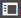

# Creazione di moduli con sezioni ripetibili {#creating-forms-with-repeatable-sections}

Le sezioni ripetibili sono pannelli che possono essere aggiunti o rimossi dinamicamente in un modulo.

Ad esempio, quando si candida a una mansione, la persona in cerca di occupazione fornisce dettagli precedenti sull&#39;impiego come il nome della società, il ruolo, il progetto e altre informazioni. L&#39;informazione di tutti i datori di lavoro richiede sezioni di aspetto diverso ma simile. In questo scenario, il modulo per l&#39;impiego fornisce una sezione datore di lavoro e fornisce anche un&#39;opzione per aggiungere dinamicamente più sezioni di questo tipo. Queste sezioni, che vengono aggiunte dinamicamente, sono note come Sezioni ripetibili.

Per creare pannelli ripetibili, potete utilizzare uno dei seguenti metodi:

## Utilizzo di Instance Manager tramite script  {#using-instance-manager-via-scripts-nbsp}

1. In modalità di modifica, seleziona un pannello, quindi seleziona . Nella barra laterale, in Proprietà, abilita **[!UICONTROL Rendi il pannello ripetibile]**. Specificare i valori per i campi **[!UICONTROL Massimo]** e **[!UICONTROL Minimo]**.

   Il campo Massimo specifica il numero massimo di volte in cui un pannello può essere visualizzato sulla pagina. Puoi specificare -1 nel campo Conteggio massimo per consentire la visualizzazione del pannello per un numero infinito di volte.

   Il campo Minimum (Minimo) specifica il numero minimo di volte in cui un pannello viene visualizzato nel modulo. Se imposti il campo Conteggio minimo su zero, in un secondo momento potrai rimuovere tutte le istanze tramite script al termine della rappresentazione.

   >[!NOTE]
   >
   >Per creare un pannello non ripetibile, impostate il valore dei campi Massimo e Minimo su uno. Il layout del Pannello a soffietto non supporta -1 nel campo Conteggio massimo. Puoi specificare un numero alto per dare la nozione di valore infinito.

1. L’elemento principale del pannello, che deve essere ripetuto, deve contenere pulsanti di aggiunta ed eliminazione per gestire le istanze dei pannelli ripetibili. Per inserire pulsanti nell&#39;elemento padre e attivare gli script sui pulsanti, effettuare le seguenti operazioni:

   1. Dalla barra laterale, trascina un componente pulsante nell’elemento principale del pannello. Selezionare il componente e selezionare . Le regole del pulsante si aprono nell’editor di regole.
   1. Nella finestra Editor regole, fai clic su **Crea**.

      Selezionare **Editor visivo** nella riga Oggetti e funzioni modulo.

      1. Nell&#39;area delle regole, in WHEN, selezionare lo stato **su cui fare clic**.
      1. Sotto THEN:

         * Per creare un pulsante Aggiungi pannello, seleziona **Aggiungi istanza** e trascina il pannello utilizzando  oppure selezionalo utilizzando **Rilascia oggetto o seleziona qui.**
         * Per creare un pulsante Elimina pannello, seleziona **Rimuovi istanza** e trascina il pannello tramite  oppure selezionalo con **Rilascia oggetto o seleziona qui.**

      Selezionare **Editor di codice** nella riga Oggetti e funzioni modulo. Fai clic su **Modifica regole** e nell&#39;area del codice:

      * Per creare un pulsante Aggiungi pannello, specificare `this.panel.instanceManager.addInstance()`
      * Per creare un pulsante Elimina pannello, specificare `this.panel.instanceManager.removeInstance(this.panel.instanceIndex)`

      Fai clic su **Fine**.

      >[!NOTE]
      >
      >Se un campo appartiene a un pannello ripetibile, non è possibile accedervi direttamente utilizzando il relativo nome negli script. Per accedere al campo, specificare l&#39;istanza ripetibile a cui appartiene il campo utilizzando l&#39;API `instances` in `InstanceManager`. Sintassi per l&#39;utilizzo dell&#39;API `instances` in `InstanceManager`:
      >
      >
      >`<panelName>.instanceManager.instances[<instanceNumber>].<fieldname>`
      >
      >
      >Ad esempio, puoi creare un modulo adattivo con un pannello ripetibile con una casella di testo. Quando si precompila il modulo con tre caselle di testo ripetibili, è necessario il codice xml seguente:
      >
      >
      >`<panel1><textbox1>AA1</panel1></textbox1>`
      >
      >
      >`<panel1><textbox1>AA2</panel1></textbox1>`
      >
      >
      >`<panel1><textbox1>AA3</panel1></textbox1>`
      >
      >
      >Per leggere i dati AA1, specifica:
      >
      >
      >`Panel1.instanceManager.instances[0].textbox.value`
      >
      >
      >Per leggere i dati AA2, specifica:
      >
      >
      >`Panel1.instanceManager.instances[1].textbox.value`
      >
      >
      >Per ulteriori informazioni, vedere: Classe: InstanceManager#instances in [Riferimento API Java di AEM Forms](https://adobe.com/go/learn_aemforms_documentation_63).

      >[!NOTE]
      >
      >Quando tutte le istanze di un pannello vengono rimosse da un modulo adattivo, per aggiungere un’istanza del pannello rimosso, utilizza la sintassi _panelName per acquisire la gestione delle istanze del pannello e l’API addInstance della gestione delle istanze per aggiungere l’istanza eliminata. _panelName.addInstance(). Aggiunge un’istanza del pannello rimosso.

## Utilizzo del layout Pannello a soffietto per il pannello principale   {#using-the-accordion-layout-for-the-parent-panel-nbsp}

Un pannello dispone di varie opzioni di layout. L’opzione Layout per la progettazione del Pannello a soffietto supporta i pannelli ripetibili come funzionalità integrata. Esegui i seguenti passaggi per creare un pannello ripetibile con l’opzione Layout per la progettazione del Pannello a soffietto:

1. Selezionare  nell&#39;elemento padre del pannello da ripetere. Puoi visualizzare le proprietà nella barra laterale. Nel menu a discesa **Layout**, seleziona **Pannello a soffietto**.
1. In un pannello da ripetere, selezionare . Puoi visualizzare le proprietà del pannello nella barra laterale. Abilita la scheda **Rendi il pannello ripetibile** e specifica i valori per i campi **Maximum** e **Minimum**.

   Ora puoi utilizzare i pulsanti più (+) ed elimina ( ) per aggiungere e rimuovere i pannelli.

## Utilizzo di sottomaschere ripetute dal modello di modulo (XDP/XSD) {#using-repeating-subforms-from-form-template-xdp-xsd}

La sottomaschera ripetibile è simile ai pannelli ripetibili in Adaptive Forms. In Designer [!DNL AEM Forms] eseguire i passaggi seguenti per creare un sottomodulo ripetuto:

1. Nella tavolozza Gerarchia selezionare la sottomaschera padre della sottomaschera che si desidera ripetere.
1. Nella tavolozza Oggetto fare clic sulla scheda Sottomodulo e nell&#39;elenco Contenuto selezionare Flussi.
1. Selezionare la sottomaschera da ripetere.
1. Nella tavolozza Oggetto, fare clic sulla scheda Sottomodulo e selezionare Posizionato o Flusso nell&#39;elenco Contenuto.
1. Fare clic sulla scheda Associazione e selezionare Ripeti sottomaschera per ogni elemento dati.
1. Per specificare il numero minimo di ripetizioni, selezionare Conteggio minimo e digitare un numero nella casella associata. Se questa opzione è impostata su 0 e non vengono forniti dati per gli oggetti nel sottomodulo al momento dell&#39;unione dei dati, il sottomodulo non viene posizionato al momento del rendering del modulo.
1. Per specificare il numero massimo di ripetizioni di sottomaschera, selezionare Max e digitare un numero nella casella associata. Se non si specifica un valore nella casella Max, il numero di ripetizioni della sottomaschera è illimitato.
1. Per specificare un numero impostato di ripetizioni di sottomaschera, indipendentemente dalla quantità di dati, selezionare Conteggio iniziale e digitare un numero nella casella associata. Se si seleziona questa opzione e non sono disponibili dati o sono presenti meno voci di dati rispetto al valore Conteggio iniziale specificato, le istanze vuote del sottomodulo verranno comunque inserite nel modulo.
1. Aggiungere due pulsanti nella sottomaschera padre: uno per aggiungere un&#39;istanza e un altro per eliminare un&#39;istanza di una sottomaschera ripetibile. Per i passaggi dettagliati, vedi [Generare un&#39;azione](https://help.adobe.com/en_US/AEMForms/6.1/DesignerHelp/WS107c29ade9134a2c74572b5612a87ca2b56-8000.2.html#WS107c29ade9134a2c-1f74d86012a87d4fe55-8000.2).
1. Collega ora il modello al modulo adattivo. Per i passaggi dettagliati, consulta [Creare un modulo adattivo basato su un modello](creating-adaptive-form.md#create-an-adaptive-form-based-on-a-template).
1. Utilizzare i pulsanti creati nel passaggio 9 per aggiungere e rimuovere sottomaschere.

Il file .zip allegato contiene un modulo secondario ripetibile di esempio.

[Ottieni file](assets/samplerepeatablesubform.zip)

## Utilizzo delle impostazioni di ripetizione di uno schema XML (XSD) {#using-repeat-settings-of-an-xml-schema-xsd-br}

È possibile creare pannelli ripetibili da uno schema XML e dalla proprietà minOccours &amp; maxOccurs di qualsiasi elemento di tipo complesso. Per informazioni dettagliate sullo schema XML, vedere [Creare un Forms adattivo utilizzando lo schema XML come modello modulo](adaptive-form-xml-schema-form-model.md).

Nel codice seguente, il pannello `SampleType` utilizza la proprietà minOccours &amp; maxOccurs.

```xml
<?xml version="1.0" encoding="utf-8" ?>
    <xs:schema targetNamespace="https://adobe.com/sample.xsd"
                    xmlns="https://adobe.com/sample.xsd"
                    xmlns:xs="https://www.w3.org/2001/XMLSchema"
                >

        <xs:element name="sample" type="SampleType"/>

        <xs:complexType name="SampleType">
            <xs:sequence>
                <xs:element name="leaderName" type="xs:string" default="Enter Name"/>
                <xs:element name="assignmentStartDate" type="xs:date"/>
                <xs:element name="gender" type="GenderEnum"/>
                <xs:element name="noOfProjectsAssigned" type="IntType"/>
                <xs:element name="assignmentDetails" type="AssignmentDetails"
                                            minOccurs="0" maxOccurs="10"/>
            </xs:sequence>
        </xs:complexType>

        <xs:complexType name="AssignmentDetails">
            <xs:attribute name="name" type="xs:string" use="required"/>
            <xs:attribute name="durationOfAssignment" type="xs:unsignedInt" use="required"/>
            <xs:attribute name="numberOfMentees" type="xs:unsignedInt" use="required"/>
             <xs:attribute name="descriptionOfAssignment" type="xs:string" use="required"/>
             <xs:attribute name="financeRelatedProject" type="xs:boolean"/>
       </xs:complexType>
  <xs:simpleType name="IntType">
            <xs:restriction base="xs:int">
            </xs:restriction>
        </xs:simpleType>
  <xs:simpleType name="GenderEnum">
            <xs:restriction base="xs:string">
                <xs:enumeration value="Female"/>
                <xs:enumeration value="Male"/>
            </xs:restriction>
        </xs:simpleType>
    </xs:schema>
```

>[!NOTE]
>
>Per il layout non a soffietto, utilizza i componenti del pulsante Modulo adattivo per aggiungere e rimuovere le istanze.


>[!MORELIKETHIS]
>
>* [Creare moduli con sezioni ripetibili nei componenti core modulo adattivo](/help/forms/create-forms-repeatable-sections.md)