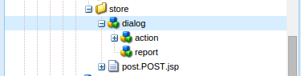

# Creare un’azione di invio personalizzata per Adaptive Forms {#writing-custom-submit-action-for-adaptive-forms}

| Versione | Collegamento articolo |
| -------- | ---------------------------- |
| AEM 6.5 | [Fai clic qui](https://experienceleague.adobe.com/docs/experience-manager-65/forms/customize-aem-forms/custom-submit-action-form.html) |
| AEM as a Cloud Service (Componenti core) | [Fai clic qui](https://experienceleague.adobe.com/en/docs/experience-manager-cloud-service/content/forms/adaptive-forms-authoring/authoring-adaptive-forms-core-components/create-an-adaptive-form-on-forms-cs/custom-submit-action-for-adaptive-forms-based-on-core-components) |
| AEM as a Cloud Service (Componenti di base) | Questo articolo |

Un modulo adattivo fornisce più azioni di invio pronte all’uso. Un’azione di invio specifica i dettagli delle azioni da eseguire sui dati raccolti tramite il modulo adattivo. Ad esempio, l’invio di dati tramite e-mail.

È possibile creare un&#39;azione di invio personalizzata per aggiungere funzionalità non incluse in [azioni di invio predefinite](configuring-submit-actions.md) o non supportate tramite una singola azione di invio OOTB. Ad esempio, l’invio di dati a un flusso di lavoro, il salvataggio dei dati in un archivio dati, l’invio di una notifica e-mail alla persona che invia il modulo e l’invio di un’e-mail alla persona responsabile dell’elaborazione del modulo inviato per le approvazioni e i rifiuti tramite una singola azione di invio.

## Formato dati XML {#xml-data-format}

I dati XML vengono inviati al servlet utilizzando il parametro di richiesta **`jcr:data`**. Le azioni di invio possono accedere al parametro per elaborare i dati. Nel codice seguente viene descritto il formato dei dati XML. I campi associati al modello di modulo vengono visualizzati nella sezione **`afBoundData`**. I campi non associati vengono visualizzati nella sezione `afUnoundData`. <!--For more information about the format of the `data.xml` file, see [Introduction to prepopulating Adaptive Form fields](prepopulate-adaptive-form-fields.md).-->

```xml
<?xml ?>
<afData>
<afUnboundData>
<data>
<field1>value</field2>
<repeatablePanel>
    <field2>value</field2>
</repeatablePanel>
<repeatablePanel>
    <field2>value</field2>
</repeatablePanel>
</data>
</afUnboundData>
<afBoundData>
<!-- xml corresponding to the Form Model /XML Schema -->
</afBoundData>
</afData>
```

### Campi azione {#action-fields}

Un&#39;azione di invio può aggiungere campi di input nascosti (utilizzando il tag [input](https://developer.mozilla.org/en/docs/Web/HTML/Element/Input) di HTML) al modulo renderizzato HTML. Questi campi nascosti possono contenere i valori necessari durante l’elaborazione dell’invio del modulo. Durante l’invio del modulo, questi valori dei campi vengono postback come parametri di richiesta che l’azione di invio può utilizzare durante la gestione dell’invio. I campi di input sono denominati campi di azione.

Ad esempio, un&#39;azione di invio che acquisisce anche il tempo impiegato per compilare un modulo può aggiungere i campi di input nascosti `startTime` e `endTime`.

Uno script può fornire i valori dei campi `startTime` e `endTime` rispettivamente durante il rendering del modulo e prima dell&#39;invio del modulo. Lo script dell&#39;azione di invio `post.jsp` può quindi accedere a questi campi utilizzando i parametri di richiesta e calcolare il tempo totale necessario per compilare il modulo.

### File allegati {#file-attachments}

Le azioni di invio possono inoltre utilizzare i file allegati caricati mediante il componente File allegato. Gli script di azioni di invio possono accedere a questi file utilizzando l&#39;API sling [RequestParameter](https://sling.apache.org/apidocs/sling5/org/apache/sling/api/request/RequestParameter.html). Il metodo [isFormField](https://sling.apache.org/apidocs/sling5/org/apache/sling/api/request/RequestParameter.html#isFormField()) dell&#39;API consente di identificare se il parametro della richiesta è un file o un campo modulo. È possibile scorrere i parametri di richiesta in un&#39;azione di invio per identificare i parametri di file allegato.

Il codice di esempio seguente identifica gli allegati della richiesta. Successivamente, legge i dati nel file utilizzando [Get API](https://sling.apache.org/apidocs/sling5/org/apache/sling/api/request/RequestParameter.html#get()). Infine, crea un oggetto Document utilizzando i dati e lo aggiunge a un elenco.

```java
RequestParameterMap requestParameterMap = slingRequest.getRequestParameterMap();
for (Map.Entry<String, RequestParameter[]> param : requestParameterMap.entrySet()) {
    RequestParameter rpm = param.getValue()[0];
    if(!rpm.isFormField()) {
        fileAttachments.add(new Document(rpm.get()));
    }
}
```

Quando si allegano file al modulo adattivo, il server convalida gli allegati dopo l’invio del modulo adattivo e restituisce un messaggio di errore se:

* I file allegati includono un nome file che inizia con il carattere (.) e contiene \ / : * ? &quot; &lt; > | ; % $ caratteri o contiene nomi di file speciali riservati per il sistema operativo Windows, ad esempio `nul`, `prn`, `con`, `lpt` o `com`.

* La dimensione del file allegato è 0 byte.

* Il formato del file allegato non è definito nella sezione [Tipi di file supportati](https://helpx.adobe.com/it/document-cloud/help/supported-file-formats-fill-sign.html#main-pars_text) durante la configurazione del componente File allegato in un modulo adattivo.

### Percorso di inoltro e URL di reindirizzamento {#forward-path-and-redirect-url}

Dopo aver eseguito l’azione richiesta, il servlet Submit inoltra la richiesta al percorso di inoltro. Un’azione utilizza l’API setForwardPath per impostare il percorso di inoltro nel servlet di invio della guida.

Se l’azione non fornisce un percorso di inoltro, il servlet di invio reindirizzerà il browser utilizzando l’URL di reindirizzamento. L’autore configura l’URL di reindirizzamento utilizzando la configurazione della pagina di ringraziamento nella finestra di dialogo Modifica modulo adattivo. Puoi anche configurare l’URL di reindirizzamento tramite l’azione di invio o l’API setRedirectUrl nel servlet di invio della guida. Puoi anche configurare i parametri di richiesta inviati all’URL di reindirizzamento utilizzando l’API setRedirectParameters nel servlet di invio della guida.

>[!NOTE]
>
>Un autore fornisce l’URL di reindirizzamento (utilizzando la configurazione della pagina di ringraziamento). [Le azioni di invio OOTB](configuring-submit-actions.md) utilizzano l&#39;URL di reindirizzamento per reindirizzare il browser dalla risorsa a cui fa riferimento il percorso di inoltro.
>
>Puoi scrivere un’azione di invio personalizzata che inoltra una richiesta a una risorsa o a un servlet. Adobe consiglia che lo script che gestisce le risorse per il percorso di inoltro reindirizzi la richiesta all’URL di reindirizzamento al termine dell’elaborazione.

## Azione invio {#submit-action}

Un&#39;azione di invio è un sling:Folder che include quanto segue:

* **addfields.jsp**: questo script fornisce i campi di azione che vengono aggiunti al file HTML durante il rendering. Utilizza questo script per aggiungere i parametri di input nascosti richiesti durante l’invio nello script POST.POST.jsp.
* **dialog.xml**: questo script è simile alla finestra di dialogo del componente CQ. Fornisce informazioni di configurazione personalizzate dall’autore. I campi vengono visualizzati nella scheda Invia azioni della finestra di dialogo Modifica modulo adattivo quando si seleziona l’azione di invio.
* **post.POST.jsp**: il servlet di invio chiama questo script con i dati inviati e i dati aggiuntivi nelle sezioni precedenti. Ogni riferimento all’esecuzione di un’azione in questa pagina implica l’esecuzione dello script post.POST.jsp. Per registrare l&#39;azione di invio con il Forms adattivo da visualizzare nella finestra di dialogo Modifica modulo adattivo, aggiungi queste proprietà a `sling:Folder`:

   * **guideComponentType** di tipo String e valore **fd/af/components/guidesubmittype**
   * **guideDataModel** di tipo String che specifica il tipo di modulo adattivo per il quale è applicabile l&#39;azione di invio. <!--**xfa** is supported for XFA-based Adaptive Forms while -->**xsd** è supportato per Forms adattivo basato su XSD. **basic** è supportato per Forms adattivi che non utilizzano XDP o XSD. Per visualizzare l’azione su più tipi di Forms adattivo, aggiungi le stringhe corrispondenti. Separa ogni stringa con una virgola. Ad esempio, per rendere visibile un&#39;azione nel Forms adattivo basato su <!--XFA- and -->XSD, specifica il valore come <!--**xfa** and--> **xsd**.

   * **jcr:description** di tipo String. Il valore di questa proprietà viene visualizzato nell&#39;elenco Azione di invio della scheda Invio azioni della finestra di dialogo Modifica modulo adattivo. Le azioni OOTB sono presenti nell&#39;archivio CRX nel percorso **/libs/fd/af/components/guidesubmittype**.

   * **submitService** di tipo String. Per ulteriori informazioni, consulta [Pianificare l&#39;invio di moduli adattivi per azioni personalizzate](#schedule-adaptive-form-submission).

## Creazione di un’azione di invio personalizzata {#creating-a-custom-submit-action}

>[!NOTE]
>
> Per informazioni su come creare un&#39;azione di invio personalizzata per i Componenti core, consulta [Creare un&#39;azione di invio personalizzata per Forms adattivo (Componenti core)](https://experienceleague.adobe.com/en/docs/experience-manager-cloud-service/content/forms/adaptive-forms-authoring/authoring-adaptive-forms-core-components/create-an-adaptive-form-on-forms-cs/custom-submit-action-for-adaptive-forms-based-on-core-components).

Per creare un’azione di invio personalizzata che salvi i dati nell’archivio CRX, quindi ti invia un’e-mail, effettua le seguenti operazioni. Il modulo adattivo contiene il contenuto dell’archivio azioni di invio OOTB (obsoleto) che salva i dati nell’archivio CRX. Inoltre, AEM fornisce un&#39;API [Mail](https://www.adobe.io/experience-manager/reference-materials/6-5/javadoc/com/day/cq/mailer/package-summary.html) che può essere utilizzata per inviare e-mail. Prima di utilizzare l’API Mail, configura il servizio Day CQ Mail tramite la console di sistema. Puoi riutilizzare l’azione Archivia contenuto (obsoleta) per memorizzare i dati nell’archivio. L’azione Archivia contenuto (obsoleta) è disponibile nella posizione /libs/fd/af/components/guidesubmittype/store nell’archivio CRX.

1. Accedi a CRXDE Lite all’URL https://&lt;server>:&lt;porta>/crx/de/index.jsp. Creare un nodo con la proprietà sling:Folder e name store_and_mail nella cartella /apps/custom_submit_action. Creare la cartella custom_submit_action se non esiste già.

   

2. **Fornisci i campi di configurazione obbligatori.**

   Aggiungi la configurazione richiesta dall’azione Archivia. Copia il nodo **cq:dialog** dell&#39;azione Archivia da /libs/fd/af/components/guidesubmittype/store nella cartella delle azioni in /apps/custom_submit_action/store_and_email.

   

3. **Fornire i campi di configurazione per richiedere all&#39;autore la configurazione della posta elettronica.**

   Il modulo adattivo fornisce anche un’azione E-mail che invia e-mail agli utenti. Personalizza questa azione in base alle tue esigenze. Passa a /libs/fd/af/components/guidesubmittype/email/dialog. Copia i nodi all&#39;interno del nodo cq:dialog nel nodo cq:dialog dell&#39;azione di invio (/apps/custom_submit_action/store_and_email/dialog).

   

4. **Rendi l&#39;azione disponibile nella finestra di dialogo Modifica modulo adattivo.**

   Aggiungi le seguenti proprietà nel nodo store_and_email:

   * **guideComponentType** di tipo **String** e valore **fd/af/components/guidesubmittype**

   * **guideDataModel** di tipo **String** e valore **<!--xfa, -->xsd, basic**

   * **jcr:description** di tipo **String** e valore **Azione archivio e posta elettronica**

   * **submitService** di tipo **String** e valore **Store e Email**. Per ulteriori informazioni, consulta [Pianificare l&#39;invio di moduli adattivi per azioni personalizzate](#schedule-adaptive-form-submission).

5. Apri un modulo adattivo. Fai clic sul pulsante **Modifica** accanto a **Inizio** per aprire la finestra di dialogo **Modifica** del contenitore Modulo adattivo. La nuova azione viene visualizzata nella scheda **Invia azioni**. Se si seleziona l&#39;**Azione archivio ed e-mail**, la configurazione aggiunta verrà visualizzata nel nodo della finestra di dialogo.

   

6. **Utilizzare l&#39;azione per completare un&#39;attività.**

   Aggiungi lo script POST.POST.jsp all’azione. (/apps/custom_submit_action/store_and_mail/).

   Esegui l’azione Archivio OOTB (script POST.POST.jsp). Utilizza l&#39;API [FormsHelper.runAction](https://www.adobe.io/experience-manager/reference-materials/6-5/javadoc/com/day/cq/wcm/foundation/forms/FormsHelper.html#runAction-java.lang.String-java.lang.String-org.apache.sling.api.resource.Resource-org.apache.sling.api.SlingHttpServletRequest-org.apache.sling.api.SlingHttpServletResponse-)&#x200B;(java.lang.String, java.lang.String, org.apache.sling.api.resource.Resource, org.apache.sling.api.SlingHttpServletRequest, org.apache.sling.api.SlingHttpServletResponse) fornita da CQ nel codice per eseguire l&#39;azione Archivia. Aggiungi il seguente codice nel file JSP:

   `FormsHelper.runAction("/libs/fd/af/components/guidesubmittype/store", "post", resource, slingRequest, slingResponse);`

   Per inviare l’e-mail, il codice legge l’indirizzo e-mail del destinatario dalla configurazione. Per recuperare il valore di configurazione nello script dell’azione, leggi le proprietà della risorsa corrente utilizzando il codice seguente. Analogamente, potete leggere gli altri file di configurazione.

   `ValueMap properties = ResourceUtil.getValueMap(resource);`

   `String mailTo = properties.get("mailTo");`

   Infine, utilizza l’API Mail di CQ per inviare l’e-mail. Utilizza la classe [SimpleEmail](https://commons.apache.org/proper/commons-email/commons-email2-javax/apidocs/org/apache/commons/mail2/javax/SimpleEmail.html) per creare l&#39;oggetto e-mail come illustrato di seguito:

   >[!NOTE]
   >
   >Assicurati che il file JSP abbia il nome post.POST.jsp.

   ```java
   <%@include file="/libs/fd/af/components/guidesglobal.jsp" %>
   <%@page import="com.day.cq.wcm.foundation.forms.FormsHelper,
          org.apache.sling.api.resource.ResourceUtil,
          org.apache.sling.api.resource.ValueMap,
                   com.day.cq.mailer.MessageGatewayService,
     com.day.cq.mailer.MessageGateway,
     org.apache.commons.mail.Email,
                   org.apache.commons.mail.SimpleEmail" %>
   <%@taglib prefix="sling"
                   uri="https://sling.apache.org/taglibs/sling/1.0" %>
   <%@taglib prefix="cq"
                   uri="https://www.day.com/taglibs/cq/1.0"
   %>
   <cq:defineObjects/>
   <sling:defineObjects/>
   <%
           String storeContent =
                       "/libs/fd/af/components/guidesubmittype/store";
           FormsHelper.runAction(storeContent, "post", resource,
                                   slingRequest, slingResponse);
    ValueMap props = ResourceUtil.getValueMap(resource);
    Email email = new SimpleEmail();
    String[] mailTo = props.get("mailto", new String[0]);
    email.setFrom((String)props.get("from"));
           for (String toAddr : mailTo) {
               email.addTo(toAddr);
      }
    email.setMsg((String)props.get("template"));
    email.setSubject((String)props.get("subject"));
    MessageGatewayService messageGatewayService =
                       sling.getService(MessageGatewayService.class);
    MessageGateway messageGateway =
                   messageGatewayService.getGateway(SimpleEmail.class);
    messageGateway.send(email);
   %>
   ```

   Seleziona l’azione nel modulo adattivo. L’azione invia un’e-mail e memorizza i dati.

## Utilizzare la proprietà submitService per azioni di invio personalizzate {#submitservice-property}

Quando si imposta l&#39;azione di invio personalizzata, che include la proprietà `submitService`, il modulo attiva [FormSubmitActionService](https://helpx.adobe.com/experience-manager/6-5/forms/javadocs/com/adobe/aemds/guide/service/FormSubmitActionService.html) all&#39;invio. `FormSubmitActionService` utilizza il metodo `getServiceName` per recuperare il valore per la proprietà `submitService`. In base al valore della proprietà `submitService`, il servizio richiama il metodo submit appropriato. Includere `FormSubmitActionService` nel bundle personalizzato caricato nel server [!DNL AEM Forms].

Aggiungi la proprietà `submitService` di tipo stringa a `sling:Folder` dell&#39;azione di invio personalizzata per abilitare [!DNL Adobe Sign] per il modulo adattivo. È possibile selezionare l&#39;opzione **[!UICONTROL Abilita Adobe Sign]** nella sezione **[!UICONTROL Firma elettronica]** delle proprietà del contenitore Moduli adattivi solo dopo aver impostato il valore per la proprietà `submitService` dell&#39;azione di invio personalizzata.

<!--As a result of setting an appropriate value for the `submitService` property and enabling [!DNL Adobe Sign], you can schedule the submission of an Adaptive Form to ensure that all configured signers have taken an action on the form. [!DNL Adobe Sign] Configuration Service keeps polling [!DNL Adobe Sign] server at regular intervals to verify the status of signatures. If all the signers complete signing the form, the Submit Action service is started and the form is submitted.-->


<!-- You can't do comments within comments, so I changed comment tags to <start-comment> <end-comment> -->

<!--
## Workflow for a Submit Action {#workflow-for-a-submit-action}

The flowchart depicts the workflow for a Submit Action that is triggered when you click the **[!UICONTROL Submit]** button in an Adaptive Form. The files in the File Attachment component are uploaded to the server, and the form data is updated with the URLs of the uploaded files. Within the client, the data is stored in the JSON format. The client sends an Ajax request to an internal servlet that massages the data you specified and returns it in the XML format. The client collates this data with action fields. It submits the data to the final servlet (Guide Submit servlet) through a Form Submit Action. Then, the servlet forwards the control to the Submit Action. The Submit Action can forward the request to a different sling resource or redirect the browser to another URL.


### XML data format {#xml-data-format}

The XML data is sent to the servlet using the **`jcr:data`** request parameter. Submit Actions can access the parameter to process the data. The following code describes the format of the XML data. The fields that are bound to the Form model appear in the **`afBoundData`** section. Unbound fields appear in the `afUnoundData`section. For more information about the format of the `data.xml` file, see [Introduction to prepopulating Adaptive Form fields](prepopulate-adaptive-form-fields.md).

```xml
<?xml ?>
<afData>
<afUnboundData>
<data>
<field1>value</field2>
<repeatablePanel>
    <field2>value</field2>
</repeatablePanel>
<repeatablePanel>
    <field2>value</field2>
</repeatablePanel>
</data>
</afUnboundData>
<afBoundData>
<start comment> xml corresponding to the Form Model /XML Schema <end comment>
<start comment> </afBoundData> <end comment>
</afData>
```

### Action fields {#action-fields}

A Submit Action can add hidden input fields (using the HTML [input](https://developer.mozilla.org/en/docs/Web/HTML/Element/Input) tag) to the rendered form HTML. These hidden fields can contain values that it needs while processing form submission. When submitting the form, these field values are posted back as request parameters that the Submit Action can use during submission handling. The input fields are called action fields.

For example, a Submit Action that also captures the time taken to fill a form can add the hidden input fields `startTime` and `endTime`.

A script can supply the values of the `startTime` and `endTime` fields when the form renders and before form submission, respectively. The Submit Action script `post.jsp` can then access these fields using request parameters and compute the total time required to fill the form.

### File attachments {#file-attachments}

Submit Actions can also use the file attachments you upload using the File Attachment component. Submit Action scripts can access these files using the sling [RequestParameter API](https://sling.apache.org/apidocs/sling5/org/apache/sling/api/request/RequestParameter.html). The [isFormField](https://sling.apache.org/apidocs/sling5/org/apache/sling/api/request/RequestParameter.html#isFormField()) method of the API helps identify whether the request parameter is a file or a form field. You can iterate over the Request parameters in a Submit Action to identify File Attachment parameters.

The following sample code identifies the file attachments in the request. Next, it reads the data into the file using the [Get API](https://sling.apache.org/apidocs/sling5/org/apache/sling/api/request/RequestParameter.html#get()). Finally, it creates a Document object using the data and appends it to a list.

```java
RequestParameterMap requestParameterMap = slingRequest.getRequestParameterMap();
for (Map.Entry<String, RequestParameter[]> param : requestParameterMap.entrySet()) {
    RequestParameter rpm = param.getValue()[0];
    if(!rpm.isFormField()) {
        fileAttachments.add(new Document(rpm.get()));
    }
}
```

### Forward path and Redirect URL {#forward-path-and-redirect-url}

After performing the required action, the Submit servlet forwards the request to the forward path. An action uses the setForwardPath API to set the forward path in the Guide Submit servlet.

If the action does not provide a forward path, the Submit servlet redirects the browser using the Redirect URL. The author configures the Redirect URL using the Thank You Page configuration in the Adaptive Form Edit dialog. You can also configure the Redirect URL through the Submit Action or the setRedirectUrl API in the Guide Submit servlet. You can also configure the Request parameters sent to the Redirect URL using the setRedirectParameters API in the Guide Submit servlet.

>[!NOTE]
>
>An author provides the Redirect URL (using the Thank You Page Configuration). [OOTB Submit Actions](configuring-submit-actions.md) use the Redirect URL to redirect the browser from the resource that the forward path references.
>
>You can write a custom Submit Action that forwards a request to a resource or servlet. Adobe recommends that the script that performs resource handling for the forward path redirect the request to the Redirect URL when the processing completes.

## Submit Action {#submit-action}

A Submit Action is a sling:Folder that includes the following:

* **addfields.jsp**: This script provides the action fields that are added to the HTML file during rendition. Use this script to add hidden input parameters required during submission in the post.POST.jsp script.
* **dialog.xml**: This script is similar to the CQ Component dialog. It provides configuration information that the author customizes. The fields are displayed in the Submit Actions Tab in the Adaptive Form Edit dialog when you select the Submit Action.
* **post.POST.jsp**: The Submit servlet calls this script with the data that you submit and the additional data in the previous sections. Any mention of running an action in this page implies running the post.POST.jsp script. To register the Submit Action with the Adaptive Forms to display in the Adaptive Form Edit dialog, add these properties to the sling:Folder:

    * **guideComponentType** of type String and value **fd/af/components/guidesubmittype**
    * **guideDataModel** of type String that specifies the type of Adaptive Form for which the Submit Action is applicable. **xfa** is supported for XFA-based Adaptive Forms while **xsd** is supported for XSD-based Adaptive Forms. **basic** is supported for Adaptive Forms that do not use XDP or XSD. To display the action on multiple types of Adaptive Forms, add the corresponding strings. Separate each string by a comma. For example, to make an action visible on XFA- and XSD-based Adaptive Forms, specify the values **xfa** and **xsd** respectively.

    * **jcr:description** of type String. The value of this property is displayed in the Submit Action list in the Submit Actions Tab of the Adaptive Form Edit dialog. The OOTB actions are present in the CRX repository at the location **/libs/fd/af/components/guidesubmittype**.

## Creating a custom Submit Action {#creating-a-custom-submit-action}

Perform the following steps to create a custom Submit Action that saves the data in the CRX repository and then sends you an email. The Adaptive Form contains the OOTB Submit Action Store Content (deprecated) that saves the data in the CRX repository. In addition, CQ provides a [Mail](https://www.adobe.io/experience-manager/reference-materials/6-5/javadoc/com/day/cq/mailer/package-summary.html) API that can be used to send emails. Before using the Mail API, configure the Day CQ Mail service through the system console. You can reuse the Store Content (deprecated) action to store the data in the repository. The Store Content (deprecated) action is available at the location /libs/fd/af/components/guidesubmittype/store in the CRX repository.

1. Log in to CRXDE Lite at the URL https://&lt;server&gt;:&lt;port&gt;/crx/de/index.jsp. Create a node with the property sling:Folder and name store_and_mail in the /apps/custom_submit_action folder. Create the custom_submit_action folder if it does not exist already.

   

1. **Provide the mandatory configuration fields.**

   Add the configuration the Store action requires. Copy the **cq:dialog** node of the Store action from /libs/fd/af/components/guidesubmittype/store to the action folder at /apps/custom_submit_action/store_and_email.

   

1. **Provide configuration fields to prompt the author for email configuration.**

   The Adaptive Form also provides an Email action that sends emails to users. Customize this action based on your requirements. Navigate to /libs/fd/af/components/guidesubmittype/email/dialog. Copy the nodes within the cq:dialog node to cq:dialog node of your Submit Action (/apps/custom_submit_action/store_and_email/dialog).

   

1. **Make the action available in the Adaptive Form Edit dialog.**

   Add the following properties in the store_and_email node:

    * **guideComponentType** of type **String** and value **fd/af/components/guidesubmittype**

    * **guideDataModel** of type **String** and value **xfa, xsd, basic**

    * **jcr:description** of type **String** and value **Store and Email Action**

1. Open any Adaptive Form. Click the **Edit** button next to **Start** to open the **Edit** dialog of the Adaptive Form container. The new action is displayed in the **Submit Actions** Tab. Selecting the **Store and Email Action** displays the configuration added in the dialog node.

   

1. **Use the action to complete a task.**

   Add the post.POST.jsp script to your action. (/apps/custom_submit_action/store_and_mail/).

   Run the OOTB Store action (post.POST.jsp script). Use the [FormsHelper.runAction](https://www.adobe.io/experience-manager/reference-materials/6-5/javadoc/com/day/cq/wcm/foundation/forms/FormsHelper.html#runAction-java.lang.String-java.lang.String-org.apache.sling.api.resource.Resource-org.apache.sling.api.SlingHttpServletRequest-org.apache.sling.api.SlingHttpServletResponse-(java.lang.String, java.lang.String, org.apache.sling.api.resource.Resource, org.apache.sling.api.SlingHttpServletRequest, org.apache.sling.api.SlingHttpServletResponse)) API that CQ provides in your code to run the Store action. Add the following code in your JSP file:

   `FormsHelper.runAction("/libs/fd/af/components/guidesubmittype/store", "post", resource, slingRequest, slingResponse);`

   To send the email, the code reads the recipient's email address from the configuration. To fetch the configuration value in the action's script, read the properties of the current resource using the following code. Similarly you can read the other configuration files.

   `ValueMap properties = ResourceUtil.getValueMap(resource);`

   `String mailTo = properties.get("mailTo");`

   Finally, use the CQ Mail API to send the email. Use the [SimpleEmail](https://commons.apache.org/proper/commons-email/apidocs/org/apache/commons/mail/SimpleEmail.html) class to create the Email Object as depicted below:

   >[!NOTE]
   >
   >Ensure that the JSP file has the name post.POST.jsp.

   ```java
   <%@include file="/libs/fd/af/components/guidesglobal.jsp" %>
   <%@page import="com.day.cq.wcm.foundation.forms.FormsHelper,
          org.apache.sling.api.resource.ResourceUtil,
          org.apache.sling.api.resource.ValueMap,
                   com.day.cq.mailer.MessageGatewayService,
     com.day.cq.mailer.MessageGateway,
     org.apache.commons.mail.Email,
                   org.apache.commons.mail.SimpleEmail" %>
   <%@taglib prefix="sling"
                   uri="https://sling.apache.org/taglibs/sling/1.0" %>
   <%@taglib prefix="cq"
                   uri="https://www.day.com/taglibs/cq/1.0"
   %>
   <cq:defineObjects/>
   <sling:defineObjects/>
   <%
           String storeContent =
                       "/libs/fd/af/components/guidesubmittype/store";
           FormsHelper.runAction(storeContent, "post", resource,
                                   slingRequest, slingResponse);
    ValueMap props = ResourceUtil.getValueMap(resource);
    Email email = new SimpleEmail();
    String[] mailTo = props.get("mailto", new String[0]);
    email.setFrom((String)props.get("from"));
           for (String toAddr : mailTo) {
               email.addTo(toAddr);
      }
    email.setMsg((String)props.get("template"));
    email.setSubject((String)props.get("subject"));
    MessageGatewayService messageGatewayService =
                       sling.getService(MessageGatewayService.class);
    MessageGateway messageGateway =
                   messageGatewayService.getGateway(SimpleEmail.class);
    messageGateway.send(email);
   %>
   ```

   Select the action in the Adaptive Form. The action sends an email and stores the data. 

-->

>[!MORELIKETHIS]
>
>* [Configurare un&#39;azione di invio per un modulo adattivo](/help/forms/configure-submit-actions-core-components.md)