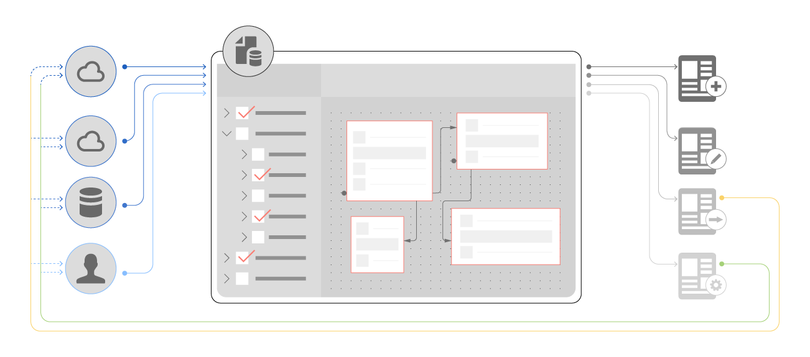

# Connettere AEM Forms a un database {#aem-forms-data-integration}

| Versione | Collegamento articolo |
| -------- | ---------------------------- |
| AEM 6.5 | [Fai clic qui](https://experienceleague.adobe.com/docs/experience-manager-65/forms/form-data-model/data-integration.html?lang=it) |
| AEM as a Cloud Service | Questo articolo |

L&#39;infrastruttura aziendale include diversi sistemi back-end o origini dati come database, servizi Web, servizi REST, servizi OData e soluzioni CRM. Insieme, creano un sistema di informazioni che fornisce dati alle applicazioni aziendali per eseguire le attività quotidiane. D&#39;altra parte, le applicazioni acquisiscono i dati e li inviano ad aggiornare le origini dati.

Quando si connette un modulo adattivo a un database, è necessaria l’integrazione con le origini dati per recuperare i dati dei clienti durante il rendering dei moduli. In alcuni casi i dati vengono recuperati da origini dati in base agli input dell’utente in Adaptive Forms. Inoltre, quando si invia un modulo adattivo a un database, i dati del modulo adattivo inviati possono essere riscritti per aggiornare le rispettive origini dati.

Anche se un sistema modulare distribuito ha i propri vantaggi, la sfida consiste nell’integrare e creare associazioni di dati tra diverse origini dati. L&#39;integrazione dei dati è la chiave di un&#39;infrastruttura aziendale funzionale ed efficiente con diverse origini dati collegate alle applicazioni per lo scambio di dati aziendali.

## Panoramica sull’integrazione dei dati {#data-integration-overview}

L&#39;integrazione dei dati di [!DNL AEM Forms] consente la configurazione e la connessione di diverse origini dati con [!DNL AEM Forms]. Fornisce un’interfaccia utente intuitiva per creare uno schema unificato di rappresentazione dei dati di entità business e servizi tra origini dati connesse. La rappresentazione unificata è nota come modello di dati del modulo (FDM), un’estensione dello schema JSON. Le entità in un modello dati modulo (FDM) sono denominate oggetti modello dati. Un modello di dati modulo (FDM) consente di:

* Accesso a oggetti, proprietà e servizi del modello dati da origini dati connesse.
* Creare oggetti e proprietà del modello dati personalizzato
* Creare associazioni tra oggetti modello dati all’interno e tra origini dati.
* Richiama i servizi oggetto modello dati per eseguire query o scrivere dati da e verso origini dati.

Dopo aver creato un modello dati modulo (FDM), è possibile utilizzarlo per:

* Creare un Forms adattivo basato su un modello di dati modulo (FDM)
* Precompila Forms adattivo da origini dati configurate
* Richiama servizi/operazioni dell’origine dati tramite le regole del modulo adattivo
* Scrivere i dati del modulo adattivo inviati nelle origini dati

## Introduzione all’integrazione dei dati {#get-started-with-data-integration}

Il primo passaggio per implementare l’integrazione dei dati per inviare un modulo adattivo a un database consiste nell’identificare e configurare le origini dati in cui sono memorizzate le informazioni che desideri utilizzare in Adaptive Forms. Successivamente, verrà creato un modello dati modulo (FDM) che utilizza oggetti, proprietà e servizi del modello dati da una o più origini dati. È possibile creare un Forms adattivo basato su un modello di dati del modulo (FDM) in cui i campi del modulo adattivo sono associati alle rispettive proprietà dell’origine dati.

[!DNL AEM Forms] consente inoltre di creare un modello dati modulo (FDM) indipendente dalle origini dati e di associare o associare in seguito gli oggetti e le proprietà del modello dati modulo (FDM) all&#39;origine dati. Elimina tutte le dipendenze dalle origini dati mentre si lavora su un modello dati modulo (FDM).

Per iniziare, comprendere e implementare l’integrazione dei dati, leggi quanto segue:

* [Configurare origini dati](configure-data-sources.md)
* [Crea modello dati modulo (FDM)](create-form-data-models.md)
* [Utilizzare il modello dati del modulo (FDM)](work-with-form-data-model.md)
* [Usa modello dati modulo (FDM)](using-form-data-model.md)

<!--

>[!NOTE]
>
>[!UICONTROL Experience Manager Forms] does not support relational database.

-->