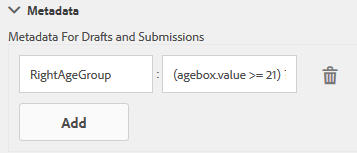

# Aggiungere informazioni dai dati utente ai metadati di invio del modulo {#adding-information-from-user-data-to-form-submission-metadata}

È possibile utilizzare i valori immessi in un elemento del modulo per calcolare i campi di metadati di una bozza o di un modulo inviato. I metadati consentono di filtrare il contenuto in base ai dati utente. Ad esempio, un utente immette John Doe nel campo del nome del modulo. È possibile utilizzare queste informazioni per calcolare i metadati che possono classificare l’invio in base alle iniziali JD.

Per calcolare i campi di metadati con i valori immessi dall’utente, aggiungi elementi del modulo nei metadati. Quando un utente immette un valore in tale elemento, uno script utilizza il valore per calcolare le informazioni. Queste informazioni vengono aggiunte nei metadati. Quando aggiungi un elemento come campo di metadati, fornisci una chiave per esso. La chiave viene aggiunta come campo nei metadati e le informazioni calcolate vengono registrate su di essa.

Ad esempio, una società di assicurazione sanitaria pubblica un modulo. In questo modulo, un campo acquisisce l’età degli utenti finali. Il cliente vuole controllare tutti gli invii in un particolare intervallo di età dopo che diversi utenti hanno inviato il modulo. Invece di analizzare tutti i dati che si complicano con l’aumentare del numero di moduli, i metadati aggiuntivi sono utili per il cliente. L’autore del modulo può configurare quali proprietà/dati compilati dall’utente vengono memorizzati al livello superiore in modo da semplificare la ricerca. I metadati aggiuntivi sono informazioni compilate dall’utente memorizzate al livello superiore del nodo dei metadati, in base alla configurazione dell’autore.

Prendi in considerazione un altro esempio di modulo che acquisisce l’ID e-mail e il numero di telefono. Quando un utente visita questo modulo in modo anonimo e abbandona il modulo, l’autore può configurarlo per salvare automaticamente l’ID e-mail e il numero di telefono. Questo modulo viene salvato automaticamente e il numero di telefono e l’ID e-mail vengono memorizzati nel nodo di metadati della bozza. Un caso d’uso di questa configurazione è il dashboard di gestione dei lead.

## Aggiunta di elementi modulo ai metadati {#adding-form-elements-to-metadata}

Per aggiungere un elemento nei metadati, effettua le seguenti operazioni:

1. Apri il modulo adattivo in modalità di modifica.\
   Per aprire il modulo in modalità di modifica, in Gestione moduli selezionare il modulo e selezionare **[!UICONTROL Apri]**.
1. In modalità di modifica, selezionare un componente, selezionare  > **[!DNL Adaptive Form Container]**, quindi selezionare .
1. Nella barra laterale fare clic su **[!DNL Metadata]**.
1. Nella sezione Metadati fare clic su **[!DNL Add]**.
1. Utilizzare il campo Valore della scheda Metadati per aggiungere script. Gli script aggiunti raccolgono i dati dagli elementi del modulo e calcolano i valori che vengono trasmessi ai metadati.

   Ad esempio, **[!DNL true]** viene registrato nei metadati se l&#39;età immessa è maggiore di 21 anni e **[!DNL false]** viene registrato se è minore di 21. Immetti lo script seguente nella scheda Metadati:

   `(agebox.value >= 21) ? true : false`

   

   Script immesso nella scheda Metadati

1. Fai clic su **[!DNL OK]**.

Dopo che un utente immette i dati nell’elemento selezionato come campo di metadati, le informazioni calcolate vengono registrate nei metadati. Puoi visualizzare i metadati nell’archivio configurato per archiviarli.

## Visualizzazione dei metadati di invio del modulo aggiornati: {#seeing-updated-form-nbsp-submission-metadata}

Nell’esempio precedente, i metadati vengono memorizzati nell’archivio CRX. I metadati si presentano come segue:

Se aggiungi un elemento casella di controllo nei metadati, i valori selezionati vengono memorizzati come stringa separata da virgole. Ad esempio, è possibile aggiungere un componente casella di controllo nel modulo e specificarne il nome come `checkbox1`. Nella casella di controllo Proprietà componente aggiungere gli elementi Patente di guida, Numero di previdenza sociale e Passport per i valori 0, 1 e 2.

Si seleziona Contenitore modulo adattivo e nelle proprietà del modulo si aggiunge una chiave di metadati `cb1` che memorizza `checkbox1.value` e si pubblica il modulo. Quando un cliente compila il modulo, seleziona le opzioni Numero di passaporto e di previdenza sociale nel campo della casella di controllo. I valori 1 e 2 sono memorizzati come 1, 2 nel campo cb1 dei metadati di invio.

>[!NOTE]
>
>L’esempio precedente è solo a scopo di apprendimento. Assicurarsi di cercare i metadati nella posizione corretta configurata nell&#39;implementazione [!DNL Experience Manager Forms].