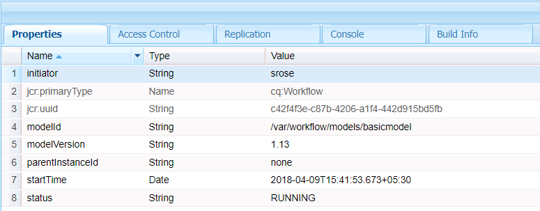

# Flussi di lavoro incentrati su Forms su OSGi | Gestione dei dati utente {#forms-centric-workflows-on-osgi-handling-user-data}

I flussi di lavoro AEM incentrati su Forms consentono di automatizzare i processi aziendali Forms incentrati sul mondo reale. I flussi di lavoro sono costituiti da una serie di passaggi che vengono eseguiti in un ordine specificato nel modello di flusso di lavoro associato. Ogni passaggio esegue un’azione specifica, ad esempio l’assegnazione di un’attività a un utente o l’invio di un messaggio e-mail. I flussi di lavoro possono interagire con le risorse nell’archivio, negli account utente e nei servizi. Pertanto, i flussi di lavoro possono coordinare attività complesse che coinvolgono qualsiasi aspetto dell&#39;Experience Manager.

È possibile attivare o avviare un flusso di lavoro incentrato sui moduli tramite uno dei seguenti metodi:

* Invio di un’applicazione da AEM casella in entrata
* Invio di una domanda da AEM [!DNL Forms] App
* Invio di un modulo adattivo
* Utilizzo di una cartella controllata
* Invio di una comunicazione interattiva o di una lettera

Per ulteriori informazioni sui flussi di lavoro e sulle funzionalità di AEM incentrati su Forms, vedi [Flusso di lavoro incentrato su Forms su OSGi](aem-forms-workflow.md).

## Archiviazione dati e dati utente {#user-data-and-data-stores}

Quando un flusso di lavoro viene attivato, viene generato automaticamente un payload per l’istanza del flusso di lavoro. A ogni istanza del flusso di lavoro viene assegnato un ID istanza univoco e un ID payload associato. Il payload contiene le posizioni dell’archivio per i dati utente e modulo associati a un’istanza di flusso di lavoro. Inoltre, le bozze e i dati storici per un’istanza di flusso di lavoro sono memorizzati anche nell’archivio AEM.

Le posizioni di repository predefinite in cui risiedono payload, bozze e cronologia di un’istanza di flusso di lavoro sono le seguenti:

>[!NOTE]
>
>È possibile configurare posizioni diverse per memorizzare i dati di payload, bozza e cronologia durante la creazione di un flusso di lavoro o di un’applicazione. Per identificare le posizioni in cui un flusso di lavoro o un&#39;applicazione ha memorizzato i dati, controlla il flusso di lavoro.

<table>
 <tbody>
  <tr>
   <td> </td>
   <td><b>AEM 6.4 [!DNL Forms]</b></td>
   <td><b>AEM 6.3 [!DNL Forms]</b></td>
  </tr>
  <tr>
   <td><strong>Flusso di lavoro   istanza</strong></td>
   <td>/var/workflow/instances/[server_id]/&lt;date&gt;/[workflow-instance]/</td>
   <td>/etc/workflow/instances/[server_id]/[date]/[workflow-instance]/</td>
  </tr>
  <tr>
   <td><strong>Payload</strong></td>
   <td>/var/fd/dashboard/payload/[server_id]/[data]/  [payload-id]/</td>
   <td>/etc/fd/dashboard/payload/[server_id]/[date]/  [payload-id]/</td>
  </tr>
  <tr>
   <td><strong>Bozze</strong></td>
   <td>/var/fd/dashboard/instances/[server_id]/  [data]/[workflow-instance]/draft/[workitem]/</td>
   <td>/etc/fd/dashboard/instances/[server_id]/  [data]/[workflow-instance]/draft/[workitem]/</td>
  </tr>
  <tr>
   <td><strong>Storia</strong></td>
   <td>/var/fd/dashboard/instances/[server_id]/  [data]/[workflow_instance]/history/</td>
   <td>/etc/fd/dashboard/instances/[server_id]/  [data]/[workflow_instance]/history/</td>
  </tr>
 </tbody>
</table>

## Accedere ed eliminare i dati utente {#access-and-delete-user-data}

Puoi accedere e eliminare i dati utente da un’istanza di flusso di lavoro nell’archivio. A questo scopo, devi conoscere l’ID istanza dell’istanza del flusso di lavoro associata all’utente. Puoi trovare l’ID di istanza di un’istanza di flusso di lavoro utilizzando il nome utente dell’utente che ha avviato l’istanza di flusso di lavoro o dell’utente che è l’attuale assegnatario dell’istanza di flusso di lavoro.

Tuttavia, non è possibile identificare o i risultati possono essere ambigui quando si identificano i flussi di lavoro associati a un iniziatore nei seguenti scenari:

* **Flusso di lavoro attivato tramite una cartella controllata**: Impossibile identificare un&#39;istanza di flusso di lavoro utilizzando il proprio iniziatore se il flusso di lavoro viene attivato da una cartella controllata. In questo caso, le informazioni utente vengono codificate nei dati memorizzati.
* **Flusso di lavoro avviato dall&#39;istanza di pubblicazione AEM**: Tutte le istanze del flusso di lavoro vengono create utilizzando un utente di servizio quando Adaptive Forms, le comunicazioni interattive o le lettere vengono inviate AEM&#39;istanza di pubblicazione. In questi casi, il nome utente dell’utente connesso non viene acquisito nei dati dell’istanza del flusso di lavoro.

### Accedere ai dati utente {#access}

Per identificare e accedere ai dati utente memorizzati per un’istanza di flusso di lavoro, esegui i seguenti passaggi:

1. Su AEM&#39;istanza dell&#39;autore, vai a `https://'[server]:[port]'/crx/de` e passa a **[!UICONTROL Strumenti > Query]**.

   Seleziona **[!UICONTROL SQL2]** dal **[!UICONTROL Tipo]** a discesa.

1. A seconda delle informazioni disponibili, esegui una delle seguenti query:

   * Esegui quanto segue se l’iniziatore del flusso di lavoro è noto:

   `SELECT &ast; FROM [cq:Workflow] AS s WHERE ISDESCENDANTNODE([path-to-workflow-instances]) and s.[initiator]='*initiator-ID*'`

   * Esegui quanto segue se l’utente i cui dati stai trovando è l’assegnatario del flusso di lavoro corrente:

   `SELECT &ast; FROM [cq:WorkItem] AS s WHERE ISDESCENDANTNODE([path-to-workflow-instances]) and s.[assignee]='*assignee-id*'`

   La query restituisce la posizione di tutte le istanze del flusso di lavoro per l’iniziatore del flusso di lavoro specificato o per l’assegnatario del flusso di lavoro corrente.

   Ad esempio, la seguente query restituisce due istanze del flusso di lavoro dal percorso `/var/workflow/instances` nodo il cui iniziatore del flusso di lavoro è `srose`.

   

1. Passa a un percorso di istanza del flusso di lavoro restituito dalla query. La proprietà status visualizza lo stato corrente dell&#39;istanza del flusso di lavoro.

   

1. Nel nodo dell’istanza del flusso di lavoro, passa a `data/payload/`. La `path` memorizza il percorso del payload per l&#39;istanza del flusso di lavoro. Puoi passare al percorso per accedere ai dati memorizzati nel payload.

   

1. Passa alle posizioni per le bozze e la cronologia per l&#39;istanza del flusso di lavoro.

   Esempio:

   `/var/fd/dashboard/instances/server0/2018-04-09/_var_workflow_instances_server0_2018-04-09_basicmodel_54/draft/`

   `/var/fd/dashboard/instances/server0/2018-04-09/_var_workflow_instances_server0_2018-04-09_basicmodel_54/history/`

1. Ripetere i passaggi 3 - 5 per tutte le istanze del flusso di lavoro restituite dalla query al passaggio 2.

   >[!NOTE]
   >
   >AEM [!DNL Forms] l&#39;app memorizza anche i dati in modalità offline. È possibile che i dati per un’istanza di flusso di lavoro vengano memorizzati localmente sui singoli dispositivi e inviati al [!DNL Forms] server quando l’app si sincronizza con il server.

### Eliminare i dati utente {#delete-user-data}

Per eliminare i dati utente dalle istanze del flusso di lavoro, devi essere un amministratore AEM eseguendo le operazioni seguenti:

1. Segui le istruzioni in [Accedere ai dati utente](forms-workflow-osgi-handling-user-data.md#access) e prendere atto dei seguenti elementi:

   * Percorsi alle istanze del flusso di lavoro associate all’utente
   * Stato delle istanze del flusso di lavoro
   * Percorsi ai payload per le istanze del flusso di lavoro
   * Percorsi alle bozze e alla cronologia per le istanze del flusso di lavoro

1. Esegui questo passaggio per le istanze del flusso di lavoro in **IN ESECUZIONE**, **SOSPESO** oppure **SCALA** stato:

   1. Vai a `https://'[server]:[port]'/aem/start.html` e accedi con le credenziali di amministratore.
   1. Passa a **[!UICONTROL Strumenti > Flusso di lavoro > Istanze]**.
   1. Seleziona le istanze del flusso di lavoro rilevanti per l’utente e tocca **[!UICONTROL Termina]** per terminare le istanze in esecuzione.

      Per ulteriori informazioni sull’utilizzo delle istanze del flusso di lavoro, consulta [Amministrazione delle istanze dei flussi di lavoro](https://experienceleague.adobe.com/docs/experience-manager-cloud-service/sites/authoring/workflows/overview.html#authoring).

1. Vai a [!DNL CRXDE Lite] , passa al percorso del payload per un’istanza di flusso di lavoro ed elimina la `payload` nodo.
1. Passa al percorso delle bozze per un’istanza di flusso di lavoro ed elimina il `draft` nodo.
1. Passa al percorso della cronologia per un&#39;istanza di flusso di lavoro ed elimina il `history` nodo.
1. Passa al percorso dell’istanza del flusso di lavoro per un’istanza del flusso di lavoro ed elimina il `[workflow-instance-ID]` nodo per il flusso di lavoro.

   >[!NOTE]
   >
   >L’eliminazione del nodo di istanza del flusso di lavoro rimuoverà l’istanza del flusso di lavoro per tutti i partecipanti al flusso di lavoro.

1. Ripeti i passaggi da 2 a 6 per tutte le istanze del flusso di lavoro identificate per un utente.
1. Identificare ed eliminare i dati di bozza e invio offline da AEM [!DNL Forms] outbox dell’app dei partecipanti al flusso di lavoro per evitare qualsiasi invio al server.

Puoi inoltre utilizzare le API per accedere e rimuovere nodi e proprietà. Per ulteriori informazioni, consulta i seguenti documenti.

* [Come accedere programmaticamente a AEM JCR](https://experienceleague.adobe.com/docs/experience-manager-65/developing/platform/access-jcr.html?lang=en#platform)
* [Rimozione di nodi e proprietà](https://docs.adobe.com/docs/en/spec/jcr/2.0/10_Writing.html#10.9%20Removing%20Nodes%20and%20Properties)
* [Riferimento API](https://helpx.adobe.com/experience-manager/6-3/sites-developing/reference-materials/javadoc/overview-summary.html)

